> Оригинал: <https://docs.crpt.ru/gismt/%D0%9C%D0%B5%D1%82%D0%BE%D0%B4%D0%B8%D1%87%D0%B5%D1%81%D0%BA%D0%B8%D0%B5_%D1%80%D0%B5%D0%BA%D0%BE%D0%BC%D0%B5%D0%BD%D0%B4%D0%B0%D1%86%D0%B8%D0%B8_%D0%BF%D0%BE_%D0%BE%D1%84%D0%BE%D1%80%D0%BC%D0%BB%D0%B5%D0%BD%D0%B8%D1%8E_%D0%B4%D0%BE%D0%BA%D1%83%D0%BC%D0%B5%D0%BD%D1%82%D0%BE%D0%B2_%D0%AD%D0%94%D0%9E/>

## Оглавление

- [1. Аннотация](#_%D0%B0%D0%BD%D0%BD%D0%BE%D1%82%D0%B0%D1%86%D0%B8%D1%8F)
- [2. Условные обозначения](#_%D1%83%D1%81%D0%BB%D0%BE%D0%B2%D0%BD%D1%8B%D0%B5_%D0%BE%D0%B1%D0%BE%D0%B7%D0%BD%D0%B0%D1%87%D0%B5%D0%BD%D0%B8%D1%8F)
- [3. Описание КИ единиц товаров, групповых и транспортных упаковок](#opisanie_ki_edinic_tovarov_gruppovyh_i_transportnyh_upakovok)
  - [3.1. Рекомендации по смене GTIN для товарной группы «Молочная продукция»](#_%D1%80%D0%B5%D0%BA%D0%BE%D0%BC%D0%B5%D0%BD%D0%B4%D0%B0%D1%86%D0%B8%D0%B8_%D0%BF%D0%BE_%D1%81%D0%BC%D0%B5%D0%BD%D0%B5_gtin_%D0%B4%D0%BB%D1%8F_%D1%82%D0%BE%D0%B2%D0%B0%D1%80%D0%BD%D0%BE%D0%B9_%D0%B3%D1%80%D1%83%D0%BF%D0%BF%D1%8B_%D0%BC%D0%BE%D0%BB%D0%BE%D1%87%D0%BD%D0%B0%D1%8F_%D0%BF%D1%80%D0%BE%D0%B4%D1%83%D0%BA%D1%86%D0%B8%D1%8F)
  - [3.2. Рекомендации по формату КИТУ для товарной группы «Молочная продукция»](#_%D1%80%D0%B5%D0%BA%D0%BE%D0%BC%D0%B5%D0%BD%D0%B4%D0%B0%D1%86%D0%B8%D0%B8_%D0%BF%D0%BE_%D1%84%D0%BE%D1%80%D0%BC%D0%B0%D1%82%D1%83_%D0%BA%D0%B8%D1%82%D1%83_%D0%B4%D0%BB%D1%8F_%D1%82%D0%BE%D0%B2%D0%B0%D1%80%D0%BD%D0%BE%D0%B9_%D0%B3%D1%80%D1%83%D0%BF%D0%BF%D1%8B_%D0%BC%D0%BE%D0%BB%D0%BE%D1%87%D0%BD%D0%B0%D1%8F_%D0%BF%D1%80%D0%BE%D0%B4%D1%83%D0%BA%D1%86%D0%B8%D1%8F)
  - [3.3. Рекомендации по формату КИТУ для товарной группы «Упакованная вода»](#_%D1%80%D0%B5%D0%BA%D0%BE%D0%BC%D0%B5%D0%BD%D0%B4%D0%B0%D1%86%D0%B8%D0%B8_%D0%BF%D0%BE_%D1%84%D0%BE%D1%80%D0%BC%D0%B0%D1%82%D1%83_%D0%BA%D0%B8%D1%82%D1%83_%D0%B4%D0%BB%D1%8F_%D1%82%D0%BE%D0%B2%D0%B0%D1%80%D0%BD%D0%BE%D0%B9_%D0%B3%D1%80%D1%83%D0%BF%D0%BF%D1%8B_%D1%83%D0%BF%D0%B0%D0%BA%D0%BE%D0%B2%D0%B0%D0%BD%D0%BD%D0%B0%D1%8F_%D0%B2%D0%BE%D0%B4%D0%B0)
- [4. Описание сведений о маркированных товарах в УПД](#_%D0%BE%D0%BF%D0%B8%D1%81%D0%B0%D0%BD%D0%B8%D0%B5_%D1%81%D0%B2%D0%B5%D0%B4%D0%B5%D0%BD%D0%B8%D0%B9_%D0%BE_%D0%BC%D0%B0%D1%80%D0%BA%D0%B8%D1%80%D0%BE%D0%B2%D0%B0%D0%BD%D0%BD%D1%8B%D1%85_%D1%82%D0%BE%D0%B2%D0%B0%D1%80%D0%B0%D1%85_%D0%B2_%D1%83%D0%BF%D0%B4)
  - [4.1. Требования к экранированию спецсимволов](#_%D1%82%D1%80%D0%B5%D0%B1%D0%BE%D0%B2%D0%B0%D0%BD%D0%B8%D1%8F_%D0%BA_%D1%8D%D0%BA%D1%80%D0%B0%D0%BD%D0%B8%D1%80%D0%BE%D0%B2%D0%B0%D0%BD%D0%B8%D1%8E_%D1%81%D0%BF%D0%B5%D1%86%D1%81%D0%B8%D0%BC%D0%B2%D0%BE%D0%BB%D0%BE%D0%B2)
  - [4.2. Требования к указанию КИ товаров](#_%D1%82%D1%80%D0%B5%D0%B1%D0%BE%D0%B2%D0%B0%D0%BD%D0%B8%D1%8F_%D0%BA_%D1%83%D0%BA%D0%B0%D0%B7%D0%B0%D0%BD%D0%B8%D1%8E_%D0%BA%D0%B8_%D1%82%D0%BE%D0%B2%D0%B0%D1%80%D0%BE%D0%B2)
  - [4.3. Требования к указанию КИГУ](#_%D1%82%D1%80%D0%B5%D0%B1%D0%BE%D0%B2%D0%B0%D0%BD%D0%B8%D1%8F_%D0%BA_%D1%83%D0%BA%D0%B0%D0%B7%D0%B0%D0%BD%D0%B8%D1%8E_%D0%BA%D0%B8%D0%B3%D1%83)
  - [4.4. Требования к указанию КИТУ](#_%D1%82%D1%80%D0%B5%D0%B1%D0%BE%D0%B2%D0%B0%D0%BD%D0%B8%D1%8F_%D0%BA_%D1%83%D0%BA%D0%B0%D0%B7%D0%B0%D0%BD%D0%B8%D1%8E_%D0%BA%D0%B8%D1%82%D1%83)
  - [4.5. Требования к указанию сведений о передаче маркированного товара в объёмно-сортовом разрезе учёта](#_%D1%82%D1%80%D0%B5%D0%B1%D0%BE%D0%B2%D0%B0%D0%BD%D0%B8%D1%8F_%D0%BA_%D1%83%D0%BA%D0%B0%D0%B7%D0%B0%D0%BD%D0%B8%D1%8E_%D1%81%D0%B2%D0%B5%D0%B4%D0%B5%D0%BD%D0%B8%D0%B9_%D0%BE_%D0%BF%D0%B5%D1%80%D0%B5%D0%B4%D0%B0%D1%87%D0%B5_%D0%BC%D0%B0%D1%80%D0%BA%D0%B8%D1%80%D0%BE%D0%B2%D0%B0%D0%BD%D0%BD%D0%BE%D0%B3%D0%BE_%D1%82%D0%BE%D0%B2%D0%B0%D1%80%D0%B0_%D0%B2_%D0%BE%D0%B1%D1%8A%D1%91%D0%BC%D0%BD%D0%BE_%D1%81%D0%BE%D1%80%D1%82%D0%BE%D0%B2%D0%BE%D0%BC_%D1%80%D0%B0%D0%B7%D1%80%D0%B5%D0%B7%D0%B5_%D1%83%D1%87%D1%91%D1%82%D0%B0)
    - [4.5.1. Рекомендации по указанию в УПД сведений о производственной партии молочной продукции](#_%D1%80%D0%B5%D0%BA%D0%BE%D0%BC%D0%B5%D0%BD%D0%B4%D0%B0%D1%86%D0%B8%D0%B8_%D0%BF%D0%BE_%D1%83%D0%BA%D0%B0%D0%B7%D0%B0%D0%BD%D0%B8%D1%8E_%D0%B2_%D1%83%D0%BF%D0%B4_%D1%81%D0%B2%D0%B5%D0%B4%D0%B5%D0%BD%D0%B8%D0%B9_%D0%BE_%D0%BF%D1%80%D0%BE%D0%B8%D0%B7%D0%B2%D0%BE%D0%B4%D1%81%D1%82%D0%B2%D0%B5%D0%BD%D0%BD%D0%BE%D0%B9_%D0%BF%D0%B0%D1%80%D1%82%D0%B8%D0%B8_%D0%BC%D0%BE%D0%BB%D0%BE%D1%87%D0%BD%D0%BE%D0%B9_%D0%BF%D1%80%D0%BE%D0%B4%D1%83%D0%BA%D1%86%D0%B8%D0%B8)
  - [4.6. Рекомендации к подаче сведений о передаче маркированных товаров в ГИС МТ](#_%D1%80%D0%B5%D0%BA%D0%BE%D0%BC%D0%B5%D0%BD%D0%B4%D0%B0%D1%86%D0%B8%D0%B8_%D0%BA_%D0%BF%D0%BE%D0%B4%D0%B0%D1%87%D0%B5_%D1%81%D0%B2%D0%B5%D0%B4%D0%B5%D0%BD%D0%B8%D0%B9_%D0%BE_%D0%BF%D0%B5%D1%80%D0%B5%D0%B4%D0%B0%D1%87%D0%B5_%D0%BC%D0%B0%D1%80%D0%BA%D0%B8%D1%80%D0%BE%D0%B2%D0%B0%D0%BD%D0%BD%D1%8B%D1%85_%D1%82%D0%BE%D0%B2%D0%B0%D1%80%D0%BE%D0%B2_%D0%B2_%D0%B3%D0%B8%D1%81_%D0%BC%D1%82)
    - [4.6.1. Правило приоритета на наивысший КИТУ / КИГУ в УПД / УПД(и)](#pravilo_prioriteta_na_naivysshij_kitu_kigu_v_upd_upd_i)
  - [4.7. Рекомендации к подаче исправленных сведений о передаче маркированных товаров в ГИС МТ на основании формата УПД(и)](#_%D1%80%D0%B5%D0%BA%D0%BE%D0%BC%D0%B5%D0%BD%D0%B4%D0%B0%D1%86%D0%B8%D0%B8_%D0%BA_%D0%BF%D0%BE%D0%B4%D0%B0%D1%87%D0%B5_%D0%B8%D1%81%D0%BF%D1%80%D0%B0%D0%B2%D0%BB%D0%B5%D0%BD%D0%BD%D1%8B%D1%85_%D1%81%D0%B2%D0%B5%D0%B4%D0%B5%D0%BD%D0%B8%D0%B9_%D0%BE_%D0%BF%D0%B5%D1%80%D0%B5%D0%B4%D0%B0%D1%87%D0%B5_%D0%BC%D0%B0%D1%80%D0%BA%D0%B8%D1%80%D0%BE%D0%B2%D0%B0%D0%BD%D0%BD%D1%8B%D1%85_%D1%82%D0%BE%D0%B2%D0%B0%D1%80%D0%BE%D0%B2_%D0%B2_%D0%B3%D0%B8%D1%81_%D0%BC%D1%82_%D0%BD%D0%B0_%D0%BE%D1%81%D0%BD%D0%BE%D0%B2%D0%B0%D0%BD%D0%B8%D0%B8_%D1%84%D0%BE%D1%80%D0%BC%D0%B0%D1%82%D0%B0_%D1%83%D0%BF%D0%B4%D0%B8)
  - [4.8. Рекомендации к проверке сведений о маркированных товарах до подачи сведений в ГИС МТ](#_%D1%80%D0%B5%D0%BA%D0%BE%D0%BC%D0%B5%D0%BD%D0%B4%D0%B0%D1%86%D0%B8%D0%B8_%D0%BA_%D0%BF%D1%80%D0%BE%D0%B2%D0%B5%D1%80%D0%BA%D0%B5_%D1%81%D0%B2%D0%B5%D0%B4%D0%B5%D0%BD%D0%B8%D0%B9_%D0%BE_%D0%BC%D0%B0%D1%80%D0%BA%D0%B8%D1%80%D0%BE%D0%B2%D0%B0%D0%BD%D0%BD%D1%8B%D1%85_%D1%82%D0%BE%D0%B2%D0%B0%D1%80%D0%B0%D1%85_%D0%B4%D0%BE_%D0%BF%D0%BE%D0%B4%D0%B0%D1%87%D0%B8_%D1%81%D0%B2%D0%B5%D0%B4%D0%B5%D0%BD%D0%B8%D0%B9_%D0%B2_%D0%B3%D0%B8%D1%81_%D0%BC%D1%82)
  - [4.9. Обработка в ГИС МТ сведений о дате выполнения операции над КИ, указанном в универсальном документе](#_%D0%BE%D0%B1%D1%80%D0%B0%D0%B1%D0%BE%D1%82%D0%BA%D0%B0_%D0%B2_%D0%B3%D0%B8%D1%81_%D0%BC%D1%82_%D1%81%D0%B2%D0%B5%D0%B4%D0%B5%D0%BD%D0%B8%D0%B9_%D0%BE_%D0%B4%D0%B0%D1%82%D0%B5_%D0%B2%D1%8B%D0%BF%D0%BE%D0%BB%D0%BD%D0%B5%D0%BD%D0%B8%D1%8F_%D0%BE%D0%BF%D0%B5%D1%80%D0%B0%D1%86%D0%B8%D0%B8_%D0%BD%D0%B0%D0%B4_%D0%BA%D0%B8_%D1%83%D0%BA%D0%B0%D0%B7%D0%B0%D0%BD%D0%BD%D0%BE%D0%BC_%D0%B2_%D1%83%D0%BD%D0%B8%D0%B2%D0%B5%D1%80%D1%81%D0%B0%D0%BB%D1%8C%D0%BD%D0%BE%D0%BC_%D0%B4%D0%BE%D0%BA%D1%83%D0%BC%D0%B5%D0%BD%D1%82%D0%B5)
  - [4.10. Рекомендации к подаче сведений об обороте маркированных товаров в рамках исполнения государственных и муниципальных контрактов для товарных групп «Ветеринарные препараты» и «Медицинские изделия»](#_%D1%80%D0%B5%D0%BA%D0%BE%D0%BC%D0%B5%D0%BD%D0%B4%D0%B0%D1%86%D0%B8%D0%B8_%D0%BA_%D0%BF%D0%BE%D0%B4%D0%B0%D1%87%D0%B5_%D1%81%D0%B2%D0%B5%D0%B4%D0%B5%D0%BD%D0%B8%D0%B9_%D0%BE%D0%B1_%D0%BE%D0%B1%D0%BE%D1%80%D0%BE%D1%82%D0%B5_%D0%BC%D0%B0%D1%80%D0%BA%D0%B8%D1%80%D0%BE%D0%B2%D0%B0%D0%BD%D0%BD%D1%8B%D1%85_%D1%82%D0%BE%D0%B2%D0%B0%D1%80%D0%BE%D0%B2_%D0%B2_%D1%80%D0%B0%D0%BC%D0%BA%D0%B0%D1%85_%D0%B8%D1%81%D0%BF%D0%BE%D0%BB%D0%BD%D0%B5%D0%BD%D0%B8%D1%8F_%D0%B3%D0%BE%D1%81%D1%83%D0%B4%D0%B0%D1%80%D1%81%D1%82%D0%B2%D0%B5%D0%BD%D0%BD%D1%8B%D1%85_%D0%B8_%D0%BC%D1%83%D0%BD%D0%B8%D1%86%D0%B8%D0%BF%D0%B0%D0%BB%D1%8C%D0%BD%D1%8B%D1%85_%D0%BA%D0%BE%D0%BD%D1%82%D1%80%D0%B0%D0%BA%D1%82%D0%BE%D0%B2_%D0%B4%D0%BB%D1%8F_%D1%82%D0%BE%D0%B2%D0%B0%D1%80%D0%BD%D1%8B%D1%85_%D0%B3%D1%80%D1%83%D0%BF%D0%BF_%D0%B2%D0%B5%D1%82%D0%B5%D1%80%D0%B8%D0%BD%D0%B0%D1%80%D0%BD%D1%8B%D0%B5_%D0%BF%D1%80%D0%B5%D0%BF%D0%B0%D1%80%D0%B0%D1%82%D1%8B_%D0%B8_%D0%BC%D0%B5%D0%B4%D0%B8%D1%86%D0%B8%D0%BD%D1%81%00%D0%BA%D0%B8%D0%B5_%D0%B8%D0%B7%D0%B4%D0%B5%D0%BB%D0%B8%D1%8F)
  - [4.11. Рекомендации к подаче сведений через ЕИС Закупки в рамках исполнения государственных и муниципальных контрактов для товарной группы «Медицинские изделия»](#_%D1%80%D0%B5%D0%BA%D0%BE%D0%BC%D0%B5%D0%BD%D0%B4%D0%B0%D1%86%D0%B8%D0%B8_%D0%BA_%D0%BF%D0%BE%D0%B4%D0%B0%D1%87%D0%B5_%D1%81%D0%B2%D0%B5%D0%B4%D0%B5%D0%BD%D0%B8%D0%B9_%D1%87%D0%B5%D1%80%D0%B5%D0%B7_%D0%B5%D0%B8%D1%81_%D0%B7%D0%B0%D0%BA%D1%83%D0%BF%D0%BA%D0%B8_%D0%B2_%D1%80%D0%B0%D0%BC%D0%BA%D0%B0%D1%85_%D0%B8%D1%81%D0%BF%D0%BE%D0%BB%D0%BD%D0%B5%D0%BD%D0%B8%D1%8F_%D0%B3%D0%BE%D1%81%D1%83%D0%B4%D0%B0%D1%80%D1%81%D1%82%D0%B2%D0%B5%D0%BD%D0%BD%D1%8B%D1%85_%D0%B8_%D0%BC%D1%83%D0%BD%D0%B8%D1%86%D0%B8%D0%BF%D0%B0%D0%BB%D1%8C%D0%BD%D1%8B%D1%85_%D0%BA%D0%BE%D0%BD%D1%82%D1%80%D0%B0%D0%BA%D1%82%D0%BE%D0%B2_%D0%B4%D0%BB%D1%8F_%D1%82%D0%BE%D0%B2%D0%B0%D1%80%D0%BD%D0%BE%D0%B9_%D0%B3%D1%80%D1%83%D0%BF%D0%BF%D1%8B_%D0%BC%D0%B5%D0%B4%D0%B8%D1%86%D0%B8%D0%BD%D1%81%D0%BA%D0%B8%D0%B5_%D0%B8%D0%B7%D0%B4%D0%B5%D0%BB%D0%B8%D1%8F)
- [5. Описание сведений о маркированных товарах в УКД](#_%D0%BE%D0%BF%D0%B8%D1%81%D0%B0%D0%BD%D0%B8%D0%B5_%D1%81%D0%B2%D0%B5%D0%B4%D0%B5%D0%BD%D0%B8%D0%B9_%D0%BE_%D0%BC%D0%B0%D1%80%D0%BA%D0%B8%D1%80%D0%BE%D0%B2%D0%B0%D0%BD%D0%BD%D1%8B%D1%85_%D1%82%D0%BE%D0%B2%D0%B0%D1%80%D0%B0%D1%85_%D0%B2_%D1%83%D0%BA%D0%B4)
  - [5.1. Требования к экранированию спецсимволов УКД по формату Приказа № ЕД-7-26/736@ от 12.10.2020](#_%D1%82%D1%80%D0%B5%D0%B1%D0%BE%D0%B2%D0%B0%D0%BD%D0%B8%D1%8F_%D0%BA_%D1%8D%D0%BA%D1%80%D0%B0%D0%BD%D0%B8%D1%80%D0%BE%D0%B2%D0%B0%D0%BD%D0%B8%D1%8E_%D1%81%D0%BF%D0%B5%D1%86%D1%81%D0%B8%D0%BC%D0%B2%D0%BE%D0%BB%D0%BE%D0%B2_%D1%83%D0%BA%D0%B4_%D0%BF%D0%BE_%D1%84%D0%BE%D1%80%D0%BC%D0%B0%D1%82%D1%83_%D0%BF%D1%80%D0%B8%D0%BA%D0%B0%D0%B7%D0%B0_%D0%B5%D0%B4_7_26736_%D0%BE%D1%82_12_10_2020)
  - [5.2. Требования к указанию КИ товаров, групповых и транспортных упаковок](#trebovaniya_k_ukazaniyu_ki_tovarov_gruppovyh_i_transportnyh_upakovok)
  - [5.3. Требования к указанию сведений о передаче маркированного товара в объёмно-сортовом разрезе учёта](#trebovaniya_k_ukazaniyu_svedenij_o_peredache_markirovannogo_tovara_v_obyomno_sortovom_razreze_uchyota)
    - [5.3.1. Рекомендации по указанию в УКД сведений о производственной партии молочной продукции для участников эксперимента](#_%D1%80%D0%B5%D0%BA%D0%BE%D0%BC%D0%B5%D0%BD%D0%B4%D0%B0%D1%86%D0%B8%D0%B8_%D0%BF%D0%BE_%D1%83%D0%BA%D0%B0%D0%B7%D0%B0%D0%BD%D0%B8%D1%8E_%D0%B2_%D1%83%D0%BA%D0%B4_%D1%81%D0%B2%D0%B5%D0%B4%D0%B5%D0%BD%D0%B8%D0%B9_%D0%BE_%D0%BF%D1%80%D0%BE%D0%B8%D0%B7%D0%B2%D0%BE%D0%B4%D1%81%D1%82%D0%B2%D0%B5%D0%BD%D0%BD%D0%BE%D0%B9_%D0%BF%D0%B0%D1%80%D1%82%D0%B8%D0%B8_%D0%BC%D0%BE%D0%BB%D0%BE%D1%87%D0%BD%D0%BE%D0%B9_%D0%BF%D1%80%D0%BE%D0%B4%D1%83%D0%BA%D1%86%D0%B8%D0%B8_%D0%B4%D0%BB%D1%8F_%D1%83%D1%87%D0%B0%D1%81%D1%82%D0%BD%D0%B8%D0%BA%D0%BE%D0%B2_%D1%8D%D0%BA%D1%81%D0%BF%D0%B5%D1%80%D0%B8%D0%BC%D0%B5%D0%BD%D1%82%D0%B0)
  - [5.4. Рекомендации к подаче сведений в ГИС МТ об изменениях сведений о передаче маркированных товаров](#_%D1%80%D0%B5%D0%BA%D0%BE%D0%BC%D0%B5%D0%BD%D0%B4%D0%B0%D1%86%D0%B8%D0%B8_%D0%BA_%D0%BF%D0%BE%D0%B4%D0%B0%D1%87%D0%B5_%D1%81%D0%B2%D0%B5%D0%B4%D0%B5%D0%BD%D0%B8%D0%B9_%D0%B2_%D0%B3%D0%B8%D1%81_%D0%BC%D1%82_%D0%BE%D0%B1_%D0%B8%D0%B7%D0%BC%D0%B5%D0%BD%D0%B5%D0%BD%D0%B8%D1%8F%D1%85_%D1%81%D0%B2%D0%B5%D0%B4%D0%B5%D0%BD%D0%B8%D0%B9_%D0%BE_%D0%BF%D0%B5%D1%80%D0%B5%D0%B4%D0%B0%D1%87%D0%B5_%D0%BC%D0%B0%D1%80%D0%BA%D0%B8%D1%80%D0%BE%D0%B2%D0%B0%D0%BD%D0%BD%D1%8B%D1%85_%D1%82%D0%BE%D0%B2%D0%B0%D1%80%D0%BE%D0%B2)
  - [5.5. Рекомендации к проверке сведений о маркированных товарах до подачи сведений в ГИС МТ](#_%D1%80%D0%B5%D0%BA%D0%BE%D0%BC%D0%B5%D0%BD%D0%B4%D0%B0%D1%86%D0%B8%D0%B8_%D0%BA_%D0%BF%D1%80%D0%BE%D0%B2%D0%B5%D1%80%D0%BA%D0%B5_%D1%81%D0%B2%D0%B5%D0%B4%D0%B5%D0%BD%D0%B8%D0%B9_%D0%BE_%D0%BC%D0%B0%D1%80%D0%BA%D0%B8%D1%80%D0%BE%D0%B2%D0%B0%D0%BD%D0%BD%D1%8B%D1%85_%D1%82%D0%BE%D0%B2%D0%B0%D1%80%D0%B0%D1%85_%D0%B4%D0%BE_%D0%BF%D0%BE%D0%B4%D0%B0%D1%87%D0%B8_%D1%81%D0%B2%D0%B5%D0%B4%D0%B5%D0%BD%D0%B8%D0%B9_%D0%B2_%D0%B3%D0%B8%D1%81_%D0%BC%D1%82_2)
  - [5.6. Обработка в ГИС МТ сведений о дате выполнения операции над КИ, указанном в универсальном документе](#_%D0%BE%D0%B1%D1%80%D0%B0%D0%B1%D0%BE%D1%82%D0%BA%D0%B0_%D0%B2_%D0%B3%D0%B8%D1%81_%D0%BC%D1%82_%D1%81%D0%B2%D0%B5%D0%B4%D0%B5%D0%BD%D0%B8%D0%B9_%D0%BE_%D0%B4%D0%B0%D1%82%D0%B5_%D0%B2%D1%8B%D0%BF%D0%BE%D0%BB%D0%BD%D0%B5%D0%BD%D0%B8%D1%8F_%D0%BE%D0%BF%D0%B5%D1%80%D0%B0%D1%86%D0%B8%D0%B8_%D0%BD%D0%B0%D0%B4_%D0%BA%D0%B8_%D1%83%D0%BA%D0%B0%D0%B7%D0%B0%D0%BD%D0%BD%D0%BE%D0%BC_%D0%B2_%D1%83%D0%BD%D0%B8%D0%B2%D0%B5%D1%80%D1%81%D0%B0%D0%BB%D1%8C%D0%BD%D0%BE%D0%BC_%D0%B4%D0%BE%D0%BA%D1%83%D0%BC%D0%B5%D0%BD%D1%82%D0%B5_2)
- [6. Описание дополнительных сведений о передаче маркированных товаров (виды оборота, причины выбытия товаров)](#opisanie_dopolnitelnyh_svedenij_o_peredache_markirovannyh_tovarov_vidy_oborota_prichiny_vybytiya_tovarov)
  - [6.1. Сведения о видах оборота](#_%D1%81%D0%B2%D0%B5%D0%B4%D0%B5%D0%BD%D0%B8%D1%8F_%D0%BE_%D0%B2%D0%B8%D0%B4%D0%B0%D1%85_%D0%BE%D0%B1%D0%BE%D1%80%D0%BE%D1%82%D0%B0)
    - [6.1.1. Сведения в УПД, оформленных в рамках договоров комиссии и (или) агентских договоров](#svedeniya_v_upd_oformlennyh_v_ramkah_dogovorov_komissii_i_ili_agentskih_dogovorov)
    - [6.1.2. Сведения в УПД при указании информации о возврате товара от покупателя продавцу](#_%D1%81%D0%B2%D0%B5%D0%B4%D0%B5%D0%BD%D0%B8%D1%8F_%D0%B2_%D1%83%D0%BF%D0%B4_%D0%BF%D1%80%D0%B8_%D1%83%D0%BA%D0%B0%D0%B7%D0%B0%D0%BD%D0%B8%D0%B8_%D0%B8%D0%BD%D1%84%D0%BE%D1%80%D0%BC%D0%B0%D1%86%D0%B8%D0%B8_%D0%BE_%D0%B2%D0%BE%D0%B7%D0%B2%D1%80%D0%B0%D1%82%D0%B5_%D1%82%D0%BE%D0%B2%D0%B0%D1%80%D0%B0_%D0%BE%D1%82_%D0%BF%D0%BE%D0%BA%D1%83%D0%BF%D0%B0%D1%82%D0%B5%D0%BB%D1%8F_%D0%BF%D1%80%D0%BE%D0%B4%D0%B0%D0%B2%D1%86%D1%83)
    - [6.1.3. Сведения в УПД при передаче / возврате товара на ответственное хранение](#_%D1%81%D0%B2%D0%B5%D0%B4%D0%B5%D0%BD%D0%B8%D1%8F_%D0%B2_%D1%83%D0%BF%D0%B4_%D0%BF%D1%80%D0%B8_%D0%BF%D0%B5%D1%80%D0%B5%D0%B4%D0%B0%D1%87%D0%B5_%D0%B2%D0%BE%D0%B7%D0%B2%D1%80%D0%B0%D1%82%D0%B5_%D1%82%D0%BE%D0%B2%D0%B0%D1%80%D0%B0_%D0%BD%D0%B0_%D0%BE%D1%82%D0%B2%D0%B5%D1%82%D1%81%D1%82%D0%B2%D0%B5%D0%BD%D0%BD%D0%BE%D0%B5_%D1%85%D1%80%D0%B0%D0%BD%D0%B5%D0%BD%D0%B8%D0%B5)
    - [6.1.4. Сведения в УПД (в объёмно-сортовом виде) о наличии чека ККТ при совершении операции по сделке](#_%D1%81%D0%B2%D0%B5%D0%B4%D0%B5%D0%BD%D0%B8%D1%8F_%D0%B2_%D1%83%D0%BF%D0%B4_%D0%B2_%D0%BE%D0%B1%D1%8A%D1%91%D0%BC%D0%BD%D0%BE_%D1%81%D0%BE%D1%80%D1%82%D0%BE%D0%B2%D0%BE%D0%BC_%D0%B2%D0%B8%D0%B4%D0%B5_%D0%BE_%D0%BD%D0%B0%D0%BB%D0%B8%D1%87%D0%B8%D0%B8_%D1%87%D0%B5%D0%BA%D0%B0_%D0%BA%D0%BA%D1%82_%D0%BF%D1%80%D0%B8_%D1%81%D0%BE%D0%B2%D0%B5%D1%80%D1%88%D0%B5%D0%BD%D0%B8%D0%B8_%D0%BE%D0%BF%D0%B5%D1%80%D0%B0%D1%86%D0%B8%D0%B8_%D0%BF%D0%BE_%D1%81%D0%B4%D0%B5%D0%BB%D0%BA%D0%B5)
    - [6.1.5. Передача товара при классической контрактной схеме производства](#_%D0%BF%D0%B5%D1%80%D0%B5%D0%B4%D0%B0%D1%87%D0%B0_%D1%82%D0%BE%D0%B2%D0%B0%D1%80%D0%B0_%D0%BF%D1%80%D0%B8_%D0%BA%D0%BB%D0%B0%D1%81%D1%81%D0%B8%D1%87%D0%B5%D1%81%D0%BA%D0%BE%D0%B9_%D0%BA%D0%BE%D0%BD%D1%82%D1%80%D0%B0%D0%BA%D1%82%D0%BD%D0%BE%D0%B9_%D1%81%D1%85%D0%B5%D0%BC%D0%B5_%D0%BF%D1%80%D0%BE%D0%B8%D0%B7%D0%B2%D0%BE%D0%B4%D1%81%D1%82%D0%B2%D0%B0)
  - [6.2. Сведения о причинах выбытия](#_%D1%81%D0%B2%D0%B5%D0%B4%D0%B5%D0%BD%D0%B8%D1%8F_%D0%BE_%D0%BF%D1%80%D0%B8%D1%87%D0%B8%D0%BD%D0%B0%D1%85_%D0%B2%D1%8B%D0%B1%D1%8B%D1%82%D0%B8%D1%8F)
  - [6.3. Сведения о реализации маркированных товаров в рамках гос. контракта](#_%D1%81%D0%B2%D0%B5%D0%B4%D0%B5%D0%BD%D0%B8%D1%8F_%D0%BE_%D1%80%D0%B5%D0%B0%D0%BB%D0%B8%D0%B7%D0%B0%D1%86%D0%B8%D0%B8_%D0%BC%D0%B0%D1%80%D0%BA%D0%B8%D1%80%D0%BE%D0%B2%D0%B0%D0%BD%D0%BD%D1%8B%D1%85_%D1%82%D0%BE%D0%B2%D0%B0%D1%80%D0%BE%D0%B2_%D0%B2_%D1%80%D0%B0%D0%BC%D0%BA%D0%B0%D1%85_%D0%B3%D0%BE%D1%81_%D0%BA%D0%BE%D0%BD%D1%82%D1%80%D0%B0%D0%BA%D1%82%D0%B0)
  - [6.4. Сведения о безвозмездной передаче маркированной продукции](#_%D1%81%D0%B2%D0%B5%D0%B4%D0%B5%D0%BD%D0%B8%D1%8F_%D0%BE_%D0%B1%D0%B5%D0%B7%D0%B2%D0%BE%D0%B7%D0%BC%D0%B5%D0%B7%D0%B4%D0%BD%D0%BE%D0%B9_%D0%BF%D0%B5%D1%80%D0%B5%D0%B4%D0%B0%D1%87%D0%B5_%D0%BC%D0%B0%D1%80%D0%BA%D0%B8%D1%80%D0%BE%D0%B2%D0%B0%D0%BD%D0%BD%D0%BE%D0%B9_%D0%BF%D1%80%D0%BE%D0%B4%D1%83%D0%BA%D1%86%D0%B8%D0%B8)
  - [6.5. Рекомендации по указанию мест осуществления деятельности для товарных групп «Алкоголь» и «Пиво, напитки, изготавливаемые на основе пива, слабоалкогольные напитки»](#rekomendacii_po_ukazaniyu_mest_osushchestvleniya_deyatelnosti)
    - [6.5.1. Регистрация МОД участников оборота](#_%D1%80%D0%B5%D0%B3%D0%B8%D1%81%D1%82%D1%80%D0%B0%D1%86%D0%B8%D1%8F_%D0%BC%D0%BE%D0%B4_%D1%83%D1%87%D0%B0%D1%81%D1%82%D0%BD%D0%B8%D0%BA%D0%BE%D0%B2_%D0%BE%D0%B1%D0%BE%D1%80%D0%BE%D1%82%D0%B0)
    - [6.5.2. Рекомендации к подаче сведений о МОД в ГИС МТ в УПД](#_%D1%80%D0%B5%D0%BA%D0%BE%D0%BC%D0%B5%D0%BD%D0%B4%D0%B0%D1%86%D0%B8%D0%B8_%D0%BA_%D0%BF%D0%BE%D0%B4%D0%B0%D1%87%D0%B5_%D1%81%D0%B2%D0%B5%D0%B4%D0%B5%D0%BD%D0%B8%D0%B9_%D0%BE_%D0%BC%D0%BE%D0%B4_%D0%B2_%D0%B3%D0%B8%D1%81_%D0%BC%D1%82_%D0%B2_%D1%83%D0%BF%D0%B4)
      - [6.5.2.1. Для юридических лиц](#_%D0%B4%D0%BB%D1%8F_%D1%8E%D1%80%D0%B8%D0%B4%D0%B8%D1%87%D0%B5%D1%81%D0%BA%D0%B8%D1%85_%D0%BB%D0%B8%D1%86)
      - [6.5.2.2. Для индивидуальных предпринимателей](#_%D0%B4%D0%BB%D1%8F_%D0%B8%D0%BD%D0%B4%D0%B8%D0%B2%D0%B8%D0%B4%D1%83%D0%B0%D0%BB%D1%8C%D0%BD%D1%8B%D1%85_%D0%BF%D1%80%D0%B5%D0%B4%D0%BF%D1%80%D0%B8%D0%BD%D0%B8%D0%BC%D0%B0%D1%82%D0%B5%D0%BB%D0%B5%D0%B9)
        - [6.5.2.2.1. При использовании «Адрес в Российской Федерации» (\<АдрРФ\> или \<АдрИнф\>)](#_%D0%BF%D1%80%D0%B8_%D0%B8%D1%81%D0%BF%D0%BE%D0%BB%D1%8C%D0%B7%D0%BE%D0%B2%D0%B0%D0%BD%D0%B8%D0%B8_%D0%B0%D0%B4%D1%80%D0%B5%D1%81_%D0%B2_%D1%80%D0%BE%D1%81%D1%81%D0%B8%D0%B9%D1%81%D0%BA%D0%BE%D0%B9_%D1%84%D0%B5%D0%B4%D0%B5%D1%80%D0%B0%D1%86%D0%B8%D0%B8_%D0%B0%D0%B4%D1%80%D1%80%D1%84_%D0%B8%D0%BB%D0%B8_%D0%B0%D0%B4%D1%80%D0%B8%D0%BD%D1%84)
        - [6.5.2.2.2. При использовании «Адрес в соответствии с государственным адресным реестром» (\<АдрГАР\>)](#_%D0%BF%D1%80%D0%B8_%D0%B8%D1%81%D0%BF%D0%BE%D0%BB%D1%8C%D0%B7%D0%BE%D0%B2%D0%B0%D0%BD%D0%B8%D0%B8_%D0%B0%D0%B4%D1%80%D0%B5%D1%81_%D0%B2_%D1%81%D0%BE%D0%BE%D1%82%D0%B2%D0%B5%D1%82%D1%81%D1%82%D0%B2%D0%B8%D0%B8_%D1%81_%D0%B3%D0%BE%D1%81%D1%83%D0%B4%D0%B0%D1%80%D1%81%D1%82%D0%B2%D0%B5%D0%BD%D0%BD%D1%8B%D0%BC_%D0%B0%D0%B4%D1%80%D0%B5%D1%81%D0%BD%D1%8B%D0%BC_%D1%80%D0%B5%D0%B5%D1%81%D1%82%D1%80%D0%BE%D0%BC_%D0%B0%D0%B4%D1%80%D0%B3%D0%B0%D1%80)
    - [6.5.3. Идентификация МОД в УКД](#_%D0%B8%D0%B4%D0%B5%D0%BD%D1%82%D0%B8%D1%84%D0%B8%D0%BA%D0%B0%D1%86%D0%B8%D1%8F_%D0%BC%D0%BE%D0%B4_%D0%B2_%D1%83%D0%BA%D0%B4)
  - [6.6. Указание в УПД КИ продукции в кегах товарной группы «Пиво, напитки, изготавливаемые на основе пива, слабоалкогольные напитки», произведённой до 1 марта 2025 года](#ukazanie_v_upd_ki_produkcii_v_kegah_tovarnoj_gruppy_pivo_napitki_izgotavlivaemye_na_osnove_piva_slaboalkogolnye_napitki_proizvedyonnoj_do_1_marta_2025_goda)
- [7. Дополнительная техническая информация при работе с ГИС МТ](#_%D0%B4%D0%BE%D0%BF%D0%BE%D0%BB%D0%BD%D0%B8%D1%82%D0%B5%D0%BB%D1%8C%D0%BD%D0%B0%D1%8F_%D1%82%D0%B5%D1%85%D0%BD%D0%B8%D1%87%D0%B5%D1%81%D0%BA%D0%B0%D1%8F_%D0%B8%D0%BD%D1%84%D0%BE%D1%80%D0%BC%D0%B0%D1%86%D0%B8%D1%8F_%D0%BF%D1%80%D0%B8_%D1%80%D0%B0%D0%B1%D0%BE%D1%82%D0%B5_%D1%81_%D0%B3%D0%B8%D1%81_%D0%BC%D1%82)
  - [7.1. Роуминговый обмен](#_%D1%80%D0%BE%D1%83%D0%BC%D0%B8%D0%BD%D0%B3%D0%BE%D0%B2%D1%8B%D0%B9_%D0%BE%D0%B1%D0%BC%D0%B5%D0%BD)
  - [7.2. Предварительная проверка УПД до свершения факта приёмки со стороны покупателя](#_%D0%BF%D1%80%D0%B5%D0%B4%D0%B2%D0%B0%D1%80%D0%B8%D1%82%D0%B5%D0%BB%D1%8C%D0%BD%D0%B0%D1%8F_%D0%BF%D1%80%D0%BE%D0%B2%D0%B5%D1%80%D0%BA%D0%B0_%D1%83%D0%BF%D0%B4_%D0%B4%D0%BE_%D1%81%D0%B2%D0%B5%D1%80%D1%88%D0%B5%D0%BD%D0%B8%D1%8F_%D1%84%D0%B0%D0%BA%D1%82%D0%B0_%D0%BF%D1%80%D0%B8%D1%91%D0%BC%D0%BA%D0%B8_%D1%81%D0%BE_%D1%81%D1%82%D0%BE%D1%80%D0%BE%D0%BD%D1%8B_%D0%BF%D0%BE%D0%BA%D1%83%D0%BF%D0%B0%D1%82%D0%B5%D0%BB%D1%8F)
  - [7.3. Повторная обработка универсальных документов](#_%D0%BF%D0%BE%D0%B2%D1%82%D0%BE%D1%80%D0%BD%D0%B0%D1%8F_%D0%BE%D0%B1%D1%80%D0%B0%D0%B1%D0%BE%D1%82%D0%BA%D0%B0_%D1%83%D0%BD%D0%B8%D0%B2%D0%B5%D1%80%D1%81%D0%B0%D0%BB%D1%8C%D0%BD%D1%8B%D1%85_%D0%B4%D0%BE%D0%BA%D1%83%D0%BC%D0%B5%D0%BD%D1%82%D0%BE%D0%B2)
  - [7.4. Приём сведений по чекам ККТ с указанием ИНН покупателя](#_%D0%BF%D1%80%D0%B8%D1%91%D0%BC_%D1%81%D0%B2%D0%B5%D0%B4%D0%B5%D0%BD%D0%B8%D0%B9_%D0%BF%D0%BE_%D1%87%D0%B5%D0%BA%D0%B0%D0%BC_%D0%BA%D0%BA%D1%82_%D1%81_%D1%83%D0%BA%D0%B0%D0%B7%D0%B0%D0%BD%D0%B8%D0%B5%D0%BC_%D0%B8%D0%BD%D0%BD_%D0%BF%D0%BE%D0%BA%D1%83%D0%BF%D0%B0%D1%82%D0%B5%D0%BB%D1%8F)
  - [7.5. Аннулирование электронных документов](#_%D0%B0%D0%BD%D0%BD%D1%83%D0%BB%D0%B8%D1%80%D0%BE%D0%B2%D0%B0%D0%BD%D0%B8%D0%B5_%D1%8D%D0%BB%D0%B5%D0%BA%D1%82%D1%80%D0%BE%D0%BD%D0%BD%D1%8B%D1%85_%D0%B4%D0%BE%D0%BA%D1%83%D0%BC%D0%B5%D0%BD%D1%82%D0%BE%D0%B2)
  - [7.6. Согласие на предоставление доступа к информации о КИ](#_%D1%81%D0%BE%D0%B3%D0%BB%D0%B0%D1%81%D0%B8%D0%B5_%D0%BD%D0%B0_%D0%BF%D1%80%D0%B5%D0%B4%D0%BE%D1%81%D1%82%D0%B0%D0%B2%D0%BB%D0%B5%D0%BD%D0%B8%D0%B5_%D0%B4%D0%BE%D1%81%D1%82%D1%83%D0%BF%D0%B0_%D0%BA_%D0%B8%D0%BD%D1%84%D0%BE%D1%80%D0%BC%D0%B0%D1%86%D0%B8%D0%B8_%D0%BE_%D0%BA%D0%B8)
  - [7.7. Рекомендации по подаче сведений в УПД при отгрузке товаров, подлежащих прослеживаемости в ГИС МТ и ФГИС МДЛП](#rekomendacii_po_podache_svedenij_v_upd_pri_otgruzke_tovarov_podlezhashchih_proslezhivaemosti_v_gis_mt_i_fgis_mdlp)
  - [7.8. Рекомендации по подаче сведений об обороте в случае недоступности инфраструктуры операторов ЭДО для товарной группы «Молочная продукция»](#_%D1%80%D0%B5%D0%BA%D0%BE%D0%BC%D0%B5%D0%BD%D0%B4%D0%B0%D1%86%D0%B8%D0%B8_%D0%BF%D0%BE_%D0%BF%D0%BE%D0%B4%D0%B0%D1%87%D0%B5_%D1%81%D0%B2%D0%B5%D0%B4%D0%B5%D0%BD%D0%B8%D0%B9_%D0%BE%D0%B1_%D0%BE%D0%B1%D0%BE%D1%80%D0%BE%D1%82%D0%B5_%D0%B2_%D1%81%D0%BB%D1%83%D1%87%D0%B0%D0%B5_%D0%BD%D0%B5%D0%B4%D0%BE%D1%81%D1%82%D1%83%D0%BF%D0%BD%D0%BE%D1%81%D1%82%D0%B8_%D0%B8%D0%BD%D1%84%D1%80%D0%B0%D1%81%D1%82%D1%80%D1%83%D0%BA%D1%82%D1%83%D1%80%D1%8B_%D0%BE%D0%BF%D0%B5%D1%80%D0%B0%D1%82%D0%BE%D1%80%D0%BE%D0%B2_%D1%8D%D0%B4%D0%BE_%D0%B4%D0%BB%D1%8F_%D1%82%D0%BE%D0%B2%D0%B0%D1%80%D0%BD%D0%BE%D0%B9_%D0%B3%D1%80%D1%83%D0%BF%D0%BF%D1%8B_%D0%BC%D0%BE%D0%BB%D0%BE%D1%87%D0%BD%D0%B0%D1%8F_%D0%BF%D1%80%D0%BE%D0%B4%D1%83%D0%BA%D1%86%D0%B8%D1%8F)
  - [7.9. Требования к указанию сведений о передаче товара для товарной группы «Табачное сырьё и НМТП» в объёмно-сортовом разрезе учёта](#_%D1%82%D1%80%D0%B5%D0%B1%D0%BE%D0%B2%D0%B0%D0%BD%D0%B8%D1%8F_%D0%BA_%D1%83%D0%BA%D0%B0%D0%B7%D0%B0%D0%BD%D0%B8%D1%8E_%D1%81%D0%B2%D0%B5%D0%B4%D0%B5%D0%BD%D0%B8%D0%B9_%D0%BE_%D0%BF%D0%B5%D1%80%D0%B5%D0%B4%D0%B0%D1%87%D0%B5_%D1%82%D0%BE%D0%B2%D0%B0%D1%80%D0%B0_%D0%B4%D0%BB%D1%8F_%D1%82%D0%BE%D0%B2%D0%B0%D1%80%D0%BD%D0%BE%D0%B9_%D0%B3%D1%80%D1%83%D0%BF%D0%BF%D1%8B_%D1%82%D0%B0%D0%B1%D0%B0%D1%87%D0%BD%D0%BE%D0%B5_%D1%81%D1%8B%D1%80%D1%8C%D1%91_%D0%B8_%D0%BD%D0%BC%D1%82%D0%BF_%D0%B2_%D0%BE%D0%B1%D1%8A%D1%91%D0%BC%D0%BD%D0%BE_%D1%81%D0%BE%D1%80%D1%82%D0%BE%D0%B2%D0%BE%D0%BC_%D1%80%D0%B0%D0%B7%D1%80%D0%B5%D0%B7%D0%B5_%D1%83%D1%87%D1%91%D1%82%D0%B0)
  - [7.10. Требования к указанию сведений о передаче товара для товарных групп «Алкоголь» и «Пиво, напитки, изготавливаемые на основе пива, слабоалкогольные напитки»](#trebovaniya_k_ukazaniyu_svedenij_o_peredache_tovara_dlya_tovarnoj_gruppy_pivo_napitki_izgotavlivaemye_na_osnove_piva_slaboalkogolnye_napitki)
    - [7.10.1. Обязательные поля в УПД (ЕД-7-26/970@)](#_%D0%BE%D0%B1%D1%8F%D0%B7%D0%B0%D1%82%D0%B5%D0%BB%D1%8C%D0%BD%D1%8B%D0%B5_%D0%BF%D0%BE%D0%BB%D1%8F_%D0%B2_%D1%83%D0%BF%D0%B4_%D0%B5%D0%B4_7_26970)
    - [7.10.2. Перемещение пива и слабоалкогольных напитков](#_%D0%BF%D0%B5%D1%80%D0%B5%D0%BC%D0%B5%D1%89%D0%B5%D0%BD%D0%B8%D0%B5_%D0%BF%D0%B8%D0%B2%D0%B0_%D0%B8_%D1%81%D0%BB%D0%B0%D0%B1%D0%BE%D0%B0%D0%BB%D0%BA%D0%BE%D0%B3%D0%BE%D0%BB%D1%8C%D0%BD%D1%8B%D1%85_%D0%BD%D0%B0%D0%BF%D0%B8%D1%82%D0%BA%D0%BE%D0%B2)
    - [7.10.3. Корректировка расхождений при приёмке товаров, перемещаемых между разными МОД (в рамках одного ИНН)](#korrektirovka_raskhozhdenij_pri_priyomke_tovarov_peremeshchaemyh_mezhdu_raznymi_mod_v_ramkah_odnogo_inn)
    - [7.10.4. Отмена сведений об отгрузке](#_%D0%BE%D1%82%D0%BC%D0%B5%D0%BD%D0%B0_%D1%81%D0%B2%D0%B5%D0%B4%D0%B5%D0%BD%D0%B8%D0%B9_%D0%BE%D0%B1_%D0%BE%D1%82%D0%B3%D1%80%D1%83%D0%B7%D0%BA%D0%B5)
  - [7.11. Требования к указанию сведений о передаче товара для товарной группы «Ветеринарные препараты»](#_%D1%82%D1%80%D0%B5%D0%B1%D0%BE%D0%B2%D0%B0%D0%BD%D0%B8%D1%8F_%D0%BA_%D1%83%D0%BA%D0%B0%D0%B7%D0%B0%D0%BD%D0%B8%D1%8E_%D1%81%D0%B2%D0%B5%D0%B4%D0%B5%D0%BD%D0%B8%D0%B9_%D0%BE_%D0%BF%D0%B5%D1%80%D0%B5%D0%B4%D0%B0%D1%87%D0%B5_%D1%82%D0%BE%D0%B2%D0%B0%D1%80%D0%B0_%D0%B4%D0%BB%D1%8F_%D1%82%D0%BE%D0%B2%D0%B0%D1%80%D0%BD%D0%BE%D0%B9_%D0%B3%D1%80%D1%83%D0%BF%D0%BF%D1%8B_%D0%B2%D0%B5%D1%82%D0%B5%D1%80%D0%B8%D0%BD%D0%B0%D1%80%D0%BD%D1%8B%D0%B5_%D0%BF%D1%80%D0%B5%D0%BF%D0%B0%D1%80%D0%B0%D1%82%D1%8B)
    - [7.11.1. Рекомендации к подаче сведений о МОД в УПД](#_%D1%80%D0%B5%D0%BA%D0%BE%D0%BC%D0%B5%D0%BD%D0%B4%D0%B0%D1%86%D0%B8%D0%B8_%D0%BA_%D0%BF%D0%BE%D0%B4%D0%B0%D1%87%D0%B5_%D1%81%D0%B2%D0%B5%D0%B4%D0%B5%D0%BD%D0%B8%D0%B9_%D0%BE_%D0%BC%D0%BE%D0%B4_%D0%B2_%D1%83%D0%BF%D0%B4)
  - [7.12. Требования к указанию сведений о передаче товара для табачных товарных групп](#_%D1%82%D1%80%D0%B5%D0%B1%D0%BE%D0%B2%D0%B0%D0%BD%D0%B8%D1%8F_%D0%BA_%D1%83%D0%BA%D0%B0%D0%B7%D0%B0%D0%BD%D0%B8%D1%8E_%D1%81%D0%B2%D0%B5%D0%B4%D0%B5%D0%BD%D0%B8%D0%B9_%D0%BE_%D0%BF%D0%B5%D1%80%D0%B5%D0%B4%D0%B0%D1%87%D0%B5_%D1%82%D0%BE%D0%B2%D0%B0%D1%80%D0%B0_%D0%B4%D0%BB%D1%8F_%D1%82%D0%B0%D0%B1%D0%B0%D1%87%D0%BD%D1%8B%D1%85_%D1%82%D0%BE%D0%B2%D0%B0%D1%80%D0%BD%D1%8B%D1%85_%D0%B3%D1%80%D1%83%D0%BF%D0%BF)
    - [7.12.1. Рекомендации к подаче сведений о МОД в УПД для табачных товарных групп](#_%D1%80%D0%B5%D0%BA%D0%BE%D0%BC%D0%B5%D0%BD%D0%B4%D0%B0%D1%86%D0%B8%D0%B8_%D0%BA_%D0%BF%D0%BE%D0%B4%D0%B0%D1%87%D0%B5_%D1%81%D0%B2%D0%B5%D0%B4%D0%B5%D0%BD%D0%B8%D0%B9_%D0%BE_%D0%BC%D0%BE%D0%B4_%D0%B2_%D1%83%D0%BF%D0%B4_%D0%B4%D0%BB%D1%8F_%D1%82%D0%B0%D0%B1%D0%B0%D1%87%D0%BD%D1%8B%D1%85_%D1%82%D0%BE%D0%B2%D0%B0%D1%80%D0%BD%D1%8B%D1%85_%D0%B3%D1%80%D1%83%D0%BF%D0%BF)
      - [7.12.1.1. Для юридических лиц табачных товарных групп](#_%D0%B4%D0%BB%D1%8F_%D1%8E%D1%80%D0%B8%D0%B4%D0%B8%D1%87%D0%B5%D1%81%D0%BA%D0%B8%D1%85_%D0%BB%D0%B8%D1%86_%D1%82%D0%B0%D0%B1%D0%B0%D1%87%D0%BD%D1%8B%D1%85_%D1%82%D0%BE%D0%B2%D0%B0%D1%80%D0%BD%D1%8B%D1%85_%D0%B3%D1%80%D1%83%D0%BF%D0%BF)
      - [7.12.1.2. Для индивидуальных предпринимателей табачных товарных групп](#_%D0%B4%D0%BB%D1%8F_%D0%B8%D0%BD%D0%B4%D0%B8%D0%B2%D0%B8%D0%B4%D1%83%D0%B0%D0%BB%D1%8C%D0%BD%D1%8B%D1%85_%D0%BF%D1%80%D0%B5%D0%B4%D0%BF%D1%80%D0%B8%D0%BD%D0%B8%D0%BC%D0%B0%D1%82%D0%B5%D0%BB%D0%B5%D0%B9_%D1%82%D0%B0%D0%B1%D0%B0%D1%87%D0%BD%D1%8B%D1%85_%D1%82%D0%BE%D0%B2%D0%B0%D1%80%D0%BD%D1%8B%D1%85_%D0%B3%D1%80%D1%83%D0%BF%D0%BF)
- [8. Описание кодов ошибки при проверке документов и КИ](#_%D0%BE%D0%BF%D0%B8%D1%81%D0%B0%D0%BD%D0%B8%D0%B5_%D0%BA%D0%BE%D0%B4%D0%BE%D0%B2_%D0%BE%D1%88%D0%B8%D0%B1%D0%BA%D0%B8_%D0%BF%D1%80%D0%B8_%D0%BF%D1%80%D0%BE%D0%B2%D0%B5%D1%80%D0%BA%D0%B5_%D0%B4%D0%BE%D0%BA%D1%83%D0%BC%D0%B5%D0%BD%D1%82%D0%BE%D0%B2_%D0%B8_%D0%BA%D0%B8)
  - [8.1. Проверка документа и описание ошибки](#_%D0%BF%D1%80%D0%BE%D0%B2%D0%B5%D1%80%D0%BA%D0%B0_%D0%B4%D0%BE%D0%BA%D1%83%D0%BC%D0%B5%D0%BD%D1%82%D0%B0_%D0%B8_%D0%BE%D0%BF%D0%B8%D1%81%D0%B0%D0%BD%D0%B8%D0%B5_%D0%BE%D1%88%D0%B8%D0%B1%D0%BA%D0%B8)
  - [8.2. Проверка КИ в документе и описание ошибки](#_%D0%BF%D1%80%D0%BE%D0%B2%D0%B5%D1%80%D0%BA%D0%B0_%D0%BA%D0%B8_%D0%B2_%D0%B4%D0%BE%D0%BA%D1%83%D0%BC%D0%B5%D0%BD%D1%82%D0%B5_%D0%B8_%D0%BE%D0%BF%D0%B8%D1%81%D0%B0%D0%BD%D0%B8%D0%B5_%D0%BE%D1%88%D0%B8%D0%B1%D0%BA%D0%B8)
  - [8.3. Проверка документа УПД в объёмно-сортовом и партионном виде сведений и описание ошибки](#_%D0%BF%D1%80%D0%BE%D0%B2%D0%B5%D1%80%D0%BA%D0%B0_%D0%B4%D0%BE%D0%BA%D1%83%D0%BC%D0%B5%D0%BD%D1%82%D0%B0_%D1%83%D0%BF%D0%B4_%D0%B2_%D0%BE%D0%B1%D1%8A%D1%91%D0%BC%D0%BD%D0%BE_%D1%81%D0%BE%D1%80%D1%82%D0%BE%D0%B2%D0%BE%D0%BC_%D0%B8_%D0%BF%D0%B0%D1%80%D1%82%D0%B8%D0%BE%D0%BD%D0%BD%D0%BE%D0%BC_%D0%B2%D0%B8%D0%B4%D0%B5_%D1%81%D0%B2%D0%B5%D0%B4%D0%B5%D0%BD%D0%B8%D0%B9_%D0%B8_%D0%BE%D0%BF%D0%B8%D1%81%D0%B0%D0%BD%D0%B8%D0%B5_%D0%BE%D1%88%D0%B8%D0%B1%D0%BA%D0%B8)
- [9. Информационный блок по применению документа о приёмке материальных ценностей и (или) расхождениях, выявленных при их приёмке в электронной форме (ТОРГ-2)](#_%D0%B8%D0%BD%D1%84%D0%BE%D1%80%D0%BC%D0%B0%D1%86%D0%B8%D0%BE%D0%BD%D0%BD%D1%8B%D0%B9_%D0%B1%D0%BB%D0%BE%D0%BA_%D0%BF%D0%BE_%D0%BF%D1%80%D0%B8%D0%BC%D0%B5%D0%BD%D0%B5%D0%BD%D0%B8%D1%8E_%D0%B4%D0%BE%D0%BA%D1%83%D0%BC%D0%B5%D0%BD%D1%82%D0%B0_%D0%BE_%D0%BF%D1%80%D0%B8%D1%91%D0%BC%D0%BA%D0%B5_%D0%BC%D0%B0%D1%82%D0%B5%D1%80%D0%B8%D0%B0%D0%BB%D1%8C%D0%BD%D1%8B%D1%85_%D1%86%D0%B5%D0%BD%D0%BD%D0%BE%D1%81%D1%82%D0%B5%D0%B9_%D0%B8_%D0%B8%D0%BB%D0%B8_%D1%80%D0%B0%D1%81%D1%85%D0%BE%D0%B6%D0%B4%D0%B5%D0%BD%D0%B8%D1%8F%D1%85_%D0%B2%D1%8B%D1%8F%D0%B2%D0%BB%D0%B5%D0%BD%D0%BD%D1%8B%D1%85_%D0%BF%D1%80%D0%B8_%D0%B8%D1%85_%D0%BF%D1%80%D0%B8%D1%91%D0%BC%D0%BA%D0%B5_%D0%B2_%D1%8D%D0%BB%D0%B5%D0%BA%D1%82%D1%80%D0%BE%D0%BD%D0%BD%D0%BE%D0%B9_%D1%84%D0%BE%D1%80%D0%BC%D0%B5_%D1%82%D0%BE%D1%80%D0%B3_2)
  - [9.1. Типовой сценарий обработки документа о приёмке материальных ценностей и (или) расхождениях, выявленных при их приёмке, в электронной форме (ТОРГ-2) в случае расхождения только по КИ](#_%D1%82%D0%B8%D0%BF%D0%BE%D0%B2%D0%BE%D0%B9_%D1%81%D1%86%D0%B5%D0%BD%D0%B0%D1%80%D0%B8%D0%B9_%D0%BE%D0%B1%D1%80%D0%B0%D0%B1%D0%BE%D1%82%D0%BA%D0%B8_%D0%B4%D0%BE%D0%BA%D1%83%D0%BC%D0%B5%D0%BD%D1%82%D0%B0_%D0%BE_%D0%BF%D1%80%D0%B8%D1%91%D0%BC%D0%BA%D0%B5_%D0%BC%D0%B0%D1%82%D0%B5%D1%80%D0%B8%D0%B0%D0%BB%D1%8C%D0%BD%D1%8B%D1%85_%D1%86%D0%B5%D0%BD%D0%BD%D0%BE%D1%81%D1%82%D0%B5%D0%B9_%D0%B8_%D0%B8%D0%BB%D0%B8_%D1%80%D0%B0%D1%81%D1%85%D0%BE%D0%B6%D0%B4%D0%B5%D0%BD%D0%B8%D1%8F%D1%85_%D0%B2%D1%8B%D1%8F%D0%B2%D0%BB%D0%B5%D0%BD%D0%BD%D1%8B%D1%85_%D0%BF%D1%80%D0%B8_%D0%B8%D1%85_%D0%BF%D1%80%D0%B8%D1%91%D0%BC%D0%BA%D0%B5_%D0%B2_%D1%8D%D0%BB%D0%B5%D0%BA%D1%82%D1%80%D0%BE%D0%BD%D0%BD%D0%BE%D0%B9_%D1%84%D0%BE%D1%80%D0%BC%D0%B5_%D1%82%D0%BE%D1%80%D0%B3_2_%D0%B2_%D1%81%D0%BB%D1%83%D1%87%D0%B0%D0%B5_%D1%80%D0%B0%D1%81%D1%85%D0%BE%D0%B6%D0%B4%D0%B5%D0%BD%D0%B8%D1%8F_%D1%82%D0%BE%D0%BB%D1%8C%D0%BA%D0%BE_%D0%BF%D0%BE_%D0%BA%D0%B8)
    - [9.1.1. Пример заполнения информации о КИ при недостачах в марках](#_%D0%BF%D1%80%D0%B8%D0%BC%D0%B5%D1%80_%D0%B7%D0%B0%D0%BF%D0%BE%D0%BB%D0%BD%D0%B5%D0%BD%D0%B8%D1%8F_%D0%B8%D0%BD%D1%84%D0%BE%D1%80%D0%BC%D0%B0%D1%86%D0%B8%D0%B8_%D0%BE_%D0%BA%D0%B8_%D0%BF%D1%80%D0%B8_%D0%BD%D0%B5%D0%B4%D0%BE%D1%81%D1%82%D0%B0%D1%87%D0%B0%D1%85_%D0%B2_%D0%BC%D0%B0%D1%80%D0%BA%D0%B0%D1%85)
    - [9.1.2. Пример заполнения информации о КИ при излишках по КИ](#_%D0%BF%D1%80%D0%B8%D0%BC%D0%B5%D1%80_%D0%B7%D0%B0%D0%BF%D0%BE%D0%BB%D0%BD%D0%B5%D0%BD%D0%B8%D1%8F_%D0%B8%D0%BD%D1%84%D0%BE%D1%80%D0%BC%D0%B0%D1%86%D0%B8%D0%B8_%D0%BE_%D0%BA%D0%B8_%D0%BF%D1%80%D0%B8_%D0%B8%D0%B7%D0%BB%D0%B8%D1%88%D0%BA%D0%B0%D1%85_%D0%BF%D0%BE_%D0%BA%D0%B8)
    - [9.1.3. Пример заполнения информации о КИ при ошибках по КИ](#_%D0%BF%D1%80%D0%B8%D0%BC%D0%B5%D1%80_%D0%B7%D0%B0%D0%BF%D0%BE%D0%BB%D0%BD%D0%B5%D0%BD%D0%B8%D1%8F_%D0%B8%D0%BD%D1%84%D0%BE%D1%80%D0%BC%D0%B0%D1%86%D0%B8%D0%B8_%D0%BE_%D0%BA%D0%B8_%D0%BF%D1%80%D0%B8_%D0%BE%D1%88%D0%B8%D0%B1%D0%BA%D0%B0%D1%85_%D0%BF%D0%BE_%D0%BA%D0%B8)
  - [9.2. Типовой сценарий обработки документа о приёмке материальных ценностей и (или) расхождениях, выявленных при их приёмке, в электронной форме (ТОРГ-2) в случае расхождений по товарам](#_%D1%82%D0%B8%D0%BF%D0%BE%D0%B2%D0%BE%D0%B9_%D1%81%D1%86%D0%B5%D0%BD%D0%B0%D1%80%D0%B8%D0%B9_%D0%BE%D0%B1%D1%80%D0%B0%D0%B1%D0%BE%D1%82%D0%BA%D0%B8_%D0%B4%D0%BE%D0%BA%D1%83%D0%BC%D0%B5%D0%BD%D1%82%D0%B0_%D0%BE_%D0%BF%D1%80%D0%B8%D1%91%D0%BC%D0%BA%D0%B5_%D0%BC%D0%B0%D1%82%D0%B5%D1%80%D0%B8%D0%B0%D0%BB%D1%8C%D0%BD%D1%8B%D1%85_%D1%86%D0%B5%D0%BD%D0%BD%D0%BE%D1%81%D1%82%D0%B5%D0%B9_%D0%B8_%D0%B8%D0%BB%D0%B8_%D1%80%D0%B0%D1%81%D1%85%D0%BE%D0%B6%D0%B4%D0%B5%D0%BD%D0%B8%D1%8F%D1%85_%D0%B2%D1%8B%D1%8F%D0%B2%D0%BB%D0%B5%D0%BD%D0%BD%D1%8B%D1%85_%D0%BF%D1%80%D0%B8_%D0%B8%D1%85_%D0%BF%D1%80%D0%B8%D1%91%D0%BC%D0%BA%D0%B5_%D0%B2_%D1%8D%D0%BB%D0%B5%D0%BA%D1%82%D1%80%D0%BE%D0%BD%D0%BD%D0%BE%D0%B9_%D1%84%D0%BE%D1%80%D0%BC%D0%B5_%D1%82%D0%BE%D1%80%D0%B3_2_%D0%B2_%D1%81%D0%BB%D1%83%D1%87%D0%B0%D0%B5_%D1%80%D0%B0%D1%81%D1%85%D0%BE%D0%B6%D0%B4%D0%B5%D0%BD%D0%B8%D0%B9_%D0%BF%D0%BE_%D1%82%D0%BE%D0%B2%D0%B0%D1%80%D0%B0%D0%BC)
    - [9.2.1. Обнаружен брак по товарам, в том числе брак по КМ](#_%D0%BE%D0%B1%D0%BD%D0%B0%D1%80%D1%83%D0%B6%D0%B5%D0%BD_%D0%B1%D1%80%D0%B0%D0%BA_%D0%BF%D0%BE_%D1%82%D0%BE%D0%B2%D0%B0%D1%80%D0%B0%D0%BC_%D0%B2_%D1%82%D0%BE%D0%BC_%D1%87%D0%B8%D1%81%D0%BB%D0%B5_%D0%B1%D1%80%D0%B0%D0%BA_%D0%BF%D0%BE_%D0%BA%D0%BC)
    - [9.2.2. Обнаружена недостача товаров. Пример заполнения информации при обнаружении недостачи товаров](#_%D0%BE%D0%B1%D0%BD%D0%B0%D1%80%D1%83%D0%B6%D0%B5%D0%BD%D0%B0_%D0%BD%D0%B5%D0%B4%D0%BE%D1%81%D1%82%D0%B0%D1%87%D0%B0_%D1%82%D0%BE%D0%B2%D0%B0%D1%80%D0%BE%D0%B2_%D0%BF%D1%80%D0%B8%D0%BC%D0%B5%D1%80_%D0%B7%D0%B0%D0%BF%D0%BE%D0%BB%D0%BD%D0%B5%D0%BD%D0%B8%D1%8F_%D0%B8%D0%BD%D1%84%D0%BE%D1%80%D0%BC%D0%B0%D1%86%D0%B8%D0%B8_%D0%BF%D1%80%D0%B8_%D0%BE%D0%B1%D0%BD%D0%B0%D1%80%D1%83%D0%B6%D0%B5%D0%BD%D0%B8%D0%B8_%D0%BD%D0%B5%D0%B4%D0%BE%D1%81%D1%82%D0%B0%D1%87%D0%B8_%D1%82%D0%BE%D0%B2%D0%B0%D1%80%D0%BE%D0%B2)
    - [9.2.3. Пример заполнения информации при обнаружении излишков товаров](#_%D0%BF%D1%80%D0%B8%D0%BC%D0%B5%D1%80_%D0%B7%D0%B0%D0%BF%D0%BE%D0%BB%D0%BD%D0%B5%D0%BD%D0%B8%D1%8F_%D0%B8%D0%BD%D1%84%D0%BE%D1%80%D0%BC%D0%B0%D1%86%D0%B8%D0%B8_%D0%BF%D1%80%D0%B8_%D0%BE%D0%B1%D0%BD%D0%B0%D1%80%D1%83%D0%B6%D0%B5%D0%BD%D0%B8%D0%B8_%D0%B8%D0%B7%D0%BB%D0%B8%D1%88%D0%BA%D0%BE%D0%B2_%D1%82%D0%BE%D0%B2%D0%B0%D1%80%D0%BE%D0%B2)
  - [9.3. Указание сведений при заполнении информации при объёмно-сортовом разрезе учёта](#_%D1%83%D0%BA%D0%B0%D0%B7%D0%B0%D0%BD%D0%B8%D0%B5_%D1%81%D0%B2%D0%B5%D0%B4%D0%B5%D0%BD%D0%B8%D0%B9_%D0%BF%D1%80%D0%B8_%D0%B7%D0%B0%D0%BF%D0%BE%D0%BB%D0%BD%D0%B5%D0%BD%D0%B8%D0%B8_%D0%B8%D0%BD%D1%84%D0%BE%D1%80%D0%BC%D0%B0%D1%86%D0%B8%D0%B8_%D0%BF%D1%80%D0%B8_%D0%BE%D0%B1%D1%8A%D1%91%D0%BC%D0%BD%D0%BE_%D1%81%D0%BE%D1%80%D1%82%D0%BE%D0%B2%D0%BE%D0%BC_%D1%80%D0%B0%D0%B7%D1%80%D0%B5%D0%B7%D0%B5_%D1%83%D1%87%D1%91%D1%82%D0%B0)
- [Перечень сокращений, условных обозначений и терминов](#perechen_sokrashchenij_uslovnyh_oboznachenij_i_terminov)
- [История изменений](#_%D0%B8%D1%81%D1%82%D0%BE%D1%80%D0%B8%D1%8F_%D0%B8%D0%B7%D0%BC%D0%B5%D0%BD%D0%B5%D0%BD%D0%B8%D0%B9)

<span class="Back_link"></span>

Методические рекомендации по описанию сведений о передаче маркированных товаров при оформлении электронных документов для уведомления ГИС МТ об обороте маркированной продукции


Содержание

- [1. Аннотация](#_аннотация)
- [2. Условные обозначения](#_условные_обозначения)
- [3. Описание КИ единиц товаров, групповых и транспортных упаковок](#opisanie_ki_edinic_tovarov_gruppovyh_i_transportnyh_upakovok)
  - [3.1. Рекомендации по смене GTIN для товарной группы «Молочная продукция»](#_рекомендации_по_смене_gtin_для_товарной_группы_молочная_продукция)
  - [3.2. Рекомендации по формату КИТУ для товарной группы «Молочная продукция»](#_рекомендации_по_формату_киту_для_товарной_группы_молочная_продукция)
  - [3.3. Рекомендации по формату КИТУ для товарной группы «Упакованная вода»](#_рекомендации_по_формату_киту_для_товарной_группы_упакованная_вода)
- [4. Описание сведений о маркированных товарах в УПД](#_описание_сведений_о_маркированных_товарах_в_упд)
  - [4.1. Требования к экранированию спецсимволов](#_требования_к_экранированию_спецсимволов)
  - [4.2. Требования к указанию КИ товаров](#_требования_к_указанию_ки_товаров)
  - [4.3. Требования к указанию КИГУ](#_требования_к_указанию_кигу)
  - [4.4. Требования к указанию КИТУ](#_требования_к_указанию_киту)
  - [4.5. Требования к указанию сведений о передаче маркированного товара в объёмно-сортовом разрезе учёта](#_требования_к_указанию_сведений_о_передаче_маркированного_товара_в_объёмно_сортовом_разрезе_учёта)
    - [4.5.1. Рекомендации по указанию в УПД сведений о производственной партии молочной продукции](#_рекомендации_по_указанию_в_упд_сведений_о_производственной_партии_молочной_продукции)
  - [4.6. Рекомендации к подаче сведений о передаче маркированных товаров в ГИС МТ](#_рекомендации_к_подаче_сведений_о_передаче_маркированных_товаров_в_гис_мт)
    - [4.6.1. Правило приоритета на наивысший КИТУ / КИГУ в УПД / УПД(и)](#pravilo_prioriteta_na_naivysshij_kitu_kigu_v_upd_upd_i)
  - [4.7. Рекомендации к подаче исправленных сведений о передаче маркированных товаров в ГИС МТ на основании формата УПД(и)](#_рекомендации_к_подаче_исправленных_сведений_о_передаче_маркированных_товаров_в_гис_мт_на_основании_формата_упди)
  - [4.8. Рекомендации к проверке сведений о маркированных товарах до подачи сведений в ГИС МТ](#_рекомендации_к_проверке_сведений_о_маркированных_товарах_до_подачи_сведений_в_гис_мт)
  - [4.9. Обработка в ГИС МТ сведений о дате выполнения операции над КИ, указанном в универсальном документе](#_обработка_в_гис_мт_сведений_о_дате_выполнения_операции_над_ки_указанном_в_универсальном_документе)
  - [4.10. Рекомендации к подаче сведений об обороте маркированных товаров в рамках исполнения государственных и муниципальных контрактов для товарных групп «Ветеринарные препараты» и «Медицинские изделия»](#_рекомендации_к_подаче_сведений_об_обороте_маркированных_товаров_в_рамках_исполнения_государственных_и_муниципальных_контрактов_для_товарных_групп_ветеринарные_препараты_и_медицинские_изделия)
  - [4.11. Рекомендации к подаче сведений через ЕИС Закупки в рамках исполнения государственных и муниципальных контрактов для товарной группы «Медицинские изделия»](#_рекомендации_к_подаче_сведений_через_еис_закупки_в_рамках_исполнения_государственных_и_муниципальных_контрактов_для_товарной_группы_медицинские_изделия)
- [5. Описание сведений о маркированных товарах в УКД](#_описание_сведений_о_маркированных_товарах_в_укд)
  - [5.1. Требования к экранированию спецсимволов УКД по формату Приказа № ЕД-7-26/736@ от 12.10.2020](#_требования_к_экранированию_спецсимволов_укд_по_формату_приказа_ед_7_26736_от_12_10_2020)
  - [5.2. Требования к указанию КИ товаров, групповых и транспортных упаковок](#trebovaniya_k_ukazaniyu_ki_tovarov_gruppovyh_i_transportnyh_upakovok)
  - [5.3. Требования к указанию сведений о передаче маркированного товара в объёмно-сортовом разрезе учёта](#trebovaniya_k_ukazaniyu_svedenij_o_peredache_markirovannogo_tovara_v_obyomno_sortovom_razreze_uchyota)
    - [5.3.1. Рекомендации по указанию в УКД сведений о производственной партии молочной продукции для участников эксперимента](#_рекомендации_по_указанию_в_укд_сведений_о_производственной_партии_молочной_продукции_для_участников_эксперимента)
  - [5.4. Рекомендации к подаче сведений в ГИС МТ об изменениях сведений о передаче маркированных товаров](#_рекомендации_к_подаче_сведений_в_гис_мт_об_изменениях_сведений_о_передаче_маркированных_товаров)
  - [5.5. Рекомендации к проверке сведений о маркированных товарах до подачи сведений в ГИС МТ](#_рекомендации_к_проверке_сведений_о_маркированных_товарах_до_подачи_сведений_в_гис_мт_2)
  - [5.6. Обработка в ГИС МТ сведений о дате выполнения операции над КИ, указанном в универсальном документе](#_обработка_в_гис_мт_сведений_о_дате_выполнения_операции_над_ки_указанном_в_универсальном_документе_2)
- [6. Описание дополнительных сведений о передаче маркированных товаров (виды оборота, причины выбытия товаров)](#opisanie_dopolnitelnyh_svedenij_o_peredache_markirovannyh_tovarov_vidy_oborota_prichiny_vybytiya_tovarov)
  - [6.1. Сведения о видах оборота](#_сведения_о_видах_оборота)
    - [6.1.1. Сведения в УПД, оформленных в рамках договоров комиссии и (или) агентских договоров](#svedeniya_v_upd_oformlennyh_v_ramkah_dogovorov_komissii_i_ili_agentskih_dogovorov)
    - [6.1.2. Сведения в УПД при указании информации о возврате товара от покупателя продавцу](#_сведения_в_упд_при_указании_информации_о_возврате_товара_от_покупателя_продавцу)
    - [6.1.3. Сведения в УПД при передаче / возврате товара на ответственное хранение](#_сведения_в_упд_при_передаче_возврате_товара_на_ответственное_хранение)
    - [6.1.4. Сведения в УПД (в объёмно-сортовом виде) о наличии чека ККТ при совершении операции по сделке](#_сведения_в_упд_в_объёмно_сортовом_виде_о_наличии_чека_ккт_при_совершении_операции_по_сделке)
    - [6.1.5. Передача товара при классической контрактной схеме производства](#_передача_товара_при_классической_контрактной_схеме_производства)
  - [6.2. Сведения о причинах выбытия](#_сведения_о_причинах_выбытия)
  - [6.3. Сведения о реализации маркированных товаров в рамках гос. контракта](#_сведения_о_реализации_маркированных_товаров_в_рамках_гос_контракта)
  - [6.4. Сведения о безвозмездной передаче маркированной продукции](#_сведения_о_безвозмездной_передаче_маркированной_продукции)
  - [6.5. Рекомендации по указанию мест осуществления деятельности для товарных групп «Алкоголь» и «Пиво, напитки, изготавливаемые на основе пива, слабоалкогольные напитки»](#rekomendacii_po_ukazaniyu_mest_osushchestvleniya_deyatelnosti)
    - [6.5.1. Регистрация МОД участников оборота](#_регистрация_мод_участников_оборота)
    - [6.5.2. Рекомендации к подаче сведений о МОД в ГИС МТ в УПД](#_рекомендации_к_подаче_сведений_о_мод_в_гис_мт_в_упд)
      - [6.5.2.1. Для юридических лиц](#_для_юридических_лиц)
      - [6.5.2.2. Для индивидуальных предпринимателей](#_для_индивидуальных_предпринимателей)
        - [6.5.2.2.1. При использовании «Адрес в Российской Федерации» (\<АдрРФ\> или \<АдрИнф\>)](#_при_использовании_адрес_в_российской_федерации_адррф_или_адринф)
        - [6.5.2.2.2. При использовании «Адрес в соответствии с государственным адресным реестром» (\<АдрГАР\>)](#_при_использовании_адрес_в_соответствии_с_государственным_адресным_реестром_адргар)
    - [6.5.3. Идентификация МОД в УКД](#_идентификация_мод_в_укд)
  - [6.6. Указание в УПД КИ продукции в кегах товарной группы «Пиво, напитки, изготавливаемые на основе пива, слабоалкогольные напитки», произведённой до 1 марта 2025 года](#ukazanie_v_upd_ki_produkcii_v_kegah_tovarnoj_gruppy_pivo_napitki_izgotavlivaemye_na_osnove_piva_slaboalkogolnye_napitki_proizvedyonnoj_do_1_marta_2025_goda)
- [7. Дополнительная техническая информация при работе с ГИС МТ](#_дополнительная_техническая_информация_при_работе_с_гис_мт)
  - [7.1. Роуминговый обмен](#_роуминговый_обмен)
  - [7.2. Предварительная проверка УПД до свершения факта приёмки со стороны покупателя](#_предварительная_проверка_упд_до_свершения_факта_приёмки_со_стороны_покупателя)
  - [7.3. Повторная обработка универсальных документов](#_повторная_обработка_универсальных_документов)
  - [7.4. Приём сведений по чекам ККТ с указанием ИНН покупателя](#_приём_сведений_по_чекам_ккт_с_указанием_инн_покупателя)
  - [7.5. Аннулирование электронных документов](#_аннулирование_электронных_документов)
  - [7.6. Согласие на предоставление доступа к информации о КИ](#_согласие_на_предоставление_доступа_к_информации_о_ки)
  - [7.7. Рекомендации по подаче сведений в УПД при отгрузке товаров, подлежащих прослеживаемости в ГИС МТ и ФГИС МДЛП](#rekomendacii_po_podache_svedenij_v_upd_pri_otgruzke_tovarov_podlezhashchih_proslezhivaemosti_v_gis_mt_i_fgis_mdlp)
  - [7.8. Рекомендации по подаче сведений об обороте в случае недоступности инфраструктуры операторов ЭДО для товарной группы «Молочная продукция»](#_рекомендации_по_подаче_сведений_об_обороте_в_случае_недоступности_инфраструктуры_операторов_эдо_для_товарной_группы_молочная_продукция)
  - [7.9. Требования к указанию сведений о передаче товара для товарной группы «Табачное сырьё и НМТП» в объёмно-сортовом разрезе учёта](#_требования_к_указанию_сведений_о_передаче_товара_для_товарной_группы_табачное_сырьё_и_нмтп_в_объёмно_сортовом_разрезе_учёта)
  - [7.10. Требования к указанию сведений о передаче товара для товарных групп «Алкоголь» и «Пиво, напитки, изготавливаемые на основе пива, слабоалкогольные напитки»](#trebovaniya_k_ukazaniyu_svedenij_o_peredache_tovara_dlya_tovarnoj_gruppy_pivo_napitki_izgotavlivaemye_na_osnove_piva_slaboalkogolnye_napitki)
    - [7.10.1. Обязательные поля в УПД (ЕД-7-26/970@)](#_обязательные_поля_в_упд_ед_7_26970)
    - [7.10.2. Перемещение пива и слабоалкогольных напитков](#_перемещение_пива_и_слабоалкогольных_напитков)
    - [7.10.3. Корректировка расхождений при приёмке товаров, перемещаемых между разными МОД (в рамках одного ИНН)](#korrektirovka_raskhozhdenij_pri_priyomke_tovarov_peremeshchaemyh_mezhdu_raznymi_mod_v_ramkah_odnogo_inn)
    - [7.10.4. Отмена сведений об отгрузке](#_отмена_сведений_об_отгрузке)
  - [7.11. Требования к указанию сведений о передаче товара для товарной группы «Ветеринарные препараты»](#_требования_к_указанию_сведений_о_передаче_товара_для_товарной_группы_ветеринарные_препараты)
    - [7.11.1. Рекомендации к подаче сведений о МОД в УПД](#_рекомендации_к_подаче_сведений_о_мод_в_упд)
  - [7.12. Требования к указанию сведений о передаче товара для табачных товарных групп](#_требования_к_указанию_сведений_о_передаче_товара_для_табачных_товарных_групп)
    - [7.12.1. Рекомендации к подаче сведений о МОД в УПД для табачных товарных групп](#_рекомендации_к_подаче_сведений_о_мод_в_упд_для_табачных_товарных_групп)
      - [7.12.1.1. Для юридических лиц табачных товарных групп](#_для_юридических_лиц_табачных_товарных_групп)
      - [7.12.1.2. Для индивидуальных предпринимателей табачных товарных групп](#_для_индивидуальных_предпринимателей_табачных_товарных_групп)
- [8. Описание кодов ошибки при проверке документов и КИ](#_описание_кодов_ошибки_при_проверке_документов_и_ки)
  - [8.1. Проверка документа и описание ошибки](#_проверка_документа_и_описание_ошибки)
  - [8.2. Проверка КИ в документе и описание ошибки](#_проверка_ки_в_документе_и_описание_ошибки)
  - [8.3. Проверка документа УПД в объёмно-сортовом и партионном виде сведений и описание ошибки](#_проверка_документа_упд_в_объёмно_сортовом_и_партионном_виде_сведений_и_описание_ошибки)
- [9. Информационный блок по применению документа о приёмке материальных ценностей и (или) расхождениях, выявленных при их приёмке в электронной форме (ТОРГ-2)](#_информационный_блок_по_применению_документа_о_приёмке_материальных_ценностей_и_или_расхождениях_выявленных_при_их_приёмке_в_электронной_форме_торг_2)
  - [9.1. Типовой сценарий обработки документа о приёмке материальных ценностей и (или) расхождениях, выявленных при их приёмке, в электронной форме (ТОРГ-2) в случае расхождения только по КИ](#_типовой_сценарий_обработки_документа_о_приёмке_материальных_ценностей_и_или_расхождениях_выявленных_при_их_приёмке_в_электронной_форме_торг_2_в_случае_расхождения_только_по_ки)
    - [9.1.1. Пример заполнения информации о КИ при недостачах в марках](#_пример_заполнения_информации_о_ки_при_недостачах_в_марках)
    - [9.1.2. Пример заполнения информации о КИ при излишках по КИ](#_пример_заполнения_информации_о_ки_при_излишках_по_ки)
    - [9.1.3. Пример заполнения информации о КИ при ошибках по КИ](#_пример_заполнения_информации_о_ки_при_ошибках_по_ки)
  - [9.2. Типовой сценарий обработки документа о приёмке материальных ценностей и (или) расхождениях, выявленных при их приёмке, в электронной форме (ТОРГ-2) в случае расхождений по товарам](#_типовой_сценарий_обработки_документа_о_приёмке_материальных_ценностей_и_или_расхождениях_выявленных_при_их_приёмке_в_электронной_форме_торг_2_в_случае_расхождений_по_товарам)
    - [9.2.1. Обнаружен брак по товарам, в том числе брак по КМ](#_обнаружен_брак_по_товарам_в_том_числе_брак_по_км)
    - [9.2.2. Обнаружена недостача товаров. Пример заполнения информации при обнаружении недостачи товаров](#_обнаружена_недостача_товаров_пример_заполнения_информации_при_обнаружении_недостачи_товаров)
    - [9.2.3. Пример заполнения информации при обнаружении излишков товаров](#_пример_заполнения_информации_при_обнаружении_излишков_товаров)
  - [9.3. Указание сведений при заполнении информации при объёмно-сортовом разрезе учёта](#_указание_сведений_при_заполнении_информации_при_объёмно_сортовом_разрезе_учёта)
- [Перечень сокращений, условных обозначений и терминов](#perechen_sokrashchenij_uslovnyh_oboznachenij_i_terminov)
- [История изменений](#_история_изменений)

## <span id="_аннотация"></span>1. Аннотация

Настоящий документ не является руководством по организации бизнес-процессов и бухгалтерского учёта на стороне участника оборота товаров. Методические рекомендации описывают требования по указанию информации о маркировке товаров в электронных документах, утверждённых приказами ФНС России и применяемых согласно Постановлениям Правительства РФ в рамках маркировки товаров Государственной информационной системой мониторинга за оборотом товаров (ГИС МТ). Методические рекомендации описывают требования ко внесению информации о транспортных, групповых и потребительских упаковках для подачи сведений в ГИС МТ.

Данный документ содержит:

- описание дополнительных требований к форматам электронных документов:

  - [Описание сведений о маркированных товарах в УПД](#_описание_сведений_о_маркированных_товарах_в_упд);

  - [Рекомендации к подаче исправленных сведений о передаче маркированных товаров в ГИС МТ на основании формата УПД(и)](#_рекомендации_к_подаче_исправленных_сведений_о_передаче_маркированных_товаров_в_гис_мт_на_основании_формата_упди);

  - [Описание сведений о маркированных товарах в УКД](#_описание_сведений_о_маркированных_товарах_в_укд);

  - исправленный универсальный корректировочный документ (УКД(и)), применяемый при подаче сведений об обороте маркированных товаров в ГИС МТ (см. [Описание сведений о маркированных товарах в УКД](#_описание_сведений_о_маркированных_товарах_в_укд));

- описание требований к указанию сведений:

  - [Требования к указанию КИ товаров](#_требования_к_указанию_ки_товаров);

  - [Требования к указанию КИГУ](#_требования_к_указанию_кигу);

  - [Требования к указанию КИТУ](#_требования_к_указанию_киту) с учётом особенностей товарных групп;

- описание дополнительных признаков в форматах электронных документов для определения в ГИС МТ вида оборота товаров («Комиссия», «Агент»), случаев для регистрации выбытия товаров (реализация по гос. контракту, реализация для собственных нужд предприятия);

- примеры заполнения электронных документов в части указания сведений о маркированных товарах и дополнительных признаков.

## <span id="_условные_обозначения"></span>2. Условные обозначения

В настоящем документе приняты следующие условные обозначения:

- полужирным начертанием в таблицах отмечены поля документов, на которые рекомендуется обратить внимание;

- в примерах названия тегов, значения тегов и поля документов выделены полужирным начертанием;

- в целях визуального обозначения изменяемой части примеров кодов идентификации используются символы \< \>.

## <span id="opisanie_ki_edinic_tovarov_gruppovyh_i_transportnyh_upakovok"></span>3. Описание КИ единиц товаров, групповых и транспортных упаковок

В электронных документах УПД, УПД(и), УКД, УКД(и) при передаче маркированных товаров между участниками оборота товаров указываются КИ передаваемых единиц товаров, групповых и транспортных упаковок.

Требования к составу КИ определяются правилами маркировки, утверждёнными Постановлениями Правительства РФ, или методическими рекомендациями, утверждёнными для проведения эксперимента по маркировке товара.

Примеры описания КИ потребительских упаковок единиц товаров (КИ), комплектов (КИК), наборов (КИН), групповых упаковок (КИГУ), транспортных упаковок (КИТУ) при указании в УПД, УПД(и), УКД, УКД(и) представлены в таблицах ниже.

<table class="tableblock frame-all grid-all stretch">
<caption>Таблица 1. Примеры описания КИ / КИК / КИТУ / КИН при указании в УПД, УПД(и), УКД, УКД(и) для товарной группы «Предметы одежды, бельё постельное, столовое, туалетное и кухонное»</caption>
<colgroup>
<col style="width: 18%" />
<col style="width: 10%" />
<col style="width: 55%" />
<col style="width: 17%" />
</colgroup>
<thead>
<tr>
<th class="tableblock halign-left valign-top">Кодовый номер</th>
<th class="tableblock halign-left valign-top">КИ / КИК / КИТУ / КИН</th>
<th class="tableblock halign-left valign-top">Описание КИ / КИК / КИТУ / КИН для указания в УПД, УПД(и), УКД, УКД(и)</th>
<th class="tableblock halign-left valign-top">Комментарий</th>
</tr>
</thead>
<tbody>
<tr>
<td rowspan="2" class="tableblock halign-left valign-top"><p>1 – Предметы одежды, бельё постельное, столовое, туалетное и кухонное</p></td>
<td class="tableblock halign-left valign-top"><p>КИ / КИК / КИН</p></td>
<td class="tableblock halign-left valign-top"><p>01&lt;код товара (14 цифр)&gt;21&lt;ИСН (13 символов)&gt;. Пример: 0100000000000728215k1nnN1nN(,Dj</p></td>
<td class="tableblock halign-left valign-top"></td>
</tr>
<tr>
<td class="tableblock halign-left valign-top"><p>КИТУ</p></td>
<td class="tableblock halign-left valign-top"><p>Допустимая длина серийного кода транспортной упаковки:</p>
<ul>
<li><p>для кода типа SSCC – 20 цифр с идентификатором применения AI(00). Пример: SSCC c AI (00) – 00177222601100000017 (целевой), SSCC без AI (00) – 177222601100000017;</p></li>
<li><p>для логистического кода по стандарту GS1-128 – от 18 до 48 символов: цифры, буквы латинского алфавита, спецсимволы (A-Z a-z 0-9 % &amp; ' " ( ) * + , - _ . / : ; &lt; = &gt; ? !). Пример: КИ короба – 01000000000008771320010121E’d1ZnM;</p></li>
<li><p>для кода по формату DataBar Expanded Stacked – от 18 до 74 символов: цифры, буквы латинского алфавита, спецсимволы (A-Z a-z 0-9 % &amp; ' " ( ) * + , - _ . / : ; &lt; = &gt; ? !). Пример: КИ короба – 01000000000008771320010121E’d1ZnM</p></li>
</ul></td>
<td class="tableblock halign-left valign-top"><p>При передаче SSCC в универсальных документах необходимо использовать код в том виде, в котором он был заявлен в Сиcтеме маркировки</p></td>
</tr>
</tbody>
</table>

<table class="tableblock frame-all grid-all stretch">
<caption>Таблица 2. Примеры описания КИ / КИТУ при указании в УПД, УПД(и), УКД, УКД(и) для товарной группы «Обувные товары»</caption>
<colgroup>
<col style="width: 15%" />
<col style="width: 10%" />
<col style="width: 45%" />
<col style="width: 30%" />
</colgroup>
<thead>
<tr>
<th class="tableblock halign-left valign-top">Кодовый номер</th>
<th class="tableblock halign-left valign-top">КИ / КИТУ</th>
<th class="tableblock halign-left valign-top">Описание КИ / КИТУ для указания в УПД, УПД(и), УКД, УКД(и)</th>
<th class="tableblock halign-left valign-top">Комментарий</th>
</tr>
</thead>
<tbody>
<tr>
<td rowspan="2" class="tableblock halign-left valign-top"><p>2 – Обувные товары</p></td>
<td class="tableblock halign-left valign-top"><p>КИ</p></td>
<td class="tableblock halign-left valign-top"><p>01&lt;код товара (14 цифр)&gt;21&lt;ИСН (13 символов)&gt;. Пример: 0111111111111111215xT+JuAa1Aa=A</p></td>
<td rowspan="2" class="tableblock halign-left valign-top"><p>На этапе эксперимента была доступна эмиссия КМ с указанием идентификатора применения (240), отвечающего за код ТН ВЭД. Данные коды считаются действующими и указываются в документах в виде: 01&lt;код товара (14 цифр)&gt;21&lt;ИСН (13 символов)&gt;240&lt;ТН ВЭД (возможные варианты: первые 4 символа или полный код 10 символов)&gt;.<br />
При передаче SSCC в универсальных документах необходимо использовать код в том виде, в котором он был заявлен в Сиcтеме маркировки</p></td>
</tr>
<tr>
<td class="tableblock halign-left valign-top"><p>КИТУ</p></td>
<td class="tableblock halign-left valign-top"><p>Допустимая длина серийного кода транспортной упаковки:</p>
<ul>
<li><p>для кода типа SSCC – 20 цифр с идентификатором применения AI(00). Пример: SSCC c AI (00) – 00177222601100000017 (целевой), SSCC без AI (00) – 177222601100000017;</p></li>
<li><p>для логистического кода по стандарту GS1-128 – от 18 до 48 символов: цифры, буквы латинского алфавита, спецсимволы (A-Z a-z 0-9 % &amp; ' " ( ) * + , - _ . / : ; &lt; = &gt; ? !). Пример: КИ короба – 01111111111111111320010121E’d1ZzZ;</p></li>
<li><p>для кода по формату DataBar Expanded Stacked – от 18 до 74 символов: цифры, буквы латинского алфавита, спецсимволы (A-Z a-z 0-9 % &amp; ' " ( ) * + , - _ . / : ; &lt; = &gt; ? !). Пример: КИ короба – 01111111111111111320010121E’d1ZzZ</p></li>
</ul></td>
</tr>
</tbody>
</table>

<table class="tableblock frame-all grid-all stretch">
<caption>Таблица 3. Примеры описания КИ / КИТУ / КИГУ при указании в УПД, УПД(и), УКД, УКД(и) для товарной группы «Табачная продукция»</caption>
<colgroup>
<col style="width: 18%" />
<col style="width: 10%" />
<col style="width: 55%" />
<col style="width: 17%" />
</colgroup>
<thead>
<tr>
<th class="tableblock halign-left valign-top">Кодовый номер</th>
<th class="tableblock halign-left valign-top">КИ / КИТУ / КИГУ</th>
<th class="tableblock halign-left valign-top">Описание КИ / КИТУ / КИГУ для указания в УПД, УПД(и), УКД, УКД(и)</th>
<th class="tableblock halign-left valign-top">Комментарий</th>
</tr>
</thead>
<tbody>
<tr>
<td rowspan="3" class="tableblock halign-left valign-top"><p>3 – Табачная продукция</p></td>
<td class="tableblock halign-left valign-top"><p>КИ</p></td>
<td class="tableblock halign-left valign-top"><p>С макс. розничной ценой: &lt;код товара (14 цифр)&gt;&lt;ИСН (7 символов)&gt;&lt;макс. розничная цена пачки (4 символов)&gt;. Пример: 040160011111343BFuQsSSSsS. Без макс. розничной цены: &lt;код товара (14 цифр)&gt;&lt;ИСН (7 символов)&gt;. Пример: 040160011111340udTqwl</p></td>
<td class="tableblock halign-left valign-top"></td>
</tr>
<tr>
<td class="tableblock halign-left valign-top"><p>КИТУ</p></td>
<td class="tableblock halign-left valign-top"><p>Серийный код транспортной упаковки GS1-128 / SSCC:</p>
<p>– <strong>Короб</strong>: &lt;Группа1&gt;&lt;Группа2&gt;&lt;Группа3&gt; (от 34 до 74 символов):<br />
<strong>Группа 1</strong>: 01&lt;код товара (14 ц.)&gt;;<br />
<strong>Группа 2</strong>: 11&lt;дата изготовления (6 с.)&gt; или 13&lt;дата упаковки (6 с.)&gt;;<br />
<strong>Группа 3</strong>: 21&lt;серийный номер (до 20 с.)&gt;.<br />
Пример: 010401100114245811200101218JgAbyB1k@</p>
<p>– <strong>Короб</strong>: от 20 до 74 символов. Пример: 01333333333333331320010121E’d8ZnM</p>
<p>– <strong>Паллета, контейнер (20 ц.)</strong>: SSCC с идентификатором применения AI (00). Пример: 00177000000000000049</p></td>
<td class="tableblock halign-left valign-top"></td>
</tr>
<tr>
<td class="tableblock halign-left valign-top"><p>КИГУ</p></td>
<td class="tableblock halign-left valign-top"><p>С макс. розничной ценой: 01&lt;код товара (14 цифр)&gt;21&lt;(7 символов)&gt;8005&lt;сумма макс. розничной цены (6 символов). Пример: 01040160011111582101MmcLO8005095000.<br />
Без макс. розничной цены: 01&lt;код товара (14 цифр)&gt;21&lt;(7 символов)&gt;. Пример: 0104016001111158211rM6iz5</p></td>
<td class="tableblock halign-left valign-top"><p>Для унификации формата блоков (КИГУ) передавать КИ без скобок, выделяющих идентификаторы применения 01 и 21</p></td>
</tr>
</tbody>
</table>

<table class="tableblock frame-all grid-all stretch">
<caption>Таблица 4. Примеры описания КИ / КИТУ / КИН при указании в УПД, УПД(и), УКД, УКД(и) для товарной группы «Духи и туалетная вода»</caption>
<colgroup>
<col style="width: 18%" />
<col style="width: 10%" />
<col style="width: 55%" />
<col style="width: 17%" />
</colgroup>
<thead>
<tr>
<th class="tableblock halign-left valign-top">Кодовый номер</th>
<th class="tableblock halign-left valign-top">КИ / КИТУ / КИН</th>
<th class="tableblock halign-left valign-top">Описание КИ / КИТУ / КИН для указания в УПД, УПД(и), УКД, УКД(и)</th>
<th class="tableblock halign-left valign-top">Комментарий</th>
</tr>
</thead>
<tbody>
<tr>
<td rowspan="2" class="tableblock halign-left valign-top"><p>4 – Духи и туалетная вода</p></td>
<td class="tableblock halign-left valign-top"><p>КИ / КИН</p></td>
<td class="tableblock halign-left valign-top"><p>01&lt;код товара (14 цифр)&gt;21&lt;ИСН (13 символов)&gt;. Пример: 0100000000006604215mNNNNnnNnnn7</p></td>
<td class="tableblock halign-left valign-top"></td>
</tr>
<tr>
<td class="tableblock halign-left valign-top"><p>КИТУ</p></td>
<td class="tableblock halign-left valign-top"><p>Допустимая длина серийного кода транспортной упаковки:</p>
<ul>
<li><p>для кода типа SSCC – 20 цифр с идентификатором применения AI(00). Пример: SSCC c AI (00) – 00177222601100000017 (целевой), SSCC без AI (00) – 177222601100000017;</p></li>
<li><p>для логистического кода по стандарту GS1-128 – от 18 до 48 символов: цифры, буквы латинского алфавита, спецсимволы (A-Z a-z 0-9 % &amp; ' " ( ) * + , - _ . / : ; &lt; = &gt; ? !). Пример: КИ короба – 01000000000044041320010121E’d1ZnM;</p></li>
<li><p>для кода по формату DataBar Expanded Stacked – от 18 до 74 символов: цифры, буквы латинского алфавита, спецсимволы (A-Z a-z 0-9 % &amp; ' " ( ) * + , - _ . / : ; &lt; = &gt; ? !). Пример: КИ короба – 01000000000044041320010121E’d1ZnM</p></li>
</ul></td>
<td class="tableblock halign-left valign-top"><p>При передаче SSCC в универсальных документах необходимо использовать код в том виде, в котором он был заявлен в Сиcтеме маркировки</p></td>
</tr>
</tbody>
</table>

<table class="tableblock frame-all grid-all stretch">
<caption>Таблица 5. Примеры описания КИ / КИТУ при указании в УПД, УПД(и), УКД, УКД(и) для товарной группы «Шины и покрышки пневматические резиновые новые»</caption>
<colgroup>
<col style="width: 18%" />
<col style="width: 10%" />
<col style="width: 55%" />
<col style="width: 17%" />
</colgroup>
<thead>
<tr>
<th class="tableblock halign-left valign-top">Кодовый номер</th>
<th class="tableblock halign-left valign-top">КИ / КИТУ</th>
<th class="tableblock halign-left valign-top">Описание КИ / КИТУ для указания в УПД, УПД(и), УКД, УКД(и)</th>
<th class="tableblock halign-left valign-top">Комментарий</th>
</tr>
</thead>
<tbody>
<tr>
<td rowspan="2" class="tableblock halign-left valign-top"><p>5 – Шины и покрышки пневматические резиновые новые</p></td>
<td class="tableblock halign-left valign-top"><p>КИ</p></td>
<td class="tableblock halign-left valign-top"><p>01&lt;код товара (14 цифр)&gt;21&lt;ИСН (13 символов)&gt;. Пример: 0111111111111111215BBBb(11ajh8c</p></td>
<td class="tableblock halign-left valign-top"></td>
</tr>
<tr>
<td class="tableblock halign-left valign-top"><p>КИТУ</p></td>
<td class="tableblock halign-left valign-top"><p>Допустимая длина серийного кода транспортной упаковки:</p>
<ul>
<li><p>для кода типа SSCC – 20 цифр с идентификатором применения AI(00). Пример: SSCC c AI (00) – 00177222601100000017 (целевой вариант), SSCC без AI (00) – 177222601100000017;</p></li>
<li><p>для логистического кода по стандарту GS1-128 – от 18 до 48 символов: цифры, буквы латинского алфавита, спецсимволы (A-Z a-z 0-9 % &amp; ' " ( ) * + , - _ . / : ; &lt; = &gt; ? !). Пример: КИ короба – 01111111111111111320010121E’d1ZzZ;</p></li>
<li><p>для кода по формату DataBar Expanded Stacked – от 18 до 74 символов: цифры, буквы латинского алфавита, спецсимволы (A-Z a-z 0-9 % &amp; ' " ( ) * + , - _ . / : ; &lt; = &gt; ? !). Пример: КИ короба – 01111111111111111320010121E’d1ZzZ</p></li>
</ul></td>
<td class="tableblock halign-left valign-top"><p>При передаче SSCC в универсальных документах необходимо использовать код в том виде, в котором он был заявлен в Сиcтеме маркировки</p></td>
</tr>
</tbody>
</table>

<table class="tableblock frame-all grid-all stretch">
<caption>Таблица 6. Примеры описания КИ / КИТУ / КИН при указании в УПД, УПД(и), УКД, УКД(и) для товарной группы «Фотокамеры (кроме кинокамер), фотовспышки и лампы-вспышки»</caption>
<colgroup>
<col style="width: 18%" />
<col style="width: 10%" />
<col style="width: 55%" />
<col style="width: 17%" />
</colgroup>
<thead>
<tr>
<th class="tableblock halign-left valign-top">Кодовый номер</th>
<th class="tableblock halign-left valign-top">КИ / КИТУ / КИН</th>
<th class="tableblock halign-left valign-top">Описание КИ / КИТУ / КИН для указания в УПД, УПД(и), УКД, УКД(и)</th>
<th class="tableblock halign-left valign-top">Комментарий</th>
</tr>
</thead>
<tbody>
<tr>
<td rowspan="2" class="tableblock halign-left valign-top"><p>6 – Фотокамеры (кроме кинокамер), фотовспышки и лампы-вспышки</p></td>
<td class="tableblock halign-left valign-top"><p>КИ / КИН</p></td>
<td class="tableblock halign-left valign-top"><p>01&lt;код товара (14 цифр)&gt;21&lt;ИСН (20 символов)&gt;. Пример: 01444444444444442159YjRk;Ihdm6T2WItlgr</p></td>
<td class="tableblock halign-left valign-top"></td>
</tr>
<tr>
<td class="tableblock halign-left valign-top"><p>КИТУ</p></td>
<td class="tableblock halign-left valign-top"><p>Допустимая длина серийного кода транспортной упаковки:</p>
<ul>
<li><p>для кода типа SSCC – 20 цифр с идентификатором применения AI(00). Пример: SSCC c AI (00) – 00177222601100000017 (целевой), SSCC без AI (00) – 177222601100000017;</p></li>
<li><p>для логистического кода по стандарту GS1-128 – от 18 до 48 символов: цифры, буквы латинского алфавита, спецсимволы (A-Z a-z 0-9 % &amp; ' " ( ) * + , - _ . / : ; &lt; = &gt; ? !). Пример: КИ короба – 01444444444444441320010121E’d8ZnM;</p></li>
<li><p>для кода DataBar Expanded Stacked – от 18 до 74 символов: цифры, буквы латинского алфавита, спецсимволы (A-Z a-z 0-9 % &amp; ' " ( ) * + , - _ . / : ; &lt; = &gt; ? !). Пример: КИ короба – 01444444444444441320010121E’d8ZnM</p></li>
</ul></td>
<td class="tableblock halign-left valign-top"><p>При передаче SSCC в универсальных документах необходимо использовать код в том виде, в котором он был заявлен в Сиcтеме маркировки</p></td>
</tr>
</tbody>
</table>

<table class="tableblock frame-all grid-all stretch">
<caption>Таблица 7. Примеры описания КИ / КИТУ / КИГУ / КИН при указании в УПД, УПД(и), УКД, УКД(и) для товарной группы «Молочная продукция»</caption>
<colgroup>
<col style="width: 18%" />
<col style="width: 10%" />
<col style="width: 55%" />
<col style="width: 17%" />
</colgroup>
<thead>
<tr>
<th class="tableblock halign-left valign-top">Кодовый номер</th>
<th class="tableblock halign-left valign-top">КИ / КИТУ / КИГУ / КИН</th>
<th class="tableblock halign-left valign-top">Описание КИ / КИТУ / КИГУ / КИН для указания в УПД, УПД(и), УКД, УКД(и)</th>
<th class="tableblock halign-left valign-top">Комментарий</th>
</tr>
</thead>
<tbody>
<tr>
<td rowspan="2" class="tableblock halign-left valign-top"><p>8 – Молочная продукция</p></td>
<td class="tableblock halign-left valign-top"><p>КИ / КИГУ / КИН</p></td>
<td class="tableblock halign-left valign-top"><p>01&lt;код товара (14 цифр)&gt;21&lt;ИСН (6 символов)&gt;. Пример: 0144444444444444215smhXP</p></td>
<td class="tableblock halign-left valign-top"></td>
</tr>
<tr>
<td class="tableblock halign-left valign-top"><p>КИТУ</p></td>
<td class="tableblock halign-left valign-top"><p>Допустимая длина серийного кода транспортной упаковки:</p>
<ul>
<li><p>для кода типа SSCC – 20 цифр с идентификатором применения AI(00). Пример: SSCC c AI (00) – 00177222601100000017 (целевой), SSCC без AI (00) – 177222601100000017;</p></li>
<li><p>для логистического кода по стандарту GS1-128 – от 18 до 48 символов: цифры, буквы латинского алфавита, спецсимволы (A-Z a-z 0-9 % &amp; ' " ( ) * + , - _ . / : ; &lt; = &gt; ? !). Пример: КИ короба – 01444444444444441320010121E’d8ZnM;</p></li>
<li><p>для кода DataBar Expanded Stacked – от 18 до 74 символов: цифры, буквы латинского алфавита, спецсимволы (A-Z a-z 0-9 % &amp; ' " ( ) * + , - _ . / : ; &lt; = &gt; ? !). Пример: КИ короба – 01444444444444443103008000105709261102156532</p></li>
</ul></td>
<td class="tableblock halign-left valign-top"><p>При передаче SSCC в универсальных документах необходимо использовать код в том виде, в котором он был заявлен в Сиcтеме маркировки</p></td>
</tr>
</tbody>
</table>

<table class="tableblock frame-all grid-all stretch">
<caption>Таблица 8. Примеры описания КИ / КИГУ / КИТУ при указании в УПД, УПД(и), УКД, УКД(и) для товарной группы «Велосипеды и велосипедные рамы»</caption>
<colgroup>
<col style="width: 18%" />
<col style="width: 10%" />
<col style="width: 55%" />
<col style="width: 17%" />
</colgroup>
<thead>
<tr>
<th class="tableblock halign-left valign-top">Кодовый номер</th>
<th class="tableblock halign-left valign-top">КИ / КИГУ / КИТУ</th>
<th class="tableblock halign-left valign-top">Описание КИ / КИГУ / КИТУ для указания в УПД, УПД(и), УКД, УКД(и)</th>
<th class="tableblock halign-left valign-top">Комментарий</th>
</tr>
</thead>
<tbody>
<tr>
<td rowspan="2" class="tableblock halign-left valign-top"><p>9 – Велосипеды и велосипедные рамы</p></td>
<td class="tableblock halign-left valign-top"><p>КИ / КИГУ</p></td>
<td class="tableblock halign-left valign-top"><p>01&lt;код товара (14 цифр)&gt;21&lt;ИСН (13 символов)&gt;. Пример: 0133333333333333215tPoNqNB7qOdc</p></td>
<td class="tableblock halign-left valign-top"></td>
</tr>
<tr>
<td class="tableblock halign-left valign-top"><p>КИТУ</p></td>
<td class="tableblock halign-left valign-top"><p>Допустимая длина серийного кода транспортной упаковки:</p>
<ul>
<li><p>для кода типа SSCC – 20 цифр с идентификатором применения AI(00). Пример: SSCC c AI (00) – 00177222601100000017 (целевой), SSCC без AI (00) – 177222601100000017;</p></li>
<li><p>для логистического кода по стандарту GS1-128 – от 18 до 48 символов: цифры, буквы латинского алфавита, спецсимволы (A-Z a-z 0-9 % &amp; ' " ( ) * + , - _ . / : ; &lt; = &gt; ? !). Пример: КИ короба – 01333333333333331320010121E’d8ZnM;</p></li>
<li><p>для кода по формату DataBar Expanded Stacked – от 18 до 74 символов: цифры, буквы латинского алфавита, спецсимволы (A-Z a-z 0-9 % &amp; ' " ( ) * + , - _ . / : ; &lt; = &gt; ? !). Пример: КИ короба – 01333333333333331320010121E’d8ZnM</p></li>
</ul></td>
<td class="tableblock halign-left valign-top"><p>При передаче SSCC в универсальных документах необходимо использовать код в том виде, в котором он был заявлен в Сиcтеме маркировки</p></td>
</tr>
</tbody>
</table>

<table class="tableblock frame-all grid-all stretch">
<caption>Таблица 9. Примеры описания КИ / КИГУ / КИН / КИТУ при указании в УПД, УПД(и), УКД, УКД(и) для товарной группы «Медицинские изделия»</caption>
<colgroup>
<col style="width: 18%" />
<col style="width: 10%" />
<col style="width: 55%" />
<col style="width: 17%" />
</colgroup>
<thead>
<tr>
<th class="tableblock halign-left valign-top">Кодовый номер</th>
<th class="tableblock halign-left valign-top">КИ / КИГУ / КИН / КИТУ</th>
<th class="tableblock halign-left valign-top">Описание КИ / КИГУ / КИН / КИТУ для указания в УПД, УПД(и), УКД, УКД(и)</th>
<th class="tableblock halign-left valign-top">Комментарий</th>
</tr>
</thead>
<tbody>
<tr>
<td rowspan="2" class="tableblock halign-left valign-top"><p>10 – Медицинские изделия</p></td>
<td class="tableblock halign-left valign-top"><p>КИ / КИГУ / КИН</p></td>
<td class="tableblock halign-left valign-top"><p>01&lt;код товара (14 цифр)&gt;21&lt;ИСН (13 символов). Пример: 0155555555555555211000000000034</p></td>
<td class="tableblock halign-left valign-top"></td>
</tr>
<tr>
<td class="tableblock halign-left valign-top"><p>КИТУ</p></td>
<td class="tableblock halign-left valign-top"><p>Допустимая длина серийного кода транспортной упаковки:</p>
<ul>
<li><p>для кода типа SSCC – 20 цифр с идентификатором применения AI(00). Пример: SSCC c AI (00) – 00177222601100000017 (целевой), SSCC без AI (00) – 177222601100000017;</p></li>
<li><p>для логистического кода по стандарту GS1-128 – от 18 до 48 символов: цифры, буквы латинского алфавита, спецсимволы (A-Z a-z 0-9 % &amp; ' " ( ) * + , - _ . / : ; &lt; = &gt; ? !). Пример: КИ короба – 01555555555555551320010121E’d8ZnM;</p></li>
<li><p>для кода по формату DataBar Expanded Stacked – от 18 до 74 символов: цифры, буквы латинского алфавита, спецсимволы (A-Z a-z 0-9 % &amp; ' " ( ) * + , - _ . / : ; &lt; = &gt; ? !). Пример: КИ короба – 01555555555555551320010121E’d8ZnM</p></li>
</ul></td>
<td class="tableblock halign-left valign-top"><p>При передаче SSCC в универсальных документах необходимо использовать код в том виде, в котором он был заявлен в Сиcтеме маркировки</p></td>
</tr>
</tbody>
</table>

<table class="tableblock frame-all grid-all stretch">
<caption>Таблица 10. Примеры описания КИ / КИТУ при указании в УПД, УПД(и), УКД, УКД(и) для товарной группы «Алкоголь»</caption>
<colgroup>
<col style="width: 18%" />
<col style="width: 10%" />
<col style="width: 55%" />
<col style="width: 17%" />
</colgroup>
<thead>
<tr>
<th class="tableblock halign-left valign-top">Кодовый номер</th>
<th class="tableblock halign-left valign-top">КИ / КИТУ</th>
<th class="tableblock halign-left valign-top">Описание КИ / КИТУ для указания в УПД, УПД(и), УКД, УКД(и)</th>
<th class="tableblock halign-left valign-top">Комментарий</th>
</tr>
</thead>
<tbody>
<tr>
<td rowspan="2" class="tableblock halign-left valign-top"><p>11 – Алкоголь</p></td>
<td class="tableblock halign-left valign-top"><p>КИ</p></td>
<td class="tableblock halign-left valign-top"><p>&lt;тип маркировки (196)&gt; &lt;серия марки (500)&gt; &lt;серийный номер марки (8 цифр)&gt; &lt;дата эмиссии (2 цифры месяца и 2 цифры года)&gt; &lt;версия генерации (3 цифры)&gt;. Пример: 196500032569640143587</p></td>
<td class="tableblock halign-left valign-top"></td>
</tr>
<tr>
<td class="tableblock halign-left valign-top"><p>КИТУ</p></td>
<td class="tableblock halign-left valign-top"><p>Допустимая длина серийного кода транспортной упаковки для логистического кода по стандарту CODE-128 – 18 и 26 цифр. Примеры: 177222601100000017 и 01003999465410118000000001</p></td>
<td class="tableblock halign-left valign-top"></td>
</tr>
</tbody>
</table>

<table class="tableblock frame-all grid-all stretch">
<caption>Таблица 11. Примеры описания КИ / КИТУ / КИГУ при указании в УПД, УПД(и), УКД, УКД(и) для товарной группы «Альтернативная табачная продукция»</caption>
<colgroup>
<col style="width: 18%" />
<col style="width: 10%" />
<col style="width: 55%" />
<col style="width: 17%" />
</colgroup>
<thead>
<tr>
<th class="tableblock halign-left valign-top">Кодовый номер</th>
<th class="tableblock halign-left valign-top">КИ / КИТУ / КИГУ</th>
<th class="tableblock halign-left valign-top">Описание КИ / КИТУ / КИГУ для указания в УПД, УПД(и), УКД, УКД(и)</th>
<th class="tableblock halign-left valign-top">Комментарий</th>
</tr>
</thead>
<tbody>
<tr>
<td rowspan="3" class="tableblock halign-left valign-top"><p>12 – Альтернативная табачная продукция</p></td>
<td class="tableblock halign-left valign-top"><p>КИ</p></td>
<td class="tableblock halign-left valign-top"><p>С идентификатором применения: 01&lt;код товара (14 цифр)&gt;21&lt;ИСН (7 символов)&gt;. Пример: 0104011001111158211rM6iz5.<br />
Без идентификаторов применения и с макс. розничной ценой: &lt;код товара (14 цифр)&gt;&lt;ИСН (7 символов)&gt;&lt;макс. розничная цена пачки (4 символа)&gt;. Пример: 040110011111347jfZq36AAAA.<br />
Без идентификаторов применения и без макс. розничной цены: &lt;код товара (14 цифр)&gt;&lt;ИСН (7 символов)&gt;. Пример: 040110011111347ghiq36</p></td>
<td class="tableblock halign-left valign-top"></td>
</tr>
<tr>
<td class="tableblock halign-left valign-top"><p>КИТУ</p></td>
<td class="tableblock halign-left valign-top"><p>Серийный код транспортной упаковки GS1-128 / SSCC:</p>
<p>– <strong>Короб</strong>: &lt;Группа1&gt;&lt;Группа2&gt;&lt;Группа3&gt; (от 34 до 74 символов):<br />
<strong>Группа 1</strong>: 01&lt;код товара (14 ц.)&gt;;<br />
<strong>Группа 2</strong>: 11&lt;дата изготовления (6 с.)&gt; или 13&lt;дата упаковки (6 с.)&gt;;<br />
<strong>Группа 3</strong>: 21&lt;серийный номер (до 20 с.)&gt;.<br />
Пример: 010401100114245811200101218JgAbyB1k@</p>
<p>– <strong>Короб</strong>: от 20 до 74 символов. Пример: 01333333333333331320010121E’d8ZnM</p>
<p>– <strong>Паллета, контейнер (20 ц.)</strong>: SSCC с идентификатором применения AI (00). Пример: 00177000000000000049</p></td>
<td class="tableblock halign-left valign-top"></td>
</tr>
<tr>
<td class="tableblock halign-left valign-top"><p>КИГУ</p></td>
<td class="tableblock halign-left valign-top"><p>01&lt;код товара (14 цифр)&gt;21&lt;ИСН (7 символов)&gt;. Пример: 010401100111177721000;56;</p></td>
<td class="tableblock halign-left valign-top"></td>
</tr>
</tbody>
</table>

<table class="tableblock frame-all grid-all stretch">
<caption>Таблица 12. Примеры описания КИ / КИТУ / КИГУ при указании в УПД, УПД(и), УКД, УКД(и) для товарной группы «Упакованная вода»</caption>
<colgroup>
<col style="width: 18%" />
<col style="width: 10%" />
<col style="width: 55%" />
<col style="width: 17%" />
</colgroup>
<thead>
<tr>
<th class="tableblock halign-left valign-top">Кодовый номер</th>
<th class="tableblock halign-left valign-top">КИ / КИТУ / КИГУ</th>
<th class="tableblock halign-left valign-top">Описание КИ / КИТУ / КИГУ для указания в УПД, УПД(и), УКД, УКД(и)</th>
<th class="tableblock halign-left valign-top">Комментарий</th>
</tr>
</thead>
<tbody>
<tr>
<td rowspan="2" class="tableblock halign-left valign-top"><p>13 – Упакованная вода</p></td>
<td class="tableblock halign-left valign-top"><p>КИ / КИГУ</p></td>
<td class="tableblock halign-left valign-top"><p>01&lt;код товара (14 цифр)&gt;21&lt;ИСН (13 символов)&gt;. Пример: 0101111111111111211t1kRci;&gt;42c=</p></td>
<td class="tableblock halign-left valign-top"></td>
</tr>
<tr>
<td class="tableblock halign-left valign-top"><p>КИТУ</p></td>
<td class="tableblock halign-left valign-top"><p>Допустимая длина серийного кода транспортной упаковки:</p>
<ul>
<li><p>для кода типа SSCC – 20 цифр с идентификатором применения AI(00). Пример: SSCC c AI (00) – 00177222601100000017 (целевой), SSCC без AI (00) – 177222601100000017;</p></li>
<li><p>для логистического кода по стандарту GS1-128 – от 18 до 48 символов: цифры, буквы латинского алфавита, спецсимволы (A-Z a-z 0-9 % &amp; ' " ( ) * + , - _ . / : ; &lt; = &gt; ? !). Пример: КИ короба – 01011111111111111320010121E’d8ZnM;</p></li>
<li><p>для кода DataBar Expanded Stacked – от 18 до 74 символов: цифры, буквы латинского алфавита, спецсимволы (A-Z a-z 0-9 % &amp; ' " ( ) * + , - _ . / : ; &lt; = &gt; ? !). Пример: КИ короба – 01011111111111111320010121E’d8ZnM</p></li>
</ul></td>
<td class="tableblock halign-left valign-top"><p>При передаче SSCC в универсальных документах необходимо использовать код в том виде, в котором он был заявлен в Сиcтеме маркировки</p></td>
</tr>
</tbody>
</table>

<table id="primery_opisaniya_ki_kitu_kigu_pri_ukazanii_v_upd_updi_ukd_ukdi_dlya_tovarnoj_gruppy_pivo" class="tableblock frame-all grid-all stretch">
<caption>Таблица 13. Примеры описания КИ / КИТУ / КИГУ при указании в УПД, УПД(и), УКД, УКД(и) для товарной группы «Пиво, напитки, изготавливаемые на основе пива и слабоалкогольные напитки»</caption>
<colgroup>
<col style="width: 18%" />
<col style="width: 10%" />
<col style="width: 55%" />
<col style="width: 17%" />
</colgroup>
<thead>
<tr>
<th class="tableblock halign-left valign-top">Кодовый номер</th>
<th class="tableblock halign-left valign-top">КИ / КИТУ / КИГУ</th>
<th class="tableblock halign-left valign-top">Описание КИ / КИТУ / КИГУ для указания в УПД, УПД(и), УКД, УКД(и)</th>
<th class="tableblock halign-left valign-top">Комментарий</th>
</tr>
</thead>
<tbody>
<tr>
<td rowspan="2" class="tableblock halign-left valign-top"><p>15 – Пиво, напитки, изготавливаемые на основе пива и слабоалкогольные напитки</p></td>
<td class="tableblock halign-left valign-top"><p>КИ / КИГУ</p></td>
<td class="tableblock halign-left valign-top"><p>01&lt;код товара (14 цифр)&gt;21&lt;ИСН (7 символов)&gt;. Пример: 0104677777777777215t1kRci</p></td>
<td class="tableblock halign-left valign-top"></td>
</tr>
<tr>
<td class="tableblock halign-left valign-top"><p>КИТУ</p></td>
<td class="tableblock halign-left valign-top"><p>Допустимая длина серийного кода транспортной упаковки:</p>
<ul>
<li><p>для кода типа SSCC – 20 цифр с идентификатором применения AI(00). Пример: SSCC c AI (00) – 00177222601100000017 (целевой), SSCC без AI (00) – 177222601100000017;</p></li>
<li><p>для логистического кода по стандарту GS1-128 – от 18 до 48 символов: цифры, буквы латинского алфавита, спецсимволы (A-Z a-z 0-9 % &amp; ' " ( ) * + , - _ . / : ; &lt; = &gt; ? !). Пример: КИ короба – 01011111111111111320010121E’d8ZnM;</p></li>
<li><p>для кода DataBar Expanded Stacked – от 18 до 74 символов: цифры, буквы латинского алфавита, спецсимволы (A-Z a-z 0-9 % &amp; ' " ( ) * + , - _ . / : ; &lt; = &gt; ? !). Пример: КИ короба – 01011111111111111320010121E’d8ZnM</p></li>
</ul></td>
<td class="tableblock halign-left valign-top"><p>При передаче SSCC в универсальных документах необходимо использовать код в том виде, в котором он был заявлен в Сиcтеме маркировки</p></td>
</tr>
</tbody>
</table>

<table class="tableblock frame-all grid-all stretch">
<caption>Таблица 14. Примеры описания КИ / КИТУ / КИГУ при указании в УПД, УПД(и), УКД, УКД(и) для товарной группы «Никотиносодержащая продукция»</caption>
<colgroup>
<col style="width: 18%" />
<col style="width: 10%" />
<col style="width: 55%" />
<col style="width: 17%" />
</colgroup>
<thead>
<tr>
<th class="tableblock halign-left valign-top">Кодовый номер</th>
<th class="tableblock halign-left valign-top">КИ / КИТУ / КИГУ</th>
<th class="tableblock halign-left valign-top">Описание КИ / КИТУ / КИГУ для указания в УПД, УПД(и), УКД, УКД(и)</th>
<th class="tableblock halign-left valign-top">Комментарий</th>
</tr>
</thead>
<tbody>
<tr>
<td rowspan="3" class="tableblock halign-left valign-top"><p>16 – Никотиносодержащая продукция</p></td>
<td class="tableblock halign-left valign-top"><p>КИ</p></td>
<td class="tableblock halign-left valign-top"><p>С макс. розничной ценой: &lt;код товара (14 цифр)&gt;&lt;ИСН (7 символов)&gt;&lt;макс. розничная цена пачки (4 символа)&gt;. Пример: 040160011111343BFuQsSSSsS.<br />
Без макс. розничной цены: &lt;код товара (14 цифр)&gt;&lt;ИСН (7 символов)&gt;. Пример: 040160011111340udTqwl</p></td>
<td class="tableblock halign-left valign-top"></td>
</tr>
<tr>
<td class="tableblock halign-left valign-top"><p>КИТУ</p></td>
<td class="tableblock halign-left valign-top"><p>Серийный код GS1-128 / SSCC:</p>
<p>– <strong>Короб</strong>: &lt;Группа1&gt;&lt;Группа2&gt;&lt;Группа3&gt; (от 34 до 74 символов):<br />
<strong>Группа 1</strong>: 01&lt;код товара (14 ц.)&gt;;<br />
<strong>Группа 2</strong>: 11&lt;дата изготовления (6 с.)&gt; или 13&lt;дата упаковки (6 с.)&gt;;<br />
<strong>Группа 3</strong>: 21&lt;серийный номер (до 20 с.)&gt;.<br />
Пример: 010401100114245811200101218JgAbyB1k@</p>
<p>– <strong>Короб</strong>: от 20 до 74 символов. Пример: 01333333333333331320010121E’d8ZnM</p>
<p>– <strong>Паллета, контейнер (20 ц.)</strong>: SSCC с идентификатором применения AI (00). Пример: 00177000000000000049</p></td>
<td class="tableblock halign-left valign-top"></td>
</tr>
<tr>
<td class="tableblock halign-left valign-top"><p>КИГУ</p></td>
<td class="tableblock halign-left valign-top"><p>С макс. розничной ценой: 01&lt;код товара (14 цифр)&gt;21&lt;(7 символов)&gt;8005&lt;сумма макс. розничной цены (6 символов). Пример: 01040160011111582101MmcLO8005095000.<br />
Без макс. розничной цены: 01&lt;код товара (14 цифр)&gt;21&lt;(7 символов)&gt;. Пример: 0104016001111158211rM6iz5</p></td>
<td class="tableblock halign-left valign-top"><p>Для унификации формата блоков (КИГУ) передавать КИ без скобок, выделяющих идентификаторы применения 01 и 21</p></td>
</tr>
</tbody>
</table>

<table id="primery_opisaniya_ki_kitu_kigu_kin_pri_ukazanii_v_upd_updi_ukd_ukdi_dlya_tovarnoj_gruppy_bad" class="tableblock frame-all grid-all stretch">
<caption>Таблица 15. Примеры описания КИ / КИТУ / КИГУ / КИН при указании в УПД, УПД(и), УКД, УКД(и) для товарной группы «Биологически активные добавки к пище»</caption>
<colgroup>
<col style="width: 18%" />
<col style="width: 10%" />
<col style="width: 55%" />
<col style="width: 17%" />
</colgroup>
<thead>
<tr>
<th class="tableblock halign-left valign-top">Кодовый номер</th>
<th class="tableblock halign-left valign-top">КИ / КИТУ / КИГУ / КИН</th>
<th class="tableblock halign-left valign-top">Описание КИ / КИТУ / КИГУ / КИН для указания в УПД, УПД(и), УКД, УКД(и)</th>
<th class="tableblock halign-left valign-top">Комментарий</th>
</tr>
</thead>
<tbody>
<tr>
<td rowspan="2" class="tableblock halign-left valign-top"><p>17 – Биологически активные добавки к пище</p></td>
<td class="tableblock halign-left valign-top"><p>КИ / КИГУ / КИН</p></td>
<td class="tableblock halign-left valign-top"><p>01&lt;код товара (14 цифр)&gt;21&lt;ИСН (13 символов)&gt;. Пример: 0101111111111111215t1kRci;&gt;42c=</p></td>
<td class="tableblock halign-left valign-top"></td>
</tr>
<tr>
<td class="tableblock halign-left valign-top"><p>КИТУ</p></td>
<td class="tableblock halign-left valign-top"><p>Допустимая длина серийного кода транспортной упаковки:</p>
<ul>
<li><p>для кода типа SSCC – 20 цифр с идентификатором применения AI(00). Пример: SSCC c AI (00) – 00177222601100000017 (целевой), SSCC без AI (00) – 177222601100000017;</p></li>
<li><p>для логистического кода по стандарту GS1-128 – от 18 до 48 символов: цифры, буквы латинского алфавита, спецсимволы (A-Z a-z 0-9 % &amp; ' " ( ) * + , - _ . / : ; &lt; = &gt; ? !). Пример: КИ короба – 01011111111111111320010121E’d8ZnM;</p></li>
<li><p>для кода DataBar Expanded Stacked – от 18 до 74 символов: цифры, буквы латинского алфавита, спецсимволы (A-Z a-z 0-9 % &amp; ' " ( ) * + , - _ . / : ; &lt; = &gt; ? !). Пример: КИ короба – 01011111111111111320010121E’d8ZnM</p></li>
</ul></td>
<td class="tableblock halign-left valign-top"><p>При передаче SSCC в универсальных документах необходимо использовать код в том виде, в котором он был заявлен в Сиcтеме маркировки</p></td>
</tr>
</tbody>
</table>

<table id="primery_opisaniya_ki_kitu_kigu_kin_pri_ukazanii_v_upd_updi_ukd_ukdi_dlya_tovarnoj_gruppy_antiseptiki" class="tableblock frame-all grid-all stretch">
<caption>Таблица 16. Примеры описания КИ / КИТУ / КИГУ / КИН при указании в УПД, УПД(и), УКД, УКД(и) для товарной группы «Антисептики и дезинфицирующие средства»</caption>
<colgroup>
<col style="width: 18%" />
<col style="width: 10%" />
<col style="width: 55%" />
<col style="width: 17%" />
</colgroup>
<thead>
<tr>
<th class="tableblock halign-left valign-top">Кодовый номер</th>
<th class="tableblock halign-left valign-top">КИ / КИГУ / КИТУ / КИН</th>
<th class="tableblock halign-left valign-top">Описание КИ / КИТУ / КИГУ / КИН для указания в УПД, УПД(и), УКД, УКД(и)</th>
<th class="tableblock halign-left valign-top">Комментарий</th>
</tr>
</thead>
<tbody>
<tr>
<td rowspan="2" class="tableblock halign-left valign-top"><p>19 – Антисептики и дезинфицирующие средства</p></td>
<td class="tableblock halign-left valign-top"><p>КИ / КИГУ / КИН</p></td>
<td class="tableblock halign-left valign-top"><p>01&lt;код товара (14 цифр)&gt;21&lt;ИСН (13 символов)&gt;. Пример: 0101111111111111211t1kRci;&gt;42c=</p></td>
<td class="tableblock halign-left valign-top"></td>
</tr>
<tr>
<td class="tableblock halign-left valign-top"><p>КИТУ</p></td>
<td class="tableblock halign-left valign-top"><p>Допустимая длина серийного кода транспортной упаковки:</p>
<ul>
<li><p>для кода типа SSCC – 20 цифр с идентификатором применения AI(00). Пример: SSCC c AI (00) – 00177222601100000017 (целевой), SSCC без AI (00) – 177222601100000017;</p></li>
<li><p>для логистического кода по стандарту GS1-128 – от 18 до 48 символов: цифры, буквы латинского алфавита, спецсимволы (A-Z a-z 0-9 % &amp; ' " ( ) * + , - _ . / : ; &lt; = &gt; ? !). Пример: КИ короба – 01011111111111111320010121E’d8ZnM;</p></li>
<li><p>для кода DataBar Expanded Stacked – от 18 до 74 символов: цифры, буквы латинского алфавита, спецсимволы (A-Z a-z 0-9 % &amp; ' " ( ) * + , - _ . / : ; &lt; = &gt; ? !). Пример: КИ короба – 01011111111111111320010121E’d8ZnM</p></li>
</ul></td>
<td class="tableblock halign-left valign-top"><p>При передаче SSCC в универсальных документах необходимо использовать код в том виде, в котором он был заявлен в Сиcтеме маркировки</p></td>
</tr>
</tbody>
</table>

<table class="tableblock frame-all grid-all stretch">
<caption>Таблица 17. Примеры описания КИ / КИГУ / КИН / КИТУ при указании в УПД, УПД(и), УКД, УКД(и) для товарной группы «Консервированная продукция»</caption>
<colgroup>
<col style="width: 18%" />
<col style="width: 10%" />
<col style="width: 55%" />
<col style="width: 17%" />
</colgroup>
<thead>
<tr>
<th class="tableblock halign-left valign-top">Кодовый номер</th>
<th class="tableblock halign-left valign-top">КИ / КИГУ / КИН / КИТУ</th>
<th class="tableblock halign-left valign-top">Описание КИ / КИГУ / КИН / КИТУ для указания в УПД, УПД(и), УКД, УКД(и)</th>
<th class="tableblock halign-left valign-top">Комментарий</th>
</tr>
</thead>
<tbody>
<tr>
<td rowspan="2" class="tableblock halign-left valign-top"><p>32 – Консервированная продукция</p></td>
<td class="tableblock halign-left valign-top"><p>КИ / КИГУ / КИН</p></td>
<td class="tableblock halign-left valign-top"><p>01&lt;код товара (14 цифр)&gt;21&lt;ИСН (6 символов)&gt;. Пример: 01555465600855552150;e0y</p></td>
<td class="tableblock halign-left valign-top"></td>
</tr>
<tr>
<td class="tableblock halign-left valign-top"><p>КИТУ</p></td>
<td class="tableblock halign-left valign-top"><p>Допустимая длина серийного кода транспортной упаковки:</p>
<ul>
<li><p>для кода типа SSCC – 20 цифр с идентификатором применения AI(00). Пример: SSCC c AI (00) – 00177222601100000017 (целевой), SSCC без AI (00) – 177222601100000017;</p></li>
<li><p>для логистического кода по стандарту GS1-128 – от 18 до 48 символов: цифры, буквы латинского алфавита, спецсимволы (A-Z a-z 0-9 % &amp; ' " ( ) * + , - _ . / : ; &lt; = &gt; ? !). Пример: КИ короба – 01011111111111111320010121E’d8ZnMM;</p></li>
<li><p>для кода DataBar Expanded Stacked – от 18 до 74 символов: цифры, буквы латинского алфавита, спецсимволы (A-Z a-z 0-9 % &amp; ' " ( ) * + , - _ . / : ; &lt; = &gt; ? !). Пример: КИ короба – 01011111111111111320010121E’d8ZnM</p></li>
</ul></td>
<td class="tableblock halign-left valign-top"><p>При передаче SSCC в универсальных документах необходимо использовать код в том виде, в котором он был заявлен в Сиcтеме маркировки</p></td>
</tr>
</tbody>
</table>

<table class="tableblock frame-all grid-all stretch">
<caption>Таблица 18. Примеры описания КИ / КИГУ / КИН / КИТУ при указании в УПД, УПД(и), УКД, УКД(и) для товарной группы «Корма для животных»</caption>
<colgroup>
<col style="width: 18%" />
<col style="width: 10%" />
<col style="width: 55%" />
<col style="width: 17%" />
</colgroup>
<thead>
<tr>
<th class="tableblock halign-left valign-top">Кодовый номер</th>
<th class="tableblock halign-left valign-top">КИ / КИГУ / КИН / КИТУ</th>
<th class="tableblock halign-left valign-top">Описание КИ / КИГУ / КИН / КИТУ для указания в УПД, УПД(и), УКД, УКД(и)</th>
<th class="tableblock halign-left valign-top">Комментарий</th>
</tr>
</thead>
<tbody>
<tr>
<td rowspan="2" class="tableblock halign-left valign-top"><p>20 – Корма для животных</p></td>
<td class="tableblock halign-left valign-top"><p>КИ / КИГУ / КИН</p></td>
<td class="tableblock halign-left valign-top"><p>01&lt;код товара (14 цифр)&gt;21&lt;ИСН (6 символов)&gt;. Пример: 01555465600855552150;e0y</p></td>
<td class="tableblock halign-left valign-top"></td>
</tr>
<tr>
<td class="tableblock halign-left valign-top"><p>КИТУ</p></td>
<td class="tableblock halign-left valign-top"><p>Допустимая длина серийного кода транспортной упаковки:</p>
<ul>
<li><p>для кода типа SSCC – 20 цифр с идентификатором применения AI(00). Пример: SSCC c AI (00) – 00177222601100000017 (целевой), SSCC без AI (00) – 177222601100000017;</p></li>
<li><p>для логистического кода по стандарту GS1-128 – от 18 до 48 символов: цифры, буквы латинского алфавита, спецсимволы (A-Z a-z 0-9 % &amp; ' " ( ) * + , - _ . / : ; &lt; = &gt; ? !). Пример: КИ короба – 01011111111111111320010121E’d8ZnMM;</p></li>
<li><p>для кода DataBar Expanded Stacked – от 18 до 74 символов: цифры, буквы латинского алфавита, спецсимволы (A-Z a-z 0-9 % &amp; ' " ( ) * + , - _ . / : ; &lt; = &gt; ? !). Пример: КИ короба – 01011111111111111320010121E’d8ZnM</p></li>
</ul></td>
<td class="tableblock halign-left valign-top"><p>При передаче SSCC в универсальных документах необходимо использовать код в том виде, в котором он был заявлен в Сиcтеме маркировки</p></td>
</tr>
</tbody>
</table>

<table class="tableblock frame-all grid-all stretch">
<caption>Таблица 19. Примеры описания КИ / КИГУ / КИН / КИТУ при указании в УПД, УПД(и), УКД, УКД(и) для товарной группы «Косметика, бытовая химия и товары личной гигиены»</caption>
<colgroup>
<col style="width: 18%" />
<col style="width: 10%" />
<col style="width: 55%" />
<col style="width: 17%" />
</colgroup>
<thead>
<tr>
<th class="tableblock halign-left valign-top">Кодовый номер</th>
<th class="tableblock halign-left valign-top">КИ / КИГУ / КИН / КИТУ</th>
<th class="tableblock halign-left valign-top">Описание КИ / КИГУ / КИН / КИТУ для указания в УПД, УПД(и), УКД, УКД(и)</th>
<th class="tableblock halign-left valign-top">Комментарий</th>
</tr>
</thead>
<tbody>
<tr>
<td rowspan="2" class="tableblock halign-left valign-top"><p>35 – Косметика, бытовая химия и товары личной гигиены</p></td>
<td class="tableblock halign-left valign-top"><p>КИ / КИГУ / КИН</p></td>
<td class="tableblock halign-left valign-top"><p>01&lt;код товара (14 цифр)&gt;21&lt;ИСН (6 символов)&gt;. Пример: 0101111111111111215t1kRc</p></td>
<td class="tableblock halign-left valign-top"></td>
</tr>
<tr>
<td class="tableblock halign-left valign-top"><p>КИТУ</p></td>
<td class="tableblock halign-left valign-top"><p>Допустимая длина серийного кода транспортной упаковки:</p>
<ul>
<li><p>для кода типа SSCC – 20 цифр с идентификатором применения AI(00). Пример: SSCC c AI (00) – 00177222601100000017 (целевой), SSCC без AI (00) – 177222601100000017;</p></li>
<li><p>для логистического кода по стандарту GS1-128 – от 18 до 48 символов: цифры, буквы латинского алфавита, спецсимволы (A-Z a-z 0-9 % &amp; ' " ( ) * + , - _ . / : ; &lt; = &gt; ? !). Пример: КИ короба – 01011111111111111320010121E’d8ZnMM;</p></li>
<li><p>для кода DataBar Expanded Stacked – от 18 до 74 символов: цифры, буквы латинского алфавита, спецсимволы (A-Z a-z 0-9 % &amp; ' " ( ) * + , - _ . / : ; &lt; = &gt; ? !). Пример: КИ короба – 01011111111111111320010121E’d8ZnM</p></li>
</ul></td>
<td class="tableblock halign-left valign-top"><p>При передаче SSCC в универсальных документах необходимо использовать код в том виде, в котором он был заявлен в Сиcтеме маркировки</p></td>
</tr>
</tbody>
</table>

<table class="tableblock frame-all grid-all stretch">
<caption>Таблица 20. Примеры описания КИ / КИГУ / КИН / КИТУ при указании в УПД, УПД(и), УКД, УКД(и) для товарной группы «Морепродукты»</caption>
<colgroup>
<col style="width: 18%" />
<col style="width: 10%" />
<col style="width: 55%" />
<col style="width: 17%" />
</colgroup>
<thead>
<tr>
<th class="tableblock halign-left valign-top">Кодовый номер</th>
<th class="tableblock halign-left valign-top">КИ / КИГУ / КИН / КИТУ</th>
<th class="tableblock halign-left valign-top">Описание КИ / КИГУ / КИН / КИТУ для указания в УПД, УПД(и), УКД, УКД(и)</th>
<th class="tableblock halign-left valign-top">Комментарий</th>
</tr>
</thead>
<tbody>
<tr>
<td rowspan="2" class="tableblock halign-left valign-top"><p>21 – Морепродукты</p></td>
<td class="tableblock halign-left valign-top"><p>КИ / КИГУ / КИН</p></td>
<td class="tableblock halign-left valign-top"><p>01&lt;код товара (14 цифр)&gt;21&lt;ИСН (6 символов)&gt;. Пример: 01555465600855552150;e0y</p></td>
<td class="tableblock halign-left valign-top"></td>
</tr>
<tr>
<td class="tableblock halign-left valign-top"><p>КИТУ</p></td>
<td class="tableblock halign-left valign-top"><p>Допустимая длина серийного кода транспортной упаковки:</p>
<ul>
<li><p>для кода типа SSCC – 20 цифр с идентификатором применения AI(00). Пример: SSCC c AI (00) – 00177222601100000017 (целевой), SSCC без AI (00) – 177222601100000017;</p></li>
<li><p>для логистического кода по стандарту GS1-128 – от 18 до 48 символов: цифры, буквы латинского алфавита, спецсимволы (A-Z a-z 0-9 % &amp; ' " ( ) * + , - _ . / : ; &lt; = &gt; ? !). Пример: КИ короба – 01011111111111111320010121E’d8ZnMM;</p></li>
<li><p>для кода DataBar Expanded Stacked – от 18 до 74 символов: цифры, буквы латинского алфавита, спецсимволы (A-Z a-z 0-9 % &amp; ' " ( ) * + , - _ . / : ; &lt; = &gt; ? !). Пример: КИ короба – 01011111111111111320010121E’d8ZnM</p></li>
</ul></td>
<td class="tableblock halign-left valign-top"><p>При передаче SSCC в универсальных документах необходимо использовать код в том виде, в котором он был заявлен в Сиcтеме маркировки</p></td>
</tr>
</tbody>
</table>

<table class="tableblock frame-all grid-all stretch">
<caption>Таблица 21. Примеры описания КИ / КИГУ / КИН / КИТУ при указании в УПД, УПД(и), УКД, УКД(и) для товарной группы «Безалкогольное пиво»</caption>
<colgroup>
<col style="width: 18%" />
<col style="width: 10%" />
<col style="width: 55%" />
<col style="width: 17%" />
</colgroup>
<thead>
<tr>
<th class="tableblock halign-left valign-top">Кодовый номер</th>
<th class="tableblock halign-left valign-top">КИ / КИГУ / КИН / КИТУ</th>
<th class="tableblock halign-left valign-top">Описание КИ / КИГУ / КИН / КИТУ для указания в УПД, УПД(и), УКД, УКД(и)</th>
<th class="tableblock halign-left valign-top">Комментарий</th>
</tr>
</thead>
<tbody>
<tr>
<td rowspan="2" class="tableblock halign-left valign-top"><p>22 – Безалкогольное пиво</p></td>
<td class="tableblock halign-left valign-top"><p>КИ / КИГУ / КИН</p></td>
<td class="tableblock halign-left valign-top"><p>01&lt;код товара (14 цифр)&gt;21&lt;ИСН (7 символов)&gt;. Пример: 0101111111111111215t1kRci</p></td>
<td class="tableblock halign-left valign-top"></td>
</tr>
<tr>
<td class="tableblock halign-left valign-top"><p>КИТУ</p></td>
<td class="tableblock halign-left valign-top"><p>Допустимая длина серийного кода транспортной упаковки:</p>
<ul>
<li><p>для кода типа SSCC – 20 цифр с идентификатором применения AI(00). Пример: SSCC c AI (00) – 00177222601100000017 (целевой), SSCC без AI (00) – 177222601100000017;</p></li>
<li><p>для логистического кода по стандарту GS1-128 – от 18 до 48 символов: цифры, буквы латинского алфавита, спецсимволы (A-Z a-z 0-9 % &amp; ' " ( ) * + , - _ . / : ; &lt; = &gt; ? !). Пример: КИ короба – 01011111111111111320010121E’d8ZnM;</p></li>
<li><p>для кода DataBar Expanded Stacked – от 18 до 74 символов: цифры, буквы латинского алфавита, спецсимволы (A-Z a-z 0-9 % &amp; ' " ( ) * + , - _ . / : ; &lt; = &gt; ? !). Пример: КИ короба – 01011111111111111320010121E’d8ZnM</p></li>
</ul></td>
<td class="tableblock halign-left valign-top"><p>При передаче SSCC в универсальных документах необходимо использовать код в том виде, в котором он был заявлен в Сиcтеме маркировки</p></td>
</tr>
</tbody>
</table>

<table class="tableblock frame-all grid-all stretch">
<caption>Таблица 22. Примеры описания КИ / КИГУ / КИН / КИТУ при указании в УПД, УПД(и), УКД, УКД(и) для товарной группы «Соковая продукция и безалкогольные напитки»</caption>
<colgroup>
<col style="width: 18%" />
<col style="width: 10%" />
<col style="width: 55%" />
<col style="width: 17%" />
</colgroup>
<thead>
<tr>
<th class="tableblock halign-left valign-top">Кодовый номер</th>
<th class="tableblock halign-left valign-top">КИ / КИГУ / КИН / КИТУ</th>
<th class="tableblock halign-left valign-top">Описание КИ / КИГУ / КИН / КИТУ для указания в УПД, УПД(и), УКД, УКД(и)</th>
<th class="tableblock halign-left valign-top">Комментарий</th>
</tr>
</thead>
<tbody>
<tr>
<td rowspan="2" class="tableblock halign-left valign-top"><p>23 – Соковая продукция и безалкогольные напитки</p></td>
<td class="tableblock halign-left valign-top"><p>КИ / КИГУ / КИН</p></td>
<td class="tableblock halign-left valign-top"><p>01&lt;код товара (14 цифр)&gt;21&lt;ИСН (13 символов)&gt;. Пример: 0101111111111111215t1kRci;&gt;42c=</p></td>
<td class="tableblock halign-left valign-top"></td>
</tr>
<tr>
<td class="tableblock halign-left valign-top"><p>КИТУ</p></td>
<td class="tableblock halign-left valign-top"><p>Допустимая длина серийного кода транспортной упаковки:</p>
<ul>
<li><p>для кода типа SSCC – 20 цифр с идентификатором применения AI(00). Пример: SSCC c AI (00) – 00177222601100000017 (целевой), SSCC без AI (00) – 177222601100000017;</p></li>
<li><p>для логистического кода по стандарту GS1-128 – от 18 до 48 символов: цифры, буквы латинского алфавита, спецсимволы (A-Z a-z 0-9 % &amp; ' " ( ) * + , - _ . / : ; &lt; = &gt; ? !). Пример: КИ короба – 01011111111111111320010121E’d8ZnMM;</p></li>
<li><p>для кода DataBar Expanded Stacked – от 18 до 74 символов: цифры, буквы латинского алфавита, спецсимволы (A-Z a-z 0-9 % &amp; ' " ( ) * + , - _ . / : ; &lt; = &gt; ? !). Пример: КИ короба – 01011111111111111320010121E’d8ZnM</p></li>
</ul></td>
<td class="tableblock halign-left valign-top"><p>При передаче SSCC в универсальных документах необходимо использовать код в том виде, в котором он был заявлен в Сиcтеме маркировки</p></td>
</tr>
</tbody>
</table>

<table class="tableblock frame-all grid-all stretch">
<caption>Таблица 23. Примеры описания КИ / КИГУ / КИН / КИТУ при указании в УПД, УПД(и), УКД, УКД(и) для товарной группы «Мясные изделия»</caption>
<colgroup>
<col style="width: 18%" />
<col style="width: 10%" />
<col style="width: 55%" />
<col style="width: 17%" />
</colgroup>
<thead>
<tr>
<th class="tableblock halign-left valign-top">Кодовый номер</th>
<th class="tableblock halign-left valign-top">КИ / КИГУ / КИН / КИТУ</th>
<th class="tableblock halign-left valign-top">Описание КИ / КИГУ / КИН / КИТУ для указания в УПД, УПД(и), УКД, УКД(и)</th>
<th class="tableblock halign-left valign-top">Комментарий</th>
</tr>
</thead>
<tbody>
<tr>
<td rowspan="2" class="tableblock halign-left valign-top"><p>25 – Мясные изделия</p></td>
<td class="tableblock halign-left valign-top"><p>КИ / КИГУ / КИН</p></td>
<td class="tableblock halign-left valign-top"><p>01&lt;код товара (14 цифр)&gt;21&lt;ИСН (6 символов)&gt;. Пример: 0101111111111111215t1kRc</p>
<p>01&lt;код товара (14 цифр)&gt;21&lt;ИСН (13 символов)&gt;. Пример: 0101111111111111215t1kRc12542c=</p></td>
<td class="tableblock halign-left valign-top"></td>
</tr>
<tr>
<td class="tableblock halign-left valign-top"><p>КИТУ</p></td>
<td class="tableblock halign-left valign-top"><p>Допустимая длина серийного кода транспортной упаковки:</p>
<ul>
<li><p>для кода типа SSCC – 20 цифр с идентификатором применения AI(00). Пример: SSCC c AI (00) – 00177222601100000017 (целевой), SSCC без AI (00) – 177222601100000017;</p></li>
<li><p>для логистического кода по стандарту GS1-128 – от 18 до 48 символов: цифры, буквы латинского алфавита, спецсимволы (A-Z a-z 0-9 % &amp; ' " ( ) * + , - _ . / : ; &lt; = &gt; ? !). Пример: КИ короба – 01011111111111111320010121E’d8ZnMM;</p></li>
<li><p>для кода DataBar Expanded Stacked – от 18 до 74 символов: цифры, буквы латинского алфавита, спецсимволы (A-Z a-z 0-9 % &amp; ' " ( ) * + , - _ . / : ; &lt; = &gt; ? !). Пример: КИ короба – 01011111111111111320010121E’d8ZnM</p></li>
</ul></td>
<td class="tableblock halign-left valign-top"><p>При передаче SSCC в универсальных документах необходимо использовать код в том виде, в котором он был заявлен в Сиcтеме маркировки</p></td>
</tr>
</tbody>
</table>

<table class="tableblock frame-all grid-all stretch">
<caption>Таблица 24. Примеры описания КИ / КИГУ / КИТУ при указании в УПД, УПД(и), УКД, УКД(и) для товарной группы «Ветеринарные препараты»</caption>
<colgroup>
<col style="width: 18%" />
<col style="width: 10%" />
<col style="width: 55%" />
<col style="width: 17%" />
</colgroup>
<thead>
<tr>
<th class="tableblock halign-left valign-top">Кодовый номер</th>
<th class="tableblock halign-left valign-top">КИ / КИГУ / КИТУ</th>
<th class="tableblock halign-left valign-top">Описание КИ / КИГУ / КИТУ для указания в УПД, УПД(и), УКД, УКД(и)</th>
<th class="tableblock halign-left valign-top">Комментарий</th>
</tr>
</thead>
<tbody>
<tr>
<td rowspan="2" class="tableblock halign-left valign-top"><p>26 – Ветеринарные препараты</p></td>
<td class="tableblock halign-left valign-top"><p>КИ / КИГУ</p></td>
<td class="tableblock halign-left valign-top"><p>01&lt;код товара (14 цифр)&gt;21&lt;ИСН (13 символов)&gt;. Пример: 0101111111111111215t1kRci;&gt;42c=</p></td>
<td class="tableblock halign-left valign-top"></td>
</tr>
<tr>
<td class="tableblock halign-left valign-top"><p>КИТУ</p></td>
<td class="tableblock halign-left valign-top"><p>Допустимая длина серийного кода транспортной упаковки:</p>
<ul>
<li><p>для кода типа SSCC – 20 цифр с идентификатором применения AI(00). Пример: SSCC c AI (00) – 00177222601100000017 (целевой), SSCC без AI (00) – 177222601100000017;</p></li>
<li><p>для логистического кода по стандарту GS1-128 – от 18 до 48 символов: цифры, буквы латинского алфавита, спецсимволы (A-Z a-z 0-9 % &amp; ' " ( ) * + , - _ . / : ; &lt; = &gt; ? !). Пример: КИ короба – 01011111111111111320010121E’d8ZnMM;</p></li>
<li><p>для кода DataBar Expanded Stacked – от 18 до 74 символов: цифры, буквы латинского алфавита, спецсимволы (A-Z a-z 0-9 % &amp; ' " ( ) * + , - _ . / : ; &lt; = &gt; ? !). Пример: КИ короба – 01011111111111111320010121E’d8ZnM</p></li>
</ul></td>
<td class="tableblock halign-left valign-top"><p>При передаче SSCC в универсальных документах необходимо использовать код в том виде, в котором он был заявлен в Сиcтеме маркировки</p></td>
</tr>
</tbody>
</table>

<table class="tableblock frame-all grid-all stretch">
<caption>Таблица 25. Примеры описания КИ / КИГУ / КИН / КИТУ при указании в УПД, УПД(и), УКД, УКД(и) для товарной группы «Игры и игрушки для детей»</caption>
<colgroup>
<col style="width: 18%" />
<col style="width: 10%" />
<col style="width: 55%" />
<col style="width: 17%" />
</colgroup>
<thead>
<tr>
<th class="tableblock halign-left valign-top">Кодовый номер</th>
<th class="tableblock halign-left valign-top">КИ / КИГУ / КИН / КИТУ</th>
<th class="tableblock halign-left valign-top">Описание КИ / КИГУ / КИН / КИТУ для указания в УПД, УПД(и), УКД, УКД(и)</th>
<th class="tableblock halign-left valign-top">Комментарий</th>
</tr>
</thead>
<tbody>
<tr>
<td rowspan="2" class="tableblock halign-left valign-top"><p>27 – Игры и игрушки для детей</p></td>
<td class="tableblock halign-left valign-top"><p>КИ / КИГУ / КИН</p></td>
<td class="tableblock halign-left valign-top"><p>01&lt;код товара (14 цифр)&gt;21&lt;ИСН (6 символов)&gt;. Пример: 0101111111111111215t1kRc</p>
<p>01&lt;код товара (14 цифр)&gt;21&lt;ИСН (13 символов)&gt;. Пример: 0101111111111111215t1kRc12542c=</p></td>
<td class="tableblock halign-left valign-top"></td>
</tr>
<tr>
<td class="tableblock halign-left valign-top"><p>КИТУ</p></td>
<td class="tableblock halign-left valign-top"><p>Допустимая длина серийного кода транспортной упаковки:</p>
<ul>
<li><p>для кода типа SSCC – 20 цифр с идентификатором применения AI(00). Пример: SSCC c AI (00) – 00177222601100000017 (целевой), SSCC без AI (00) – 177222601100000017;</p></li>
<li><p>для логистического кода по стандарту GS1-128 – от 18 до 48 символов: цифры, буквы латинского алфавита, спецсимволы (A-Z a-z 0-9 % &amp; ' " ( ) * + , - _ . / : ; &lt; = &gt; ? !). Пример: КИ короба – 01011111111111111320010121E’d8ZnMM;</p></li>
<li><p>для кода DataBar Expanded Stacked – от 18 до 74 символов: цифры, буквы латинского алфавита, спецсимволы (A-Z a-z 0-9 % &amp; ' " ( ) * + , - _ . / : ; &lt; = &gt; ? !). Пример: КИ короба – 01011111111111111320010121E’d8ZnM</p></li>
</ul></td>
<td class="tableblock halign-left valign-top"><p>При передаче SSCC в универсальных документах необходимо использовать код в том виде, в котором он был заявлен в Сиcтеме маркировки</p></td>
</tr>
</tbody>
</table>

<table class="tableblock frame-all grid-all stretch">
<caption>Таблица 26. Примеры описания КИ / КИГУ / КИН / КИТУ при указании в УПД, УПД(и), УКД, УКД(и) для товарной группы «Радиоэлектронная продукция»</caption>
<colgroup>
<col style="width: 18%" />
<col style="width: 10%" />
<col style="width: 55%" />
<col style="width: 17%" />
</colgroup>
<thead>
<tr>
<th class="tableblock halign-left valign-top">Кодовый номер</th>
<th class="tableblock halign-left valign-top">КИ / КИГУ / КИН / КИТУ</th>
<th class="tableblock halign-left valign-top">Описание КИ / КИГУ / КИН / КИТУ для указания в УПД, УПД(и), УКД, УКД(и)</th>
<th class="tableblock halign-left valign-top">Комментарий</th>
</tr>
</thead>
<tbody>
<tr>
<td rowspan="2" class="tableblock halign-left valign-top"><p>28 – Радиоэлектронная продукция</p></td>
<td class="tableblock halign-left valign-top"><p>КИ / КИГУ / КИН</p></td>
<td class="tableblock halign-left valign-top"><p>01&lt;код товара (14 цифр)&gt;21&lt;ИСН (20 символов)&gt;. Пример: 01011111111111112155555555t1kRci;&gt;42c=</p></td>
<td class="tableblock halign-left valign-top"></td>
</tr>
<tr>
<td class="tableblock halign-left valign-top"><p>КИТУ</p></td>
<td class="tableblock halign-left valign-top"><p>Допустимая длина серийного кода транспортной упаковки:</p>
<ul>
<li><p>для кода типа SSCC – 20 цифр с идентификатором применения AI(00). Пример: SSCC c AI (00) – 00177222601100000017 (целевой), SSCC без AI (00) – 177222601100000017;</p></li>
<li><p>для логистического кода по стандарту GS1-128 – от 18 до 48 символов: цифры, буквы латинского алфавита, спецсимволы (A-Z a-z 0-9 % &amp; ' " ( ) * + , - _ . / : ; &lt; = &gt; ? !). Пример: КИ короба – 01011111111111111320010121E’d8ZnMM;</p></li>
<li><p>для кода DataBar Expanded Stacked – от 18 до 74 символов: цифры, буквы латинского алфавита, спецсимволы (A-Z a-z 0-9 % &amp; ' " ( ) * + , - _ . / : ; &lt; = &gt; ? !). Пример: КИ короба – 01011111111111111320010121E’d8ZnM</p></li>
</ul></td>
<td class="tableblock halign-left valign-top"><p>При передаче SSCC в универсальных документах необходимо использовать код в том виде, в котором он был заявлен в Сиcтеме маркировки</p></td>
</tr>
</tbody>
</table>

<table class="tableblock frame-all grid-all stretch">
<caption>Таблица 27. Примеры описания КИ / КИГУ / КИН / КИТУ при указании в УПД, УПД(и), УКД, УКД(и) для товарной группы «Растительные масла»</caption>
<colgroup>
<col style="width: 18%" />
<col style="width: 10%" />
<col style="width: 55%" />
<col style="width: 17%" />
</colgroup>
<thead>
<tr>
<th class="tableblock halign-left valign-top">Кодовый номер</th>
<th class="tableblock halign-left valign-top">КИ / КИГУ / КИН / КИТУ</th>
<th class="tableblock halign-left valign-top">Описание КИ / КИГУ / КИН / КИТУ для указания в УПД, УПД(и), УКД, УКД(и)</th>
<th class="tableblock halign-left valign-top">Комментарий</th>
</tr>
</thead>
<tbody>
<tr>
<td rowspan="2" class="tableblock halign-left valign-top"><p>33 – Растительные масла</p></td>
<td class="tableblock halign-left valign-top"><p>КИ / КИГУ / КИН</p></td>
<td class="tableblock halign-left valign-top"><p>01&lt;код товара (14 цифр)&gt;21&lt;ИСН (13 символов)&gt;. Пример: 0101111111111111215t1kRci;&gt;42c=</p></td>
<td class="tableblock halign-left valign-top"></td>
</tr>
<tr>
<td class="tableblock halign-left valign-top"><p>КИТУ</p></td>
<td class="tableblock halign-left valign-top"><p>Допустимая длина серийного кода транспортной упаковки:</p>
<ul>
<li><p>для кода типа SSCC – 20 цифр с идентификатором применения AI(00). Пример: SSCC c AI (00) – 00177222601100000017 (целевой), SSCC без AI (00) – 177222601100000017;</p></li>
<li><p>для логистического кода по стандарту GS1-128 – от 18 до 48 символов: цифры, буквы латинского алфавита, спецсимволы (A-Z a-z 0-9 % &amp; ' " ( ) * + , - _ . / : ; &lt; = &gt; ? !). Пример: КИ короба – 01011111111111111320010121E’d8ZnMM;</p></li>
<li><p>для кода DataBar Expanded Stacked – от 18 до 74 символов: цифры, буквы латинского алфавита, спецсимволы (A-Z a-z 0-9 % &amp; ' " ( ) * + , - _ . / : ; &lt; = &gt; ? !). Пример: КИ короба – 01011111111111111320010121E’d8ZnM</p></li>
</ul></td>
<td class="tableblock halign-left valign-top"><p>При передаче SSCC в универсальных документах необходимо использовать код в том виде, в котором он был заявлен в Сиcтеме маркировки</p></td>
</tr>
</tbody>
</table>

<table class="tableblock frame-all grid-all stretch">
<caption>Таблица 28. Примеры описания КИ / КИГУ / КИТУ при указании в УПД, УПД(и), УКД, УКД(и) для товарной группы «Оптоволокно и оптоволоконная продукция»</caption>
<colgroup>
<col style="width: 18%" />
<col style="width: 10%" />
<col style="width: 55%" />
<col style="width: 17%" />
</colgroup>
<thead>
<tr>
<th class="tableblock halign-left valign-top">Кодовый номер</th>
<th class="tableblock halign-left valign-top">КИ / КИГУ / КИТУ</th>
<th class="tableblock halign-left valign-top">Описание КИ / КИГУ / КИТУ для указания в УПД, УПД(и), УКД, УКД(и)</th>
<th class="tableblock halign-left valign-top">Комментарий</th>
</tr>
</thead>
<tbody>
<tr>
<td rowspan="2" class="tableblock halign-left valign-top"><p>34 – Оптоволокно и оптоволоконная продукция</p></td>
<td class="tableblock halign-left valign-top"><p>КИ / КИГУ</p></td>
<td class="tableblock halign-left valign-top"><p>01&lt;код товара (14 цифр)&gt;21&lt;ИСН (13 символов)&gt;. Пример: 0101111111111111215t1kRci;&gt;42c=</p></td>
<td class="tableblock halign-left valign-top"></td>
</tr>
<tr>
<td class="tableblock halign-left valign-top"><p>КИТУ</p></td>
<td class="tableblock halign-left valign-top"><p>Допустимая длина серийного кода транспортной упаковки:</p>
<ul>
<li><p>для кода типа SSCC – 20 цифр с идентификатором применения AI(00). Пример: SSCC c AI (00) – 00177222601100000017 (целевой), SSCC без AI (00) – 177222601100000017;;</p></li>
<li><p>для логистического кода по стандарту GS1-128 – от 18 до 48 символов: цифры, буквы латинского алфавита, спецсимволы (A-Z a-z 0-9 % &amp; ' " ( ) * + , - _ . / : ; &lt; = &gt; ? !). Пример: КИ короба – 01011111111111111320010121E’d8ZnMM;</p></li>
<li><p>для кода DataBar Expanded Stacked – от 18 до 74 символов: цифры, буквы латинского алфавита, спецсимволы (A-Z a-z 0-9 % &amp; ' " ( ) * + , - _ . / : ; &lt; = &gt; ? !). Пример: КИ короба – 01011111111111111320010121E’d8ZnM</p></li>
</ul></td>
<td class="tableblock halign-left valign-top"><p>При передаче SSCC в универсальных документах необходимо использовать код в том виде, в котором он был заявлен в Сиcтеме маркировки</p></td>
</tr>
</tbody>
</table>

<table class="tableblock frame-all grid-all stretch">
<caption>Таблица 29. Примеры описания КИ / КИН / КИТУ при указании в УПД, УПД(и), УКД, УКД(и) для товарной группы «Печатная продукция»</caption>
<colgroup>
<col style="width: 18%" />
<col style="width: 10%" />
<col style="width: 55%" />
<col style="width: 17%" />
</colgroup>
<thead>
<tr>
<th class="tableblock halign-left valign-top">Кодовый номер</th>
<th class="tableblock halign-left valign-top">КИ / КИН / КИТУ</th>
<th class="tableblock halign-left valign-top">Описание КИ / КИН / КИТУ для указания в УПД, УПД(и), УКД, УКД(и)</th>
<th class="tableblock halign-left valign-top">Комментарий</th>
</tr>
</thead>
<tbody>
<tr>
<td rowspan="2" class="tableblock halign-left valign-top"><p>36 – Печатная продукция</p></td>
<td class="tableblock halign-left valign-top"><p>КИ / КИН</p></td>
<td class="tableblock halign-left valign-top"><p>01&lt;код товара (14 цифр)&gt;21&lt;ИСН (13 символов)&gt;. Пример: 0101111111111111215t1kRci;&gt;42c=</p></td>
<td class="tableblock halign-left valign-top"></td>
</tr>
<tr>
<td class="tableblock halign-left valign-top"><p>КИТУ</p></td>
<td class="tableblock halign-left valign-top"><p>Допустимая длина серийного кода транспортной упаковки:</p>
<ul>
<li><p>для кода типа SSCC – 20 цифр с идентификатором применения AI(00). Пример: SSCC c AI (00) – 00177222601100000017 (целевой), SSCC без AI (00) – 177222601100000017;</p></li>
<li><p>для логистического кода по стандарту GS1-128 – от 18 до 48 символов: цифры, буквы латинского алфавита, спецсимволы (A-Z a-z 0-9 % &amp; ' " ( ) * + , - _ . / : ; &lt; = &gt; ? !). Пример: КИ короба – 01011111111111111320010121E’d8ZnMM;</p></li>
<li><p>для кода DataBar Expanded Stacked – от 18 до 74 символов: цифры, буквы латинского алфавита, спецсимволы (A-Z a-z 0-9 % &amp; ' " ( ) * + , - _ . / : ; &lt; = &gt; ? !). Пример: КИ короба – 01011111111111111320010121E’d8ZnM</p></li>
</ul></td>
<td class="tableblock halign-left valign-top"><p>При передаче SSCC в универсальных документах необходимо использовать код в том виде, в котором он был заявлен в Сиcтеме маркировки</p></td>
</tr>
</tbody>
</table>

<table class="tableblock frame-all grid-all stretch">
<caption>Таблица 30. Примеры описания КИ / КИГУ / КИН / КИТУ при указании в УПД, УПД(и), УКД, УКД(и) для товарной группы «Бакалейная продукция»</caption>
<colgroup>
<col style="width: 18%" />
<col style="width: 10%" />
<col style="width: 55%" />
<col style="width: 17%" />
</colgroup>
<thead>
<tr>
<th class="tableblock halign-left valign-top">Кодовый номер</th>
<th class="tableblock halign-left valign-top">КИ / КИГУ / КИН / КИТУ</th>
<th class="tableblock halign-left valign-top">Описание КИ / КИГУ / КИН / КИТУ для указания в УПД, УПД(и), УКД, УКД(и)</th>
<th class="tableblock halign-left valign-top">Комментарий</th>
</tr>
</thead>
<tbody>
<tr>
<td rowspan="2" class="tableblock halign-left valign-top"><p>37 – Бакалейная продукция</p></td>
<td class="tableblock halign-left valign-top"><p>КИ / КИГУ / КИН</p></td>
<td class="tableblock halign-left valign-top"><p>01&lt;код товара (14 цифр)&gt;21&lt;ИСН (13 символов)&gt;. Пример: 0101111111111111215t1kRci;&gt;42c=</p></td>
<td class="tableblock halign-left valign-top"></td>
</tr>
<tr>
<td class="tableblock halign-left valign-top"><p>КИТУ</p></td>
<td class="tableblock halign-left valign-top"><p>Допустимая длина серийного кода транспортной упаковки:</p>
<ul>
<li><p>для кода типа SSCC – 20 цифр с идентификатором применения AI(00). Пример: SSCC c AI (00) – 00177222601100000017 (целевой), SSCC без AI (00) – 177222601100000017;</p></li>
<li><p>для логистического кода по стандарту GS1-128 – от 18 до 48 символов: цифры, буквы латинского алфавита, спецсимволы (A-Z a-z 0-9 % &amp; ' " ( ) * + , - _ . / : ; &lt; = &gt; ? !). Пример: КИ короба – 01011111111111111320010121E’d8ZnMM;</p></li>
<li><p>для кода DataBar Expanded Stacked – от 18 до 74 символов: цифры, буквы латинского алфавита, спецсимволы (A-Z a-z 0-9 % &amp; ' " ( ) * + , - _ . / : ; &lt; = &gt; ? !). Пример: КИ короба – 01011111111111111320010121E’d8ZnM</p></li>
</ul></td>
<td class="tableblock halign-left valign-top"><p>При передаче SSCC в универсальных документах необходимо использовать код в том виде, в котором он был заявлен в Сиcтеме маркировки</p></td>
</tr>
</tbody>
</table>

<table class="tableblock frame-all grid-all stretch">
<caption>Таблица 31. Примеры описания КИ / КИГУ / КИТУ при указании в УПД, УПД(и), УКД, УКД(и) для товарной группы «Строительные материалы»</caption>
<colgroup>
<col style="width: 18%" />
<col style="width: 10%" />
<col style="width: 55%" />
<col style="width: 17%" />
</colgroup>
<thead>
<tr>
<th class="tableblock halign-left valign-top">Кодовый номер</th>
<th class="tableblock halign-left valign-top">КИ / КИГУ / КИТУ</th>
<th class="tableblock halign-left valign-top">Описание КИ / КИГУ / КИТУ для указания в УПД, УПД(и), УКД, УКД(и)</th>
<th class="tableblock halign-left valign-top">Комментарий</th>
</tr>
</thead>
<tbody>
<tr>
<td rowspan="2" class="tableblock halign-left valign-top"><p>39 – Строительные материалы</p></td>
<td class="tableblock halign-left valign-top"><p>КИ / КИГУ</p></td>
<td class="tableblock halign-left valign-top"><p>01&lt;код товара (14 цифр)&gt;21&lt;ИСН (13 символов)&gt;. Пример: 0101111111111111215t1kRci;&gt;42c=</p></td>
<td class="tableblock halign-left valign-top"></td>
</tr>
<tr>
<td class="tableblock halign-left valign-top"><p>КИТУ</p></td>
<td class="tableblock halign-left valign-top"><p>Допустимая длина серийного кода транспортной упаковки:</p>
<ul>
<li><p>для кода типа SSCC – 20 цифр с идентификатором применения AI(00). Пример: SSCC c AI (00) – 00177222601100000017 (целевой), SSCC без AI (00) – 177222601100000017;</p></li>
<li><p>для логистического кода по стандарту GS1-128 – от 18 до 48 символов: цифры, буквы латинского алфавита, спецсимволы (A-Z a-z 0-9 % &amp; ' " ( ) * + , - _ . / : ; &lt; = &gt; ? !). Пример: КИ короба – 01011111111111111320010121E’d8ZnMM;</p></li>
<li><p>для кода DataBar Expanded Stacked – от 18 до 74 символов: цифры, буквы латинского алфавита, спецсимволы (A-Z a-z 0-9 % &amp; ' " ( ) * + , - _ . / : ; &lt; = &gt; ? !). Пример: КИ короба – 01011111111111111320010121E’d8ZnM</p></li>
</ul></td>
<td class="tableblock halign-left valign-top"><p>При передаче SSCC в универсальных документах необходимо использовать код в том виде, в котором он был заявлен в Сиcтеме маркировки</p></td>
</tr>
</tbody>
</table>

<table class="tableblock frame-all grid-all stretch">
<caption>Таблица 32. Примеры описания КИ / КИН / КИТУ при указании в УПД, УПД(и), УКД, УКД(и) для товарной группы «Пиротехника и огнетушащее оборудование»</caption>
<colgroup>
<col style="width: 18%" />
<col style="width: 10%" />
<col style="width: 55%" />
<col style="width: 17%" />
</colgroup>
<thead>
<tr>
<th class="tableblock halign-left valign-top">Кодовый номер</th>
<th class="tableblock halign-left valign-top">КИ / КИН / КИТУ</th>
<th class="tableblock halign-left valign-top">Описание КИ / КИН / КИТУ для указания в УПД, УПД(и), УКД, УКД(и)</th>
<th class="tableblock halign-left valign-top">Комментарий</th>
</tr>
</thead>
<tbody>
<tr>
<td rowspan="2" class="tableblock halign-left valign-top"><p>40 – Пиротехника и огнетушащее оборудование</p></td>
<td class="tableblock halign-left valign-top"><p>КИ / КИН</p></td>
<td class="tableblock halign-left valign-top"><p>01&lt;код товара (14 цифр)&gt;21&lt;ИСН (6 символов)&gt;. Пример: 0101111111111111215t1kRc</p>
<p>01&lt;код товара (14 цифр)&gt;21&lt;ИСН (13 символов)&gt;. Пример: 0101111111111111215t1kRc12542c=</p></td>
<td class="tableblock halign-left valign-top"></td>
</tr>
<tr>
<td class="tableblock halign-left valign-top"><p>КИТУ</p></td>
<td class="tableblock halign-left valign-top"><p>Допустимая длина серийного кода транспортной упаковки:</p>
<ul>
<li><p>для кода типа SSCC – 20 цифр с идентификатором применения AI(00). Пример: SSCC c AI (00) – 00177222601100000017 (целевой), SSCC без AI (00) – 177222601100000017;</p></li>
<li><p>для логистического кода по стандарту GS1-128 – от 18 до 48 символов: цифры, буквы латинского алфавита, спецсимволы (A-Z a-z 0-9 % &amp; ' " ( ) * + , - _ . / : ; &lt; = &gt; ? !). Пример: КИ короба – 01011111111111111320010121E’d8ZnMM;</p></li>
<li><p>для кода DataBar Expanded Stacked – от 18 до 74 символов: цифры, буквы латинского алфавита, спецсимволы (A-Z a-z 0-9 % &amp; ' " ( ) * + , - _ . / : ; &lt; = &gt; ? !). Пример: КИ короба – 01011111111111111320010121E’d8ZnM</p></li>
</ul></td>
<td class="tableblock halign-left valign-top"><p>При передаче SSCC в универсальных документах необходимо использовать код в том виде, в котором он был заявлен в Сиcтеме маркировки</p></td>
</tr>
</tbody>
</table>

<table class="tableblock frame-all grid-all stretch">
<caption>Таблица 33. Примеры описания КИ / КИТУ при указании в УПД, УПД(и), УКД, УКД(и) для товарной группы «Отопительные приборы»</caption>
<colgroup>
<col style="width: 18%" />
<col style="width: 10%" />
<col style="width: 55%" />
<col style="width: 17%" />
</colgroup>
<thead>
<tr>
<th class="tableblock halign-left valign-top">Кодовый номер</th>
<th class="tableblock halign-left valign-top">КИ / КИТУ</th>
<th class="tableblock halign-left valign-top">Описание КИ / КИТУ для указания в УПД, УПД(и), УКД, УКД(и)</th>
<th class="tableblock halign-left valign-top">Комментарий</th>
</tr>
</thead>
<tbody>
<tr>
<td rowspan="2" class="tableblock halign-left valign-top"><p>41 – Отопительные приборы</p></td>
<td class="tableblock halign-left valign-top"><p>КИ</p></td>
<td class="tableblock halign-left valign-top"><p>01&lt;код товара (14 цифр)&gt;21&lt;ИСН (6 символов)&gt;. Пример: 01555465600855552150;e0y</p></td>
<td class="tableblock halign-left valign-top"></td>
</tr>
<tr>
<td class="tableblock halign-left valign-top"><p>КИТУ</p></td>
<td class="tableblock halign-left valign-top"><p>Допустимая длина серийного кода транспортной упаковки:</p>
<ul>
<li><p>для кода типа SSCC – 20 цифр с идентификатором применения AI(00). Пример: SSCC c AI (00) – 00177222601100000017 (целевой), SSCC без AI (00) – 177222601100000017;</p></li>
<li><p>для логистического кода по стандарту GS1-128 – от 18 до 48 символов: цифры, буквы латинского алфавита, спецсимволы (A-Z a-z 0-9 % &amp; ' " ( ) * + , - _ . / : ; &lt; = &gt; ? !). Пример: КИ короба – 01011111111111111320010121E’d8ZnMM;</p></li>
<li><p>для кода DataBar Expanded Stacked – от 18 до 74 символов: цифры, буквы латинского алфавита, спецсимволы (A-Z a-z 0-9 % &amp; ' " ( ) * + , - _ . / : ; &lt; = &gt; ? !). Пример: КИ короба – 01011111111111111320010121E’d8ZnM</p></li>
</ul></td>
<td class="tableblock halign-left valign-top"><p>При передаче SSCC в универсальных документах необходимо использовать код в том виде, в котором он был заявлен в Сиcтеме маркировки</p></td>
</tr>
</tbody>
</table>

<table class="tableblock frame-all grid-all stretch">
<caption>Таблица 34. Примеры описания КИ / КИТУ при указании в УПД, УПД(и), УКД, УКД(и) для товарной группы «Кабельно-проводниковая продукция»</caption>
<colgroup>
<col style="width: 18%" />
<col style="width: 10%" />
<col style="width: 55%" />
<col style="width: 17%" />
</colgroup>
<thead>
<tr>
<th class="tableblock halign-left valign-top">Кодовый номер</th>
<th class="tableblock halign-left valign-top">КИ / КИТУ</th>
<th class="tableblock halign-left valign-top">Описание КИ / КИТУ для указания в УПД, УПД(и), УКД, УКД(и)</th>
<th class="tableblock halign-left valign-top">Комментарий</th>
</tr>
</thead>
<tbody>
<tr>
<td rowspan="2" class="tableblock halign-left valign-top"><p>42 – Кабельно-проводниковая продукция</p></td>
<td class="tableblock halign-left valign-top"><p>КИ</p></td>
<td class="tableblock halign-left valign-top"><p>01&lt;код товара (14 цифр)&gt;21&lt;ИСН (13 символов)&gt;. Пример: 0101111111111111215t1kRci;&gt;42c=</p></td>
<td class="tableblock halign-left valign-top"></td>
</tr>
<tr>
<td class="tableblock halign-left valign-top"><p>КИТУ</p></td>
<td class="tableblock halign-left valign-top"><p>Допустимая длина серийного кода транспортной упаковки:</p>
<ul>
<li><p>для кода типа SSCC – 20 цифр с идентификатором применения AI(00). Пример: SSCC c AI (00) – 00177222601100000017 (целевой), SSCC без AI (00) – 177222601100000017;</p></li>
<li><p>для логистического кода по стандарту GS1-128 – от 18 до 48 символов: цифры, буквы латинского алфавита, спецсимволы (A-Z a-z 0-9 % &amp; ' " ( ) * + , - _ . / : ; &lt; = &gt; ? !). Пример: КИ короба – 01011111111111111320010121E’d8ZnMM;</p></li>
<li><p>для кода DataBar Expanded Stacked – от 18 до 74 символов: цифры, буквы латинского алфавита, спецсимволы (A-Z a-z 0-9 % &amp; ' " ( ) * + , - _ . / : ; &lt; = &gt; ? !). Пример: КИ короба – 01011111111111111320010121E’d8ZnM</p></li>
</ul></td>
<td class="tableblock halign-left valign-top"><p>При передаче SSCC в универсальных документах необходимо использовать код в том виде, в котором он был заявлен в Сиcтеме маркировки</p></td>
</tr>
</tbody>
</table>

<table class="tableblock frame-all grid-all stretch">
<caption>Таблица 35. Примеры описания КИ / КИГУ / КИН / КИТУ при указании в УПД, УПД(и), УКД, УКД(и) для товарной группы «Моторные масла»</caption>
<colgroup>
<col style="width: 18%" />
<col style="width: 10%" />
<col style="width: 55%" />
<col style="width: 17%" />
</colgroup>
<thead>
<tr>
<th class="tableblock halign-left valign-top">Кодовый номер</th>
<th class="tableblock halign-left valign-top">КИ / КИГУ / КИН / КИТУ</th>
<th class="tableblock halign-left valign-top">Описание КИ / КИГУ / КИН / КИТУ для указания в УПД, УПД(и), УКД, УКД(и)</th>
<th class="tableblock halign-left valign-top">Комментарий</th>
</tr>
</thead>
<tbody>
<tr>
<td rowspan="2" class="tableblock halign-left valign-top"><p>43 – Моторные масла</p></td>
<td class="tableblock halign-left valign-top"><p>КИ / КИГУ / КИН</p></td>
<td class="tableblock halign-left valign-top"><p>01&lt;код товара (14 цифр)&gt;21&lt;ИСН (13 символов)&gt;. Пример: 0101111111111111215t1kRci;&gt;42c=</p></td>
<td class="tableblock halign-left valign-top"></td>
</tr>
<tr>
<td class="tableblock halign-left valign-top"><p>КИТУ</p></td>
<td class="tableblock halign-left valign-top"><p>Допустимая длина серийного кода транспортной упаковки:</p>
<ul>
<li><p>для кода типа SSCC – 20 цифр с идентификатором применения AI(00). Пример: SSCC c AI (00) – 00177222601100000017 (целевой), SSCC без AI (00) – 177222601100000017;</p></li>
<li><p>для логистического кода по стандарту GS1-128 – от 18 до 48 символов: цифры, буквы латинского алфавита, спецсимволы (A-Z a-z 0-9 % &amp; ' " ( ) * + , - _ . / : ; &lt; = &gt; ? !). Пример: КИ короба – 01011111111111111320010121E’d8ZnMM;</p></li>
<li><p>для кода DataBar Expanded Stacked – от 18 до 74 символов: цифры, буквы латинского алфавита, спецсимволы (A-Z a-z 0-9 % &amp; ' " ( ) * + , - _ . / : ; &lt; = &gt; ? !). Пример: КИ короба – 01011111111111111320010121E’d8ZnM</p></li>
</ul></td>
<td class="tableblock halign-left valign-top"><p>При передаче SSCC в универсальных документах необходимо использовать код в том виде, в котором он был заявлен в Сиcтеме маркировки</p></td>
</tr>
</tbody>
</table>

<table class="tableblock frame-all grid-all stretch">
<caption>Таблица 36. Примеры описания КИ / КИН / КИТУ при указании в УПД, УПД(и), УКД, УКД(и) для товарной группы «Полимерные трубы»</caption>
<colgroup>
<col style="width: 18%" />
<col style="width: 10%" />
<col style="width: 55%" />
<col style="width: 17%" />
</colgroup>
<thead>
<tr>
<th class="tableblock halign-left valign-top">Кодовый номер</th>
<th class="tableblock halign-left valign-top">КИ / КИН / КИТУ</th>
<th class="tableblock halign-left valign-top">Описание КИ / КИН / КИТУ для указания в УПД, УПД(и), УКД, УКД(и)</th>
<th class="tableblock halign-left valign-top">Комментарий</th>
</tr>
</thead>
<tbody>
<tr>
<td rowspan="2" class="tableblock halign-left valign-top"><p>44 – Полимерные трубы</p></td>
<td class="tableblock halign-left valign-top"><p>КИ / КИН</p></td>
<td class="tableblock halign-left valign-top"><p>01&lt;код товара (14 цифр)&gt;21&lt;ИСН (6 символов)&gt;. Пример: 01555475600855752150;e0s</p></td>
<td class="tableblock halign-left valign-top"></td>
</tr>
<tr>
<td class="tableblock halign-left valign-top"><p>КИТУ</p></td>
<td class="tableblock halign-left valign-top"><p>Допустимая длина серийного кода транспортной упаковки:</p>
<ul>
<li><p>для кода типа SSCC – 20 цифр с идентификатором применения AI(00). Пример: SSCC c AI (00) – 00177222601100000017 (целевой), SSCC без AI (00) – 177222601100000017;</p></li>
<li><p>для логистического кода по стандарту GS1-128 – от 18 до 48 символов: цифры, буквы латинского алфавита, спецсимволы (A-Z a-z 0-9 % &amp; ' " ( ) * + , - _ . / : ; &lt; = &gt; ? !). Пример: КИ короба – 01011111111111111320010121E’d8ZnMM;</p></li>
<li><p>для кода DataBar Expanded Stacked – от 18 до 74 символов: цифры, буквы латинского алфавита, спецсимволы (A-Z a-z 0-9 % &amp; ' " ( ) * + , - _ . / : ; &lt; = &gt; ? !). Пример: КИ короба – 01011111111111111320010121E’d8ZnM</p></li>
</ul></td>
<td class="tableblock halign-left valign-top"><p>При передаче SSCC в универсальных документах необходимо использовать код в том виде, в котором он был заявлен в Сиcтеме маркировки</p></td>
</tr>
</tbody>
</table>

<table class="tableblock frame-all grid-all stretch">
<caption>Таблица 37. Примеры описания КИ / КИГУ / КИН / КИТУ при указании в УПД, УПД(и), УКД, УКД(и) для товарной группы «Сладости и кондитерские изделия»</caption>
<colgroup>
<col style="width: 18%" />
<col style="width: 10%" />
<col style="width: 55%" />
<col style="width: 17%" />
</colgroup>
<thead>
<tr>
<th class="tableblock halign-left valign-top">Кодовый номер</th>
<th class="tableblock halign-left valign-top">КИ / КИГУ / КИН / КИТУ</th>
<th class="tableblock halign-left valign-top">Описание КИ / КИГУ / КИН / КИТУ для указания в УПД, УПД(и), УКД, УКД(и)</th>
<th class="tableblock halign-left valign-top">Комментарий</th>
</tr>
</thead>
<tbody>
<tr>
<td rowspan="2" class="tableblock halign-left valign-top"><p>45 – Сладости и кондитерские изделия</p></td>
<td class="tableblock halign-left valign-top"><p>КИ / КИГУ / КИН</p></td>
<td class="tableblock halign-left valign-top"><p>01&lt;код товара (14 цифр)&gt;21&lt;ИСН (6 символов)&gt;. Пример: 0101111111111111215t1kRc</p>
<p>01&lt;код товара (14 цифр)&gt;21&lt;ИСН (13 символов)&gt;. Пример: 0101111111111111215t1kRc12542c=</p></td>
<td class="tableblock halign-left valign-top"></td>
</tr>
<tr>
<td class="tableblock halign-left valign-top"><p>КИТУ</p></td>
<td class="tableblock halign-left valign-top"><p>Допустимая длина серийного кода транспортной упаковки:</p>
<ul>
<li><p>для кода типа SSCC – 20 цифр с идентификатором применения AI(00). Пример: SSCC c AI (00) – 00177222601100000017 (целевой), SSCC без AI (00) – 177222601100000017;</p></li>
<li><p>для логистического кода по стандарту GS1-128 – от 18 до 48 символов: цифры, буквы латинского алфавита, спецсимволы (A-Z a-z 0-9 % &amp; ' " ( ) * + , - _ . / : ; &lt; = &gt; ? !). Пример: КИ короба – 01011111111111111320010121E’d8ZnMM;</p></li>
<li><p>для кода DataBar Expanded Stacked – от 18 до 74 символов: цифры, буквы латинского алфавита, спецсимволы (A-Z a-z 0-9 % &amp; ' " ( ) * + , - _ . / : ; &lt; = &gt; ? !). Пример: КИ короба – 01011111111111111320010121E’d8ZnM</p></li>
</ul></td>
<td class="tableblock halign-left valign-top"><p>При передаче SSCC в универсальных документах необходимо использовать код в том виде, в котором он был заявлен в Сиcтеме маркировки</p></td>
</tr>
</tbody>
</table>

<table class="tableblock frame-all grid-all stretch">
<caption>Таблица 38. Примеры описания КИ / КИГУ / КИН / КИТУ при указании в УПД, УПД(и), УКД, УКД(и) для товарной группы «Автозапчасти и комплектующие транспортных средств»</caption>
<colgroup>
<col style="width: 18%" />
<col style="width: 10%" />
<col style="width: 55%" />
<col style="width: 17%" />
</colgroup>
<thead>
<tr>
<th class="tableblock halign-left valign-top">Кодовый номер</th>
<th class="tableblock halign-left valign-top">КИ / КИГУ / КИН / КИТУ</th>
<th class="tableblock halign-left valign-top">Описание КИ / КИГУ / КИН / КИТУ для указания в УПД, УПД(и), УКД, УКД(и)</th>
<th class="tableblock halign-left valign-top">Комментарий</th>
</tr>
</thead>
<tbody>
<tr>
<td rowspan="2" class="tableblock halign-left valign-top"><p>48 – Автозапчасти и комплектующие транспортных средств</p></td>
<td class="tableblock halign-left valign-top"><p>КИ / КИГУ / КИН</p></td>
<td class="tableblock halign-left valign-top"><p>01&lt;код товара (14 цифр)&gt;21&lt;ИСН (6 символов)&gt;. Пример: 0101111111111111215t1kRc</p>
<p>01&lt;код товара (14 цифр)&gt;21&lt;ИСН (13 символов)&gt;. Пример: 0101111111111111215t1kRc12542c=</p></td>
<td class="tableblock halign-left valign-top"></td>
</tr>
<tr>
<td class="tableblock halign-left valign-top"><p>КИТУ</p></td>
<td class="tableblock halign-left valign-top"><p>Допустимая длина серийного кода транспортной упаковки:</p>
<ul>
<li><p>для кода типа SSCC – 20 цифр с идентификатором применения AI(00). Пример: SSCC c AI (00) – 00177222601100000017 (целевой), SSCC без AI (00) – 177222601100000017;</p></li>
<li><p>для логистического кода по стандарту GS1-128 – от 18 до 48 символов: цифры, буквы латинского алфавита, спецсимволы (A-Z a-z 0-9 % &amp; ' " ( ) * + , - _ . / : ; &lt; = &gt; ? !). Пример: КИ короба – 01011111111111111320010121E’d8ZnMM;</p></li>
<li><p>для кода DataBar Expanded Stacked – от 18 до 74 символов: цифры, буквы латинского алфавита, спецсимволы (A-Z a-z 0-9 % &amp; ' " ( ) * + , - _ . / : ; &lt; = &gt; ? !). Пример: КИ короба – 01011111111111111320010121E’d8ZnM</p></li>
</ul></td>
<td class="tableblock halign-left valign-top"><p>При передаче SSCC в универсальных документах необходимо использовать код в том виде, в котором он был заявлен в Сиcтеме маркировки</p></td>
</tr>
</tbody>
</table>

<table class="tableblock frame-all grid-all stretch">
<caption>Таблица 39. Примеры описания КИ / КИГУ / КИН / КИТУ при указании в УПД, УПД(и), УКД, УКД(и) для товарной группы «Натуральный мех»</caption>
<colgroup>
<col style="width: 18%" />
<col style="width: 10%" />
<col style="width: 55%" />
<col style="width: 17%" />
</colgroup>
<thead>
<tr>
<th class="tableblock halign-left valign-top">Кодовый номер</th>
<th class="tableblock halign-left valign-top">КИ / КИГУ / КИН / КИТУ</th>
<th class="tableblock halign-left valign-top">Описание КИ / КИГУ / КИН / КИТУ для указания в УПД, УПД(и), УКД, УКД(и)</th>
<th class="tableblock halign-left valign-top">Комментарий</th>
</tr>
</thead>
<tbody>
<tr>
<td rowspan="2" class="tableblock halign-left valign-top"><p>49 – Натуральный мех</p></td>
<td class="tableblock halign-left valign-top"><p>КИ / КИГУ / КИН</p></td>
<td class="tableblock halign-left valign-top"><p>01&lt;код товара (14 цифр)&gt;21&lt;ИСН (13 символов)&gt;. Пример: 0101111111111111215t1kRci;&gt;42c=</p></td>
<td class="tableblock halign-left valign-top"></td>
</tr>
<tr>
<td class="tableblock halign-left valign-top"><p>КИТУ</p></td>
<td class="tableblock halign-left valign-top"><p>Допустимая длина серийного кода транспортной упаковки:</p>
<ul>
<li><p>для кода типа SSCC – 20 цифр с идентификатором применения AI(00). Пример: SSCC c AI (00) – 00177222601100000017 (целевой), SSCC без AI (00) – 177222601100000017;</p></li>
<li><p>для логистического кода по стандарту GS1-128 – от 18 до 48 символов: цифры, буквы латинского алфавита, спецсимволы (A-Z a-z 0-9 % &amp; ' " ( ) * + , - _ . / : ; &lt; = &gt; ? !). Пример: КИ короба – 01011111111111111320010121E’d8ZnMM;</p></li>
<li><p>для кода DataBar Expanded Stacked – от 18 до 74 символов: цифры, буквы латинского алфавита, спецсимволы (A-Z a-z 0-9 % &amp; ' " ( ) * + , - _ . / : ; &lt; = &gt; ? !). Пример: КИ короба – 01011111111111111320010121E’d8ZnM</p></li>
</ul></td>
<td class="tableblock halign-left valign-top"><p>При передаче SSCC в универсальных документах необходимо использовать код в том виде, в котором он был заявлен в Сиcтеме маркировки</p></td>
</tr>
</tbody>
</table>

<table class="tableblock frame-all grid-all stretch">
<caption>Таблица 40. Примеры описания КИ / КИГУ / КИН / КИТУ при указании в УПД, УПД(и), УКД, УКД(и) для товарной группы «Радиоэлектронная продукция. Электронные системы доставки никотина»</caption>
<colgroup>
<col style="width: 18%" />
<col style="width: 10%" />
<col style="width: 55%" />
<col style="width: 17%" />
</colgroup>
<thead>
<tr>
<th class="tableblock halign-left valign-top">Кодовый номер</th>
<th class="tableblock halign-left valign-top">КИ / КИГУ / КИН / КИТУ</th>
<th class="tableblock halign-left valign-top">Описание КИ / КИГУ / КИН / КИТУ для указания в УПД, УПД(и), УКД, УКД(и)</th>
<th class="tableblock halign-left valign-top">Комментарий</th>
</tr>
</thead>
<tbody>
<tr>
<td rowspan="2" class="tableblock halign-left valign-top"><p>50 – Радиоэлектронная продукция. Электронные системы доставки никотина</p></td>
<td class="tableblock halign-left valign-top"><p>КИ / КИН / КИГУ</p></td>
<td class="tableblock halign-left valign-top"><p>01&lt;код товара (14 цифр)&gt;21&lt;ИСН (13 символов)&gt;. Пример: 0101111111111111215t1kRci;&gt;42c=</p></td>
<td class="tableblock halign-left valign-top"></td>
</tr>
<tr>
<td class="tableblock halign-left valign-top"><p>КИТУ</p></td>
<td class="tableblock halign-left valign-top"><p>Допустимая длина серийного кода транспортной упаковки:</p>
<ul>
<li><p>для кода типа SSCC – 20 цифр с идентификатором применения AI(00). Пример: SSCC c AI (00) – 00177222601100000017 (целевой), SSCC без AI (00) – 177222601100000017;</p></li>
<li><p>для логистического кода по стандарту GS1-128 – от 18 до 48 символов: цифры, буквы латинского алфавита, спецсимволы (A-Z a-z 0-9 % &amp; ' " ( ) * + , - _ . / : ; &lt; = &gt; ? !). Пример: КИ короба – 01011111111111111320010121E’d8ZnMM;</p></li>
<li><p>для кода DataBar Expanded Stacked – от 18 до 74 символов: цифры, буквы латинского алфавита, спецсимволы (A-Z a-z 0-9 % &amp; ' " ( ) * + , - _ . / : ; &lt; = &gt; ? !). Пример: КИ короба – 01011111111111111320010121E’d8ZnM</p></li>
</ul></td>
<td class="tableblock halign-left valign-top"><p>При передаче SSCC в универсальных документах необходимо использовать код в том виде, в котором он был заявлен в Сиcтеме маркировки</p></td>
</tr>
</tbody>
</table>

<table class="tableblock frame-all grid-all stretch">
<caption>Таблица 41. Примеры описания КИ / КИГУ / КИН / КИТУ при указании в УПД, УПД(и), УКД, УКД(и) для товарной группы «Радиоэлектронная продукция. Ноутбуки и смартфоны»</caption>
<colgroup>
<col style="width: 18%" />
<col style="width: 10%" />
<col style="width: 55%" />
<col style="width: 17%" />
</colgroup>
<thead>
<tr>
<th class="tableblock halign-left valign-top">Кодовый номер</th>
<th class="tableblock halign-left valign-top">КИ / КИГУ / КИН / КИТУ</th>
<th class="tableblock halign-left valign-top">Описание КИ / КИГУ / КИН / КИТУ для указания в УПД, УПД(и), УКД, УКД(и)</th>
<th class="tableblock halign-left valign-top">Комментарий</th>
</tr>
</thead>
<tbody>
<tr>
<td rowspan="2" class="tableblock halign-left valign-top"><p>51 – Радиоэлектронная продукция. Ноутбуки и смартфоны</p></td>
<td class="tableblock halign-left valign-top"><p>КИ / КИГУ / КИН</p></td>
<td class="tableblock halign-left valign-top"><p>01&lt;код товара (14 цифр)&gt;21&lt;ИСН (20 символов)&gt;. Пример: 01444444444444442159YjRk;Ihdm6T2WItlgr</p></td>
<td class="tableblock halign-left valign-top"></td>
</tr>
<tr>
<td class="tableblock halign-left valign-top"><p>КИТУ</p></td>
<td class="tableblock halign-left valign-top"><p>Допустимая длина серийного кода транспортной упаковки:</p>
<ul>
<li><p>для кода типа SSCC – 20 цифр с идентификатором применения AI(00). Пример: SSCC c AI (00) – 00177222601100000017 (целевой), SSCC без AI (00) – 177222601100000017;</p></li>
<li><p>для логистического кода по стандарту GS1-128 – от 18 до 48 символов: цифры, буквы латинского алфавита, спецсимволы (A-Z a-z 0-9 % &amp; ' " ( ) * + , - _ . / : ; &lt; = &gt; ? !). Пример: КИ короба – 01011111111111111320010121E’d8ZnMM;</p></li>
<li><p>для кода DataBar Expanded Stacked – от 18 до 74 символов: цифры, буквы латинского алфавита, спецсимволы (A-Z a-z 0-9 % &amp; ' " ( ) * + , - _ . / : ; &lt; = &gt; ? !). Пример: КИ короба – 01011111111111111320010121E’d8ZnM</p></li>
</ul></td>
<td class="tableblock halign-left valign-top"><p>При передаче SSCC в универсальных документах необходимо использовать код в том виде, в котором он был заявлен в Сиcтеме маркировки</p></td>
</tr>
</tbody>
</table>

<table class="tableblock frame-all grid-all stretch">
<caption>Таблица 42. Примеры описания КИ / КИГУ / КИТУ при указании в УПД, УПД(и), УКД, УКД(и) для товарной группы «Полуфабрикаты и замороженные продукты»</caption>
<colgroup>
<col style="width: 18%" />
<col style="width: 10%" />
<col style="width: 55%" />
<col style="width: 17%" />
</colgroup>
<thead>
<tr>
<th class="tableblock halign-left valign-top">Кодовый номер</th>
<th class="tableblock halign-left valign-top">КИ / КИГУ / КИТУ</th>
<th class="tableblock halign-left valign-top">Описание КИ / КИГУ / КИТУ для указания в УПД, УПД(и), УКД, УКД(и)</th>
<th class="tableblock halign-left valign-top">Комментарий</th>
</tr>
</thead>
<tbody>
<tr>
<td rowspan="2" class="tableblock halign-left valign-top"><p>52 – Полуфабрикаты и замороженные продукты</p></td>
<td class="tableblock halign-left valign-top"><p>КИ / КИГУ</p></td>
<td class="tableblock halign-left valign-top"><p>01&lt;код товара (14 цифр)&gt;21&lt;ИСН (6 символов)&gt;. Пример: 0101111111111111215t1kRc</p>
<p>01&lt;код товара (14 цифр)&gt;21&lt;ИСН (13 символов)&gt;. Пример: 0101111111111111215t1kRc12542c=</p></td>
<td class="tableblock halign-left valign-top"></td>
</tr>
<tr>
<td class="tableblock halign-left valign-top"><p>КИТУ</p></td>
<td class="tableblock halign-left valign-top"><p>Допустимая длина серийного кода транспортной упаковки:</p>
<ul>
<li><p>для кода типа SSCC – 20 цифр с идентификатором применения AI(00). Пример: SSCC c AI (00) – 00177222601100000017 (целевой), SSCC без AI (00) – 177222601100000017;</p></li>
<li><p>для логистического кода по стандарту GS1-128 – от 18 до 48 символов: цифры, буквы латинского алфавита, спецсимволы (A-Z a-z 0-9 % &amp; ' " ( ) * + , - _ . / : ; &lt; = &gt; ? !). Пример: КИ короба – 01011111111111111320010121E’d8ZnMM;</p></li>
<li><p>для кода DataBar Expanded Stacked – от 18 до 74 символов: цифры, буквы латинского алфавита, спецсимволы (A-Z a-z 0-9 % &amp; ' " ( ) * + , - _ . / : ; &lt; = &gt; ? !). Пример: КИ короба – 01011111111111111320010121E’d8ZnM</p></li>
</ul></td>
<td class="tableblock halign-left valign-top"><p>При передаче SSCC в универсальных документах необходимо использовать код в том виде, в котором он был заявлен в Сиcтеме маркировки</p></td>
</tr>
</tbody>
</table>

<table class="tableblock frame-all grid-all stretch">
<caption>Таблица 43. Примеры описания КИ / КИГУ / КИН / КИТУ при указании в УПД, УПД(и), УКД, УКД(и) для товарной группы «Удобрения в потребительской упаковке»</caption>
<colgroup>
<col style="width: 18%" />
<col style="width: 10%" />
<col style="width: 55%" />
<col style="width: 17%" />
</colgroup>
<thead>
<tr>
<th class="tableblock halign-left valign-top">Кодовый номер</th>
<th class="tableblock halign-left valign-top">КИ / КИГУ / КИН / КИТУ</th>
<th class="tableblock halign-left valign-top">Описание КИ / КИГУ / КИН / КИТУ для указания в УПД, УПД(и), УКД, УКД(и)</th>
<th class="tableblock halign-left valign-top">Комментарий</th>
</tr>
</thead>
<tbody>
<tr>
<td rowspan="2" class="tableblock halign-left valign-top"><p>53 – Удобрения в потребительской упаковке</p></td>
<td class="tableblock halign-left valign-top"><p>КИ / КИГУ / КИН</p></td>
<td class="tableblock halign-left valign-top"><p>01&lt;код товара (14 цифр)&gt;21&lt;ИСН (6 символов)&gt;. Пример: 0101111111111111215t1kRc</p>
<p>01&lt;код товара (14 цифр)&gt;21&lt;ИСН (13 символов)&gt;. Пример: 0101111111111111215t1kRc12542c=</p></td>
<td class="tableblock halign-left valign-top"></td>
</tr>
<tr>
<td class="tableblock halign-left valign-top"><p>КИТУ</p></td>
<td class="tableblock halign-left valign-top"><p>Допустимая длина серийного кода транспортной упаковки:</p>
<ul>
<li><p>для кода типа SSCC – 20 цифр с идентификатором применения AI(00). Пример: SSCC c AI (00) – 00177222601100000017 (целевой), SSCC без AI (00) – 177222601100000017;</p></li>
<li><p>для логистического кода по стандарту GS1-128 – от 18 до 48 символов: цифры, буквы латинского алфавита, спецсимволы (A-Z a-z 0-9 % &amp; ' " ( ) * + , - _ . / : ; &lt; = &gt; ? !). Пример: КИ короба – 01011111111111111320010121E’d8ZnMM;</p></li>
<li><p>для кода DataBar Expanded Stacked – от 18 до 74 символов: цифры, буквы латинского алфавита, спецсимволы (A-Z a-z 0-9 % &amp; ' " ( ) * + , - _ . / : ; &lt; = &gt; ? !). Пример: КИ короба – 01011111111111111320010121E’d8ZnM</p></li>
</ul></td>
<td class="tableblock halign-left valign-top"><p>При передаче SSCC в универсальных документах необходимо использовать код в том виде, в котором он был заявлен в Сиcтеме маркировки</p></td>
</tr>
</tbody>
</table>

<table class="tableblock frame-all grid-all stretch">
<caption>Таблица 44. Примеры описания КИ / КИГУ / КИН / КИТУ при указании в УПД, УПД(и), УКД, УКД(и) для товарной группы «Товары для дома и интерьера»</caption>
<colgroup>
<col style="width: 18%" />
<col style="width: 10%" />
<col style="width: 55%" />
<col style="width: 17%" />
</colgroup>
<thead>
<tr>
<th class="tableblock halign-left valign-top">Кодовый номер</th>
<th class="tableblock halign-left valign-top">КИ / КИГУ / КИН / КИТУ</th>
<th class="tableblock halign-left valign-top">Описание КИ / КИГУ / КИН / КИТУ для указания в УПД, УПД(и), УКД, УКД(и)</th>
<th class="tableblock halign-left valign-top">Комментарий</th>
</tr>
</thead>
<tbody>
<tr>
<td rowspan="2" class="tableblock halign-left valign-top"><p>54 – Товары для дома и интерьера</p></td>
<td class="tableblock halign-left valign-top"><p>КИ / КИГУ / КИН</p></td>
<td class="tableblock halign-left valign-top"><p>01&lt;код товара (14 цифр)&gt;21&lt;ИСН (6 символов)&gt;. Пример: 0101111111111111215t1kRc</p>
<p>01&lt;код товара (14 цифр)&gt;21&lt;ИСН (13 символов)&gt;. Пример: 0101111111111111215t1kRc12542c=</p></td>
<td class="tableblock halign-left valign-top"></td>
</tr>
<tr>
<td class="tableblock halign-left valign-top"><p>КИТУ</p></td>
<td class="tableblock halign-left valign-top"><p>Допустимая длина серийного кода транспортной упаковки:</p>
<ul>
<li><p>для кода типа SSCC – 20 цифр с идентификатором применения AI(00). Пример: SSCC c AI (00) – 00177222601100000017 (целевой), SSCC без AI (00) – 177222601100000017;</p></li>
<li><p>для логистического кода по стандарту GS1-128 – от 18 до 48 символов: цифры, буквы латинского алфавита, спецсимволы (A-Z a-z 0-9 % &amp; ' " ( ) * + , - _ . / : ; &lt; = &gt; ? !). Пример: КИ короба – 01011111111111111320010121E’d8ZnMM;</p></li>
<li><p>для кода DataBar Expanded Stacked – от 18 до 74 символов: цифры, буквы латинского алфавита, спецсимволы (A-Z a-z 0-9 % &amp; ' " ( ) * + , - _ . / : ; &lt; = &gt; ? !). Пример: КИ короба – 01011111111111111320010121E’d8ZnM</p></li>
</ul></td>
<td class="tableblock halign-left valign-top"><p>При передаче SSCC в универсальных документах необходимо использовать код в том виде, в котором он был заявлен в Сиcтеме маркировки</p></td>
</tr>
</tbody>
</table>

Подробное описание КИ маркированных товаров для товарных групп:

- **«Автозапчасти и комплектующие транспортных средств»** приведено в Постановлении Правительства РФ от 22.02.2025 № 202 «О проведении на территории Российской Федерации эксперимента по маркировке средствами идентификации отдельных видов компонентов транспортных средств и устройств с двигателем внутреннего сгорания»;

- **«Алкоголь»** приведено в Постановлении Правительства РФ от 06.05.2024 № 585 «О проведении на территории Российской Федерации эксперимента по размещению кодов маркировки в машиночитаемой форме на федеральные специальные марки для маркировки отдельных видов алкогольной продукции с содержанием этилового спирта (крепостью) в готовой продукции до 9 процентов включительно»;

- **«Альтернативная табачная продукция»** приведено в Постановлении Правительства РФ от 30.06.2020 № 953 о внесении изменений в Постановление Правительства РФ от 28.02.2019 № 224 «Об утверждении Правил маркировки табачной продукции средствами идентификации и особенностях внедрения государственной информационной системы мониторинга за оборотом товаров, подлежащих обязательной маркировке средствами идентификации, в отношении табачной продукции»;

- **«Антисептики и дезинфицирующие средства»** приведено в Постановлении Правительства РФ от 30.05.2023 № 870 «Об утверждении Правил маркировки парфюмерно-косметической продукции, предназначенной для гигиены рук, с заявленным в маркировке потребительской упаковки антимикробным действием, а также кожных антисептиков — дезинфицирующих средств средствами идентификации и особенностях внедрения государственной информационной системы мониторинга за оборотом товаров, подлежащих обязательной маркировке средствами идентификации, в отношении парфюмерно-косметической продукции, предназначенной для гигиены рук, с заявленным в маркировке потребительской упаковки антимикробным действием, а также кожных антисептиков — дезинфицирующих средств»;

- **«Бакалейная продукция»** приведено в Постановлении Правительства РФ от 30.11.2024 № 1682 «Об утверждении Правил маркировки отдельных видов бакалейной и иной пищевой продукции, упакованной в потребительскую упаковку, средствами идентификации и особенностях внедрения государственной информационной системы мониторинга за оборотом товаров, подлежащих обязательной маркировке средствами идентификации, в отношении отдельных видов бакалейной и иной пищевой продукции, упакованной в потребительскую упаковку»;

- **«Безалкогольное пиво»** приведено в Постановлении Правительства РФ от 27.05.2024 № 678 «Об утверждении Правил маркировки безалкогольного пива средствами идентификации и особенностях внедрения государственной информационной системы мониторинга за оборотом товаров, подлежащих обязательной маркировке средствами идентификации, в отношении безалкогольного пива»;

- **«Специализированная пищевая продукция и БАД к пище»** приведено в Постановлении Правительства РФ:

  - от 31.05.2023 № 886 «Об утверждении Правил маркировки биологически активных добавок к пище средствами идентификации и особенностях внедрения государственной информационной системы мониторинга за оборотом товаров, подлежащих обязательной маркировке средствами идентификации, в отношении биологически активных добавок к пище»;

  - от 31.05.2025 № 811 «Об утверждении Правил маркировки пищевой продукции для питания спортсменов средствами идентификации, особенностях внедрения государственной информационной системы мониторинга за оборотом товаров, подлежащих обязательной маркировке средствами идентификации в отношении пищевой продукции для питания спортсменов, и о проведении на территории Российской Федерации эксперимента по маркировке средствами идентификации пищевой продукции для питания спортсменов»;

- **«Велосипеды и велосипедные рамы»** приведено в Постановлении Правительства РФ от 23.05.2024 № 645 «Об утверждении Правил маркировки велосипедов и велосипедных рам средствами идентификации и особенностях внедрения государственной информационной системы мониторинга за оборотом товаров, подлежащих обязательной маркировке средствами идентификации, в отношении велосипедов и велосипедных рам»;

- **«Ветеринарные препараты»** приведено в Постановлении Правительства РФ от 27.05.2024 г. № 675 «Об утверждении Правил маркировки лекарственных препаратов для ветеринарного применения средствами идентификации и особенностях внедрения государственной информационной системы мониторинга за оборотом товаров, подлежащих обязательной маркировке средствами идентификации, в отношении лекарственных препаратов для ветеринарного применения»;

- **«Духи и туалетная вода»** приведено в Постановлении Правительства РФ от 31.12.2019 № 1957 «Об утверждении Правил маркировки духов и туалетной воды средствами идентификации и особенностях внедрения государственной информационной системы мониторинга за оборотом товаров, подлежащих обязательной маркировке средствами идентификации, в отношении духов и туалетной воды»;

- **«Игры и игрушки для детей»** приведено в Постановлении Правительства РФ от 31.05.2025 № 819 «Об утверждении Правил маркировки средствами идентификации отдельных видов товаров для детей и особенностях внедрения государственной информационной системы мониторинга за оборотом товаров, подлежащих обязательной маркировке средствами идентификации, в отношении отдельных видов товаров для детей»;

- **«Кабельно-проводниковая продукция»** приведено в Постановлении Правительства РФ от 04.05.2024 № 582 «О проведении на территории Российской Федерации эксперимента по маркировке средствами идентификации отдельных видов кабельно-проводниковой продукции»;

- **«Консервированная продукция»** приведено в Постановлении Правительства РФ от 27.05.2024 № 677 «Об утверждении Правил маркировки отдельных видов консервированных продуктов, упакованных в потребительскую упаковку, средствами идентификации и особенностях внедрения государственной информационной системы мониторинга за оборотом товаров, подлежащих обязательной маркировке средствами идентификации, в отношении отдельных видов консервированных продуктов»;

- **«Корма для животных»** приведено в Постановлении Правительства РФ от 27.05.2024 г. № 674 «Об утверждении Правил маркировки упакованных в потребительскую упаковку кормов для животных средствами идентификации и особенностях внедрения государственной информационной системы мониторинга за оборотом товаров, подлежащих обязательной маркировке средствами идентификации, в отношении упакованных в потребительскую упаковку кормов для животных»;

- **«Косметика, бытовая химия и товары личной гигиены** приведено в Постановлении Правительства РФ от 30.11.2024 № 1681 «Об утверждении Правил маркировки средствами идентификации отдельных видов парфюмерно-косметической продукции и товаров бытовой химии, товаров личной гигиены, упакованных в потребительскую упаковку, и особенностях внедрения государственной информационной системы мониторинга за оборотом товаров, подлежащих обязательной маркировке средствами идентификации, в отношении отдельных видов парфюмерно-косметической продукции и товаров бытовой химии, товаров личной гигиены, упакованных в потребительскую упаковку»;

- **«Медицинские изделия»** приведено в Постановлении Правительства РФ:

  - от 31.05.2023 № 894 «Об утверждении Правил маркировки отдельных видов медицинских изделий средствами идентификации и особенностях внедрения государственной информационной системы мониторинга за оборотом товаров, подлежащих обязательной маркировке средствами идентификации, в отношении отдельных видов медицинских изделий»;

  - от 31.05.2023 № 885 «Об утверждении Правил маркировки кресел-колясок средствами идентификации и особенностях внедрения государственной информационной системы мониторинга за оборотом товаров, подлежащих обязательной маркировке средствами идентификации, в отношении кресел-колясок»;

  - от 31.05.2024 № 744 «Об утверждении Правил маркировки отдельных видов технических средств реабилитации средствами идентификации и особенностях внедрения государственной информационной системы мониторинга за оборотом товаров, подлежащих обязательной маркировке средствами идентификации, в отношении отдельных видов технических средств реабилитации».

- **«Молочная продукция»** приведено в Постановлении Правительства РФ от 15.12.2020 № 2099 (ред. от 19.10.2022) «Об утверждении Правил маркировки молочной продукции средствами идентификации и особенностях внедрения государственной информационной системы мониторинга за оборотом товаров, подлежащих обязательной маркировке средствами идентификации, в отношении молочной продукции»;

- **«Морепродукты»** приведено в Постановлении Правительства Российской Федерации от 29.11.2023 № 2028 «Об утверждении Правил маркировки икры осетровых и икры лососевых (красной икры) средствами идентификации и особенностях внедрения государственной информационной системы мониторинга за оборотом товаров, подлежащих обязательной маркировке средствами идентификации, в отношении икры осетровых и икры лососевых (красной икры)»;

- **«Моторные масла»** приведено в Постановлении Правительства РФ от 30.11.2024 № 1683 «Об утверждении Правил маркировки отдельных видов смазочных материалов и специальных автомобильных жидкостей средствами идентификации и особенностях внедрения государственной информационной системы мониторинга за оборотом товаров, подлежащих обязательной маркировке средствами идентификации, в отношении отдельных видов смазочных материалов и специальных автомобильных жидкостей»;

- **«Мясные изделия»** приведено в Постановлении Правительства РФ от 28.02.2026 № 205 «О внесении изменений в некоторые акты Правительства Российской Федерации»;

- **«Натуральный мех»** приведено в Постановлении Правительства РФ от 31.01.2026 № 75 «Об утверждении правил маркировки меховых изделий средствами идентификации и особенностях внедрения государственной информационной системы мониторинга за оборотом товаров, подлежащих обязательной маркировке средствами идентификации, в отношении меховых изделий»;

- **«Никотиносодержащая продукция»** приведено в Постановлении Правительства РФ от 14.04.2023 № 598 «О проведении на территории Российской Федерации эксперимента по маркировке средствами идентификации и мониторингу оборота отдельных видов никотиносодержащих жидкостей и электронных систем доставки никотина»;

- **«Обувные товары»** приведено в Постановлении Правительства РФ от 05.07.2019 № 860 «Об утверждении правил маркировки обувных товаров средствами идентификации и особенностях внедрения государственной информационной системы мониторинга за оборотом товаров, подлежащих обязательной маркировке средствами идентификации, в отношении обувных товаров»;

- **«Оптоволокно и оптоволоконная продукция»** приведено в Постановлении Правительства РФ от 16.11.2023 № 1929 «О проведении на территории Российской Федерации эксперимента по маркировке средствами идентификации отдельных видов оптоволоконной продукции»;

- **«Отопительные приборы»** приведено в Постановлении Правительства РФ от 26.03.2024 № 373 «О проведении на территории Российской Федерации эксперимента по маркировке средствами идентификации отдельных видов отопительных приборов»;

- **«Печатная продукция»** приведено в Постановлении Правительства РФ от 28.02.2024 № 218 «О проведении на территории Российской Федерации эксперимента по маркировке средствами идентификации отдельных видов печатных учебных изданий»;

- **«Пиво, напитки, изготавливаемые на основе пива, и слабоалкогольные напитки»** приведено в Постановлении Правительства РФ от 30.11.2022 № 2173 «Об утверждении правил маркировки пива, напитков, изготавливаемых на основе пива, и отдельных видов слабоалкогольных напитков средствами идентификации и особенностях внедрения государственной информационной системы мониторинга за оборотом товаров, подлежащих обязательной маркировке средствами идентификации, в отношении пива, напитков, изготавливаемых на основе пива, и отдельных видов слабоалкогольных напитков»;

- **«Пиротехника и огнетушащее оборудование»** приведено в Постановлении Правительства РФ от 27.06.2024 № 867 «О проведении на территории Российской Федерации эксперимента по маркировке средствами идентификации отдельных видов пиротехнических изделий, отдельных видов средств пожаротушения, отдельных видов средств обеспечения пожарной безопасности, отдельных видов продукции для гражданской обороны и защиты от чрезвычайных ситуаций природного и техногенного характера»;

- **«Полуфабрикаты и замороженные продукты»** приведено в Постановлении Правительства РФ от 17.11.2025 № 1823 «О проведении на территории Российской Федерации эксперимента по маркировке средствами идентификации мясных изделий, включая изделия колбасные и аналогичную пищевую продукцию из мяса, субпродуктов или крови животных, из мяса и субпродуктов птицы, упакованных в потребительскую упаковку, а также эксперимента по маркировке средствами идентификации полуфабрикатов и замороженной пищевой продукции, упакованных в потребительскую упаковку»;

- **«Предметы одежды, бельё постельное, столовое, туалетное и кухонное»** приведено в Постановлении Правительства РФ от 31.12.2019 № 1956 «Об утверждении Правил маркировки товаров легкой промышленности средствами идентификации и особенностях внедрения государственной информационной системы мониторинга за оборотом товаров, подлежащих обязательной маркировке средствами идентификации, в отношении товаров легкой промышленности»;

- **«Полимерные трубы»** приведено в Постановлении Правительства РФ от 24.10.2024 № 1424 «О проведении на территории Российской Федерации эксперимента по маркировке средствами идентификации отдельных видов полимерной трубной продукции и продукции, используемой для её производства»;

- **«Радиоэлектронная продукция»** приведено в Постановлении Правительства РФ от 28.11.2025 № 1954 «Об утверждении Правил маркировки отдельных видов радиоэлектронной продукции средствами идентификации и особенностях внедрения государственной информационной системы мониторинга за оборотом товаров, подлежащих обязательной маркировке средствами идентификации, в отношении отдельных видов радиоэлектронной продукции»;

- **«Радиоэлектронная продукция. Ноутбуки и смартфоны»** приведено в Постановлении Правительства РФ от 28.11.2025 № 1954 «Об утверждении Правил маркировки отдельных видов радиоэлектронной продукции средствами идентификации и особенностях внедрения государственной информационной системы мониторинга за оборотом товаров, подлежащих обязательной маркировке средствами идентификации, в отношении отдельных видов радиоэлектронной продукции»;

- **«Радиоэлектронная продукция. Электронные системы доставки никотина»** приведено в Постановлении Правительства РФ от 25.11.2023 № 1993 «О проведении на территории Российской Федерации эксперимента по маркировке средствами идентификации отдельных видов радиоэлектронной продукции» (ред. от 05.07.2025);

- **«Растительные масла»** приведено в Постановлении Правительства РФ от 27.05.2024 № 676 «Об утверждении Правил маркировки отдельных видов пищевых растительных масел и масложировой продукции средствами идентификации и особенностях внедрения государственной информационной системы мониторинга за оборотом товаров, подлежащих обязательной маркировке средствами идентификации, в отношении отдельных видов пищевых растительных масел и масложировой продукции»;

- **«Сладости и кондитерские изделия»** приведено в Постановлении Правительства РФ от 22.02.2025 № 203 «О проведении на территории Российской Федерации эксперимента по маркировке средствами идентификации отдельных видов сладостей и кондитерских изделий, упакованных в потребительскую упаковку»;

- **«Соковая продукция и безалкогольные напитки»** приведено в Постановлении Правительства РФ от 31.05.2023 № 887 «Об утверждении Правил маркировки отдельных видов безалкогольных напитков, в том числе с соком, и соков средствами идентификации и особенностях внедрения государственной информационной системы мониторинга за оборотом товаров, подлежащих обязательной маркировке средствами идентификации, в отношении отдельных видов безалкогольных напитков, в том числе с соком, и соков»;

- **«Строительные материалы»** приведено в Постановлении Правительства РФ от 31.05.2025 № 820 «Об утверждении Правил маркировки отдельных видов строительных материалов в потребительской упаковке средствами идентификации и особенностях внедрения государственной информационной системы мониторинга за оборотом товаров, подлежащих обязательной маркировке средствами идентификации, в отношении отдельных видов строительных материалов в потребительской упаковке»;

- **«Табачная продукция»** приведено в Постановлении Правительства РФ от 28.02.2019 № 224 «Об утверждении Правил маркировки табачной продукции средствами идентификации и особенностях внедрения государственной информационной системы мониторинга за оборотом товаров, подлежащих обязательной маркировке средствами идентификации, в отношении табачной продукции»;

- **«Товары для дома и интерьера»** приведено в Постановлении Правительства РФ от 20.09.2025 № 1458 «О проведении на территории Российской Федерации эксперимента по маркировке средствами идентификации отдельных видов товаров для дома и интерьера»;

- **«Удобрения в потребительской упаковке»** приведено в Постановлении Правительства РФ от 21.10.2025 № 1621 «О проведении на территории Российской Федерации эксперимента по маркировке средствами идентификации отдельных видов удобрений в потребительской упаковке»;

- **«Упакованная вода»** приведено в Постановлении Правительства РФ от 31.05.2021 № 841 «Об утверждении Правил маркировки упакованной воды средствами идентификации и особенностях внедрения государственной информационной системы мониторинга за оборотом товаров, подлежащих обязательной маркировке средствами идентификации, в отношении упакованной воды»;

- **«Фотокамеры (кроме кинокамер), фотовспышки и лампы-вспышки»** приведено в Постановлении Правительства РФ от 31.12.2019 № 1953 «Об утверждении Правил маркировки фотокамер (кроме кинокамер), фотовспышек и ламп-вспышек средствами идентификации и особенностях внедрения государственной информационной системы мониторинга за оборотом товаров, подлежащих обязательной маркировке средствами идентификации, в отношении фототоваров»;

- **«Шины и покрышки пневматические резиновые новые»** приведено в Постановление Правительства РФ от 31.12.2019 № 1958 «Об утверждении Правил маркировки шин средствами идентификации и особенностях внедрения государственной информационной системы мониторинга за оборотом товаров, подлежащих обязательной маркировке средствами идентификации, в отношении шин».

В электронных документах КИ товаров, групповых и транспортных упаковок указываются:

- без символов — разделителей FNC1 (ASCII 29) и GS (ASCII 29);

- без кода проверки (крипто-хвоста);

- без пробелов или иных символов табуляции внутри КИ, в том числе переносы строк.

КИ потребительских, групповых упаковок, комплектов и наборов генерируются в ГИС МТ с применением системы управления заказов на выдачу КИ.

КИТУ генерируются участниками обмена по одному из следующих форматов:

- GS1-128;

- двумерный штриховой код GS1 DataMatrix;

- «DataBar Expanded Stacked».

Для построения кода применяется словарь Code-128. Максимальное количество знаков КИ одномерного линейного штрих-кода, наносимого на упаковку — 48 символов (включая идентификаторы применения). Максимальное количество знаков КИ штрихового кода «DataBar Expanded Stacked» — 74 символа (включая идентификаторы применения).

SSCC является частным случаем формирования одномерного линейного штрих-кода, используемого для маркировки логистической единицы (короба, паллеты, контейнера). Максимальное количество знаков КИ двумерного штрихового кода в формате GS1 DataMatrix, допускаемого для указания и передачи в систему ГИС МТ — 74 символа (включая идентификаторы применения).

КИТУ подаются в систему ГИС МТ без символьных обозначений «(» и «)», в которые могут быть включены идентификаторы применения при визуализации описательной части кода.

Пример:

``` adoc
Код: 01111111111111113200101211012345
Визуализация: (01)1111111111111(13)200101(21)1012345
Код SSCC: 077212602200000010 или 00077212602200000010
Визуализация: (00)077212602200000010
```

### <span id="_рекомендации_по_смене_gtin_для_товарной_группы_молочная_продукция"></span>3.1. Рекомендации по смене GTIN для товарной группы «Молочная продукция»

Ввиду поэтапного запуска маркировки и прослеживаемости молочной продукции в соответствии с принятым Постановлением Правительства РФ от 15.12.2020 № 2099 для целей исключения дополнительных требований со стороны участников оборота товаров, осуществляющих вывод из оборота маркированной молочной продукции путём розничной продажи, участникам обмена, осуществляющим эмиссии и нанесение средств идентификации на товары, рекомендуется в срок до 01.12.2021 произвести смену GTIN для продукции, отгружаемой со средствами идентификации при выполнении следующего условия.

*Срок годности продукции с момента производства и период ее оборачиваемости превышают период с даты старта обязательной маркировки ( 01 июня, 01 сентября, 01 декабря 2021 года) до даты начала обязательного предоставления в ГИС МТ сведений о выводе из оборота путём розничной продажи (01 декабря 2021 года).*

Со стороны ГИС МТ для участников оборота товаров составлен следующий перечень видов продукции, которые потенциально могут находиться в обороте после даты старта обязательного предоставления в ГИС МТ сведений о выводе из оборота путём розничной продажи (1 декабря 2021 года).

<table class="tableblock frame-all grid-all stretch">
<caption>Таблица 45. Перечень видов продукции, которые потенциально могут находиться в обороте после даты старта обязательного предоставления в ГИС МТ сведений о выводе из оборота путём розничной продажи</caption>
<colgroup>
<col style="width: 10%" />
<col style="width: 30%" />
<col style="width: 18%" />
<col style="width: 12%" />
<col style="width: 12%" />
<col style="width: 18%" />
</colgroup>
<thead>
<tr>
<th class="tableblock halign-left valign-top">ТНВЭД</th>
<th class="tableblock halign-left valign-top">Категория</th>
<th class="tableblock halign-left valign-top">Уточнения по видам продукции</th>
<th class="tableblock halign-left valign-top">Срок годности: min, дней</th>
<th class="tableblock halign-left valign-top">Срок годности: max, дней</th>
<th class="tableblock halign-left valign-top">Дата старта обязательной маркировки продукции</th>
</tr>
</thead>
<tbody>
<tr>
<td class="tableblock halign-left valign-top"><p>0406 20<br />
–<br />
0406 40</p></td>
<td class="tableblock halign-left valign-top"><p>Сыры</p></td>
<td class="tableblock halign-left valign-top"><p>Плавленый сыр</p></td>
<td class="tableblock halign-left valign-top"><p>60</p></td>
<td class="tableblock halign-left valign-top"><p>270</p></td>
<td class="tableblock halign-left valign-top"><p>1 июня 2021</p></td>
</tr>
<tr>
<td class="tableblock halign-left valign-top"><p>2105</p></td>
<td class="tableblock halign-left valign-top"><p>Мороженое и прочие виды пищевого льда, не содержащие или содержащие какао</p></td>
<td class="tableblock halign-left valign-top"><p>Мороженное</p></td>
<td class="tableblock halign-left valign-top"><p>180</p></td>
<td class="tableblock halign-left valign-top"><p>549</p></td>
<td class="tableblock halign-left valign-top"><p>1 июня 2021</p></td>
</tr>
<tr>
<td class="tableblock halign-left valign-top"><p>0401</p></td>
<td class="tableblock halign-left valign-top"><p>Молоко и сливки, несгущённые и без добавления сахара или других подслащивающих веществ</p></td>
<td class="tableblock halign-left valign-top"><p>Молоко ультрапастеризованное</p></td>
<td class="tableblock halign-left valign-top"><p>180</p></td>
<td class="tableblock halign-left valign-top"><p>365</p></td>
<td class="tableblock halign-left valign-top"><p>1 сентября 2021</p></td>
</tr>
<tr>
<td class="tableblock halign-left valign-top"><p>0402</p></td>
<td class="tableblock halign-left valign-top"><p>Молоко и сливки, сгущенные или с добавлением сахара или других подслащивающих веществ</p></td>
<td class="tableblock halign-left valign-top"><p>Сгущённое молоко<br />
</p>
<p>Сухое молоко</p></td>
<td class="tableblock halign-left valign-top"><p>240<br />
</p>
<p>240</p></td>
<td class="tableblock halign-left valign-top"><p>548<br />
</p>
<p>1080</p></td>
<td class="tableblock halign-left valign-top"><p>1 сентября 2021</p></td>
</tr>
<tr>
<td class="tableblock halign-left valign-top"><p>2202 99</p></td>
<td class="tableblock halign-left valign-top"><p>Безалкогольные напитки, содержащие молочный жир</p></td>
<td class="tableblock halign-left valign-top"><p>Молоко с соком</p></td>
<td class="tableblock halign-left valign-top"><p>365</p></td>
<td class="tableblock halign-left valign-top"><p>510</p></td>
<td class="tableblock halign-left valign-top"><p>1 сентября 2021</p></td>
</tr>
<tr>
<td class="tableblock halign-left valign-top"><p>0405</p></td>
<td class="tableblock halign-left valign-top"><p>Сливочное масло и прочие жиры и масла, изготовленные из молока, молочные пасты</p></td>
<td class="tableblock halign-left valign-top"><p>Сливочное масло</p></td>
<td class="tableblock halign-left valign-top"><p>15</p></td>
<td class="tableblock halign-left valign-top"><p>180</p></td>
<td class="tableblock halign-left valign-top"><p>1 декабря 2021</p></td>
</tr>
</tbody>
</table>

Дополнительно:

- при смене GTIN на продукцию в ФГИС «ВетИС» потребуется обновить сведения в справочнике номенклатуры для товара с сохранением имеющегося GUID 4-го уровня;

- на период вымывания остатков немаркированной продукции при отгрузке продукции покупателю со стороны производителя / продавца и при приёмке продукции потребуется поддерживать возможность работы с двумя GTIN одного вида товара, соответствующими одному GUID.

### <span id="_рекомендации_по_формату_киту_для_товарной_группы_молочная_продукция"></span>3.2. Рекомендации по формату КИТУ для товарной группы «Молочная продукция»

Для целей исключения разрозненных и избыточных требований от участников оборота маркированной молочной продукции при формировании КИТУ рекомендуется придерживаться структуры кода, приведённой в таблице ниже.

<table class="tableblock frame-all grid-all stretch">
<caption>Таблица 46. Структура кода</caption>
<colgroup>
<col style="width: 20%" />
<col style="width: 50%" />
<col style="width: 30%" />
</colgroup>
<thead>
<tr>
<th class="tableblock halign-left valign-top">AI</th>
<th class="tableblock halign-left valign-top">Описание</th>
<th class="tableblock halign-left valign-top">Допустимая посимвольная размерность</th>
</tr>
</thead>
<tbody>
<tr>
<td class="tableblock halign-left valign-top"><p>01</p></td>
<td class="tableblock halign-left valign-top"><p>GTIN (Global Trade Item Number)</p></td>
<td class="tableblock halign-left valign-top"><p>16</p></td>
</tr>
<tr>
<td class="tableblock halign-left valign-top"><p>11</p></td>
<td class="tableblock halign-left valign-top"><p>Production Date (Дата производства)</p></td>
<td class="tableblock halign-left valign-top"><p>8</p></td>
</tr>
<tr>
<td class="tableblock halign-left valign-top"><p>3103</p></td>
<td class="tableblock halign-left valign-top"><p>Net Weight (вес нетто)<sup>**</sup></p></td>
<td class="tableblock halign-left valign-top"><p>10</p></td>
</tr>
<tr>
<td class="tableblock halign-left valign-top"><p>10</p></td>
<td class="tableblock halign-left valign-top"><p>Batch / lot number (номер партии)</p></td>
<td rowspan="2" class="tableblock halign-left valign-top"><p>до 16</p></td>
</tr>
<tr>
<td class="tableblock halign-left valign-top"><p>21</p></td>
<td class="tableblock halign-left valign-top"><p>Serial number (серийный номер)</p></td>
</tr>
<tr>
<td class="tableblock halign-left valign-top"></td>
<td class="tableblock halign-left valign-top"><p>Общая максимальная длина кода</p></td>
<td class="tableblock halign-left valign-top"><p>48</p></td>
</tr>
</tbody>
</table>

<sup>\*</sup> В структуру кода по согласованию между участниками оборота товаров может включаться AI «17» («Expiration Date (Дата окончания строка годности)»), допустимая посимвольная размерность 8(10).

<sup>\*\*</sup> Вес нетто указывается для товаров с переменным весом.

### <span id="_рекомендации_по_формату_киту_для_товарной_группы_упакованная_вода"></span>3.3. Рекомендации по формату КИТУ для товарной группы «Упакованная вода»

Для целей исключения разрозненных и избыточных требований от участников оборота маркированной упакованной воды при формировании КИТУ рекомендуется придерживаться структуры кода, приведённой в таблице ниже.

<table class="tableblock frame-all grid-all stretch">
<caption>Таблица 47. Структура кода</caption>
<colgroup>
<col style="width: 70%" />
<col style="width: 30%" />
</colgroup>
<thead>
<tr>
<th colspan="2" class="tableblock halign-center valign-middle">EAN-128</th>
</tr>
</thead>
<tbody>
<tr>
<td class="tableblock halign-left valign-top"><p><strong>GTIN (Global Trade Item Number) 01</strong></p></td>
<td class="tableblock halign-left valign-top"><p>16</p></td>
</tr>
<tr>
<td class="tableblock halign-left valign-top"><p>Production Date (дата производства) опционально</p></td>
<td class="tableblock halign-left valign-top"><p>8</p></td>
</tr>
<tr>
<td class="tableblock halign-left valign-top"><p>Expiration Date (дата окончания строка годности) опционально</p></td>
<td class="tableblock halign-left valign-top"><p>8 (10)</p></td>
</tr>
<tr>
<td class="tableblock halign-left valign-top"><p>Batch / lot number (номер партии) при наличии</p></td>
<td class="tableblock halign-left valign-top"><p><strong>До 16 (в том числе разделитель 2 знака)</strong></p></td>
</tr>
<tr>
<td class="tableblock halign-left valign-top"><p><strong>Serial number (серийный номер)</strong></p></td>
<td class="tableblock halign-left valign-top"></td>
</tr>
<tr>
<td class="tableblock halign-left valign-top"><p><strong>Итого знаков</strong></p></td>
<td class="tableblock halign-left valign-top"><p>48</p></td>
</tr>
</tbody>
</table>

## <span id="_описание_сведений_о_маркированных_товарах_в_упд"></span>4. Описание сведений о маркированных товарах в УПД

Подача сведений в ГИС МТ об обороте (отгрузки / приёмки) маркированных товаров, между участниками оборота товаров, осуществляется на основании уведомления о передаче (приёмке) товаров (в формате универсального передаточного документа (УПД, УПД(и)).

Формируемый для подачи сведений документ должен состоять из двух файлов обмена согласно Приказу ФНС России от 19.12.2023 № ЕД-7-26/970@:

«ON_NSCHFDOPYYXXXX» и «ON_NSCHFDOPYYYXXXX», где **имя файла** должно иметь следующий вид: **R_Т_A_О_GGGGMMDD_N1_N2_N3_N4_N5_N6_N7**, где:

- **«N2»** — формируется значение «1» в случае, если законодательством Российской Федерации предусмотрено использование настоящего формата в целях контроля за движением товаров, подлежащих прослеживаемости (при отсутствии показателя принимает однозначное значение «0»);

<!-- -->

- **«N3»** — формируется значение «1» в случае, если законодательством Российской Федерации предусмотрено использование настоящего формата в целях контроля за движением товаров, подлежащих маркировке (при отсутствии показателя принимает однозначное значение «0»);

  «N3» = «1» — заполняется всегда, если в УПД присутствует товар, маркированный ГИС МТ.

<!-- -->

- **«N4»** — формируется значение «1» в случае, если законодательством Российской Федерации предусмотрено использование настоящего формата в целях контроля за движением алкогольной продукции, подлежащей маркировке (при отсутствии показателя принимает однозначное значение «0»);

  «N4» = «1» — заполняется, если в УПД присутствуют товары, относящиеся к товарной группе «Пиво, напитки, изготавливаемые на основе пива, слабоалкогольные напитки» (ППРФ от 30.11.2022 №2173).

  Имя файла будет содержать значения «N3» = «1», «N4» = «1».

  **Пример имени файла**:

      R_Т_A_О_GGGGMMDD_N1_N2_1_1_N5_N6_N7

- **«N5»** — формируется значение «1» в случае, если законодательством Российской Федерации предусмотрено использование настоящего формата в целях контроля за движением/оборотом табачной продукции, сырья, никотиносодержащей продукции и никотинового сырья (при отсутствии показателя принимает однозначное значение «0»).

  «N5» = «1» — заполняется, если в УПД присутствуют товары, относящиеся к товарным группам «Альтернативная табачная продукция», «Никотиносодержащая продукция», «Табачная продукция» или «Табачное сырьё и НМТП».

  Имя файла будет содержать значения «N3» = «1», «N5» = «1».

  **Пример имени файла**:

      R_Т_A_О_GGGGMMDD_N1_N2_1_N4_1_N6_N7

  При одновременной отгрузке товаров, относящихся к товарным группам «Альтернативная табачная продукция», «Никотиносодержащая продукция», «Пиво, напитки, изготавливаемые на основе пива, слабоалкогольные напитки», «Табачная продукция» или «Табачное сырьё и НМТП», имя файла будет содержать значения «N3» = «1», «N4» = «1», «N5» = «1».

  **Пример имени файла**:

      R_Т_A_О_GGGGMMDD_N1_N2_1_1_1_N6_N7

Со стороны участников оборота товаров файлы должны быть подписаны УКЭП согласно требованиям правил маркировки, которые утверждены Постановлениями Правительства РФ.

К обработке принимаются документы с функциями «СЧФДОП» и «ДОП» (первичный документ). Документ с функцией «СЧФДОП» и «ДОП» состоит из двух файлов обмена (файл «Информации продавца» и файл «Информации покупателя»).

В одном документе могут указываться товары, подлежащие маркировке, и товары, не подлежащие маркировке средствами идентификации. ГИС МТ обрабатывает сведения только о маркированных товарах.

В одном документе не могут указываться КИГУ и КИТУ (мультитоварные упаковки), содержащие во вложении КИ потребительских единиц товара разных товарных групп.

Описание правил указания сведений о передаваемых маркированных товарах приведено в таблице ниже.

Согласно Приказу ФНС России от 19.12.2023 № ЕД-7-26/970@:

<table class="tableblock frame-all grid-all stretch">
<caption>Таблица 48. Номера средств идентификации товаров (НомСредИдентТов) (Таблица 5.18 согласно Приказу ФНС России от 19.12.2023 № ЕД-7-26/970@)</caption>
<colgroup>
<col style="width: 25%" />
<col style="width: 20%" />
<col style="width: 11%" />
<col style="width: 11%" />
<col style="width: 12%" />
<col style="width: 21%" />
</colgroup>
<thead>
<tr>
<th class="tableblock halign-left valign-top">Наименование элемента</th>
<th class="tableblock halign-left valign-top">Сокращённое наименование (код) элемента</th>
<th class="tableblock halign-left valign-top">Признак типа элемента</th>
<th class="tableblock halign-left valign-top">Формат элемента</th>
<th class="tableblock halign-left valign-top">Признак обязательности элемента</th>
<th class="tableblock halign-left valign-top">Дополнительная информация</th>
</tr>
</thead>
<tbody>
<tr>
<td class="tableblock halign-left valign-top"><p>Уникальный идентификатор транспортной упаковки</p></td>
<td class="tableblock halign-left valign-top"><p>ИдентТрансУпак</p></td>
<td class="tableblock halign-left valign-top"><p>А</p></td>
<td class="tableblock halign-left valign-top"><p>T(1-255)</p></td>
<td class="tableblock halign-left valign-top"><p>НУ</p></td>
<td class="tableblock halign-left valign-top"><p>Элемент обязателен при отсутствии &lt;КИЗ&gt;, &lt;КолВедМарк&gt; и &lt;НомУпак&gt;.<br />
Например, SSCC</p></td>
</tr>
<tr>
<td class="tableblock halign-left valign-top"><p>Количество товара в единицах измерения маркированного товара средствами идентификации</p></td>
<td class="tableblock halign-left valign-top"><p>КолВедМарк</p></td>
<td class="tableblock halign-left valign-top"><p>А</p></td>
<td class="tableblock halign-left valign-top"><p>N(26)</p></td>
<td class="tableblock halign-left valign-top"><p>НУ</p></td>
<td class="tableblock halign-left valign-top"><p>Указывается количество маркированных товаров в потребительской упаковке (КИЗ).<br />
Элемент обязателен при отсутствии &lt;КИЗ&gt;, &lt;НомУпак&gt;, &lt;ИдентТрансУпак&gt;</p></td>
</tr>
<tr>
<td class="tableblock halign-left valign-top"><p>Производственная партия (КОД)*</p></td>
<td class="tableblock halign-left valign-top"><p>ПрПартМарк</p></td>
<td class="tableblock halign-left valign-top"><p>A</p></td>
<td class="tableblock halign-left valign-top"><p>T(21-32)</p></td>
<td class="tableblock halign-left valign-top"><p>Н</p></td>
<td class="tableblock halign-left valign-top"></td>
</tr>
<tr>
<td class="tableblock halign-left valign-top"><p>Контрольный идентификационный знак</p></td>
<td class="tableblock halign-left valign-top"><p>КИЗ</p></td>
<td class="tableblock halign-left valign-top"><p>П</p></td>
<td class="tableblock halign-left valign-top"><p>T(1-255)</p></td>
<td class="tableblock halign-left valign-top"><p>НМУ</p></td>
<td class="tableblock halign-left valign-top"><p>Элемент обязателен при отсутствии &lt;ИдентТрансУпак&gt;, &lt;НомУпак&gt; и &lt;КолВедМарк&gt;</p></td>
</tr>
<tr>
<td class="tableblock halign-left valign-top"><p>Уникальный идентификатор вторичной (потребительской)/третичной (заводской, транспортной) упаковки</p></td>
<td class="tableblock halign-left valign-top"><p>НомУпак</p></td>
<td class="tableblock halign-left valign-top"><p>П</p></td>
<td class="tableblock halign-left valign-top"><p>T(1-255)</p></td>
<td class="tableblock halign-left valign-top"><p>НМУ</p></td>
<td class="tableblock halign-left valign-top"><p>Элемент обязателен при отсутствии &lt;КИЗ&gt;, &lt;ИдентТрансУпак&gt; и &lt;КолВедМарк&gt;</p></td>
</tr>
</tbody>
</table>

\* Обязанность заполнения атрибута «Производственная партия (КОД)\*» устанавливается отдельными отраслевыми Постановлениями Правительства РФ соответствующих товарных групп.

Для успешной обработки документа в ГИС МТ, регистрация продавца и покупателя, как участников оборота товаров в ГИС МТ, обязательна, за исключением сценариев оформления УПД с указанием признаков выбытия КИ.

Для входа в ЛК и просмотра сведений по обработанному документу, а также для получения сведений посредством API (см. <a href="https://docs.crpt.ru/gismt/True_API/" rel="noopener" target="_blank">True API</a>), участником оборота товаров обязательно должен быть подписан договор по товарной группе, в рамках которой осуществляется товарооборот.

### <span id="_требования_к_экранированию_спецсимволов"></span>4.1. Требования к экранированию спецсимволов

При указании сведений по КИ маркированных товаров необходимо соблюдать правила экранирования спецсимволов, являющихся частью КИ.

Описание зарезервированных символов XML, требуемых к подмене именованными сущностями для корректного формирования файла, предоставлено в таблице ниже.

| Именованная сущность для подмены | Зарезервированный символ | Наименование | Теги / атрибуты файла УПД |
|----|----|----|----|
| \&lt; | \< | less than | \<КИЗ\>, \<НомУпак\> |
| \&gt; | \> | greater than | \<КИЗ\>, \<НомУпак\> |
| \&amp; | & | ampersand | \<КИЗ\>, \<НомУпак\> |
| \&apos; | ' | apostrophe | \<ИдентТрансУпак\> |
| \&quot; | " | quotation mark | \<ИдентТрансУпак\> |

Таблица 49. Зарезервированные символы XML, требуемые к подмене именованными сущностями {.tableblock .frame-all .grid-all .stretch}

В колонке **«Теги / атрибуты файла УПД»** указаны значения тегов \<КИЗ\>,\<НомУпак\> или атрибута \<ИдентТрансУпак\> тега \<НомСредИдентТов\>, для которых является обязательным экранирование указанных спецсимволов.

Пример:

``` adoc
Код идентификации: 010460000000000021LT8V!->CW”xJ)
-> <КИЗ>010460000000000021LT8V!-&gt;CW"xJ)</КИЗ>
Код идентификации: 01046002660122222201071921E’d8ZnM
-> <НомСредИдентТов ИдентТрансУпак="01046002660122222201071921E&apos;d8ZnM"/>
```

При указании сведений в XML-файле допустимо экранирование всего значения КИ, указанного в тегах \<КИЗ\>, \<НомУпак\> и содержащего спецсимволы, описанные в таблице раздела «[Требования к экранированию спецсимволов](#_требования_к_экранированию_спецсимволов)». Значение КИ заключается в конструкцию «CDATA».

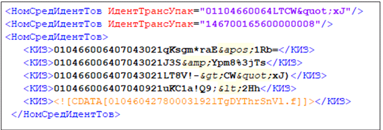

Рисунок 1. Пример различных видов экранирования в документе

При указании КИ все значения указываются без скобок, в которые заключены идентификаторы применения, и без пробелов.

### <span id="_требования_к_указанию_ки_товаров"></span>4.2. Требования к указанию КИ товаров

КИ товаров в потребительской упаковке (единицы товара, комплекты, наборы) могут быть указаны в элементе \<КИЗ\> (контрольный идентификационный знак).

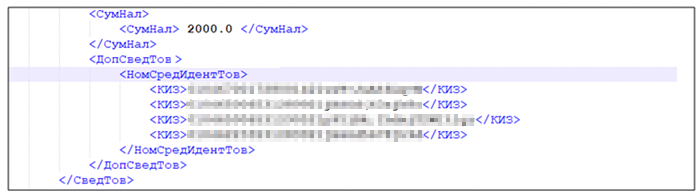

Рисунок 2. Пример указания КИ товаров в потребительской упаковке

### <span id="_требования_к_указанию_кигу"></span>4.3. Требования к указанию КИГУ

Блоки, потребительские наборы, прочие групповые упаковки (КИГУ, КИН) могут быть указаны в элементе \<НомУпак\> (уникальный идентификатор вторичной (потребительской) / третичной (заводской, транспортной) упаковки).

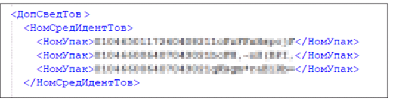

Рисунок 3. Пример указания КИГУ

В данном элементе так же допустимо указание КИТУ — коробов, как при условии их вложенности / вхождении в транспортную упаковку высшего уровня, так и как отдельной единицы отгрузки товара.

### <span id="_требования_к_указанию_киту"></span>4.4. Требования к указанию КИТУ

Значения КИТУ для паллет, контейнеров и коробов могут быть указаны в элементе \<ИдентТрансУпак\> (уникальный идентификатор транспортной упаковки).

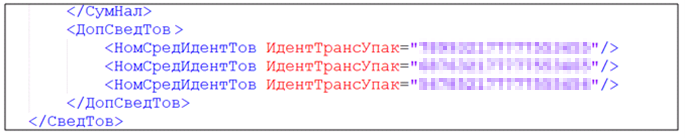

Рисунок 4. Пример указания КИТУ

Если в КИТУ входят несколько товарных позиций из УПД, значение КИТУ необходимо указывать к каждой строке товарной позиции в этом документе.

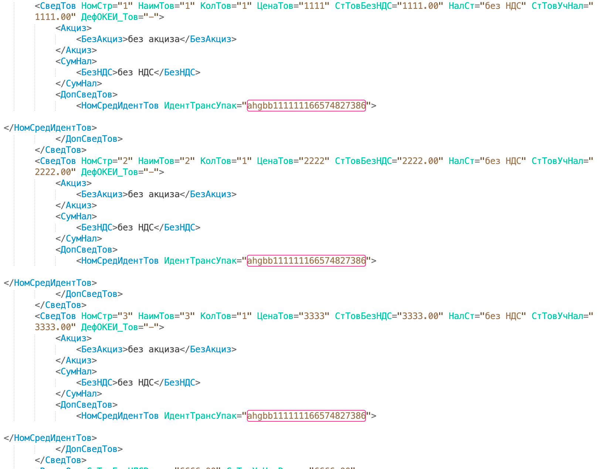

Рисунок 5. Пример указания КИТУ к нескольким товарным позициям

### <span id="_требования_к_указанию_сведений_о_передаче_маркированного_товара_в_объёмно_сортовом_разрезе_учёта"></span>4.5. Требования к указанию сведений о передаче маркированного товара в объёмно-сортовом разрезе учёта

Участникам оборота товаров доступна функциональность по обработке документов с указанием сведений о маркированных товарах в объёмно-сортовом разрезе на демонстрационном и промышленном контурах ГИС МТ. Перечень ошибок, возникающих при обработке документов, содержащих сведения в объёмно-сортовом разрезе, доступен в разделе «[Проверка документа УПД в объёмно-сортовом и партионном виде сведений и описание ошибки](#_проверка_документа_упд_в_объёмно_сортовом_и_партионном_виде_сведений_и_описание_ошибки)». Даты начала обязательной передачи сведений об обороте товара для участников оборота товаров, осуществляющих оптовую торговлю, регулируется Постановлениями Правительства РФ соответствующих товарных групп.

При организации прослеживаемости маркированной продукции в ГИС МТ в товарных группах, предусматривающих применение сортового учёта, в УПД, УКД, УПД(и) предполагается указание информации об отгруженной маркированной продукции, базирующейся на следующих принципах:

- в одном документе УПД, УПД(и), УКД, УКД(и) допускается указание сведений о маркированных товарах с поэкземплярной и объёмно-сортовой прослеживаемостью;

- в одном документе допускается сочетание информации о маркированных товарах в объёмно-сортовом разрезе по всем товарным группам, предусматривающим объёмно-сортовой период прослеживаемости;

- по Приказу ФНС России от 19.12.2023 № ЕД-7-26/970@: для отражения в документе информации о маркированной продукции в объёмно-сортовом разрезе учёта используются поля \<ГТИН\> и \<КолВедМарк\> в единице, подлежащей маркировке.

  Возможна ситуация, когда GTIN не совпадает с кодом, нанесённым на товар, и дополненным лидирующими нулями до 14 символов (например, если на товаре нанесён код EAN-8 или EAN-13). В этом случае в регулярном выражении ОСУ необходимо указывать код товара из НКМТ, в соответствии с которым сформирован код маркировки на товаре. Код товара определяется идентификатором применения AI, равным «01», и состоит из 14 цифр;

  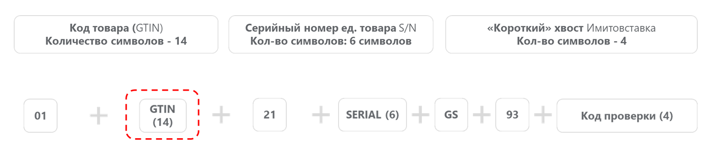

  Рисунок 6. Определение кода товара

- по товарной позиции необходимо указывать GTIN минимальной потребительской упаковки, доступной к реализации. При указании GTIN наборов и групповой упаковки на баланс склада будут зачислены только GTIN вложений на основании сведений из НКМТ;

- по GTIN с признаком весового товара на балансе виртуального склада количество будет учитываться в двух единицах измерения: вес (в кг) и количество КМ. При этом вес будет заимствоваться из значения, переданного по товарной строке из атрибута \<КолТов/\>.

  Количество единиц маркируемой продукции для товаров с переменным весом может быть указано в УПД по расчётным показателям, исходя из веса отгружаемой продукции. Для товаров с переменным весом в НКМТ указан диапазон возможного веса единицы товара, для таких товаров сведения по количеству могут быть рассчитаны исходя из средних значений весового диапазона.

  Пример: согласно сведениям из НКМТ сыр весовой имеет переменный вес от 8 до 10 кг. В УПД по товарной позиции указано 100 кг.

  Расчёт количества единиц маркированной продукции:

  ``` highlight
  100 кг (количество в поставке) / 9 кг (средний вес одной единицы) = 11,1
  ```

  Полученное при расчёте число всегда округляется до целого согласно правилу арифметического округления: если после запятой стоит цифра 1, 2, 3 или 4, то цифра до запятой не меняется, если после запятой стоит цифра 5, 6, 7, 8 или 9, то цифра до запятой увеличивается на единицу. В данном примере допустимо указать в регулярном выражении 11 единиц товара;

По Приказу ФНС России от 19.12.2023 № ЕД-7-26/970@:

- для указания сведений о маркированном товаре в объёмно–сортовом разрезе необходимо использовать тег \<ГТИН\> и \<КолВедМарк\>;

  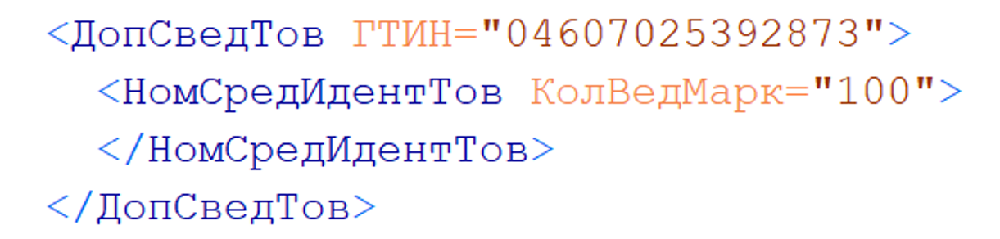

  Рисунок 7. Пример указания сведений об отгруженной маркированной продукции при сортовом разрезе учёта по Приказу ФНС России от 19.12.2023 № ЕД-7-26/970@

- также допускается указание сведений о маркированном товаре в объёмно-сортовом разрезе в виде регулярного выражения \[02\]\[GTIN\]\[37\]\[количество\] в единице, подлежащей маркировке, в теге \<НомУпак\>. Данный способ является опциональным и может быть использован по согласованию с контрагентом. В данном случае атрибуты \<ГТИН\> и \<КолВедМарк\> не заполняются;

  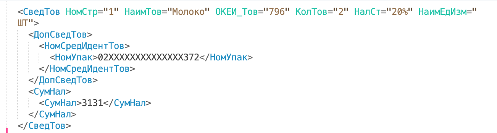

  Рисунок 8. Пример альтернативного опционального способа указания сведений об отгруженной маркированной продукции при сортовом разрезе учёта по Приказу ФНС России от 19.12.2023 № ЕД-7-26/970@

На время переходного периода от объёмно-сортового учёта к экземплярному рекомендуется распределять отгрузки по партиям по дате производства:

- первые отгрузки — по объёмно-сортовому учёту для товаров, произведенных до наступления экземплярной прослеживаемости (в УПД заполняются поля \<ГТИН\> и \<КолВедМарк\>);

- после вымывания остатков — переходить на отгрузки партий производства, произведенных при наступлении экземплярной прослеживаемости (в УПД указываются коды идентификации).

При необходимости поставки смешанной партии, по договоренности с покупателем, разделять товар на две строки в документе УПД, УПД(и) в зависимости от разреза сведений о маркировке:

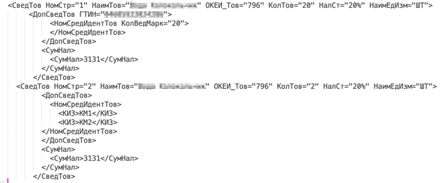

Рисунок 9. Пример заполнения сведений при отгрузке смешанной партии

Если передача продукции, произведённой до даты старта экземплярной прослеживаемости, в отношении которой допускается объёмно-сортовая прослеживаемость, планируется к отгрузке в экземплярном разрезе (в УПД указываются коды идентификации), то сначала необходимо согласовать с контрагентом такую возможность. Поскольку для корректного учёта сведений об обороте контрагенту последующую отгрузку будет необходимо производить только в экземплярном разрезе

#### <span id="_рекомендации_по_указанию_в_упд_сведений_о_производственной_партии_молочной_продукции"></span>4.5.1. Рекомендации по указанию в УПД сведений о производственной партии молочной продукции

Согласно Приказу ФНС России от 19.12.2023 № ЕД-7-26/970@ сведения о производственной партии и количестве продукции указываются в поле **«Номер средств идентификации товаров»** (\<НомСредИдентТов\>). Количество проставляется в атрибуте \<КолВедМарк\>, номер партии — в атрибуте \<ПрПартМарк="\<номер партии от 21 до 32 символов\>"\>.

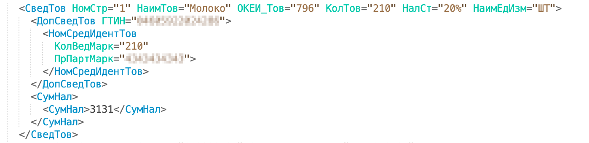

Рисунок 10. Пример указания сведений в xml УПД (ЕД-7-26/970@)

Для УПД / УПД(и) по формату приказа ФНС России от 19.12.2023 № ЕД-7-26/970@ допускается указание нескольких партий, для этого поле \<НомСредИдентТов\> становится множественным.

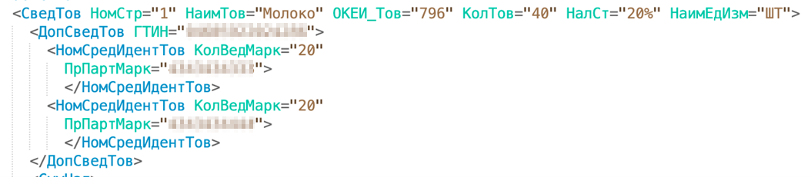

Рисунок 11. Пример указания сведений в xml УПД (ЕД-7-26/970@) с несколькими идентификаторами производственной партии

При передаче сведений о товарах с переменным весом, когда в составе общего количества содержится несколько партий, используется атрибут \<НомУпак\>, который содержит регулярное выражение: \[02\]\[gtin\]\[37\]\[count\]\[3103\]\[weight\], где \[gtin\] — код товара (14 цифр), \[count\] — количество товара в единице измерения упаковки (от 1 до 8 цифр), \[weight\] — вес товара в граммах (9 цифр, если количество менее 9 цифр — заполняется лидирующими нулями).

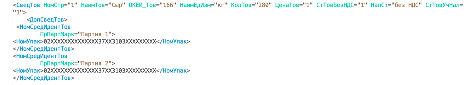

Рисунок 12. Пример указания нескольких партий для весового товара в соответствии с Приказом ФНС России от 19.12.2023 № ЕД-7-26/970@:

При использовании данного разреза передачи сведений атрибуты \<ГТИН\> и \<КолВедМарк\> предусмотренные форматом, не заполняются.

### <span id="_рекомендации_к_подаче_сведений_о_передаче_маркированных_товаров_в_гис_мт"></span>4.6. Рекомендации к подаче сведений о передаче маркированных товаров в ГИС МТ

Общие рекомендации:

- для корректной автоматизированной обработки документов в файле обмена «Информация покупателя» рекомендуется заполнять поле \<КодИтога\> «Титула Покупателя», согласно описанию формата, представленного в таблице 7.6 приказа ФНС России от 19.12.2023 № ЕД-7-26/970@.

  Поведение системы ГИС МТ при заполнении поля \<КодИтога\>:

  «1» — товары (работы, услуги, права) приняты без расхождений (претензий). Все указанные КИ перейдут на получателя документа.

  «2» — товары (работы, услуги, права) приняты с расхождениями (претензией). Все указанные КИ перейдут на получателя документа. Последующая корректировка данных по КИ может быть осуществлена путём подачи исправленных или корректировочных документов.

  «3» — товары (работы, услуги, права) не приняты. Указанные КИ останутся у отправителя КИ (товаров). Движение в ГИС МТ происходить не будет. При отсутствии поля \<КодИтога\> происходит движение КИ от отправителя документа к получателю;

- в ГИС МТ возможна успешная обработка УПД / УПД(и), содержащего сведения о кодах идентификации маркированной продукции или сведения в объёмно-сортовых показателях, ранее реализованных покупателем посредством ККТ по данному документу.

Рекомендации при указании в документе сведений по кодам идентификации:

- при передаче сведений в УПД / УПД(и) о групповой упаковке не требуется указание КИ товаров, входящих в групповую упаковку;

- при передаче сведений в УПД / УПД(и) о транспортной упаковке не требуется указание КИ товаров и / или КИГУ и КИТУ, входящих в эту упаковку. Указывается только КИТУ верхнего уровня;

- в УПД / УПД(и) одновременно могут быть поданы сведения о транспортных, групповых и потребительских упаковках маркированного товара. Пример: передаётся 1 транспортная упаковка (состав агрегата не указывается), 2 групповые упаковки (состав агрегата не указывается) и 3 товара в потребительской упаковке.

  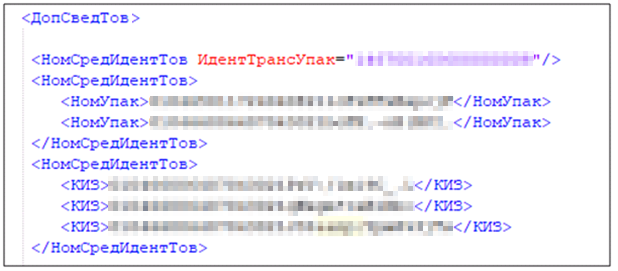

  Рисунок 13. Пример заполнения КИ в УПД

Одновременное указание в УПД / УПД(и) сведений по КИ упаковки (транспортной, групповой) и сведений по КИ вложений в эти упаковки не считается ошибочным и принимаются в ГИС МТ. Обработка сведений выполняется по «Правилу приоритета на наивысший КИТУ / КИГУ».

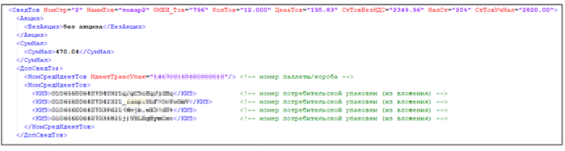

Рисунок 14. Пример заполнения КИ в УПД при одновременном указании сведений по КИ упаковок и их вложениям

В указанном примере в УПД указывается 1 КИТУ, вложенность которого составляет 10 КИ, и отдельно 4 КИ из вложения в данном КИТУ. В ГИС МТ применится [Правило приоритета на наивысший КИТУ / КИГУ в УПД / УПД(и)](#pravilo_prioriteta_na_naivysshij_kitu_kigu_v_upd_upd_i), т.е. по УПД с продавца на покупателя будут перемещены 1 КИТУ, указанный в документе, и все КИ, вложенные в данный КИТУ (10 КИ).

Рекомендации при указании в документе сведений по объёмно-сортовым показателям:

- приход и расход по товарам в разрезе кода товара (GTIN) осуществляется на основании указанных в \<ГТИН\>, \<КолВедМарк\>. Код товара (GTIN) групповой упаковки и набора при объёмно-сортовом учёте имеет привязки к поданным в ГИС МТ данным по агрегированию кодов в верхнеуровневую упаковку. При указании в документе только данных количества кодов групповой упаковки или наборов без указания сведений о количестве кодов товаров, вложенных в указанные групповые упаковки или наборы, по данным системы будет выполнен приход или расход только по вложенным кодам товаров (GTIN) групповой упаковки или набора;

- при одновременном заполнении \<ГТИН\> и \<ИдентТрансУпак\> (или \<КИЗ\>), приоритетным считается значение в \<ИдентТрансУпак\> (или \<КИЗ\>);

- при одновременном заполнении \<КолВедМарк\> и \<ИдентТрансУпак\> (или \<КИЗ\>), приоритетным считается значение в \<ИдентТрансУпак\> (или \<КИЗ\>);

- недопустимо одновременное заполнение \<ГТИН\>, \<КолВедМарк\> и \<ИдентТрансУпак\> (или \<КИЗ\>) для одной позиции.

#### <span id="pravilo_prioriteta_na_naivysshij_kitu_kigu_v_upd_upd_i"></span>4.6.1. Правило приоритета на наивысший КИТУ / КИГУ в УПД / УПД(и)

При одновременном указании в УПД / УПД(и) информации о транспортной упаковке или групповой упаковке и о КИ потребительских, групповых и транспортных упаковок, входящих в эту транспортную или групповую упаковку, ГИС МТ обработает сведения по всем вложенным КИ (до первого уровня вложенности), которые по данным системы будут входить в наивысший уровень из указанных в УПД идентификаторов транспортной или групповой упаковки.

При указании в строке УПД / УПД(и) всех видов упаковки КИ / КИГУ / КИТУ система обработает все виды упаковок и их вложения от наибольшей упаковки к меньшей.

Состав транспортных, групповых упаковок (КИТУ / КИГУ) определяется в ГИС МТ на основании сведений об агрегации КИ, которые подаются в систему участниками оборота товаров до свершения факта отгрузки товаров по УПД.

В случае представления участниками оборота в информационную систему мониторинга сведений об обороте и выводе из оборота части товаров, находившихся (по данным информационной системы мониторинга) в транспортной упаковке, в информационной системе мониторинга автоматически регистрируется расформирование всех упаковок более высокого уровня вложенности, содержавших изъятый из групповой или транспортной упаковки товар.

### <span id="_рекомендации_к_подаче_исправленных_сведений_о_передаче_маркированных_товаров_в_гис_мт_на_основании_формата_упди"></span>4.7. Рекомендации к подаче исправленных сведений о передаче маркированных товаров в ГИС МТ на основании формата УПД(и)

- при подаче об исправлении сведений в формате УПД(и), при условии, что ранее в ГИС МТ были поданы сведения в формате УПД и обработаны успешно (КИ сменили **«Владельца»** на **«Покупателя»** / **«Получателя»**), указываются все транспортные, групповые и потребительские идентификаторы, переданные по первичному документу на **«Покупателя»** / **«Получателя»**;

- если на момент подачи сведений в формате УПД(и) со стороны покупателя были реализованы / перемещены КИ, ранее перемещённые на основании сведений по УПД, данные КИ должны быть указаны в УПД(и);

- в случае обработки с ошибками сведений, поданных в формате УПД (например, расформирование КИТУ до перехода права собственности по КИ), необходимо исправить ошибки и подать сведения, используя формат документа УПД(и) или аннулирование документа, обработанного с ошибкой, и последующей подачей нового документа;

- если на момент подачи исправлений по КИТУ, переданных ранее по УПД, на замену КИ в формате УПД(и) покупателем были уже расформированы КИТУ (вложенность при этом в полном составе числится за покупателем), то при обработке УПД(и) на **«Продавца»** перемещается вложенность КИТУ, а расформированный КИТУ остается на покупателе;

- при подаче сведений в формате УПД(и), при условии, что ранее в ГИС МТ были поданы сведения в формате УПД с указанием значения \<КодИтога\> = 3, сведения в формате УПД(и) будут приняты и обработаны в ГИС МТ.

### <span id="_рекомендации_к_проверке_сведений_о_маркированных_товарах_до_подачи_сведений_в_гис_мт"></span>4.8. Рекомендации к проверке сведений о маркированных товарах до подачи сведений в ГИС МТ

На момент подачи сведений в ГИС МТ в формате УПД указываемые коды идентификации транспортных, групповых и потребительских упаковок, должны быть в собственности у отправителя / продавца или переданы ему по комиссионной или агентской схемам.

На момент подачи сведений в ГИС МТ КИ, указанные в УПД, не должны фигурировать в документе «Отгрузка», на который не оформлен подписанный документ «Приёмка». Документы «Отгрузка» и «Приёмка» в электронном формате реализуются Оператором-ЦРПТ для прямой подачи сведений в ГИС МТ.

Указанные в формате УПД транспортные и групповые упаковки должны быть наполненными, т.е. обязательно содержать вложенные коды.

Указанные в формате УПД КИ потребительских упаковок не должны быть выбывшими из оборота.

Метод проверки сведений по УПД до подачи в ГИС МТ описан в разделе «[Предварительная проверка УПД до свершения факта приёмки со стороны покупателя](#_предварительная_проверка_упд_до_свершения_факта_приёмки_со_стороны_покупателя)» текущих рекомендаций.

В сведениях, передаваемых в формате УПД / УПД(и), не могут указываться агрегированные таможенные коды (АТК).

Нюансы для **табачных товарных групп**

При **первичной** передаче продукции от производителя необходимо убедиться в наличии лицензии, соответствующей [требованиям](https://docs.crpt.ru/gismt/Регистрация_оборудования_и_лицензий/). Проверка лицензии осуществляется по кодам, выпущенным на единицы товаров и на групповые упаковки. В случае отсутствия такой лицензии документ будет обработан с ошибкой и коды не будут введены в оборот.

Нюансы для товарных групп **«Алкоголь»** и **«Пиво, напитки, изготавливаемые на основе пива, слабоалкогольные напитки»**

При подаче УД (ЕД-7-26/970@) производится проверка мест осуществления деятельности (МОД), в связи с чем необходимо убедиться в соблюдении следующих условий:

- в личном кабинете в разделе «Профиль» → «МОД» зарегистрировано МОД как у продавца, так и у покупателя;

- сведения, указанные в УД (для юридических лиц — ИНН и КПП, для индивидуальных предпринимателей — ИНН и идентификатор ФИАС) соответствуют данным о МОД, зарегистрированном в личном кабинете продавца / покупателя;

- МОД продавца и покупателя не заблокированы в ЕГАИС и являются активными;

- ИНН продавца соответствует ИНН грузоотправителя;

- ИНН покупателя соответствует ИНН грузополучателя;

- при перемещении пива и слабоалкогольных напитков в объёмно-сортовом разрезе (ОСУ) передача осуществляется в рамках одного ИНН (между МОД одного участника оборота товаров) - применимо только для товарной группы «Пиво, напитки, изготавливаемые на основе пива, слабоалкогольные напитки».

При несоблюдении условий документ будет обработан с ошибкой.

### <span id="_обработка_в_гис_мт_сведений_о_дате_выполнения_операции_над_ки_указанном_в_универсальном_документе"></span>4.9. Обработка в ГИС МТ сведений о дате выполнения операции над КИ, указанном в универсальном документе

Сведения о перемещении КИ на основании универсальных документов записываются на:

- дату приёмки товаров («ДатаПрин»), если она указана в **«Титуле покупателя»**;

- дату отгрузки товаров («ДатаПер»), если она указана в **«Титуле продавца»**;

- дату документа об отгрузке («ДатаДок»), если даты приёмки или отгрузки товаров не указаны.

### <span id="_рекомендации_к_подаче_сведений_об_обороте_маркированных_товаров_в_рамках_исполнения_государственных_и_муниципальных_контрактов_для_товарных_групп_ветеринарные_препараты_и_медицинские_изделия"></span>4.10. Рекомендации к подаче сведений об обороте маркированных товаров в рамках исполнения государственных и муниципальных контрактов для товарных групп «Ветеринарные препараты» и «Медицинские изделия»

В случаях, когда покупателем и плательщиком по государственному контракту выступает федеральный орган исполнительной власти, для отражения сведений о поставке в информационной системе мониторинга заполняется УПД с функцией ДОП (первичный документ) с указанием кодов (значений) для формирования информации о специальных обстоятельствах документа. Значения \<СпОбстФДОП\> и сведения продавца о видах оборота представлены в таблице ниже.

При операциях, предусматривающих переход права собственности на имущество к получателю, отражение которых в бухгалтерском учёте имеет существенные особенности специального обстоятельства:

| Вид оборота | Значение |
|----|----|
| СпОбстФДОП = 00016 | Имущество передано от Поставщика (именуемого как «Продавец») Грузополучателю (именуемому как «Покупатель») в рамках исполнения контракта в соответствии с Федеральным законом от 05.04.2013 № 44-ФЗ «О контрактной системе в сфере закупок товаров, работ, услуг для обеспечения государственных и муниципальных нужд» |

При операциях, не предусматривающих перехода права собственности на имущество к получающей стороне:

| Вид оборота | Значение |
|----|----|
| СпОбстФДОП = 00042 | Имущество передано от Поставщика (именуемого как «Продавец») Грузополучателю (именуемому как «Покупатель») в рамках исполнения контракта в соответствии с Федеральным законом от 05.04.2013 № 44-ФЗ «О контрактной системе в сфере закупок товаров, работ, услуг для обеспечения государственных и муниципальных нужд» |

### <span id="_рекомендации_к_подаче_сведений_через_еис_закупки_в_рамках_исполнения_государственных_и_муниципальных_контрактов_для_товарной_группы_медицинские_изделия"></span>4.11. Рекомендации к подаче сведений через ЕИС Закупки в рамках исполнения государственных и муниципальных контрактов для товарной группы «Медицинские изделия»

Согласно пункту 33 Постановления Правительства РФ от 31.05.2023 № 894, при поставке маркированных товаров в рамках исполнения государственных и муниципальных контрактов участник оборота товаров вправе исполнить обязанность по представлению в ГИС МТ информации об обороте товаров путём представления документа о приёмке, подписанного обеими сторонами в Единой информационной системе (ЕИС) в сфере закупок.

С учётом перехода на поэкземплярную прослеживаемость с 1 сентября 2025 года, для корректной обработки документа о приёмке в ГИС МТ необходимо:

- если Заказчик является участником оборота маркированных товаров — указать реквизиты Заказчика в поле **«Покупатель»** документа о приёмке в ЕИС. После успешной обработки документа в ГИС МТ коды маркировки сменят владельца и перейдут на ИНН Заказчика;

- если Заказчик не является участником оборота маркированных товаров, а Грузополучатель является участником оборота товаров — указать реквизиты Грузополучателя в поле **«Грузополучатель»** документа о приёмке в ЕИС. После успешной обработки документа в ГИС МТ коды маркировки сменят владельца и перейдут на ИНН Грузополучателя.

## <span id="_описание_сведений_о_маркированных_товарах_в_укд"></span>5. Описание сведений о маркированных товарах в УКД

Подача электронных документов в ГИС МТ об изменении сведений в отношении переданных маркированных товаров в результате изменения стоимости отгруженной товарной позиции, в том числе, в связи с уточнением количества (объёма) поставленных (отгруженных) товаров определённого наименования, осуществляется в форме универсального корректировочного документа (УКД, УКД(и)). Исправление ошибок, связанных с кодами без изменения по номенклатурной позиции стоимостных характеристик, вызванных изменением цены или количества, осуществляется с применением УПД(и) ввиду отсутствия оснований для применения УКД.

Согласно Приказу от 12.10.2020 № ЕД-7-26/736@ формируемый для подачи сведений документ должен состоять из двух файлов обмена: «ON_NKORSCHFDOPPRMARK» и «ON_NKORSCHFDOPPOKMARK».

Со стороны участников оборота товаров файлы должны быть подписаны УКЭП.

Если отгрузка маркированной продукции была выполнена после наступления обязательности подачи сведений участниками оборота товаров в ГИС МТ, то документ об отгрузке товаров, к которому составлен корректировочный счёт-фактура (УКД, УКД(и)) должен быть ранее направлен в ГИС МТ. При отсутствии в ГИС МТ сведений о документе об отгрузке товаров, к которому составлен корректировочный счёт-фактура (УПД, УПД(и)), документ будет принят и обработан с ошибками на стороне ГИС МТ, изменений сведений о передаче товаров не произойдет.

Если отгрузка маркированной продукции была выполнена до наступления обязательности подачи сведений участниками оборота товаров в ГИС МТ, то документ об отгрузке товаров, к которому составлен корректировочный счёт-фактура (УКД, УКД(и)) может в ГИС МТ отсутствовать. На основании УКД, УКД(и) будут приняты и обработаны корректирующие сведения о передаче товаров.

К обработке принимаются документы с функциями «КСЧФДИС» и «ДИС». Документ с функцией «КСЧФДИС» и «ДИС» состоит из двух файлов обмена (файл «Информация продавца» и файл «Информация покупателя»).

Со стороны ГИС МТ принимаются УКД, УКД(и), оформленные на один документ об отгрузке товаров, к которому составлен корректировочный счёт-фактура УПД, УПД(и).

В одном документе могут указываться товары, подлежащие маркировке, и товары, не подлежащие маркировке средствами идентификации. ГИС МТ обрабатывает сведения только о маркированных товарах.

В одном документе не могут указываться КИГУ и КИТУ (мультитоварные упаковки), содержащие во вложении КИ потребительских единиц товара разных товарных групп.

В УКД, в случае изменения сведений по товарной позиции, заполнение информации по КИ можно производить следующими способами:

- в УКД может быть указан полный перечень КИ до / после из УПД (УПД(и)), к которому составляется документ о согласии покупателя с изменением стоимости (данный порядок также относится к оформлению корректировочных документов);

- в УКД может быть указан перечень КИ до / после, только по измененным КИ.

Пример указания сведений, описание ситуации к одной товарной позиции.

Ситуация 1: в УПД поставлены маркированные товары с КИ (1,2,3,4,5…​500), указание изменений в УКД.

Пример:

УКД\_(\<НомСредИдентТовДо\>) КИ (1,2,3,4,5…​500)\
УКД\_(\<НомСредИдентТовПосле\>) КИ (1,2,3,4,5…​499)

Ситуация 2: товар с КИ (500) возвращается, указание изменений в УКД.

Пример:

УКД\_(\<НомСредИдентТовДо\>) КИ (500)

УКД (\<НомСредИдентТоПосле\>) по данному КИ товара не заполняется — элемент должен отсутствовать полностью, указание дефиса («-») вместо значения КИ приведёт к обработке документа с ошибкой.

Для успешной обработки документа в ГИС МТ, регистрация продавца и покупателя, как участников оборота товаров в ГИС МТ, обязательна, за исключением сценариев оформления УПД с указанием признаков выбытия КИ.

Для входа в ЛК и просмотра сведений по обработанному документу, а также для получения сведений посредством API (см. <a href="https://docs.crpt.ru/gismt/True_API/" rel="noopener" target="_blank">True API</a>), участником оборота товаров обязательно должен быть подписан договор по товарной группе, в рамках которой осуществляется товарооборот.

### <span id="_требования_к_экранированию_спецсимволов_укд_по_формату_приказа_ед_7_26736_от_12_10_2020"></span>5.1. Требования к экранированию спецсимволов УКД по формату Приказа № ЕД-7-26/736@ от 12.10.2020

При указании сведений по КИ маркированных товаров необходимо соблюдать правила экранирования спецсимволов, являющихся частью КИ.

Описание зарезервированных символов XML, требуемых к подмене именованными сущностями для корректного формирования файла, предоставлено в таблице ниже.

| Именованная сущность для подмены | Зарезервированный символ | Наименование | Теги / атрибуты файла УПД |
|----|----|----|----|
| \&lt; | \< | less than | \<КИЗ\>, \<НомУпак\> |
| \&gt; | \> | greater than | \<КИЗ\>, \<НомУпак\> |
| \&amp; | & | ampersand | \<КИЗ\>, \<НомУпак\> |
| \&apos; | ' | apostrophe | \<ИдентТрансУпак\> |
| \&quot; | " | quotation mark | \<ИдентТрансУпак\> |

Таблица 50. Зарезервированные символы XML, требуемые к подмене именованными сущностями {.tableblock .frame-all .grid-all .stretch}

В колонке **«Теги / атрибуты файла УПД»** указаны значения тегов \<КИЗ\>,\<НомУпак\> или атрибута \<ИдентТрансУпак\> тега \<НомСредИдентТов\>, для которых является обязательным экранирование указанных спецсимволов.

Пример экранирования спецсимволов:

``` adoc
Код идентификации: 010444006404043021LT8V!->CW”xJ)
-> <КИЗ>010444006404043021LT8V!-&gt;CW"xJ)</КИЗ>
Код идентификации: 01046002110125861101071921E’d8ZnM
-> <НомСредИдентТов ИдентТрансУпак="01046002110125861101071921E&apos;d8ZnM"/>
```

При указании сведений в XML-файле допустимо экранирование всего КИ, указанного в тегах \<КИЗ\>, \<НомУпак\> и содержащего спецсимволы. КИ заключается в конструкцию «CDATA».

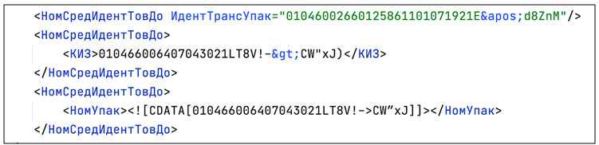

Рисунок 15. Пример видов экранирования в документе

При указании КИ все значения указываются без скобок, в которые заключены идентификаторы применения, и без пробелов.

### <span id="trebovaniya_k_ukazaniyu_ki_tovarov_gruppovyh_i_transportnyh_upakovok"></span>5.2. Требования к указанию КИ товаров, групповых и транспортных упаковок

КИ товаров указываются в полях **«Номер средства идентификации товаров до изменения»** (\<НомСредИдентТовДо\>) до изменения сведений в отношении отгруженного маркированного товара и в полях **«Номер средства идентификации товаров после изменения»** (\<НомСредИдентТовПосле\>) после изменения сведений в отношении отгруженного маркированного товара.

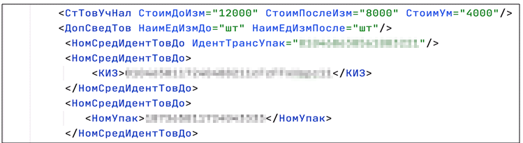

Рисунок 16. Пример заполнения элемента НомСредИдентТовДо о переданных КИ покупателю

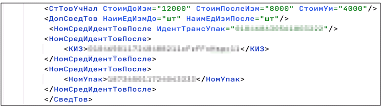

Рисунок 17. Пример заполнения элемента НомСредИдентТоПосле о скорректированных КИ на покупателе

КИ товаров в потребительской упаковке (единицы товара, комплекты, наборы) могут быть указаны в элементе \<КИЗ\> (контрольный идентификационный знак).

Блоки, потребительские наборы, прочие групповые упаковки (КИГУ, КИН) могут быть указаны в элементе **«Уникальный идентификатор вторичной (потребительской) / третичной (заводской, транспортной) упаковки»**.

Дополнительно, в данном элементе так же допустимо указание КИТУ — коробов как при условии их вложенности / вхождении в транспортную упаковку высшего уровня, так и как отдельной единицы отгрузки товара.

КИТУ (паллеты, контейнеры, короба) могут быть указаны в элементе **«Уникальный идентификатор транспортной упаковки»**.

Возврат товара, который был перемаркирован получателем или отправителем исходного УПД новым КИ, возможно осуществить с применением УКД. В информации до изменения сведений (\<НомСредИдентТовДо\>) для товаров указываются новый КИ, полученные при перемаркировке, независимо от того, указывался ли в документе «Перемаркировка» предыдущий КИ или не указывался. Информация после изменения сведений (\<НомСредИдентТоПосле\>) по данному КИ товара не заполняется — элемент может отсутствовать полностью, если осуществляется полный возврат всех КИ по товарной позиции, или быть заполнен только теми КИ, которые остаются на получателе (покупателе) документа. Указание дефиса («-») вместо значения КИ приведёт к обработке документа с ошибкой.

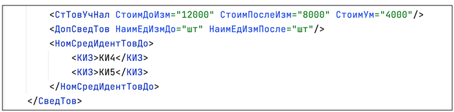

Рисунок 18. Пример заполнения при указании информации о возврате по товарной позиции

### <span id="trebovaniya_k_ukazaniyu_svedenij_o_peredache_markirovannogo_tovara_v_obyomno_sortovom_razreze_uchyota"></span>5.3. Требования к указанию сведений о передаче маркированного товара в объёмно-сортовом разрезе учёта

Участникам оборота товаров доступна функциональность по обработке документов с указанием сведений о маркированных товарах в объёмно-сортовом разрезе на демонстрационном и промышленном контурах ГИС МТ. Перечень ошибок, возникающих при обработке документов, содержащих сведения в объёмно-сортовом разрезе, доступен в разделе «[Проверка документа УПД в объёмно-сортовом и партионном виде сведений и описание ошибки](#_проверка_документа_упд_в_объёмно_сортовом_и_партионном_виде_сведений_и_описание_ошибки)». Даты начала обязательной передачи сведений об обороте товара для участников оборота товаров, осуществляющих оптовую торговлю, регулируется Постановлениями Правительства РФ соответствующих товарных групп.

При организации прослеживаемости маркированной продукции в ГИС МТ в товарных группах, предусматривающих применение сортового учёта, в УКД, УКД(и) предполагается указание информации об отгруженной маркированной продукции, базирующейся на следующих принципах:

- в УКД, УКД(и) допускается указание сведений о маркировке товаров как поэкземплярно, так и в сортовом разрезе (GTIN и количество КИ потребительских упаковок). Формат сведений должен совпадать с форматом исходного УПД;

- для отражения в документе информации о маркированной продукции в сортовом разрезе учёта используется регулярное выражение: \[02\]\[GTIN\]\[37\]\[количество\] в потребительской единице, подлежащей маркировке. Идентификаторы применения указываются без заключающих скобок;

- по товарной позиции необходимо указывать GTIN минимальной потребительской упаковки, доступной к реализации. При указании GTIN наборов и групповой упаковки на баланс склада будут зачислены только GTIN вложений на основании сведений из НКМТ;

- сведения о маркированном товаре в сортовом разрезе учёта могут быть указаны в любом теге, входящем в **«НомСредИдентТовДо»** и **«НомСредИдентТовПосле»**: **«НомУпак»** (использование атрибутов «КИЗ» и «ИдентТрансУпак» может повлечь некорректную обработку документа контрагентом);

- количество отгруженного товара указывается в виде регулярного выражения 02\[gtin\]37\[count\], где \[gtin\] — код товара (14 цифр), \[count\] — количество товара в единице измерения упаковки (от 1 до 8 цифр), в **«НомСредИдентТовДо»** до изменения сведений в отношении отгруженного маркированного товара и в **«НомСредИдентТовПосле»** после изменения сведений в отношении отгруженного маркированного товара;

  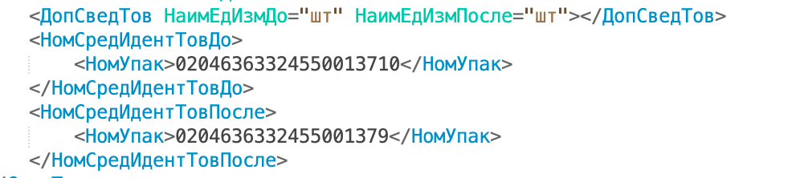

  Рисунок 19. Пример заполнения при указании информации о частичном возврате по товарной позиции

  

  Рисунок 20. Пример заполнения при указании информации о полном возврате по товарной позиции

#### <span id="_рекомендации_по_указанию_в_укд_сведений_о_производственной_партии_молочной_продукции_для_участников_эксперимента"></span>5.3.1. Рекомендации по указанию в УКД сведений о производственной партии молочной продукции для участников эксперимента

Согласно Постановлению Правительства Российской Федерации «О проведении на территории Российской Федерации эксперимента по партионному учету в отношении маркированной молочной продукции» в период с 1 июня 2024 года по 1 мая 2025 года для участников эксперимента при передаче сведений об обороте с указанием данных о производственной партии в УКД необходимо использовать формат документа в соответствии с Приказом ФНС от 12 октября 2020 г. № ЕД-7-26/736@.

Для УКД используется поле **«Информационное поле события (факта хозяйственной жизни) 2»** (\<ИнфПолФХЖ2\>) файла обмена «Информации продавца» с атрибутом \<Идентиф="ПрПартМаркДо"\> или \<Идентиф="ПрПартМаркПосле"\>.

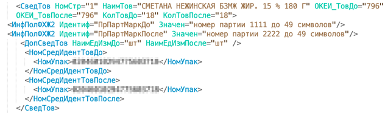

Рисунок 21. Пример указания партии в УКД в случае замены

### <span id="_рекомендации_к_подаче_сведений_в_гис_мт_об_изменениях_сведений_о_передаче_маркированных_товаров"></span>5.4. Рекомендации к подаче сведений в ГИС МТ об изменениях сведений о передаче маркированных товаров

- если на момент подачи сведений в формате УКД по корректировке сведений конкретной товарной позиции со стороны покупателя были реализованы / перемещены КИ, ранее успешно переданные на основании сведений по УПД / УПД(и), данные КИ должны быть указаны в УКД;

- если на момент подачи сведений в формате УКД по товарной группе вступили обязательства по передаче в ГИС МТ сведений об обороте КИ как экземплярном, так и в объёмно-сортовом разрезе, а исходный документ, на который была оформлена корректировка, в систему ГИС МТ не передавался, т.к. был оформлен до наступления обязательств, то сведения в формате УКД будут приняты и обработаны в ГИС МТ;

- в сведениях, передаваемых в формате УКД / УКД(и), не могут указываться АТК.

### <span id="_рекомендации_к_проверке_сведений_о_маркированных_товарах_до_подачи_сведений_в_гис_мт_2"></span>5.5. Рекомендации к проверке сведений о маркированных товарах до подачи сведений в ГИС МТ

На момент подачи сведений в ГИС МТ в формате УКД(и) при исправлении ошибки в УКД, добавляемые КИ транспортных, групповых или потребительских упаковок должны числиться за участником оборота товаров, осуществляющим поставку маркированных товаров (КИ находятся в собственности у продавца. В случае отгрузки товара с КИ от имени комиссионера / агента, КИ должны быть у него во владении (приняты от продавца)).

На момент подачи сведений в ГИС МТ в формате УКД / УКД(и) возвращаемые КИ транспортных, групповых или потребительских упаковок должны числиться за участником оборота товаров, осуществляющим возврат маркированных товаров (покупатель / комиссионер / агент).

В передаваемых сведениях, указанных в формате УКД / УКД(и), транспортные и групповые упаковки должны присутствовать в ГИС МТ.

В передаваемых сведениях, указанных в формате УКД / УКД(и), КИ потребительских упаковок, по которым происходит корректировка (перемещение или возврат), не должны быть выбывшими из оборота, за исключением УКД / УКД(и), оформленных на основании УПД с признаком выбытия товара из оборота (заполнено значение \<СвВыбытияМАРК\>).

Рекомендации будут расширены по мере разработки функциональности системы.

### <span id="_обработка_в_гис_мт_сведений_о_дате_выполнения_операции_над_ки_указанном_в_универсальном_документе_2"></span>5.6. Обработка в ГИС МТ сведений о дате выполнения операции над КИ, указанном в универсальном документе

Сведения о перемещение КИ на основании УКД записываются на:

- дату согласования действий по корректировке (\<ДатаСоглас\>), если она указана в **«Титуле покупателя»**;

- дату направления на согласование корректировки (\<ДатаНапр\>), если она указана в **«Титуле продавца»**;

- дату корректировочного счёта-фактуры (\<ДатаКСчФ\>), если даты согласования не указаны.

## <span id="opisanie_dopolnitelnyh_svedenij_o_peredache_markirovannyh_tovarov_vidy_oborota_prichiny_vybytiya_tovarov"></span>6. Описание дополнительных сведений о передаче маркированных товаров (виды оборота, причины выбытия товаров)

Участники оборота товаров, передающие товар другим участникам оборота товаров в рамках сделок, предусматривающих переход права собственности на товар, а также в рамках договоров комиссии и (или) агентских договоров, на основании первичного документа, подтверждающего отгрузку / приёмку товаров, формируют документ о передаче (приёмке) данных товаров в форме УПД с указанием вида сделки путём заполнения поля \<СпОбстФСЧФДОП\> или \<СпОбстФДОП\> согласно Приказу ФНС России от 19.12.2023 № ЕД-7-26/970@, в рамках которой осуществляется отгрузка, подписывают его усиленной электронной подписью.

Вид оборота:

- передача маркированных товаров по договорам комиссии и (или) агентским договорам (для дальнейшей реализации маркированных товаров);

- в случае применения УПД с функцией «ДОП» в качестве документа МХ-1 или МХ-3 (передача товара на ответственное хранение или возврат с ответственного хранения) необходимо проставлять соответствующую кодировку в поле \<ВидОборотаМАРК\> (9 — Перемещение товаров, не связанное с реализацией), т.к. в таких случаях не передаётся право собственности на товар, соответственно в ГИС МТ не осуществляется перемещение КИ.

В случае частичной приёмки маркированного товара для изменения ранее поданных данных в ГИС МТ, необходимо отправить корректирующие документы УКД к первичному документу (УПД, УПД(и), УКД), ранее отправленному в ГИС МТ.

Вывод товара из оборота осуществляется при обязательном указании признака выбытия в поле \<СвВыбытияМАРК\> в следующих случаях:

- при приобретении товаров юридическими лицами и индивидуальными предпринимателями в целях использования для собственных нужд, не связанных с их последующей реализацией (продажей);

- при безвозмездной передаче товаров юридическими лицами и индивидуальными предпринимателями без их последующей реализации (продажи);

- при использовании товаров для производственных целей, не связанных с их последующей реализацией (продажей);

- при реализации маркированных товаров в рамках гос. контракта (помимо обязательного указания признака выбытия в поле \<СвВыбытияМАРК\> должен быть указан идентификатор гос. контракта в элементе **«Идентификатор государственного контракта»** в поле **«Дополнительные сведения об участниках факта хозяйственной жизни, основаниях и обстоятельствах его проведения»** (\<ДопСвФЧЖ1\>)).

  При выводе КИ из оборота по причине продажи по сделке с государственной тайной сведения передаются в ГИС МТ только через документы прямой подачи сведений. В этом случае передача сведений через УПД не осуществляется.

В указанных случаях в УПД заполняется признак выбытия в поле \<СвВыбытияМАРК\>, на основании чего в ГИС МТ фиксируется перемещение КИ от продавца на покупателя и вывод КИ из оборота. Если поле \<СвВыбытияМАРК\> не заполнено, то при поступлении УПД осуществляется только перемещение кодов на покупателя, вывод кодов из оборота не осуществляется.

Если в УПД причина выбытия указана одновременно в сведениях со стороны продавца и в сведениях со стороны покупателя, при этом в указанных значениях имеется расхождение, то фактическая причина выбытия фиксируется в ГИС МТ в соответствии со следующим уровнем приоритезации:

- в поле \<СвВыбытияМАРК\> указано значение **«4»** (**«Продажа товаров по государственному (муниципальному) контракту»**) и заполнен элемент **«Идентификатор государственного контракта»** в поле **«Дополнительные сведения об участниках факта хозяйственной жизни, основаниях и обстоятельствах его проведения»** (\<ДопСвФЧЖ1\>);

- в поле \<СвВыбытияМАРК\> указано значение **«1»** (**«Покупка товаров юридическими лицами и индивидуальными предпринимателями в целях использования для собственных нужд, не связанных с их последующей реализацией (продажей)»**);

- в поле \<СвВыбытияМАРК\> указано значение **«3»** (**«Использование товаров для производственных целей, не связанных с их последующей реализацией (продажей)»**);

- в поле \<СвВыбытияМАРК\> указано значение **«2»** (**«Безвозмездная передача товаров юридическим лицам и индивидуальным предпринимателям, не связанная с их последующей реализацией (продажей)»**).

В случае оформления УПД с последующим выбытием КИ, для обработки документа в ГИС МТ регистрация покупателя не обязательна. Для входа в ЛК и просмотра сведений по обработанному документу, а также для получения сведений посредством API (см. <a href="https://docs.crpt.ru/gismt/True_API/" rel="noopener" target="_blank">True API</a>), участником оборота товаров обязательно должен быть подписан договор по товарной группе, в рамках которой осуществляется товарооборот.

### <span id="_сведения_о_видах_оборота"></span>6.1. Сведения о видах оборота

#### <span id="svedeniya_v_upd_oformlennyh_v_ramkah_dogovorov_komissii_i_ili_agentskih_dogovorov"></span>6.1.1. Сведения в УПД, оформленных в рамках договоров комиссии и (или) агентских договоров

Cогласно Приказу ФНС России от 19.12.2023 № ЕД-7-26/970@: для передачи сведений о видах оборота в УПД с функцией «ДОП», в рамках договоров комиссии и (или) агентских договоров, используется атрибут \<СпОбстФСЧФДОП\> или \<СпОбстФДОП\> элемента \<ДопСвФХЖ1\> файла обмена «Информации продавца». Описание представлено в таблице ниже.

<table class="tableblock frame-all grid-all stretch">
<caption>Таблица 51. Сведения о счёте-фактуре (содержание факта хозяйственной жизни 1 — сведения об участниках факта хозяйственной жизни, основаниях и обстоятельствах его проведения) (СвСчФакт) (Таблица 7.19)</caption>
<colgroup>
<col style="width: 25%" />
<col style="width: 17%" />
<col style="width: 12%" />
<col style="width: 12%" />
<col style="width: 13%" />
<col style="width: 21%" />
</colgroup>
<thead>
<tr>
<th class="tableblock halign-left valign-top">Наименование элемента</th>
<th class="tableblock halign-left valign-top">Сокращенное наименование (код) элемента</th>
<th class="tableblock halign-left valign-top">Признак типа элемента</th>
<th class="tableblock halign-left valign-top">Формат элемента</th>
<th class="tableblock halign-left valign-top">Признак обязательности элемента</th>
<th class="tableblock halign-left valign-top">Дополнительная информация</th>
</tr>
</thead>
<tbody>
<tr>
<td class="tableblock halign-left valign-top"><p>Порядковый номер счёта-фактуры (строка 1 счёта-фактуры), документа об отгрузке товаров (выполнении работ), передачи имущественных прав (документа об оказании услуг)</p></td>
<td class="tableblock halign-left valign-top"><p>НомерДок</p></td>
<td class="tableblock halign-left valign-top"><p>А</p></td>
<td class="tableblock halign-left valign-top"><p>Т (1-1000)</p></td>
<td class="tableblock halign-left valign-top"><p>О</p></td>
<td class="tableblock halign-left valign-top"><p>Для функции «ДОП» может принимать значение б/н (без номера)</p></td>
</tr>
<tr>
<td class="tableblock halign-left valign-top"><p>Дата составления (выписки) счёта-фактуры (строка 1 счёта-фактуры, документа об отгрузке товаров (выполнении работ), передаче имущественных прав (документа об оказании услуг)</p></td>
<td class="tableblock halign-left valign-top"><p>ДатаДок</p></td>
<td class="tableblock halign-left valign-top"><p>А</p></td>
<td class="tableblock halign-left valign-top"><p>Т (=10)</p></td>
<td class="tableblock halign-left valign-top"><p>О</p></td>
<td class="tableblock halign-left valign-top"><p>Типовой элемент &lt;ДатаТип&gt;.<br />
Дата в формате: ДД.ММ.ГГГГ</p></td>
</tr>
<tr>
<td class="tableblock halign-left valign-top"><p>Исправление (строка 1а счёта-фактуры))</p></td>
<td class="tableblock halign-left valign-top"><p>ИспрДок</p></td>
<td class="tableblock halign-left valign-top"><p>С</p></td>
<td class="tableblock halign-left valign-top"></td>
<td class="tableblock halign-left valign-top"><p>H</p></td>
<td class="tableblock halign-left valign-top"></td>
</tr>
<tr>
<td class="tableblock halign-left valign-top"><p>Сведение о продавце (строки 2, 2а, 2б счёта-фактуры))</p></td>
<td class="tableblock halign-left valign-top"><p>СвПрод</p></td>
<td class="tableblock halign-left valign-top"><p>С</p></td>
<td class="tableblock halign-left valign-top"></td>
<td class="tableblock halign-left valign-top"><p>ОМ</p></td>
<td class="tableblock halign-left valign-top"><p>Типовой элемент &lt;УчастникТип&gt;</p></td>
</tr>
<tr>
<td class="tableblock halign-left valign-top"><p>Сведение о грузоотправителе (строка 3 счёта-фактуры))</p></td>
<td class="tableblock halign-left valign-top"><p>ГрузОТ</p></td>
<td class="tableblock halign-left valign-top"><p>С</p></td>
<td class="tableblock halign-left valign-top"></td>
<td class="tableblock halign-left valign-top"><p>НМ</p></td>
<td class="tableblock halign-left valign-top"><p>Типовой элемент &lt;УчастникТип&gt;.<br />
Указывается, если грузополучатель не совпадает с покупателем</p></td>
</tr>
<tr>
<td class="tableblock halign-left valign-top"><p>Грузополучатель и его адрес (строка 4 счёта-фактуры))</p></td>
<td class="tableblock halign-left valign-top"><p>ГрузПолуч</p></td>
<td class="tableblock halign-left valign-top"><p>С</p></td>
<td class="tableblock halign-left valign-top"></td>
<td class="tableblock halign-left valign-top"><p>НМ</p></td>
<td class="tableblock halign-left valign-top"><p>Типовой элемент &lt;УчастникТип&gt;.<br />
Указывается, если грузополучатель не совпадает с покупателем</p></td>
</tr>
<tr>
<td class="tableblock halign-left valign-top"><p>Сведения о платёжно-расчётном документе (строка 5 счёта-фактуры)</p></td>
<td class="tableblock halign-left valign-top"><p>СвПРД</p></td>
<td class="tableblock halign-left valign-top"><p>С</p></td>
<td class="tableblock halign-left valign-top"></td>
<td class="tableblock halign-left valign-top"><p>НМ</p></td>
<td class="tableblock halign-left valign-top"></td>
</tr>
<tr>
<td class="tableblock halign-left valign-top"><p>Сведения о покупателе (строки 6, 6а, 6б счёта-фактуры)</p></td>
<td class="tableblock halign-left valign-top"><p>СвПокуп</p></td>
<td class="tableblock halign-left valign-top"><p>С</p></td>
<td class="tableblock halign-left valign-top"></td>
<td class="tableblock halign-left valign-top"><p>ОМ</p></td>
<td class="tableblock halign-left valign-top"><p>Типовой элемент &lt;УчастникТип&gt;</p></td>
</tr>
<tr>
<td class="tableblock halign-left valign-top"><p>Дополнительные сведения об участниках факта хозяйственной жизни, основаниях и обстоятельствах его проведения</p></td>
<td class="tableblock halign-left valign-top"><p><strong>ДопСвФХЖ1</strong></p></td>
<td class="tableblock halign-left valign-top"><p>С</p></td>
<td class="tableblock halign-left valign-top"></td>
<td class="tableblock halign-left valign-top"><p>Н</p></td>
<td class="tableblock halign-left valign-top"></td>
</tr>
<tr>
<td class="tableblock halign-left valign-top"><p>Реквизиты документа, подтверждающего отгрузку товаров (работ, услуг, имущественных прав)</p></td>
<td class="tableblock halign-left valign-top"><p>ДокПодтвОтгрНом</p></td>
<td class="tableblock halign-left valign-top"><p>С</p></td>
<td class="tableblock halign-left valign-top"></td>
<td class="tableblock halign-left valign-top"><p>НМ</p></td>
<td class="tableblock halign-left valign-top"></td>
</tr>
<tr>
<td class="tableblock halign-left valign-top"><p>Информационное поле факта хозяйственной жизни 1</p></td>
<td class="tableblock halign-left valign-top"><p>ИнфПолФХЖ1</p></td>
<td class="tableblock halign-left valign-top"><p>С</p></td>
<td class="tableblock halign-left valign-top"></td>
<td class="tableblock halign-left valign-top"><p>Н</p></td>
<td class="tableblock halign-left valign-top"></td>
</tr>
</tbody>
</table>

Описание допустимых значений заполнения **«Обстоятельства формирования счёта-фактуры, применяемого при расчётах по налогу на добавленную стоимость»** \<СпОбстФСЧФДОП\> или \<СпОбстФДОП\>, информации продавца по указанию сведений по видам оборота представлено в таблице ниже.

<table class="tableblock frame-all grid-all stretch">
<caption>Таблица 52. Дополнительные сведения об участниках факта хозяйственной жизни, основаниях и обстоятельствах его проведения (ДопСвФХЖ1) (Таблица 5.8 согласно Приказу ФНС России от 19.12.2023 № ЕД-7-26/970@):</caption>
<colgroup>
<col style="width: 20%" />
<col style="width: 17%" />
<col style="width: 12%" />
<col style="width: 12%" />
<col style="width: 13%" />
<col style="width: 26%" />
</colgroup>
<thead>
<tr>
<th class="tableblock halign-left valign-top">Наименование элемента</th>
<th class="tableblock halign-left valign-top">Сокращённое наименование (код) элемента</th>
<th class="tableblock halign-left valign-top">Признак типа элемента</th>
<th class="tableblock halign-left valign-top">Формат элемента</th>
<th class="tableblock halign-left valign-top">Признак обязательности элемента</th>
<th class="tableblock halign-left valign-top">Дополнительная информация</th>
</tr>
</thead>
<tbody>
<tr>
<td class="tableblock halign-left valign-top"><p>Идентификатор государственного контракта, договора (соглашения), (строка 8 счёта-фактуры)</p></td>
<td class="tableblock halign-left valign-top"><p>ИдГосКон</p></td>
<td class="tableblock halign-left valign-top"><p>А</p></td>
<td class="tableblock halign-left valign-top"><p>Т(20-25)</p></td>
<td class="tableblock halign-left valign-top"><p>Н</p></td>
<td class="tableblock halign-left valign-top"><p>Элемент обязателен при наличии государственного контракта на поставку товаров (выполнение работ, оказание услуг), договора (соглашения) о предоставлении из федерального бюджета организации субсидий, бюджетных инвестиций, взносов в уставный капитал</p></td>
</tr>
<tr>
<td class="tableblock halign-left valign-top"><p>Специальные обстоятельства формирования счёта-фактуры, применяемого при расчётах по налогу на добавленную стоимость</p></td>
<td class="tableblock halign-left valign-top"><p>СпОбстФСЧФ</p></td>
<td class="tableblock halign-left valign-top"><p>А</p></td>
<td class="tableblock halign-left valign-top"><p>Т(=1)</p></td>
<td class="tableblock halign-left valign-top"><p>НКУ</p></td>
<td class="tableblock halign-left valign-top"><p>Элемент формируется только при &lt;Функция&gt;=СЧФ и принимает следующие значения:<br />
1 — счёт-фактура, составленный комитентом (принципалом) комиссионеру (агенту), реализующему товары (работы, услуги), имущественные права от своего имени, или комитенту принципалу комиссионером агентом, приобретающим товары (работы, услуги), имущественные права;<br />
2 — счёт-фактура, выставляемый при получении оплаты, частичной оплаты в счёт предстоящих поставок товаров (выполнения работ, оказания услуг), передачи имущественных прав;</p></td>
</tr>
<tr>
<td class="tableblock halign-left valign-top"></td>
<td class="tableblock halign-left valign-top"></td>
<td class="tableblock halign-left valign-top"></td>
<td class="tableblock halign-left valign-top"></td>
<td class="tableblock halign-left valign-top"></td>
<td class="tableblock halign-left valign-top"><p>3 — счёт-фактура, составляемый в случае реализации комиссионером (агентом, экспедитором, застройщиком или заказчиком, выполняющим функции застройщика) двум и более покупателям (приобретения у двух и более продавцов) товаров (работ, услуг), имущественных прав от своего имени;<br />
4 — счёт-фактура, составляемый налоговым агентом, указанным в пунктах 2 и 3 статьи 161 НК;<br />
5 — счёт-фактура, составляемый продавцами при определении налоговой базы налоговыми агентами - покупателями (получателями) товаров, перечисленными в пункте 8 статьи 161 НК;<br />
6 — счёт-фактура, составляемый налоговым агентом, указанным в пунктах 5.2 и 5.3 статьи 161 НК</p></td>
</tr>
<tr>
<td class="tableblock halign-left valign-top"><p>Специальные обстоятельства формирования универсального передаточного документа, включающего счёт-фактуру</p></td>
<td class="tableblock halign-left valign-top"><p>СпОбстФСЧФДОП</p></td>
<td class="tableblock halign-left valign-top"><p>А</p></td>
<td class="tableblock halign-left valign-top"><p>Т(=5)</p></td>
<td class="tableblock halign-left valign-top"><p>НКУ</p></td>
<td class="tableblock halign-left valign-top"><p>Элемент формируется только при &lt;Функция&gt;=СЧФДОП и принимает значение в соответствии с Перечнем</p></td>
</tr>
<tr>
<td class="tableblock halign-left valign-top"><p>Специальные обстоятельства формирования документа</p></td>
<td class="tableblock halign-left valign-top"><p>СпОбстФДОП</p></td>
<td class="tableblock halign-left valign-top"><p>А</p></td>
<td class="tableblock halign-left valign-top"><p>Т(=5)</p></td>
<td class="tableblock halign-left valign-top"><p>НКУ</p></td>
<td class="tableblock halign-left valign-top"><p>Элемент формируется только при &lt;Функция&gt;=ДОП и принимает значение в соответствии с Перечнем. При &lt;N6&gt;=1 в имени сформированного файла обмена в случае оформления документом нескольких различных операций элемент &lt;СпОбстФДОП&gt; принимает значение = 10000</p></td>
</tr>
<tr>
<td class="tableblock halign-left valign-top"><p>Вид обязательств</p></td>
<td class="tableblock halign-left valign-top"><p>ВидОбяз</p></td>
<td class="tableblock halign-left valign-top"><p>С</p></td>
<td class="tableblock halign-left valign-top"><p> — </p></td>
<td class="tableblock halign-left valign-top"><p>НМ</p></td>
<td class="tableblock halign-left valign-top"><p>Состав элемента представлен в таблице 5.9</p></td>
</tr>
<tr>
<td class="tableblock halign-left valign-top"><p>Информация продавца об обстоятельствах закупок для государственных и муниципальных нужд (для учета Федеральным казначейством денежных обязательств)</p></td>
<td class="tableblock halign-left valign-top"><p>ИнфПродГосЗакКазн / ИнфПродЗаГосКазн / ИнфПродЗаГоскКазн</p></td>
<td class="tableblock halign-left valign-top"><p>С</p></td>
<td class="tableblock halign-left valign-top"><p> — </p></td>
<td class="tableblock halign-left valign-top"><p>Н</p></td>
<td class="tableblock halign-left valign-top"><p>Код элемента отличается в зависимости от версии XSD-схемы (5.01 / 5.02 / 5.03). Состав элемента представлен в таблице 5.10 Приказа ФНС России от 19.12.2023 № ЕД-7-26/970@. Элемент обязателен при осуществлении закупок для обеспечения государственных и муниципальных нужд и (или) для учёта Федеральным казначейством денежных обязательств</p></td>
</tr>
<tr>
<td class="tableblock halign-left valign-top"><p>Сведения о факторе</p></td>
<td class="tableblock halign-left valign-top"><p>СвФактор</p></td>
<td class="tableblock halign-left valign-top"><p>С</p></td>
<td class="tableblock halign-left valign-top"><p> — </p></td>
<td class="tableblock halign-left valign-top"><p>Н</p></td>
<td class="tableblock halign-left valign-top"><p>Типовой элемент &lt;УчастникТип&gt;.<br />
Состав элемента представлен в таблице 5.34</p></td>
</tr>
<tr>
<td class="tableblock halign-left valign-top"><p>Основание уступки денежного требования</p></td>
<td class="tableblock halign-left valign-top"><p>ОснУстДенТреб</p></td>
<td class="tableblock halign-left valign-top"><p>С</p></td>
<td class="tableblock halign-left valign-top"><p> — </p></td>
<td class="tableblock halign-left valign-top"><p>Н</p></td>
<td class="tableblock halign-left valign-top"><p>Типовой элемент &lt;РеквДокТип&gt;.<br />
Состав элемента представлен в таблице 5.41</p></td>
</tr>
<tr>
<td class="tableblock halign-left valign-top"><p>Сведения о сопроводительных документах, уточняющих обстоятельства факта хозяйственной жизни</p></td>
<td class="tableblock halign-left valign-top"><p>СопрДокФХЖ</p></td>
<td class="tableblock halign-left valign-top"><p>С</p></td>
<td class="tableblock halign-left valign-top"><p> — </p></td>
<td class="tableblock halign-left valign-top"><p>НМ</p></td>
<td class="tableblock halign-left valign-top"><p>Типовой элемент &lt;РеквДокТип&gt;. Состав элемента представлен в таблице 5.41</p></td>
</tr>
</tbody>
</table>

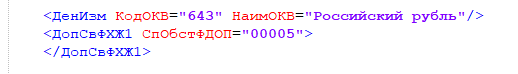

Рисунок 22. Пример заполнения элемента СпОбстФСЧФДОП по указанию вида операции в Информации продавца согласно Приказу ФНС России от 19.12.2023 № ЕД-7-26/970@

Соответствие вида оборота и значений, установленных Приказом ФНС России от 19.12.2023 № ЕД-7-26/970@ для \<СпОбстФДОП\>:

| Вид оборота | Приказ ФНС России от 19.12.2023 № ЕД-7-26/970@ |
|----|----|
| Передача агенту | СпОбстФДОП = 00005 |
| Возврат от агента | СпОбстФДОП = 00006 |
| Возврат товара от покупателя продавцу | СпОбстФДОП = 00009 |

Согласно Приказу ФНС России от 19.12.2023 № ЕД-7-26/970@ при указании \<СпОбстФДОП\> = 00008 дополнительные сведения не обрабатываются. ГИС МТ осуществляет регистрацию передачи КИ с типом оборота **«Продажа»**.

#### <span id="_сведения_в_упд_при_указании_информации_о_возврате_товара_от_покупателя_продавцу"></span>6.1.2. Сведения в УПД при указании информации о возврате товара от покупателя продавцу

Согласно Приказу ФНС России от 19.12.2023 № ЕД-7-26/970@: при указании в УПД / УПД(и) с функцией «ДОП» атрибута \<СпОбстФСЧФДОП\> или \<СпОбстФДОП\> со значением «00009» (возврат товара от покупателя продавцу) действует следующая логика обработки такого УПД / УПД(и):

- если в УПД значение атрибута \<СпОбстФСЧФДОП\> или \<СпОбстФДОП\> равно «00009», то при обработке такого УПД в ГИС МТ не осуществляется смена владельцев КИ и регистрация операции прихода/расхода на балансе «Склада» ГИС МТ;

- если в УПД(и) значение атрибута \<СпОбстФСЧФДОП\> или \<СпОбстФДОП\> равно «00009», а в УПД, к которому формируется УПД(и), атрибут \<СпОбстФСЧФДОП\> или \<СпОбстФДОП\> не был указан, то КИ возвращаются на отправителя УПД(и) и на балансе «Склада» ГИС МТ для отправителя УПД(и) осуществляется регистрация операции прихода по количеству и весу/объёму товара, а для получателя УПД(и) — регистрация операции расхода;

- если в УПД(и) атрибут \<СпОбстФСЧФДОП\> или \<СпОбстФДОП\> не указан, а в УПД, к которому формируется УПД(и), значение атрибута \<СпОбстФСЧФДОП\> или \<СпОбстФДОП\> указано «00009», то КИ перемещаются на получателя УПД(и) и на балансе «Склада» ГИС МТ для отправителя УПД(и) осуществляется регистрация операции расхода по количеству и весу/объёму товара, а для получателя УПД(и) — регистрация операции прихода.

Изменения на балансе «Склада» ГИС МТ по весу / объёму товара фиксируются только для товарных групп, в которых доступна подача сведений в объёмно-сортовом разрезе.

Если УПД или УПД(и) содержит атрибут \<СпОбстФСЧФДОП\> или \<СпОбстФДОП\> со значением «00009», то атрибут \<ВидОборотаМАРК\> со значениями «9» (перемещение товаров, не связанное с реализацией) или «10» (при расчёте по сделке оформлен чек ККТ) в ГИС МТ не будет обработан.

#### <span id="_сведения_в_упд_при_передаче_возврате_товара_на_ответственное_хранение"></span>6.1.3. Сведения в УПД при передаче / возврате товара на ответственное хранение

Для передачи сведений о видах оборота в УПД с функцией «ДОП» в качестве документа МХ-1 или МХ-3 (передача товара на ответственное хранение или возврат с ответственного хранения) используется **«Информационное поле события (факта хозяйственной жизни) 1»** (\<ИнфПолФХЖ1\>), файла обмена «Информации продавца» с идентификатором (\<Идентиф\>) \<ВидОборотаМАРК\> со значением (\<Значен\>) равным **«9»** (**«Перемещение товаров, не связанное с реализацией»**).

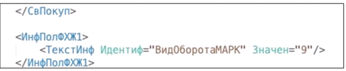

Рисунок 23. Пример заполнения информации ВидОборотаМАРК в Информации продавца

Поведение системы ГИС МТ при заполнении поля \<ВидОборотаМАРК\>:

- если при подаче сведений в поле \<ВидОборотаМАРК\> указано значение (\<Значен\>) равное **«9»** (**«Перемещение товаров, не связанное с реализацией»**) в формате УПД с функцией «ДОП», то в ГИС МТ перемещение КИ не осуществляется, УПД отобразится с видом товарооборота «Перемещение без реализации»;

- если в поле \<ВидОборотаМАРК\> не указано значение (\<Значен\>) по УПД(и) на оформленном УПД, то все указанные КИ возвращаются на отправителя документа;

- передача сведений о видах оборота в поле \<ВидОборотаМАРК\> со значением **«9»** (**«Перемещение товаров, не связанное с реализацией»**) принимается только для универсального документа с функцией «ДОП».

#### <span id="_сведения_в_упд_в_объёмно_сортовом_виде_о_наличии_чека_ккт_при_совершении_операции_по_сделке"></span>6.1.4. Сведения в УПД (в объёмно-сортовом виде) о наличии чека ККТ при совершении операции по сделке

Для исключения двойного учёта операций на балансе виртуального склада, когда в рамках одной сделки покупателю формируется чек ККТ и УПД в объёмно-сортовом виде, в УПД отражается признак наличия чека. Указание признака наличия чека применимо для товарных групп, в которых доступна подача сведений в объёмно-сортовом разрезе.

Для передачи сведений о наличии чека ККТ, в УПД (в объёмно-сортовом разрезе) используются сведения \<ВидОборотаМАРК\> со значением (\<Значен\>) равным **«10»**, указанные в:

- **«Информационное поле события (факта хозяйственной жизни) 1»** (\<ИнфПолФХЖ1\>) файла обмена «Информации продавца»;

- **«Информационное поле события (факта хозяйственной жизни) 4»** (\<ИнфПолФХЖ4\>) файла обмена «Информации покупателя».

Допустимо указание как одного значения в «Информации продавца» или в «Информации покупателя», так и двух — в «Информации продавца» и в «Информации покупателя».

Для передачи сведений о наличии чека со стороны продавца в УПД, используется **«Информационное поле события (факта хозяйственной жизни) 1»** (\<ИнфПолФХЖ1\>) файла обмена «Информации продавца»:

<table class="tableblock frame-all grid-all stretch">
<caption>Таблица 53. Информационное поле факта хозяйственной жизни 1 (ИнфПолФХЖ1) (Таблица 5.11 согласно Приказу ФНС России от 19.12.2023 № ЕД-7-26/970@)</caption>
<colgroup>
<col style="width: 25%" />
<col style="width: 17%" />
<col style="width: 12%" />
<col style="width: 12%" />
<col style="width: 13%" />
<col style="width: 21%" />
</colgroup>
<thead>
<tr>
<th class="tableblock halign-left valign-top">Наименование элемента</th>
<th class="tableblock halign-left valign-top">Сокращенное наименование (код) элемента</th>
<th class="tableblock halign-left valign-top">Признак типа элемента</th>
<th class="tableblock halign-left valign-top">Формат элемента</th>
<th class="tableblock halign-left valign-top">Признак обязательности элемента</th>
<th class="tableblock halign-left valign-top">Дополнительная информация</th>
</tr>
</thead>
<tbody>
<tr>
<td class="tableblock halign-left valign-top"><p>Идентификатор файла информационного поля</p></td>
<td class="tableblock halign-left valign-top"><p>ИдФайлИнПол</p></td>
<td class="tableblock halign-left valign-top"><p>А</p></td>
<td class="tableblock halign-left valign-top"><p>Т (=36)</p></td>
<td class="tableblock halign-left valign-top"><p>Н</p></td>
<td class="tableblock halign-left valign-top"><p>GUID.<br />
Указывается идентификатор файла, связанного со сведениями данного электронного документа</p></td>
</tr>
<tr>
<td class="tableblock halign-left valign-top"><p>Текстовая информация</p></td>
<td class="tableblock halign-left valign-top"><p>ТекстИнф</p></td>
<td class="tableblock halign-left valign-top"><p>С</p></td>
<td class="tableblock halign-left valign-top"></td>
<td class="tableblock halign-left valign-top"><p>НМ</p></td>
<td class="tableblock halign-left valign-top"><p>Типовой элемент &lt;ТекстИнфТип&gt;</p></td>
</tr>
</tbody>
</table>

Описание допустимых значений заполнения **«Информационного поля события (факта хозяйственной жизни) 1»** (\<ИнфПолФХЖ1\>) файла обмена «Информации продавца» в элементе **«Текстовая информация»** (\<ТекстИнф\>) представлено в таблице ниже.

<table class="tableblock frame-all grid-all stretch">
<caption>Таблица 54. Описание допустимых значений заполнения &lt;ИнфПолФХЖ1&gt; в элементе &lt;ТекстИнф&gt;</caption>
<colgroup>
<col style="width: 20%" />
<col style="width: 17%" />
<col style="width: 12%" />
<col style="width: 12%" />
<col style="width: 13%" />
<col style="width: 26%" />
</colgroup>
<thead>
<tr>
<th class="tableblock halign-left valign-top">Наименование элемента</th>
<th class="tableblock halign-left valign-top">Сокращенное наименование (код) элемента</th>
<th class="tableblock halign-left valign-top">Признак типа элемента</th>
<th class="tableblock halign-left valign-top">Формат элемента</th>
<th class="tableblock halign-left valign-top">Признак обязательности элемента</th>
<th class="tableblock halign-left valign-top">Дополнительная информация</th>
</tr>
</thead>
<tbody>
<tr>
<td class="tableblock halign-left valign-top"><p>Идентификатор</p></td>
<td class="tableblock halign-left valign-top"><p>Идентиф</p></td>
<td class="tableblock halign-left valign-top"><p>A</p></td>
<td class="tableblock halign-left valign-top"><p>T (1-50)</p></td>
<td class="tableblock halign-left valign-top"><p>О</p></td>
<td class="tableblock halign-left valign-top"><p><strong>ВидОборотаМАРК</strong></p></td>
</tr>
<tr>
<td class="tableblock halign-left valign-top"><p>Значение</p></td>
<td class="tableblock halign-left valign-top"><p>Значен</p></td>
<td class="tableblock halign-left valign-top"><p>А</p></td>
<td class="tableblock halign-left valign-top"><p>T (1-2000)</p></td>
<td class="tableblock halign-left valign-top"><p>О</p></td>
<td class="tableblock halign-left valign-top"><p>Принимает значение:<br />
10 — при расчёте по сделке оформлен чек ККТ</p></td>
</tr>
</tbody>
</table>

Ниже приведен пример заполнения элемента **«Информационное поле события (факта хозяйственной жизни) 1»** (\<ИнфПолФХЖ1\>) файла обмена «Информации продавца» по указанию сведений по видам оборота.

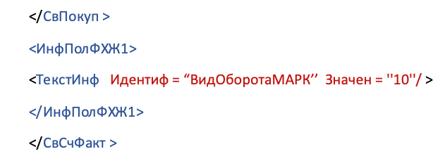

Рисунок 24. Информационное поле события факта хозяйственной жизни 1 ИнфПолФХЖ1

Ниже приведен пример заполнения элемента **«Информационное поле события (факта хозяйственной жизни) 4»** (\<ИнфПолФХЖ4\>) файла обмена «Информации покупателя» по указанию сведений о наличии чека при оформлении сделки.

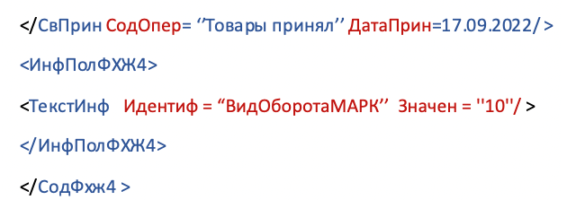

Рисунок 25. Информационное поле события факта хозяйственной жизни 4

#### <span id="_передача_товара_при_классической_контрактной_схеме_производства"></span>6.1.5. Передача товара при классической контрактной схеме производства

В рамках контрактного производства, если изготовитель:

- оказывает услугу и получает оплату за услугу, необходимо разделить передачу товара и оплату услуги:

  - для товарной позиции устанавливается признак «Товар» («ПрТовРаб» = «1») и применяется УПД с функцией «ДОП» (без указания цены) для перемещения кодов идентификации от изготовителя к заказчику;

  - счёт-фактура на стоимость услуги выставляется отдельно (УПД «СЧФ» или на бумажном носителе) по договорённости сторон;

- передаёт изготовленную продукцию по стоимости реализации, для товарной позиции указывается признак «Товар» («ПрТовРаб» = «1») или признак не указывается, и допускается использовать УПД с функцией «СЧФДОП» с указанием цены, а счёт-фактура на стоимость услуги по производству выставляется отдельно (УПД «СЧФ» или на бумажном носителе) по договорённости сторон.

### <span id="_сведения_о_причинах_выбытия"></span>6.2. Сведения о причинах выбытия

Для передачи сведений о причинах выбытия, связанных с передачей товара с целью использования для собственных нужд, в УПД используются:

- **«Информационное поле события (факта хозяйственной жизни) 1»** (\<ИнфПолФХЖ1\>) файла обмена «Информации продавца»;

- **«Информационное поле события (факта хозяйственной жизни) 4»** (\<ИнфПолФХЖ4\>) файла обмена «Информации покупателя».

Допустимо указание как одного значения в «Информации продавца» или в «Информации покупателя», так и двух — в «Информации продавца» и в «Информации покупателя».

Для передачи сведений о причинах выбытия со стороны продавца в УПД, используется **«Информационное поле события (факта хозяйственной жизни) 1»** (\<ИнфПолФХЖ1\>) файла обмена «Информации продавца»:

<table class="tableblock frame-all grid-all stretch">
<caption>Таблица 55. Информационное поле факта хозяйственной жизни 1 (ИнфПолФХЖ1) (Таблица 5.11 согласно Приказу ФНС России от 19.12.2023 № ЕД-7-26/970@)</caption>
<colgroup>
<col style="width: 25%" />
<col style="width: 17%" />
<col style="width: 12%" />
<col style="width: 12%" />
<col style="width: 13%" />
<col style="width: 21%" />
</colgroup>
<thead>
<tr>
<th class="tableblock halign-left valign-top">Наименование элемента</th>
<th class="tableblock halign-left valign-top">Сокращенное наименование (код) элемента</th>
<th class="tableblock halign-left valign-top">Признак типа элемента</th>
<th class="tableblock halign-left valign-top">Формат элемента</th>
<th class="tableblock halign-left valign-top">Признак обязательности элемента</th>
<th class="tableblock halign-left valign-top">Дополнительная информация</th>
</tr>
</thead>
<tbody>
<tr>
<td class="tableblock halign-left valign-top"><p>Идентификатор файла информационного поля</p></td>
<td class="tableblock halign-left valign-top"><p>ИдФайлИнПол</p></td>
<td class="tableblock halign-left valign-top"><p>А</p></td>
<td class="tableblock halign-left valign-top"><p>Т (=36)</p></td>
<td class="tableblock halign-left valign-top"><p>Н</p></td>
<td class="tableblock halign-left valign-top"><p>GUID.<br />
Указывается идентификатор файла, связанного со сведениями данного электронного документа</p></td>
</tr>
<tr>
<td class="tableblock halign-left valign-top"><p>Текстовая информация</p></td>
<td class="tableblock halign-left valign-top"><p>ТекстИнф</p></td>
<td class="tableblock halign-left valign-top"><p>С</p></td>
<td class="tableblock halign-left valign-top"></td>
<td class="tableblock halign-left valign-top"><p>НМ</p></td>
<td class="tableblock halign-left valign-top"><p>Типовой элемент &lt;ТекстИнфТип&gt;</p></td>
</tr>
</tbody>
</table>

Описание допустимых значений заполнения **«Информационного поля события (факта хозяйственной жизни) 1»** (\<ИнфПолФХЖ1\>) «Информации продавца» в элементе **«Текстовая информация»** (\<ТекстИнф\>) представлено в таблице ниже.

<table class="tableblock frame-all grid-all stretch">
<caption>Таблица 56. Описание допустимых значений заполнения &lt;ИнфПолФХЖ1&gt; в элементе &lt;ТекстИнф&gt;</caption>
<colgroup>
<col style="width: 20%" />
<col style="width: 17%" />
<col style="width: 12%" />
<col style="width: 12%" />
<col style="width: 13%" />
<col style="width: 26%" />
</colgroup>
<thead>
<tr>
<th class="tableblock halign-left valign-top">Наименование элемента</th>
<th class="tableblock halign-left valign-top">Сокращенное наименование (код) элемента</th>
<th class="tableblock halign-left valign-top">Признак типа элемента</th>
<th class="tableblock halign-left valign-top">Формат элемента</th>
<th class="tableblock halign-left valign-top">Признак обязательности элемента</th>
<th class="tableblock halign-left valign-top">Дополнительная информация</th>
</tr>
</thead>
<tbody>
<tr>
<td class="tableblock halign-left valign-top"><p>Идентификатор</p></td>
<td class="tableblock halign-left valign-top"><p>Идентиф</p></td>
<td class="tableblock halign-left valign-top"><p>A</p></td>
<td class="tableblock halign-left valign-top"><p>T (1-50)</p></td>
<td class="tableblock halign-left valign-top"><p>О</p></td>
<td class="tableblock halign-left valign-top"><p><strong>СвВыбытияМАРК</strong></p></td>
</tr>
<tr>
<td class="tableblock halign-left valign-top"><p>Значение</p></td>
<td class="tableblock halign-left valign-top"><p>Значен</p></td>
<td class="tableblock halign-left valign-top"><p>А</p></td>
<td class="tableblock halign-left valign-top"><p>T (1-2000)</p></td>
<td class="tableblock halign-left valign-top"><p>О</p></td>
<td class="tableblock halign-left valign-top"><p>Принимает значение:<br />
1 — покупка товаров юридическими лицами и индивидуальными предпринимателями в целях использования для собственных нужд, не связанных с их последующей реализацией (продажей);<br />
3 — использование товаров для производственных целей, не связанных с их последующей реализацией (продажей)</p></td>
</tr>
</tbody>
</table>

Пример заполнения элемента **«Информационное поле события (факта хозяйственной жизни) 1»** (\<ИнфПолФХЖ1\>) файла обмена Информации продавца по указанию сведений по видам оборота представлен на рисунке ниже.

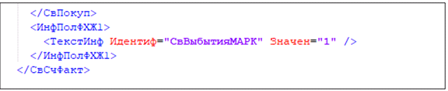

Рисунок 26. Информационное поле факта хозяйственной жизни продавца

Для передачи сведений о причинах выбытия со стороны покупателя в УПД используется **«Информационное поле события (факта хозяйственной жизни) 4»** (\<ИнфПолФХЖ4\>) файла обмена «Информации покупателя». Описание представлено в таблице ниже.

<table class="tableblock frame-all grid-all stretch">
<caption>Таблица 57. Информационное поле факта хозяйственной жизни 4 (ИнфПолФХЖ4) (Таблица 5.12 согласно Приказу ФНС России от 19.12.2023 № ЕД-7-26/970@)</caption>
<colgroup>
<col style="width: 18%" />
<col style="width: 12%" />
<col style="width: 12%" />
<col style="width: 14%" />
<col style="width: 22%" />
<col style="width: 22%" />
</colgroup>
<thead>
<tr>
<th class="tableblock halign-left valign-top">Наименование элемента</th>
<th class="tableblock halign-left valign-top">Сокращенное наименование (код) элемента</th>
<th class="tableblock halign-left valign-top">Признак типа элемента</th>
<th class="tableblock halign-left valign-top">Формат элемента</th>
<th class="tableblock halign-left valign-top">Признак обязательности элемента</th>
<th class="tableblock halign-left valign-top">Дополнительная информация</th>
</tr>
</thead>
<tbody>
<tr>
<td class="tableblock halign-left valign-top"><p>Идентификатор файла информационного поля</p></td>
<td class="tableblock halign-left valign-top"><p>ИдФайлИнфПол</p></td>
<td class="tableblock halign-left valign-top"><p>А</p></td>
<td class="tableblock halign-left valign-top"><p>Т (=36)</p></td>
<td class="tableblock halign-left valign-top"><p>Н</p></td>
<td class="tableblock halign-left valign-top"><p>GUID.<br />
Указывается идентификатор файла, связанного со сведениями данного электронного документа</p></td>
</tr>
<tr>
<td class="tableblock halign-left valign-top"><p>Текстовая информация</p></td>
<td class="tableblock halign-left valign-top"><p>ТекстИнф</p></td>
<td class="tableblock halign-left valign-top"><p>С</p></td>
<td class="tableblock halign-left valign-top"></td>
<td class="tableblock halign-left valign-top"><p>НМ</p></td>
<td class="tableblock halign-left valign-top"></td>
</tr>
</tbody>
</table>

Описание допустимых значений заполнения **«Информационного поля события (факта хозяйственной жизни) 4»** (\<ИнфПолФХЖ4\>) файла обмена «Информации покупателя» в элементе **«Текстовая информация»** (\<ТекстИнф\>) представлено в таблице ниже.

<table class="tableblock frame-all grid-all stretch">
<caption>Таблица 58. Описание допустимых значений заполнения &lt;ИнфПолФХЖ4&gt; в элементе &lt;ТекстИнф&gt;</caption>
<colgroup>
<col style="width: 20%" />
<col style="width: 18%" />
<col style="width: 12%" />
<col style="width: 12%" />
<col style="width: 13%" />
<col style="width: 25%" />
</colgroup>
<thead>
<tr>
<th class="tableblock halign-left valign-top">Наименование элемента</th>
<th class="tableblock halign-left valign-top">Сокращенное наименование (код) элемента</th>
<th class="tableblock halign-left valign-top">Признак типа элемента</th>
<th class="tableblock halign-left valign-top">Формат элемента</th>
<th class="tableblock halign-left valign-top">Признак обязательности элемента</th>
<th class="tableblock halign-left valign-top">Дополнительная информация</th>
</tr>
</thead>
<tbody>
<tr>
<td class="tableblock halign-left valign-top"><p>Идентификатор</p></td>
<td class="tableblock halign-left valign-top"><p>Идентиф</p></td>
<td class="tableblock halign-left valign-top"><p>A</p></td>
<td class="tableblock halign-left valign-top"><p>T (1-50)</p></td>
<td class="tableblock halign-left valign-top"><p>О</p></td>
<td class="tableblock halign-left valign-top"><p><strong>СвВыбытияМАРК</strong></p></td>
</tr>
<tr>
<td class="tableblock halign-left valign-top"><p>Значение</p></td>
<td class="tableblock halign-left valign-top"><p>Значен</p></td>
<td class="tableblock halign-left valign-top"><p>А</p></td>
<td class="tableblock halign-left valign-top"><p>T (=2)</p></td>
<td class="tableblock halign-left valign-top"><p>ОК</p></td>
<td class="tableblock halign-left valign-top"><p>Принимает значение:<br />
1 — покупка товаров юридическими лицами и индивидуальными предпринимателями в целях использования для собственных нужд, не связанных с их последующей реализацией (продажей);<br />
3 — использование товаров для производственных целей, не связанных с их последующей реализацией (продажей)</p></td>
</tr>
</tbody>
</table>

Пример заполнения элемента **«Информационное поле события (факта хозяйственной жизни) 4»** (\<ИнфПолФХЖ4\>) файла обмена «Информации покупателя» по указанию сведений по видам оборота представлен на рисунке ниже.

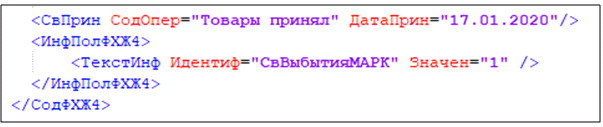

Рисунок 27. Информационное поле факта хозяйственной жизни покупателя

### <span id="_сведения_о_реализации_маркированных_товаров_в_рамках_гос_контракта"></span>6.3. Сведения о реализации маркированных товаров в рамках гос. контракта

Для передачи сведений в формате УПД о реализации маркированных товаров в рамках гос. контракта в элементе **«Идентификатор государственного контракта»** в поле **«Дополнительные сведения об участниках факта хозяйственной жизни, основаниях и обстоятельствах его проведения»** (\<ДопСвФЧЖ1\>) указывается номер государственного контракта, цифровой идентификатор, формируемый гос. заказчиком и содержащий данные о номере гос. контракта и наличии или отсутствии в гос. контракте сведений, составляющих гос. тайну (в соответствии с Приказом Казначейства России от 11.01.2021 № 4н «Об утверждении Порядка формирования идентификатора соглашения, государственного контракта, договора о капитальных вложениях, контракта учреждения и договора о проведении капитального ремонта при казначейском сопровождении средств в валюте Российской Федерации в случаях, предусмотренных Федеральным законом «О федеральном бюджете на 2021 год и на плановый период 2022 и 2023 годов»).

| Наименование элемента | Сокращенное наименование (код) элемента | Признак типа элемента | Формат элемента | Признак обязательности элемента | Дополнительная информация |
|----|----|----|----|----|----|
| Идентификатор гос. контракта, договора (соглашения), (строка 8 счёта-фактуры) | ИдГосКон | А | Т (20-25) | Н | Обязателен при наличии гос. контракта на поставку товаров (выполнение работ, оказание услуг), договора (соглашения) о предоставлении из федерального бюджета юридическому лицу субсидий, бюджетных инвестиций, взносов в уставной капитал |

Таблица 59. Дополнительные сведения об участниках факта хозяйственной жизни, основаниях и обстоятельствах его проведения (ДопСвФХЖ1) (Таблица 5.8 согласно Приказу ФНС России от 19.12.2023 № ЕД-7-26/970@) {.tableblock .frame-all .grid-all .stretch}

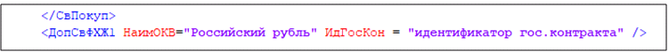

Рисунок 28. Пример заполнения сведений в УПД при реализации товаров в рамках госконтракта

Для отражения сведений о выбытии КИ, связанных с передачей товара в рамках гос. контракта или для целей, не связанных с его последующей реализацией, в УПД используется **«Информационное поле события (факта хозяйственной жизни) 1»** (\<ИнфПолФХЖ1\>) файла обмена «Информации продавца», представленное в таблице ниже.

<table class="tableblock frame-all grid-all stretch">
<caption>Таблица 60. Информационное поле факта хозяйственной жизни 1 (ИнфПолФХЖ1) (Таблица 5.11 согласно Приказу ФНС России от 19.12.2023 № ЕД-7-26/970@)</caption>
<colgroup>
<col style="width: 22%" />
<col style="width: 18%" />
<col style="width: 12%" />
<col style="width: 12%" />
<col style="width: 13%" />
<col style="width: 23%" />
</colgroup>
<thead>
<tr>
<th class="tableblock halign-left valign-top">Наименование элемента</th>
<th class="tableblock halign-left valign-top">Сокращенное наименование (код) элемента</th>
<th class="tableblock halign-left valign-top">Признак типа элемента</th>
<th class="tableblock halign-left valign-top">Формат элемента</th>
<th class="tableblock halign-left valign-top">Признак обязательности элемента</th>
<th class="tableblock halign-left valign-top">Дополнительная информация</th>
</tr>
</thead>
<tbody>
<tr>
<td class="tableblock halign-left valign-top"><p>Идентификатор файла информационного поля</p></td>
<td class="tableblock halign-left valign-top"><p>ИдФайлИнПол</p></td>
<td class="tableblock halign-left valign-top"><p>А</p></td>
<td class="tableblock halign-left valign-top"><p>Т (=36)</p></td>
<td class="tableblock halign-left valign-top"><p>Н</p></td>
<td class="tableblock halign-left valign-top"><p>GUID.<br />
Указывается идентификатор файла, связанного со сведениями данного электронного документа</p></td>
</tr>
<tr>
<td class="tableblock halign-left valign-top"><p>Текстовая информация</p></td>
<td class="tableblock halign-left valign-top"><p>ТекстИнф</p></td>
<td class="tableblock halign-left valign-top"><p>С</p></td>
<td class="tableblock halign-left valign-top"></td>
<td class="tableblock halign-left valign-top"><p>НМ</p></td>
<td class="tableblock halign-left valign-top"><p>Типовой элемент &lt;ТекстИнфТип&gt;</p></td>
</tr>
</tbody>
</table>

Изменение логики обработки при подаче данных в ГИС МТ вступит в силу после анонса / рассылки по зарегистрированным участникам оборота товаров. Текущая реализация ГИС МТ поддерживает схему выбытия КИ при указании идентификатора гос. контракта.

Описание допустимых значений заполнения **«Информационного поля события (факта хозяйственной жизни) 1»** (\<ИнфПолФХЖ1\>) файла обмена «Информации продавца» в элементе **«Текстовая информация»** (\<ТекстИнф\>) представлено в таблице ниже.

<table class="tableblock frame-all grid-all stretch">
<caption>Таблица 61. Описание допустимых значений заполнения &lt;ИнфПолФХЖ1&gt; в элементе &lt;ТекстИнф&gt;</caption>
<colgroup>
<col style="width: 22%" />
<col style="width: 18%" />
<col style="width: 12%" />
<col style="width: 12%" />
<col style="width: 13%" />
<col style="width: 23%" />
</colgroup>
<thead>
<tr>
<th class="tableblock halign-left valign-top">Наименование элемента</th>
<th class="tableblock halign-left valign-top">Сокращенное наименование (код) элемента</th>
<th class="tableblock halign-left valign-top">Признак типа элемента</th>
<th class="tableblock halign-left valign-top">Формат элемента</th>
<th class="tableblock halign-left valign-top">Признак обязательности элемента</th>
<th class="tableblock halign-left valign-top">Дополнительная информация</th>
</tr>
</thead>
<tbody>
<tr>
<td class="tableblock halign-left valign-top"><p>Идентификатор</p></td>
<td class="tableblock halign-left valign-top"><p>Идентиф</p></td>
<td class="tableblock halign-left valign-top"><p>A</p></td>
<td class="tableblock halign-left valign-top"><p>T (1-50)</p></td>
<td class="tableblock halign-left valign-top"><p>О</p></td>
<td class="tableblock halign-left valign-top"><p><strong>СвВыбытияМАРК</strong></p></td>
</tr>
<tr>
<td class="tableblock halign-left valign-top"><p>Значение</p></td>
<td class="tableblock halign-left valign-top"><p>Значен</p></td>
<td class="tableblock halign-left valign-top"><p>А</p></td>
<td class="tableblock halign-left valign-top"><p>T (1-2000)</p></td>
<td class="tableblock halign-left valign-top"><p>О</p></td>
<td class="tableblock halign-left valign-top"><p>Принимает значение:<br />
1 — покупка товаров юридическими лицами и индивидуальными предпринимателями в целях использования «Для собственных нужд», не связанных с их последующей реализацией (продажей) (значение сохранено для обратной совместимости);<br />
4 — продажа товаров по государственному (муниципальному) контракту (приоритетно к использованию)</p></td>
</tr>
</tbody>
</table>

Если при заполненном идентификаторе гос. контракта поле \<СвВыбытияМАРК\> заполнено, то при поступлении УПД осуществляется перемещение кодов на конечного покупателя с выводом кодов из оборота. Если при заполненном идентификаторе гос. контракта поле \<СвВыбытияМАРК\> не заполнено, то при поступлении УПД осуществляется только перемещение кодов на конечного покупателя, вывод кодов из оборота не осуществляется.

Для товарной группы **«Медицинские изделия»**:

- при передаче товаров по государственному (муниципальному) контракту заполнять поле \<СвВыбытияМАРК\> не требуется, чтобы перемещение товаров между контрагентами было осуществлено без вывода товаров из оборота;

- при поступлении из ЕИС Казначейства УПД, содержащего сведения о государственном контракте и данные о грузополучателях с идентичными ИНН, перемещение товаров между контрагентами осуществляется без вывода из оборота.

Пример заполнения элемента **«Информационное поле события (факта хозяйственной жизни) 1»** (\<ИнфПолФХЖ1\>) файла обмена «Информации продавца» по указанию сведений по видам оборота представлен на рисунке ниже.

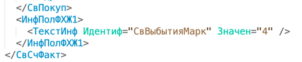

Рисунок 29. Информационное поле ИнфПолФХЖ1 о реализации в рамках государственного контракта

### <span id="_сведения_о_безвозмездной_передаче_маркированной_продукции"></span>6.4. Сведения о безвозмездной передаче маркированной продукции

Для передачи сведений о «безвозмездной передаче», не связанной с последующей реализацией (продажей) в УПД, используется **«Информационное поле события (факта хозяйственной жизни) 1»** (\<ИнфПолФХЖ1\>) файла обмена «Информации продавца»:

<table class="tableblock frame-all grid-all stretch">
<caption>Таблица 62. Информационное поле факта хозяйственной жизни 1 (ИнфПолФХЖ1) (Таблица 5.11 согласно Приказу ФНС России от 19.12.2023 № ЕД-7-26/970@)</caption>
<colgroup>
<col style="width: 22%" />
<col style="width: 18%" />
<col style="width: 12%" />
<col style="width: 12%" />
<col style="width: 13%" />
<col style="width: 23%" />
</colgroup>
<thead>
<tr>
<th class="tableblock halign-left valign-top">Наименование элемента</th>
<th class="tableblock halign-left valign-top">Сокращенное наименование (код) элемента</th>
<th class="tableblock halign-left valign-top">Признак типа элемента</th>
<th class="tableblock halign-left valign-top">Формат элемента</th>
<th class="tableblock halign-left valign-top">Признак обязательности элемента</th>
<th class="tableblock halign-left valign-top">Дополнительная информация</th>
</tr>
</thead>
<tbody>
<tr>
<td class="tableblock halign-left valign-top"><p>Идентификатор файла информационного поля</p></td>
<td class="tableblock halign-left valign-top"><p>ИдФайлИнПол</p></td>
<td class="tableblock halign-left valign-top"><p>А</p></td>
<td class="tableblock halign-left valign-top"><p>Т (=36)</p></td>
<td class="tableblock halign-left valign-top"><p>Н</p></td>
<td class="tableblock halign-left valign-top"><p>GUID.<br />
Указывается идентификатор файла, связанного со сведениями данного электронного документа</p></td>
</tr>
<tr>
<td class="tableblock halign-left valign-top"><p>Текстовая информация</p></td>
<td class="tableblock halign-left valign-top"><p>ТекстИнф</p></td>
<td class="tableblock halign-left valign-top"><p>С</p></td>
<td class="tableblock halign-left valign-top"></td>
<td class="tableblock halign-left valign-top"><p>НМ</p></td>
<td class="tableblock halign-left valign-top"><p>Типовой элемент &lt;ТекстИнфТип&gt;</p></td>
</tr>
</tbody>
</table>

Описание допустимых значений заполнения **«Информационного поля события (факта хозяйственной жизни) 1»** (\<ИнфПолФХЖ1\>) файла обмена «Информации продавца» в элементе **«Текстовая информация»** (\<ТекстИнф\>) представлено в таблице ниже.

<table class="tableblock frame-all grid-all stretch">
<caption>Таблица 63. Описание допустимых значений заполнения &lt;ИнфПолФХЖ1&gt; в элементе &lt;ТекстИнф&gt;</caption>
<colgroup>
<col style="width: 22%" />
<col style="width: 18%" />
<col style="width: 12%" />
<col style="width: 12%" />
<col style="width: 13%" />
<col style="width: 23%" />
</colgroup>
<thead>
<tr>
<th class="tableblock halign-left valign-top">Наименование элемента</th>
<th class="tableblock halign-left valign-top">Сокращенное наименование (код) элемента</th>
<th class="tableblock halign-left valign-top">Признак типа элемента</th>
<th class="tableblock halign-left valign-top">Формат элемента</th>
<th class="tableblock halign-left valign-top">Признак обязательности элемента</th>
<th class="tableblock halign-left valign-top">Дополнительная информация</th>
</tr>
</thead>
<tbody>
<tr>
<td class="tableblock halign-left valign-top"><p>Идентификатор</p></td>
<td class="tableblock halign-left valign-top"><p>Идентиф</p></td>
<td class="tableblock halign-left valign-top"><p>A</p></td>
<td class="tableblock halign-left valign-top"><p>T (1-50)</p></td>
<td class="tableblock halign-left valign-top"><p>О</p></td>
<td class="tableblock halign-left valign-top"><p><strong>СвВыбытияМАРК</strong></p></td>
</tr>
<tr>
<td class="tableblock halign-left valign-top"><p>Значение</p></td>
<td class="tableblock halign-left valign-top"><p>Значен</p></td>
<td class="tableblock halign-left valign-top"><p>А</p></td>
<td class="tableblock halign-left valign-top"><p>T (1-2000)</p></td>
<td class="tableblock halign-left valign-top"><p>О</p></td>
<td class="tableblock halign-left valign-top"><p>Принимает значение:<br />
2 — безвозмездная передача товаров юридическими лицами и индивидуальным предпринимателям, не связанная с их последующей реализацией (продажей)</p></td>
</tr>
</tbody>
</table>

Пример заполнения элемента **«Информационное поле события (факта хозяйственной жизни) 1»** (\<ИнфПолФХЖ1\>) файла обмена «Информации продавца» по указанию сведений по видам оборота представлен на рисунке ниже.

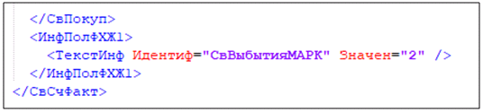

Рисунок 30. Информационное поле ИнфПолФХЖ1 о безвозмездной передаче маркированной продукции

### <span id="rekomendacii_po_ukazaniyu_mest_osushchestvleniya_deyatelnosti"></span>6.5. Рекомендации по указанию мест осуществления деятельности для товарных групп «Алкоголь» и «Пиво, напитки, изготавливаемые на основе пива, слабоалкогольные напитки»

#### <span id="_регистрация_мод_участников_оборота"></span>6.5.1. Регистрация МОД участников оборота

Участникам оборота товарных групп «Алкоголь» и «Пиво, напитки, изготавливаемые на основе пива, слабоалкогольные напитки» необходимо регистрировать места осуществления деятельности (далее — МОД) для соблюдения требований законодательства в части:

- Федерального закона от 22 ноября 1995 г. № 171-ФЗ «О государственном регулировании производства и оборота этилового спирта, алкогольной и спиртосодержащей продукции и об ограничении потребления (распития) алкогольной продукции» в части осуществления прослеживаемости адресов мест осуществления деятельности;

- Постановления Правительства РФ от 30 ноября 2022 г. № 2173 «Об утверждении Правил маркировки пива, напитков, изготавливаемых на основе пива, и отдельных видов слабоалкогольных напитков средствами идентификации и особенностях внедрения государственной информационной системы мониторинга за оборотом товаров, подлежащих обязательной маркировке средствами идентификации, в отношении пива, напитков, изготавливаемых на основе пива, и отдельных видов слабоалкогольных напитков».

Каждый адрес МОД описывается полями: **«Адрес»**, **«КПП»**, **«Идентификатор ФИАС»**, **«Статус МОД»** (подробнее о регистрации МОД в ГИС МТ см. в [инструкции](https://docs.crpt.ru/gismt/Инструкция_по_редактированию_профиля/)). Поле **«Статус МОД»** может принимать значения:

- **«Активно»** — адрес места осуществления деятельности не заблокирован в ЕГАИС;

- **«Неактивно»** — адрес места осуществления деятельности заблокирован в ЕГАИС.

Обмен сведениями о перемещении товаров между участниками оборота товаров, а также при внутреннем перемещении товаров (в рамках одного ИНН) для товарных групп «Алкоголь» и «Пиво, напитки, изготавливаемые на основе пива, слабоалкогольные напитки» осуществляется на основании:

- УПД формата, утверждённого в Приказе ФНС России от 19 декабря 2023 г. № ЕД-7-26/970@ (Приложение № 1 «Форматы счета-фактуры, универсального передаточного документа, включающего счет-фактуру, и универсального передаточного документа в электронной форме») (см. раздел «[Рекомендации к подаче сведений о МОД в ГИС МТ в УПД](#_рекомендации_к_подаче_сведений_о_мод_в_гис_мт_в_упд)»);

- УКД формата, утверждённого в Приказе ФНС России от 12 октября 2020 № ЕД-7-26/736@ (Приложение «Формат корректировочного счета-фактуры, формата представления документа, подтверждающего согласие (факт уведомления) покупателя на изменение стоимости отгруженных товаров (выполненных работ, оказанных услуг), переданных имущественных прав, включающего в себя корректировочный счет-фактуру, и формата представления документа, подтверждающего согласие (факт уведомления) покупателя на изменение стоимости отгруженных товаров (выполненных работ, оказанных услуг), переданных имущественных прав, в электронной форме») (см. раздел «[Идентификация МОД в УКД](#_идентификация_мод_в_укд)»).

Если для товарной группы **«Пиво, напитки, изготавливаемые на основе пива, слабоалкогольные напитки»** передача товаров по УД осуществляется не участнику оборота товаров с выводом КИ из оборота, то проверка МОД не выполняется.

#### <span id="_рекомендации_к_подаче_сведений_о_мод_в_гис_мт_в_упд"></span>6.5.2. Рекомендации к подаче сведений о МОД в ГИС МТ в УПД

ГИС МТ проверяет наличие и статус зарегистрированных МОД участников оборота товаров по данным из УПД. Идентификация МОД осуществляется на основании следующих данных:

- для юридических лиц — по ИНН и КПП грузоотправителя / грузополучателя (см. раздел «[Для юридических лиц](#_для_юридических_лиц)»);

- для индивидуальных предпринимателей — по ИНН индивидуального предпринимателя с использованием элементов:

  - **«Адрес в Российской Федерации»** (\<АдрРФ\> или \<АдрИнф\>) (см. раздел «[При использовании «Адрес в Российской Федерации» (\<АдрРФ\> или \<АдрИнф\>)](#_при_использовании_адрес_в_российской_федерации_адррф_или_адринф)»);

  - **«Адрес в соответствии с государственным адресным реестром»** (\<АдрГАР\>) («[При использовании «Адрес в соответствии с государственным адресным реестром» (\<АдрГАР\>)](#_при_использовании_адрес_в_соответствии_с_государственным_адресным_реестром_адргар)»);

##### <span id="_для_юридических_лиц"></span>6.5.2.1. Для юридических лиц

Для грузоотправителя / грузополучателя проверка регистрации и активности МОД осуществляется по ИНН и КПП из УПД.

**Грузоотправитель**:

Проверка регистрации и активности МОД производится по ИНН и КПП грузоотправителя, указанным в теге **«Сведения о юридическом лице, состоящем на учете в налоговых органах»**(\</ГрузОт/ГрузОтпр/ИдСв/СвЮЛУч/\>).

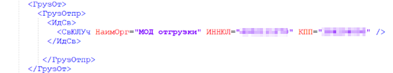

Рисунок 31. Пример указания МОД по данным грузоотправителя

Если в УПД в теге **«Сведение о грузоотправителе»** (\<ГрузОт\>) указано значение \<ОнЖе\>, то проверка регистрации и активности МОД осуществляется по данным ИНН и КПП продавца, указанным в теге **«Сведение о продавце»** (\<СвПрод\>).

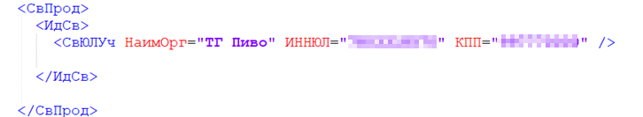

Рисунок 32. Пример указания МОД по данным продавца

**Грузополучатель**:

Проверка регистрации и активности МОД производится по ИНН и КПП грузополучателя, указанным в теге **«Сведения о юридическом лице, состоящем на учете в налоговых органах»** (\<ГрузПолуч/ИдСв/СвЮЛУч\>).

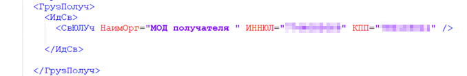

Рисунок 33. Пример указания МОД по данным грузополучателя

##### <span id="_для_индивидуальных_предпринимателей"></span>6.5.2.2. Для индивидуальных предпринимателей

Согласно приказу ФНС России от 19 декабря 2023 г. № ЕД-7-26/970 формат УПД поддерживает два варианта заполнения адресов:

- **«Адрес в Российской Федерации»** (\<СвСчФакт/…​/Адрес/**АдрРФ**\>) или (\<СвСчФакт/…​/Адрес/**АдрИнф**\>);

- **«Адрес в соответствии с государственным адресным реестром»** (\<СвСчФакт/…​/Адрес/**АдрГАР**\>).

###### <span id="_при_использовании_адрес_в_российской_федерации_адррф_или_адринф"></span>6.5.2.2.1. При использовании «Адрес в Российской Федерации» (\<АдрРФ\> или \<АдрИнф\>)

При использовании элемента **«Адрес в Российской Федерации»** (\<АдрРФ\> или \<АдрИнф\>) идентификация МОД грузоотправителя / грузополучателя в ГИС МТ происходит по логике, описанной ниже.

**Грузоотправитель**:

Проверка регистрации и активности МОД осуществляется по ИНН индивидуального предпринимателя из УПД, а также идентификатору Федеральной информационной адресной службы (ФИАС), указанному в информационном поле **«Информационное поле события (факта хозяйственной жизни) 1»** (\<ИнфПолФХЖ1\>) в атрибуте \<Идентиф="Продавец_ФиасИД"\> со значением \<Значен="\<номер ГАР 36 знаков\>"\>.

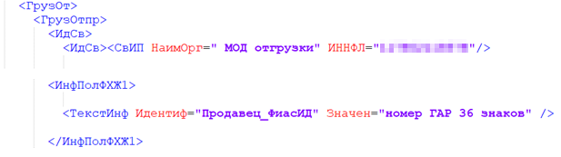

Рисунок 34. Пример указания МОД по данным грузоотправителя для индивидуальных предпринимателей

Если в УПД в теге **«Сведение о грузоотправителе»** (\<ГрузОт\>) указано значение \<ОнЖе\>, то проверка регистрации и активности МОД осуществляется по данным ИНН индивидуального предпринимателя из УПД и идентификатору ФИАС, указанному в информационном поле **«Информационное поле события (факта хозяйственной жизни) 1»** (\<ИнфПолФХЖ1\>) в атрибуте \<Идентиф="Продавец_ФиасИД"\> со значением \<Значен="\<номер ГАР 36 знаков\>"\>.

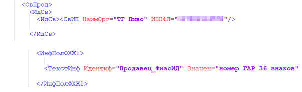

Рисунок 35. Пример указания МОД по данным грузоотправителя для индивидуальных предпринимателей

**Грузополучатель**:

Проверка регистрации и активности МОД осуществляется по ИНН индивидуального предпринимателя из УПД и идентификатору ФИАС, указанному в информационном поле **«Информационное поле события (факта хозяйственной жизни) 1»** (\<ИнфПолФХЖ1\>) в атрибуте \<Идентиф="Покупатель_ФиасИД"\> со значением \<Значен="\<номер ГАР 36 знаков\>"\>.

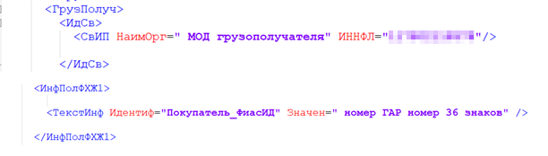

Рисунок 36. Пример указания МОД по данным грузополучателя для индивидуальных предпринимателей

###### <span id="_при_использовании_адрес_в_соответствии_с_государственным_адресным_реестром_адргар"></span>6.5.2.2.2. При использовании «Адрес в соответствии с государственным адресным реестром» (\<АдрГАР\>)

При использовании элемента **«Адрес в соответствии с государственным адресным реестром»** (\<АдрГАР\>) идентификация МОД грузоотправителя / грузополучателя в ГИС МТ происходит по следующей логике.

**Грузоотправитель**:

Проверка регистрации и активности МОД осуществляется по ИНН индивидуального предпринимателя из УПД, а также идентификатору Федеральной информационной адресной службы (ФИАС), указанному в теге «Адрес в соответствии с государственным адресным реестром» (\<АдрГАР\>) в атрибуте **«Уникальный номер адреса объекта адресации в государственном адресном реестре»** \<ИдНом\> грузоотправителя.

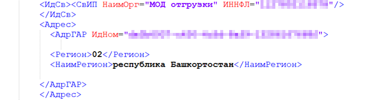

Рисунок 37. Пример указания МОД по данным грузоотправителя для индивидуальных предпринимателей

Если в УПД в теге **«Сведение о грузоотправителе»** (\<ГрузОт\>) указано значение \<ОнЖе\>, то проверка регистрации и активности МОД осуществляется по ИНН индивидуального предпринимателя из УПД и идентификатору ФИАС, указанному в теге **«Адрес в соответствии с государственным адресным реестром»** (\<АдрГАР\>) в атрибуте **«Уникальный номер адреса объекта адресации в государственном адресном реестре»** (ИдНом) продавца.

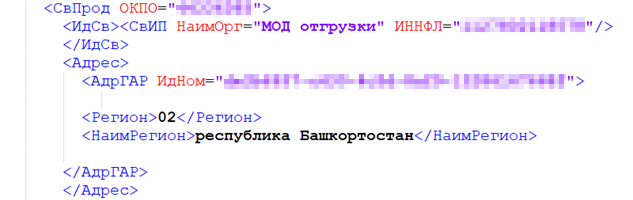

Рисунок 38. Пример указания МОД по данным грузоотправителя для индивидуальных предпринимателей

**Грузополучатель**:

Проверка регистрации и активности МОД осуществляется по ИНН индивидуального предпринимателя из УПД, а также идентификатору ФИАС, указанному в теге **«Адрес в соответствии с государственным адресным реестром»** (\<АдрГАР\>) в атрибуте **«Уникальный номер адреса объекта адресации в государственном адресном реестре»** \<ИдНом\> грузополучателя.

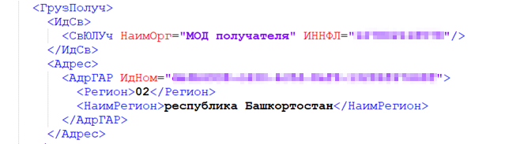

Рисунок 39. Пример указания МОД по данным грузополучателя для индивидуальных предпринимателей

#### <span id="_идентификация_мод_в_укд"></span>6.5.3. Идентификация МОД в УКД

При обработке УКД, содержащих информацию о товарах, относящихся к товарным группам, предусматривающим прослеживаемость между МОД, сведения о МОД наследуются из исходного документа УПД / УПД(и) (Приказ ФНС России от 12 октября 2020 № ЕД-7-26/736@).

### <span id="ukazanie_v_upd_ki_produkcii_v_kegah_tovarnoj_gruppy_pivo_napitki_izgotavlivaemye_na_osnove_piva_slaboalkogolnye_napitki_proizvedyonnoj_do_1_marta_2025_goda"></span>6.6. Указание в УПД КИ продукции в кегах товарной группы «Пиво, напитки, изготавливаемые на основе пива, слабоалкогольные напитки», произведённой до 1 марта 2025 года

Если передача продукции, произведённой до даты старта экземплярной прослеживаемости, в отношении которой не осуществлялась прослеживаемость, планируется к отгрузке в экземплярном разрезе (в УПД указываются коды идентификации), то сначала необходимо согласовать с контрагентом такую возможность. Поскольку для корректного учёта сведений об обороте контрагенту последующую отгрузку будет необходимо производить только в экземплярном разрезе.

## <span id="_дополнительная_техническая_информация_при_работе_с_гис_мт"></span>7. Дополнительная техническая информация при работе с ГИС МТ

### <span id="_роуминговый_обмен"></span>7.1. Роуминговый обмен

В случае роумингового обмена между участниками оборота товаров передача сведений о движении КИ выполняется как Оператором ЭДО отправителя, так и Оператором ЭДО получателя.

### <span id="_предварительная_проверка_упд_до_свершения_факта_приёмки_со_стороны_покупателя"></span>7.2. Предварительная проверка УПД до свершения факта приёмки со стороны покупателя

Для проверки УПД перед его отправкой в систему ГИС МТ возможно использование метода <a href="https://docs.crpt.ru/gismt/True_API/" rel="noopener" target="_blank">True API</a>: «Метод подачи УПД на предварительную проверку», осуществляющего первичную верификацию указанных сведений по КИ и данным продавца и покупателя.

После подачи УПД на стороне ГИС МТ выполняются следующие действия:

- проверка регистрации продавца и покупателя;

- проверка подключённых товарных групп (для товарных групп «Альтернативная табачная продукция», «Никотиносодержащая продукция», «Табачная продукция»);

- проверка валидности документа и отсутствие дублей в ГИС МТ;

- проверка наличия сведений о КИ маркированных товаров в ГИС МТ;

- проверка полномочий продавца на операции с КИ.

На проверку могут быть отправлены только документы УПД и УПД(и) до осуществления приёмки продукции со стороны покупателя.

### <span id="_повторная_обработка_универсальных_документов"></span>7.3. Повторная обработка универсальных документов

Поданные в ГИС МТ сведения в формате универсального документа, в случае их обработки с ошибками на стороне системы, можно направить на повторную обработку при следующих сценариях:

- нарушена хронология подачи документов в ГИС МТ. Например, сведения в формате УПД на дальнейшую отгрузку поступили от участника оборота товаров, перемещение кодов на которого ещё не выполнено (не поступили сведения или были обработаны с ошибками);

- продавец или покупатель по УПД не зарегистрированы в ГИС МТ или проходят процедуру регистрации;

- статусы КИ не соответствуют выполняемой операции. Например, на стороне ГИС МТ товар не был введён в оборот, но уже поступили сведения об отгрузке и приёмке продукции в формате УПД.

Направить документ на повторную обработку можно:

- по кнопке в ЕЛК в карточке документа;

- используя «Метод отправки документа ЭДО на повторную обработку» <a href="https://docs.crpt.ru/gismt/True_API/" rel="noopener" target="_blank">True API</a>.

### <span id="_приём_сведений_по_чекам_ккт_с_указанием_инн_покупателя"></span>7.4. Приём сведений по чекам ККТ с указанием ИНН покупателя

В соответствии с внесёнными изменениями в постановления правительства о правилах маркировки и оборота маркированной продукции, сведения по передаче КИ между участниками оборота товаров могут быть поданы на основании оформления чека ККТ с указанием ИНН покупателя (тег 1228 фискального документа).

На основании полученного чека ККТ осуществляется перемещение КИ с продавца на покупателя.

Если со стороны продавца выставляется и чек ККТ с указанием покупателя, и универсальный документ на этого же покупателя, то сведения в ГИС МТ обрабатываются по следующей логике:

- чек ККТ был обработан ГИС МТ ранее УПД. При поступлении УПД принимается ГИС МТ успешно;

- УПД был обработан ГИС МТ ранее поступления чека ККТ. При поступлении чека ККТ сведения принимаются ГИС МТ успешно.

С изменениями, внесёнными в Постановления Правительства РФ по конкретным товарным группам, можно ознакомиться на сайте <a href="https://честныйзнак.рф" class="bare">https://честныйзнак.рф</a>.

|  |  |
|----|----|
| Важно | Для товарной группы «Пиво, напитки, изготавливаемые на основе пива, слабоалкогольные напитки» перемещение КИ между участниками оборота товаров производится по факту обработки УПД. На основании оформления чека ККТ с указанием ИНН покупателя (тег 1228 фискального документа) владелец КИ **не меняется** |

### <span id="_аннулирование_электронных_документов"></span>7.5. Аннулирование электронных документов

В случае необходимости аннулировать ранее поданные в ГИС МТ сведения по средствам электронных документов УПД или УКД, участник оборота товаров выполняет процедуру аннулирования, в рамках своего Оператора ЭДО и направляет подписанное соглашение об аннулировании электронного документа. ГИС МТ поддерживает обработку предложений об аннулировании (DP_PRANNUL по технологии РОСЭУ), подписанных с двух сторон (продавца и покупателя).

Аннулирование электронного документа, ранее поданного в ГИС МТ, возможно при условии, что аннулируемый документ является последним в хронологии событий по КИ, КИТУ (т.е. КИ, указанные в документе, не были перемещены далее другому участнику оборота товаров, реализованы в розницу, перемаркированы, КИТУ не были расформированы).

В случае подачи в ГИС МТ аннулирования на электронный документ, ранее обработанный в системе с ошибками, статус аннулируемого документа изменяется на «Аннулирован».

В случае подачи в ГИС МТ аннулирования на электронный документ, в следствии обработки которого был расформирован верхнеуровневый агрегат (КИТУ, КИГУ, КИН) возможны два сценария поведения:

- если аннулируемый документ был оформлен с признаком выбытия КИ и содержал в себе сведения по КИТУ, КИГУ, КИН, расформирование которых производится автоматически. При обработке аннулирования на исходный документ КИТУ, КИГУ, КИН будут восстановлены и возвращены на продавца;

- если аннулируемый документ содержал в себе сведения по вложениям из КИТУ, КИГУ, КИН, расформирование которых происходит по факту перемещения вложенности из КИТУ, КИГУ, КИН. При обработке аннулирования исходные КИТУ, КИГУ, КИН не восстанавливаются. На продавца возвращается вложенность из КИТУ, КИГУ, КИН.

ГИС МТ принимаются документы аннулирования, сформированные согласно форматам DP_PRANNUL версий 1.01 и 1.02 с обязательным указанием даты формирования документа в атрибуте \<ИдФайл\> и имени XML.

Пример:

DP_PRANNUL_0XX0AA0000A-00AA-0000-AA00-0AA0A00000AA_0XXAA008A00-A00A-00AA-000A-000A0B00AAAA\_\*20200819\*\_a00a00a0-000a-0000-000a-000000000aea

### <span id="_согласие_на_предоставление_доступа_к_информации_о_ки"></span>7.6. Согласие на предоставление доступа к информации о КИ

Информация о включении контроля наличия согласия на предоставление сведений о КИ будет доведена до участников оборота товаров не позднее чем за 6 месяцев до даты включения.

Для предоставления информации о принадлежности и статусе маркированного товара в ГИС МТ контрагентам, участник оборота товаров должен:

- быть зарегистрирован в ГИС МТ;

- подключить в ЕЛК товарные группы, по которым осуществляется товарооборот маркированной продукции и подписать договора о подключении к ГИС МТ;

- зарегистрировать в ГИС МТ подписанное УКЭП согласие о предоставлении информации о принадлежности и статусе маркированного товара, находящегося в его собственности.

В Согласии перечисляются контрагенты — участники оборота товаров, зарегистрированные в ГИС МТ, которым предоставляется право запрашивать в ГИС МТ вышеуказанную информацию, либо Согласие может быть предоставлено для всех зарегистрированных в ГИС МТ участников оборота товаров.

Проверка наличия согласия будет осуществляться при использовании следующих методов <a href="https://docs.crpt.ru/gismt/True_API/" rel="noopener" target="_blank">True API</a>:

- «Метод получения подробной информации о списке КИ товаров по заданному фильтру»;

- «Метод получения общедоступной информации о КИ по списку».

### <span id="rekomendacii_po_podache_svedenij_v_upd_pri_otgruzke_tovarov_podlezhashchih_proslezhivaemosti_v_gis_mt_i_fgis_mdlp"></span>7.7. Рекомендации по подаче сведений в УПД при отгрузке товаров, подлежащих прослеживаемости в ГИС МТ и ФГИС МДЛП

При подаче сведений об обороте (отгрузке / приёмке) маркированных товаров между участниками оборота товаров, в УПД / УПД(и) не допускается указание КИ товарной группы «Лекарственные препараты для медицинского применения». Наличие указанных КИ в УПД / УПД(и), подаваемых в ГИС МТ, приведёт к ошибке обработки документа.

Если УПД / УПД(и) сопровождает отгрузку КИ, относящихся исключительно к товарной группе «Лекарственные препараты для медицинского применения», то:

- в документе не требуется указание сведений о КИ;

- в имени файла УПД / УПДи не требуется указание постфикса «N3» = «0» согласно Приказу ФНС России от 19.12.2023 № ЕД-7-26/970@.

Сведения об обороте (отгрузке / приёмке) маркированных товаров товарной группы «Лекарственные препараты для медицинского применения» между участниками оборота товаров необходимо подавать отдельно в соответствии с предусмотренными для этого форматами подачи сведений в рамках ФГИС МДЛП.

### <span id="_рекомендации_по_подаче_сведений_об_обороте_в_случае_недоступности_инфраструктуры_операторов_эдо_для_товарной_группы_молочная_продукция"></span>7.8. Рекомендации по подаче сведений об обороте в случае недоступности инфраструктуры операторов ЭДО для товарной группы «Молочная продукция»

В случае внештатной работы системы, связанной с невозможностью подачи в ГИС МТ документов через операторов ЭДО, участник оборота товаров вправе осуществлять оборот молочной продукции без направления таких документов в ГИС МТ. При этом участник оборота товаров обязан направить указанные документы в ГИС МТ после восстановления штатной работы сервисов операторов ЭДО.

При согласовании между контрагентами поставка товара может осуществляться в сопровождении документов на бумажном носителе из-за невозможности выставить документы в электронном виде (согласно Постановлению Правительства РФ от 26.12.2011 № 1137 и Федеральному закону от 06.12.2011 № 402-ФЗ). Однако, после восстановления обмена документами в электронном виде через операторов ЭДО, участник оборота товара обязан направить в ГИС МТ информацию о маркированном товаре в формате УПД с функцией ДОП или СЧФДОП.

Перевыставление в электронном виде УПД с функцией СЧФ или СЧФДОП не допускается, если ранее по поставке была выставлена счёт-фактура на бумаге, т.к. это противоречит Постановлению Правительства РФ от 26.12.2011 № 1137.

### <span id="_требования_к_указанию_сведений_о_передаче_товара_для_товарной_группы_табачное_сырьё_и_нмтп_в_объёмно_сортовом_разрезе_учёта"></span>7.9. Требования к указанию сведений о передаче товара для товарной группы «Табачное сырьё и НМТП» в объёмно-сортовом разрезе учёта

Участникам оборота товаров доступна функциональность по обработке документов с указанием сведений о табачном и никотиновом сырье и немаркируемой табачной и никотиносодержащей продукции, подлежащей прослеживаемости, в объёмно-сортовом разрезе на демонстрационном и промышленном контурах ГИС МТ. Перечень ошибок, возникающих при обработке документов, содержащих сведения в объёмно-сортовом разрезе, доступен в разделе «[Проверка документа УПД в объёмно-сортовом и партионном виде сведений и описание ошибки](#_проверка_документа_упд_в_объёмно_сортовом_и_партионном_виде_сведений_и_описание_ошибки)». Даты начала обязательной передачи сведений об обороте табачного и никотинового сырья и немаркируемой табачной и никотиносодержащей продукции, подлежащей прослеживаемости, для участников оборота товаров, осуществляющих оптовую торговлю, регулируется Постановлениями Правительства РФ соответствующих товарных групп.

Для передачи сведений о табачном и никотиновом сырье и немаркируемой табачной и никотиносодержащей продукции, подлежащей прослеживаемости, необходимо передавать в имени файла титула продавца признак постфикс «N5» = «1», аналогичным образом, как это делается для товаров с поэкземплярной и объёмно-сортовой прослеживаемостью.

При организации прослеживаемости табачного и никотинового сырья и немаркируемой табачной и никотиносодержащей продукции, подлежащей прослеживаемости, в ГИС МТ в УПД предполагается указание информации об отгруженных табачном и никотиновом сырье и немаркируемой табачной и никотиносодержащей продукции, подлежащей прослеживаемости, базирующейся на следующих принципах:

- в одном документе УПД не допускается указание сведений о маркированных товарах с поэкземплярной и объёмно-сортовой прослеживаемостью и о табачном и никотиновом сырье и немаркируемой табачной и никотиносодержащей продукции, подлежащей прослеживаемости. В одном УПД могут присутствовать сведения о маркировке табачного и никотинового сырья и немаркируемой табачной и никотиносодержащей продукции, подлежащей прослеживаемости;

- указание немаркированной табачной и никотиносодержащей продукции, подлежащей прослеживаемости, доступно только в случае, когда участник оборота товаров имеет зарегистрированную в ГИС МТ одну из следующих товарных групп:

  - «Табачная продукция»

  - «Альтернативная табачная продукция»

  - «Никотиносодержащая продукция»

- для отражения в документе информации о табачном и никотиновом сырье в объёмно-сортовом разрезе учёта используется следующее регулярное выражение:

  ``` adoc
  [Идентификатор сырья по справочнику][Объем продукции][Концентрация никотина(только для никотинового сырья)]
  ```

  Описание атрибутов регулярного выражения:

  - \[Идентификатор сырья по справочнику\] — указывается идентификатор табачного и никотинового сырья по справочнику «Видов и кодов вида табачного и никотинового сырья», имеет всегда 14 символов. Пример значения: RMT00000000001;

  - \[Объём продукции\] — указывается в литрах или килограммах, в зависимости от вида сырья. Значение состоит из 10 цифр: 7 цифр для целой части и 3 цифры для дробной части). Пример значения для 1 килограмма сырья: 0000001000. Значение указывается без разделителя, имеет всегда 10 знаков;

  - \[Концентрация никотина (только для никотинового сырья)\] — необязательное значение, указывается только для никотинового сырья. Указывается число — концентрация никотина в миллиграммах на 1 миллилитр (мг/мл). Всегда указывается 4 знака. Пример для 3 мг/мл: 0003.

  - \[Концентрация никотина (только для никотинового сырья)\] — необязательное значение, требуется только для никотинового сырья. Указывать число – концентрация никотина в миллиграммах на 1 миллилитр (мг/мл). Всегда 4 знака. Пример для 3 мг/мл: 0003.

- для отражения в документе информации о немаркируемой табачной и никотиносодержащей продукции, подлежащей прослеживаемости, в объёмно-сортовом разрезе учёта используется следующее регулярное выражение:

  ``` adoc
  [02][Код товара][37][Количество единиц потребительских упаковок]
  ```

  Идентификаторы применения указываются без заключающих скобок:

  - \[02\]\[Код товара\] — указывается GTIN немаркируемой табачной и никотиносодержащей продукции, подлежащей прослеживаемости, в объёмно-сортовом разрезе. Имеет всегда 14 символов;

  - \[37\]\[Количество единиц потребительских упаковок\] — количество минимальной (единицы) потребительских упаковок — пачки. Указывается число. Пример для двух единиц: 2.

- для одной товарной позиции в УПД допускается указание нескольких регулярных выражений, в случае, когда в составе документа содержится несколько идентификаторов сырья по справочнику и/или кодов товара немаркируемой табачной продукции;

- для указания сведений о табачном и никотиновом сырье в объёмно-сортовом разрезе используется тег \<НомУпак\>.

  Пример:

  ``` xml
  <ДопСведТов>
     <НомСредИдентТов>
      <НомУпак>RMT000000000040001990000</НомУпак>
     </НомСредИдентТов>
  </ДопСведТов>
  ```

- для указания сведений о немаркируемой табачной и никотиносодержащей продукции, подлежащей прослеживаемости, в объёмно-сортовом разрезе рекомендуется использовать тег \<НомУпак\>.

  Пример:

  ``` xml
  <ДопСведТов>
     <НомСредИдентТов>
      <НомУпак>02046000004532673712</НомУпак>
     </НомСредИдентТов>
  </ДопСведТов>
  ```

  Допускается подача в одном документе сведений о разной немаркируемой табачной и никотиносодержащей продукции, подлежащей прослеживаемости, и разных видах сырья. Для этого нужно каждый новый вид продукции или сырья (в том числе один вид никотинового сырья с разной концентрацией) помещать в отдельный тег \<СведТов\>.

  В примере ниже сведения указаны в следующем порядке:

  - табачное сырьё;

  - никотиновое сырьё с концентрацией 0120;

  - этот же вид сырья с концентрацией 0460;

  - немаркируемая продукция.

  Пример указания сведений в комбинированном виде:

  ``` xml
  <СведТов …>
  …
      <ДопСведТов>
           <НомСредИдентТов>
               <НомУпак>RMT000000000040001990000</НомУпак>
           </НомСредИдентТов>
       </ДопСведТов>
  </СведТов>
  <СведТов …>
  …
       <ДопСведТов>
           <НомСредИдентТов>
          <НомУпак>RMT0000000008400019900000120</НомУпак>
           </НомСредИдентТов>
       </ДопСведТов>
  </СведТов>
  <СведТов …>
  …
       <ДопСведТов>
           <НомСредИдентТов>
          <НомУпак>RMT0000000008400056400000460</НомУпак>
           </НомСредИдентТов>
       </ДопСведТов>
  </СведТов>
  <СведТов …>
  …
       <ДопСведТов>
           <НомСредИдентТов>
          <НомУпак>02046000004532673712</НомУпак>
           </НомСредИдентТов>
       </ДопСведТов>
  </СведТов>
  ```

  В одном УПД можно передавать одинаковые товары / сырьё без идентификаторов концентраций или с одинаковыми концентрациями никотина по одному и тому же товару в разных товарных позициях. При этом их нельзя передавать в одной товарной позиции. Подобное заполнение приведёт к отклонению документа системой с ошибкой (9001).

  Пример **некорректного** заполнения (коды отличаются только объёмом):

  ``` xml
  <ТаблСчФакт>
      <СведТов НомСтр="1" НаимТов="Скрап ZMWXB" ОКЕИ_Тов="166" КолТов="3750" СтТовБезНДС="0" НалСт="20%" СтТовУчНал="0">
          <Акциз>
              <БезАкциз>без акциза</БезАкциз>
          </Акциз>
          <СумНал>
              <БезНДС>без НДС</БезНДС>
          </СумНал>
          <ДопСведТов НаимЕдИзм="кг" АртикулТов="456">
              <НомСредИдентТов>
                  <НомУпак>RMT000000000010003750000</НомУпак>
                  <НомУпак>RMT000000000010013490000</НомУпак>
              </НомСредИдентТов>
          </ДопСведТов>
      </СведТов>
      <ВсегоОпл СтТовБезНДСВсего="0" СтТовУчНалВсего="0">
          <СумНалВсего>
              <БезНДС>без НДС</БезНДС>
          </СумНалВсего>
      </ВсегоОпл>
  </ТаблСчФакт>
  ```

  Пример **некорректного** заполнения (коды отличаются объёмом при одинаковой концентрации никотина):

  ``` xml
  <ТаблСчФакт>
      <СведТов НомСтр="1" НаимТов="Скрап  ZMWXB" ОКЕИ_Тов="166" КолТов="3750" СтТовБезНДС="0" НалСт="20%" СтТовУчНал="0">
          <Акциз>
              <БезАкциз>без акциза</БезАкциз>
          </Акциз>
          <СумНал>
              <БезНДС>без НДС</БезНДС>
          </СумНал>
          <ДопСведТов НаимЕдИзм="л" АртикулТов="456">
              <НомСредИдентТов>
                  <НомУпак>RMT0000000000800037500000500</НомУпак>
                  <НомУпак>RMT0000000000800134900000500</НомУпак>
              </НомСредИдентТов>
          </ДопСведТов>
      </СведТов>
          <ВсегоОпл СтТовБезНДСВсего="0" СтТовУчНалВсего="0">
              <СумНалВсего>
                  <БезНДС>без НДС</БезНДС>
              </СумНалВсего>
          </ВсегоОпл>
  </ТаблСчФакт>
  ```

### <span id="trebovaniya_k_ukazaniyu_svedenij_o_peredache_tovara_dlya_tovarnoj_gruppy_pivo_napitki_izgotavlivaemye_na_osnove_piva_slaboalkogolnye_napitki"></span>7.10. Требования к указанию сведений о передаче товара для товарных групп «Алкоголь» и «Пиво, напитки, изготавливаемые на основе пива, слабоалкогольные напитки»

#### <span id="_обязательные_поля_в_упд_ед_7_26970"></span>7.10.1. Обязательные поля в УПД (ЕД-7-26/970@)

Подача сведений в ГИС МТ об обороте маркированного пива и слабоалкогольных напитков осуществляется на основании уведомления о передаче (приёмке) товаров (в формате универсального передаточного документа (УПД)), согласно Приказу ФНС России от 19 декабря 2023 года № ЕД-7-26/970.

Уведомление **в обязательном порядке** должно содержать следующие сведения:

- заполнены признаки «N3» = «1» и «N4» = «1» в имени файла УПД, формируемого участником оборота товаров, перемещающего товар:

  - **«N3»** — формируется значение «1» в случае, если законодательством Российской Федерации предусмотрено использование настоящего формата в целях контроля за движением товаров, подлежащих маркировке (при отсутствии показателя принимает однозначное значение «0»);

  - **«N4»** — формируется значение «1» в случае, если законодательством Российской Федерации предусмотрено использование настоящего формата в целях контроля за движением алкогольной продукции, подлежащей маркировке (при отсутствии показателя принимает однозначное значение «0»);

  Пример имени файла **«Титула продавца»** (УПД) для товарных групп «Алкоголь» и «Пиво, напитки, изготавливаемые на основе пива, слабоалкогольные напитки»:

  ON_NSCHFDOPPR_XXXdc3f333a333c3b333333b03f3c33333c_XXXb333f3f0nbf333d333033d0f333a03c3_30330330_FB33D33F-3333-3333-3FEA-33C30ACCAD3E_0\_**1**\_**1**\_0_0_00

- указаны номер (для электронного документа) или номер и дата перевозочного документа, а также регистрационный номер транспортного средства (для документа на бумажном носителе) в информационном поле **«Информационное поле события (факта хозяйственной жизни) 1»** (\<ИнфПолФХЖ1\>) файла обмена «Информации продавца» в элементе **«Текстовая информация»** (\<ТекстИнф\>).

  При применении электронного перевозочного документа:

  - сокращённое обозначение передаваемой информации — «НомерПеревозЭлДок» указывается как значение атрибута **«Идентиф»**, а уникальный идентификатор электронного перевозочного документа, присвоенный государственной информационной системой электронных перевозочных документов, указывается как значение атрибута **«Значен»**.

  При применении перевозочного документа на бумажном носителе:

  - сокращённое обозначение передаваемой информации — «НомерПеревозДок» указывается как значение атрибута **«Идентиф»**. Номер бумажного перевозочного документа указывается как значение атрибута **«Значен»**;

  - сокращённое обозначение передаваемой информации — «ДатаПеревозДок» указывается как значение атрибута **«Идентиф»**. Дата бумажного перевозочного документа (ДД.ММ.ГГГГ) указывается как значение атрибута **«Значен»**;

  - cокращённое обозначение передаваемой информации — «РегНомер» указывается как значение атрибута **«Идентиф»**. Регистрационный номер транспортного средства указывается как значение атрибута **«Значен»**. Если перемещение производится без привлечения транспортного средства и нет номера транспортного средства, то «РегНомер» может отсутствовать или указан «-» (прочерк).

  Каждая пара атрибутов **«Идентиф»** и **«Значен»** передаются в отдельном элементе **«Текстовая информация»** (\<ТекстИнф\>).

  При одновременном заполнении в УПД идентификаторов для \<НомерПеревозЭлДок\> и \<НомерПеревозДок/ДатаПеревозДок/РегНомер\> приоритетным считается значение в идентификаторе для \<НомерПеревозЭлДок\>.

  При обработке УКД / УКД(и) для товарной группы «Пиво, напитки, изготавливаемые на основе пива, слабоалкогольные напитки» указание сведений \<НомерПеревозЭлДок\> и \<НомерПеревозДок/ДатаПеревозДок/РегНомер\> не требуется, при отсутствии наследуются из УПД / УПД(и);

  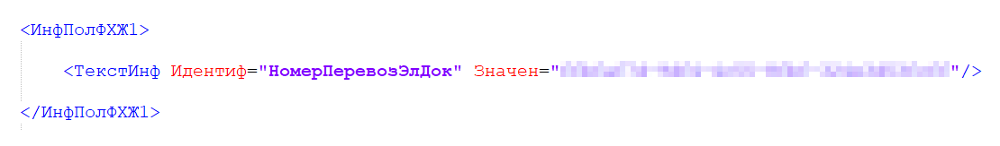

  Рисунок 40. Пример заполнения полей для электронного перевозочного документа при подаче сведений в документе УПД для товарной группы «Алкоголь» и «Пиво, напитки, изготавливаемые на основе пива, слабоалкогольные напитки»

  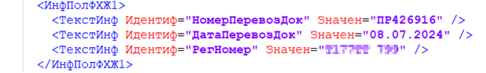

  Рисунок 41. Пример заполнения полей номера и даты перевозочного документа на бумажном носителе при подаче сведений в документе УПД для товарных групп «Алкоголь» и «Пиво, напитки, изготавливаемые на основе пива, слабоалкогольные напитки»

- указаны данные о МОД (см. «[Рекомендации по указанию МОД](#rekomendacii_po_ukazaniyu_mest_osushchestvleniya_deyatelnosti)»);

- уникальным идентификатором документа УПД является значение атрибута **«Идентификатор файла»** «Титула продавца» (\<ИдФайл\>).

#### <span id="_перемещение_пива_и_слабоалкогольных_напитков"></span>7.10.2. Перемещение пива и слабоалкогольных напитков

Для товарной группы «Пиво, напитки, изготавливаемые на основе пива, слабоалкогольные напитки» перед осуществлением перемещения товаров необходимо направить на проверку **«Титул продавца»** (УПД) с КИ / КИГУ / КИТУ в ГИС МТ для соблюдения требований законодательства в части Постановления Правительства РФ от 01.06.2024 № 746 «О внесении изменений в Постановление Правительства РФ от 30.11.2022 № 2173».

Для товарной группы «Алкоголь» процесс по перемещению товаров представлен в «Методических рекомендациях по проведению эксперимента по размещению кодов маркировки в машиночитаемой форме на федеральные специальные марки для маркировки отдельных видов алкогольной продукции с содержанием этилового спирта (крепостью) в готовой продукции до 9 процентов включительно».

Подать сведения об отгрузке продукции на проверку в ГИС МТ в форме «Титул продавца» (УПД) можно самостоятельно с помощью единого метода создания документов или через Оператора ЭДО.

При подаче сведений об отгрузке продукции между участниками оборота товаров или между МОД одного участника оборота товаров процесс состоит в следующем:

- передача сведений о перемещении товара:

  - Продавец / Грузоотправитель (МОД отправителя) через Оператора ЭДО или самостоятельно с помощью единого метода создания документов направляет подписанный «Титул продавца» на проверку в ГИС МТ;

  - на основании указанных идентификаторов в имени файла УПД «N3» = «1» и «N4» = «1» в ГИС МТ определяется, что в УПД присутствуют товары, относящиеся к товарным группам «Алкоголь» и «Пиво, напитки, изготавливаемые на основе пива, слабоалкогольные напитки»;

  - «Титул продавца» (УПД) проверяется в ГИС МТ на заполнение обязательных атрибутов:

    - Сведения о перевозочном документе:

      - для электронного перевозочного документа значение атрибута **Идентиф=“НомерПеревозЭлДок”** и в атрибуте **«Значен»** указан номер электронного перевозочного документа;

      или

      - для перевозочного документа на бумажном носителе значение атрибута **Идентиф=“НомерПеревозДок”** и в атрибуте **«Значен»** указан номер перевозочного документа;

      - для перевозочного документа на бумажном носителе значение атрибута **Идентиф=“ДатаПеревозДок”** и в атрибуте **«Значен»** указана дата перевозочного документа;

      - для перевозочного документа на бумажном носителе значение атрибута **Идентиф=“РегНомер”** и в атрибуте **«Значен»** указан регистрационный номер транспортного средства (при отсутствии номера поле **«РегНомер»** может отсутствовать или в атрибуте **«Значен»** указывается «-» (прочерк));

    - МОД грузоотправителя / грузополучателя являются активными;

    - данные по статусу и владельцу кодов, указанных в документе;

  - после прохождения проверок кодам, указанным в документе, присваивается особое состояние «Отгружен». ГИС МТ сохраняет сведения, добавляя в имя файла «Титула продавца» префикс «FIX_ИдФайл» (документ «УПД (отгрузка продукции)»).

    При запросе статуса документа следует добавить префикс «FIX\_» к имени файла поданного на проверку:

    ``` text
    FIX_ON_NSCHFDOPPR_XXXdc3f333a333c3b333333b03f3c33333c_XXXb333f3f0nbf333d333033d0f333a03c3_30330330_FB33D33F-3333-3333-3FEA-33C30ACCAD3E_0_1_1_0_0_00
    ```

  - участник оборота товаров через Оператора ЭДО или самостоятельно (с помощью методов API) по идентификатору документа «Титул продавца» (УПД) может запросить результаты проверки и состояние кодов для дальнейшей трансляции участникам оборота товаров. В запросе необходимо указывать идентификатор документа, который был получен в ответе направленного документа.

В случае необходимости внесения изменения в «Титул продавца» (УПД) **до подтверждения приёмки** Покупателем / Грузополучателем (МОД получателя), необходимо отменить ранее поданные сведения в «Титуле продавца» (УПД) через Оператора ЭДО или самостоятельно с помощью методов API, внести изменения и отправить корректный «Титул продавца» (УПД) через Оператора ЭДО или самостоятельно с помощью единого метода создания документов.

**При обмене сведениями через Оператора ЭДО** после получения положительного ответа от ГИС МТ, Продавцу / Грузоотправителю (МОД отправителя) необходимо отгрузить товар с отправкой УПД Покупателю / Грузополучателю (МОД получателя) через Оператора ЭДО.

При отрицательном ответе Продавцу / Грузоотправителю (МОД отправителя) необходимо внести изменения и отправить корректный «Титул продавца» (УПД) с новым именем файла или «Титул продавца» (УПДи) в ГИС МТ.

**Подтверждения приёмки:**

**При обмене сведениями через Оператора ЭДО** после получения подписанного обеими сторонами УПД, ГИС МТ проводит перемещение товаров между участниками оборота товаров или проводит перемещение кодов между МОД. Особое состояние с кодов снимается.

**При самостоятельной подаче сведений методами API** для перемещения товаров между МОД участника оборота товаров (в рамках одного ИНН) по факту приёмки участник оборота товаров подтверждает перемещение товара с помощью единого метода создания документов (API) в ГИС МТ, направляя подписанный и отправленный ранее «Титул продавца» и «Титул покупателя». После обработки титулов коды перемещаются с МОД отправителя на МОД получателя.

После подписания обеими сторонами первого документа в цепочке УПД / УПДи, по которому было перемещение маркированного товара, формирование документа **«УПД (отгрузка продукции)»** («FIX_ИдФайл») не требуется.

Если документ **«УПД (отгрузка продукции)»** («FIX_ИдФайл») был сформирован на второй или последующий документ корректирующий приёмку, ГИС МТ вернёт ошибку «63» — «УПД \<идентификатор документа\> для счет-фактуры №: \<номер счёт-фактуры\>, дата: \<дата счёт-фактуры\> не валидный (зарегистрирован ранее, либо был проведен УПДи)». Эта ошибка не влияет на обработку УПДи / УКД, подписанного с двух сторон.

УКД / УКДи будет обработан с ошибкой, если отсутствует успешно обработанный первичный УПД / УПДи-основание: «16» — «УКД (УКДи) №: \<номер УКД / УКДи\>, дата: \<дата УКД / УКДи\> (ID: \<идентификатор документа\>) для счет-фактуры №: \<номер счёта-фактуры\>, дата: \<дата счёта-фактуры\> не валидный (отсутствует исходный УПД-основание, либо документ не является последним)».

<table>
<colgroup>
<col style="width: 50%" />
<col style="width: 50%" />
</colgroup>
<tbody>
<tr>
<td class="icon">Обратите внимание</td>
<td class="content"><p>Подача сведений об отгрузке в «Титуле продавца» (УПД) при перемещении пива и слабоалкогольных напитков между участниками оборота товаров осуществляется только в поэкземплярном разрезе.</p>
<p>Формат УПД с указанием функции «ДОП» может быть использован для оформления передачи имущества в рамках одного хозяйствующего субъекта.</p>
<p>Подача сведений об отгрузке в «Титуле продавца» (УПД) при перемещении пива и слабоалкогольных напитков между МОД одного участника оборота товаров (в рамках одного ИНН) осуществляется в объёмно-сортовом разрезе (ОСУ) или в поэкземплярном разрезе (опционально)</p></td>
</tr>
</tbody>
</table>

#### <span id="korrektirovka_raskhozhdenij_pri_priyomke_tovarov_peremeshchaemyh_mezhdu_raznymi_mod_v_ramkah_odnogo_inn"></span>7.10.3. Корректировка расхождений при приёмке товаров, перемещаемых между разными МОД (в рамках одного ИНН)

При выявлении расхождений при приёмке товаров, перемещаемых между разными МОД одного участника оборота товаров, сведения о которой поданы им самостоятельно, допускаются следующие варианты корректировки:

- до подтверждения приёмки: с помощью единого метода создания документов формируется запрос на отмену отгрузки по УПД и повторная подача корректных сведений в **«Титуле продавца»** (УПД) для перемещения между МОД;

- после подтверждения приёмки: через формирование обратного документа от МОД получателя на МОД отправителя;

- после подтверждения приёмки: с помощью единого метода создания документов направить УКД / УКДи;

- для корректировки сведений при перемещении между МОД через оператора ЭДО будет использоваться стандартный обмен УКД / УПДи (аналогично другим товарным группам).

#### <span id="_отмена_сведений_об_отгрузке"></span>7.10.4. Отмена сведений об отгрузке

При необходимости внесения изменений или отмены ранее успешно проверенных ГИС МТ сведений об отгрузке, **до приёмки товара** участник оборота товаров может запросить отмену сведений об отгрузке:

- через Оператора ЭДО;

- с помощью единого метода создания документов.

Для отмены требуется указать:

- ИНН Продавца (отправителя), являющегося участником оборота товаров товарных групп «Алкоголь» и «Пиво, напитки, изготавливаемые на основе пива, слабоалкогольные напитки»;

- уникальный идентификатор успешно проверенного УПД c префиксом **"FIX\_"**.

  Если на проверку был подан файл:

  ``` text
  ON_NSCHFDOPPR_XXXdc3f333a333c3b333333b03f3c33333c_XXXb333f3f0nbf333d333033d0f333a03c3_30330330_FB33D33F-3333-3333-3FEA-33C30ACCAD3E_0_1_1_0_0_00
  ```

  При отмене следует добавить префикс **"FIX\_"**:

  ``` text
  FIX_ON_NSCHFDOPPR_XXXdc3f333a333c3b333333b03f3c33333c_XXXb333f3f0nbf333d333033d0f333a03c3_30330330_FB33D33F-3333-3333-3FEA-33C30ACCAD3E_0_1_1_0_0_00
  ```

### <span id="_требования_к_указанию_сведений_о_передаче_товара_для_товарной_группы_ветеринарные_препараты"></span>7.11. Требования к указанию сведений о передаче товара для товарной группы «Ветеринарные препараты»

Участникам оборота товарной группы **«Ветеринарные препараты»**, которые относятся к организациям и индивидуальным предпринимателям, осуществляющими производство кормов, организациям и индивидуальным предпринимателям, осуществляющим разведение, выращивание и содержание животных — необходимо добавить места осуществления деятельности для соблюдения требований Постановления Правительства РФ от 27 мая 2024 г №675 «Об утверждении Правил маркировки лекарственных препаратов для ветеринарного применения средствами идентификации и особенностях внедрения государственной информационной системы мониторинга за оборотом товаров, подлежащих обязательной маркировке средствами идентификации, в отношении лекарственных препаратов для ветеринарного применения».

Каждый адрес места осуществления деятельности описывается полями: **«Адрес»**, **«КПП поднадзорного объекта (грузополучателя)»**, **«Идентификатор ФИАС»**, **«Статус МОД»** (подробнее о регистрации МОД в ГИС МТ см. в [инструкции](https://docs.crpt.ru/gismt/Инструкция_по_редактированию_профиля/)). Поле **«Статус МОД»** может принимать значения:

- **«Активно»** — статус места осуществления деятельности проверен на основании данных ФГИС «ВетИС»;

- **«На проверке в ФНС»** — статус места осуществления деятельности проверяется;

- **«Не подтверждено в ФНС»** — данные о месте осуществления деятельности не подтверждены;

- **«Неактивен»** — статус места осуществления деятельности удален, на основании данных ФГИС «ВетИС».

В личном кабинете Системы маркировки в разделе **«**Профиль»** **›** **«Данные участника»**** признак в поле **«Подконтрольность ВЕТИС»** определяет необходимость участника оборота товаров подавать данные в ГИС МТ с указанием МОД при выводе из оборота маркированных ветеринарных препаратов.

Участник оборота товаров считается подконтрольным прослеживаемости ветеринарных препаратов по МОД, если значения **видов деятельности** и **видов объектов** относятся к <a href="https://docs.crpt.ru/gismt/Инструкция_по_редактированию_профиля/#prilozhenie_2_perechen_podkontrolnyh_vidov_deyatelnosti_i_obekta" rel="noopener" target="_blank">списку подконтрольных</a>.

После успешного подключения товарной группы **«Ветеринарные препараты»** в поле **«Подконтрольность ВЕТИС»** автоматически устанавливается значение **«Да»**.

Участник оборота товаров **может самостоятельно снять признак подконтрольности** в профиле ГИС МТ, **если** во ФГИС «ВетИС» **отсутствуют** поднадзорные объекты, согласно <a href="https://docs.crpt.ru/gismt/Инструкция_по_редактированию_профиля/#_редактирование_данных_участника" rel="noopener" target="_blank">правилам определения подконтрольности</a>.

Для получения сведений о подконтрольности объекта можно воспользоваться <a href="https://docs.crpt.ru/gismt/True_API/#_метод_проверки_регистрации_участников_оборота_товаров_по_инн_в_гис_мт" rel="noopener" target="_blank">методом проверки регистрации участников оборота товаров по ИНН в ГИС МТ</a>. Проверка производится по значению параметра «isControllability» (Признак наличия подконтрольных объектов по данным ФГИС «ВетИС»): если значение «true», то у участника оборота товаров есть подконтрольные объекты.

При наличии у участника оборота товаров подконтрольных объектов — поставщики формируют УПД в адрес покупателя с обязательным указанием места деятельности. Участники оборота товаров при формировании документа вывода из оборота также обязаны указывать МОД. УПД от поставщиков и документы вывода из оборота успешно обработаются в Системе маркировки, если у участника оборота товаров в личном кабинете сформирован реестр МОД. Если в УПД будет указан МОД, которого нет в реестре, то такой УПД обработается с ошибкой.

Обмен сведениями о перемещении товаров между участниками осуществляется на основании электронных универсальных документов УПД.

В случае, когда у участника оборота товаров в личном кабинете установлен признак прослеживаемости, такой участник оборота товаров должен отражать перемещение товаров между собственными МОД. Для отражения перемещения между МОД внутри хозяйствующего субъекта рекомендуется применять УПД с функцией ДОП.

Для отражения перемещения между МОД внутри хозяйствующего субъекта (для участников, у которых предусмотрена данная прослеживаемость в соответствии с Постановления Правительства РФ от 27 мая 2024 г №675) рекомендуется применять УПД с функцией ДОП.

#### <span id="_рекомендации_к_подаче_сведений_о_мод_в_упд"></span>7.11.1. Рекомендации к подаче сведений о МОД в УПД

Идентификация МОД грузополучателя в УПД осуществляется на основании следующих данных:

- для юридических лиц — по ИНН, КПП поднадзорного объекта (грузополучателя) и ФиасИД;

- для индивидуальных предпринимателей — по ИНН и ФиасИД.

Согласно приказу ФНС России от 19 декабря 2023 г. № ЕД-7-26/970 формат УПД поддерживает два варианта заполнения адресов:

- «Адрес в Российской Федерации» (\<СвСчФакт/…/Адрес/АдрРФ\>) или (\<СвСчФакт/…/Адрес/АдрИнф\>);

- «Адрес в соответствии с государственным адресным реестром» (\<СвСчФакт/…/Адрес/АдрГАР\>).

При использовании элемента **«Адрес в Российской Федерации»** (\<АдрРФ\> или \<АдрИнф\>) сведения о ФиасИД грузополучателя указывается в информационном поле «Информационное поле события (факта хозяйственной жизни) 1» (\<ИнфПолФХЖ1\>) в атрибуте \<Идентиф="Покупатель_ФиасИД"\> со значением \<Значен="\<номер ГАР 36 знаков\>"\>.

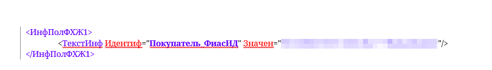

Рисунок 42. Пример заполнения элемента «Адрес в Российской Федерации»

При использовании элемента **«Адрес в соответствии с государственным адресным реестром»** сведения ФиасИД указывается в атрибуте (\<АдрГАР\>).

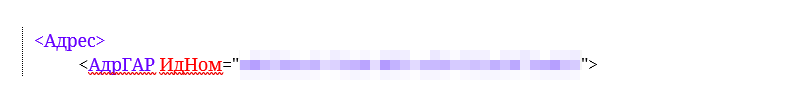

Рисунок 43. Пример заполнения элемента «Адрес в соответствии с государственным адресным реестром»

### <span id="_требования_к_указанию_сведений_о_передаче_товара_для_табачных_товарных_групп"></span>7.12. Требования к указанию сведений о передаче товара для табачных товарных групп

Участникам оборота товарных групп **«Альтернативная табачная продукция»**, **«Никотиносодержащая продукция»**, **«Табачная продукция»** необходимо добавить места осуществления деятельности для соблюдения требований Постановления Правительства РФ от 28.02.2019 № 224 «Об утверждении Правил маркировки средствами идентификации табачной и никотинсодержащей продукции и организации прослеживаемости табачной и никотинсодержащей продукции и сырья для производства такой продукции, а также об особенностях внедрения государственной информационной системы мониторинга за оборотом товаров, подлежащих обязательной маркировке средствами идентификации, в отношении табачной и никотинсодержащей продукции».

Каждый адрес МОД описывается полями: **«Адрес»**, **«КПП»**, **«Идентификатор ФИАС»**, **«Статус МОД»** (подробнее о регистрации МОД в ГИС МТ см. в [инструкции](https://docs.crpt.ru/gismt/Инструкция_по_редактированию_профиля/)). Поле **«Статус МОД»** может принимать значения:

- **«Активно»** — адрес места осуществления деятельности не заблокирован в ЕГАИС;

- **«Неактивно»** — адрес места осуществления деятельности заблокирован в ЕГАИС.

Для соблюдения пункта 114 Постановления Правительства РФ от 28.02.2019 № 224 при выводе из оборота продукции по основаниям, не являющимся продажей в розницу, участникам оборота товара необходимо указывать реквизиты МОД в УПД с признаком вывода из оборота.

#### <span id="_рекомендации_к_подаче_сведений_о_мод_в_упд_для_табачных_товарных_групп"></span>7.12.1. Рекомендации к подаче сведений о МОД в УПД для табачных товарных групп

ГИС МТ проверяет наличие и статус зарегистрированных МОД участников оборота товаров по данным из УПД. Идентификация МОД осуществляется на основании следующих данных:

- [для юридических лиц](#_для_юридических_лиц_табачных_товарных_групп) — по ИНН и КПП грузоотправителя / грузополучателя;

- [для индивидуальных предпринимателей](#_для_индивидуальных_предпринимателей_табачных_товарных_групп) — по ИНН индивидуального предпринимателя.

##### <span id="_для_юридических_лиц_табачных_товарных_групп"></span>7.12.1.1. Для юридических лиц табачных товарных групп

Для грузоотправителя / грузополучателя проверка регистрации и активности МОД осуществляется по ИНН и КПП из УПД.

**Грузоотправитель**:

При передаче по УПД с признаком вывода из оборота не участнику оборота товаров (покупатель или грузополучатель не зарегистрированы в ГИС МТ) проверка регистрации и активности МОД производится по ИНН и КПП грузоотправителя, указанным в теге **«Сведения о юридическом лице, состоящем на учете в налоговых органах»**(\</ГрузОт/ГрузОтпр/ИдСв/СвЮЛУч/\>), а также идентификатору ФИАС.

При использовании элемента **«Адрес в соответствии с государственным адресным реестром»** (\<АдрГАР\>) идентификация производится по ФИАС, указанному в теге **«Адрес в соответствии с государственным адресным реестром»** (\<АдрГАР\>) в атрибуте **«Уникальный номер адреса объекта адресации в государственном адресном реестре»** \<ИдНом\> грузоотправителя (\</СвСчФакт/ГрузОт/ГрузОтпр/Адрес/АдрГАР/\>).

При использовании элемента **«Адрес в Российской Федерации»** (\<АдрРФ\> или \<АдрИнф\>) идентификация производится по ФИАС, указанному в **«Информационное поле события (факта хозяйственной жизни) 1»** (\<ИнфПолФХЖ1\>) в атрибуте \<Идентиф="Продавец_ФиасИД"\> со значением \<Значен="\<номер ГАР 36 знаков\>"\>.

Если в УПД в теге **«Сведение о грузоотправителе»** (\<ГрузОт\>) указано значение \<ОнЖе\> или грузоотправитель отсутствует, или ИНН грузоотправителя отличается от ИНН продавца, то проверка регистрации и активности МОД осуществляется по данным ИНН и КПП продавца, указанным в теге **«Сведение о продавце»** (\<СвПрод\>), а также идентификатору ФИАС.

При использовании элемента **«Адрес в соответствии с государственным адресным реестром»** (\<АдрГАР\>) идентификация производится по ФИАС, указанному в теге **«Адрес в соответствии с государственным адресным реестром»** (\<АдрГАР\>) в атрибуте **«Уникальный номер адреса объекта адресации в государственном адресном реестре»** \<ИдНом\> продавца (\</СвСчФакт/СвПрод/Адрес/АдрГАР/\>).

При использовании элемента **«Адрес в Российской Федерации»** (\<АдрРФ\> или \<АдрИнф\>) идентификация производится по ФИАС, указанному в **«Информационное поле события (факта хозяйственной жизни) 1»** (\<ИнфПолФХЖ1\>) в атрибуте \<Идентиф="Продавец_ФиасИД"\> со значением \<Значен="\<номер ГАР 36 знаков\>"\>.

**Грузополучатель**:

При передаче по УПД с признаком вывода из оборота участнику оборота товаров (покупатель и грузополучатель зарегистрированы в ГИС МТ) проверка регистрации и активности МОД производится по ИНН и КПП грузополучателя, указанным в теге **«Сведения о юридическом лице, состоящем на учете в налоговых органах»** (\<ГрузПолуч/ИдСв/СвЮЛУч\>), а также идентификатору ФИАС.

При использовании элемента **«Адрес в соответствии с государственным адресным реестром»** (\<АдрГАР\>) идентификация производится по ФИАС, указанному в теге **«Адрес в соответствии с государственным адресным реестром»** (\<АдрГАР\>) в атрибуте **«Уникальный номер адреса объекта адресации в государственном адресном реестре»** \<ИдНом\> грузополучателя (\</СчФакт/ГрузПолуч/Адрес/АдрГАР/\>).

При использовании элемента **«Адрес в Российской Федерации»** (\<АдрРФ\> или \<АдрИнф\>) идентификация производится по ФИАС, указанному в **«Информационное поле события (факта хозяйственной жизни) 1»** (\<ИнфПолФХЖ1\>) в атрибуте \<Идентиф="Покупатель_ФиасИД"\> со значением \<Значен="\<номер ГАР 36 знаков\>"\>.

Если грузополучатель отсутствует, то проверка регистрации и активности МОД осуществляется по данным ИНН и КПП покупателя, указанным в теге **«Сведение о покупателе»** (\<СвПокуп\>), а также идентификатору ФИАС.

При использовании элемента **«Адрес в соответствии с государственным адресным реестром»** (\<АдрГАР\>) идентификация производится по ФИАС, указанному в теге **«Адрес в соответствии с государственным адресным реестром»** (\<АдрГАР\>) в атрибуте **«Уникальный номер адреса объекта адресации в государственном адресном реестре»** \<ИдНом\> покупателя (\</СчФакт/ СвПокуп /Адрес/АдрГАР/\>).

При использовании элемента **«Адрес в Российской Федерации»** (\<АдрРФ\> или \<АдрИнф\>) идентификация производится по ФИАС, указанному в **«Информационное поле события (факта хозяйственной жизни) 1»** (\<ИнфПолФХЖ1\>) в атрибуте \<Идентиф="Покупатель_ФиасИД"\> со значением \<Значен="\<номер ГАР 36 знаков\>"\>.

##### <span id="_для_индивидуальных_предпринимателей_табачных_товарных_групп"></span>7.12.1.2. Для индивидуальных предпринимателей табачных товарных групп

Для грузоотправителя / грузополучателя проверка регистрации и активности МОД осуществляется по ИНН индивидуального предпринимателя из УПД.

**Грузоотправитель**:

При передаче по УПД с признаком вывода из оборота не участнику оборота товаров (покупатель или грузополучатель не зарегистрированы в ГИС МТ) проверка регистрации и активности МОД осуществляется по ИНН грузоотправителя, указанному в элементе **«ИННФЛ»** в теге (\</ГрузОт/ГрузОтпр/ИдСв/СвИП/\>), а также идентификатору ФИАС.

При использовании элемента **«Адрес в соответствии с государственным адресным реестром»** (\<АдрГАР\>) идентификация производится по ФИАС, указанному в теге **«Адрес в соответствии с государственным адресным реестром»** (\<АдрГАР\>) в атрибуте **«Уникальный номер адреса объекта адресации в государственном адресном реестре»** \<ИдНом\> грузоотправителя (\</СвСчФакт/ГрузОт/ГрузОтпр/Адрес/АдрГАР/\>).

При использовании элемента **«Адрес в Российской Федерации»** (\<АдрРФ\> или \<АдрИнф\>) идентификация производится по ФИАС, указанному в **«Информационное поле события (факта хозяйственной жизни) 1»** (\<ИнфПолФХЖ1\>) в атрибуте \<Идентиф="Продавец_ФиасИД"\> со значением \<Значен="\<номер ГАР 36 знаков\>"\>.

Если в УПД в теге **«Сведение о грузоотправителе»** (\<ГрузОт\>) указано значение \<ОнЖе\> или грузоотправитель отсутствует, или ИНН грузоотправителя отличается от ИНН продавца, то проверка регистрации и активности МОД осуществляется по данным ИНН продавца, указанным в элементе **«ИННФЛ»** в теге **«Сведение о продавце»** (\</СвПрод/ИдСв/СвИП/\>), а также идентификатору ФИАС.

При использовании элемента **«Адрес в соответствии с государственным адресным реестром»** (\<АдрГАР\>) идентификация производится по ФИАС, указанному в теге **«Адрес в соответствии с государственным адресным реестром»** (\<АдрГАР\>) в атрибуте **«Уникальный номер адреса объекта адресации в государственном адресном реестре»** \<ИдНом\> продавца (\</СвСчФакт/СвПрод/ Адрес/АдрГАР/\>).

При использовании элемента **«Адрес в Российской Федерации»** (\<АдрРФ\> или \<АдрИнф\>) идентификация производится по ФИАС, указанному в **«Информационное поле события (факта хозяйственной жизни) 1»** (\<ИнфПолФХЖ1\>) в атрибуте \<Идентиф="Продавец_ФиасИД"\> со значением \<Значен="\<номер ГАР 36 знаков\>"\>.

**Грузополучатель**:

При передаче по УПД с признаком вывода из оборота участнику оборота товаров (покупатель и грузополучатель зарегистрированы в ГИС МТ) проверка регистрации и активности МОД осуществляется по ИНН грузополучателя, указанному в элементе **«ИННФЛ»** в теге (\</СвСчФакт/ГрузПолуч/ИдСв/СвИП/\>), а также идентификатору ФИАС.

При использовании элемента **«Адрес в соответствии с государственным адресным реестром»** (\<АдрГАР\>) идентификация производится по ФИАС, указанному в теге **«Адрес в соответствии с государственным адресным реестром»** (\<АдрГАР\>) в атрибуте **«Уникальный номер адреса объекта адресации в государственном адресном реестре»** \<ИдНом\> грузополучателя (\</СвСчФакт/ГрузПолуч/Адрес/АдрГАР/\>).

При использовании элемента **«Адрес в Российской Федерации»** (\<АдрРФ\> или \<АдрИнф\>) идентификация производится по ФИАС, указанному в **«Информационное поле события (факта хозяйственной жизни) 1»** (\<ИнфПолФХЖ1\>) в атрибуте \<Идентиф="Покупатель_ФиасИД"\> со значением \<Значен="\<номер ГАР 36 знаков\>"\>.

Если грузополучатель отсутствует, то проверка регистрации и активности МОД осуществляется по данным ИНН покупателя, указанным в теге **«Сведение о покупателе»** (\</СвПокуп/ИдСв/СвИП/\>), а также идентификатору ФИАС.

При использовании элемента **«Адрес в соответствии с государственным адресным реестром»** (\<АдрГАР\>) идентификация производится по ФИАС, указанному в теге **«Адрес в соответствии с государственным адресным реестром»** (\<АдрГАР\>) в атрибуте **«Уникальный номер адреса объекта адресации в государственном адресном реестре»** \<ИдНом\> покупателя (\</СвСчФакт/ СвПокуп /Адрес/АдрГАР/\>).

При использовании элемента **«Адрес в Российской Федерации»** (\<АдрРФ\> или \<АдрИнф\>) идентификация производится по ФИАС, указанному в **«Информационное поле события (факта хозяйственной жизни) 1»** (\<ИнфПолФХЖ1\>) в атрибуте \<Идентиф="Покупатель_ФиасИД"\> со значением \<Значен="\<номер ГАР 36 знаков\>"\>.

## <span id="_описание_кодов_ошибки_при_проверке_документов_и_ки"></span>8. Описание кодов ошибки при проверке документов и КИ

### <span id="_проверка_документа_и_описание_ошибки"></span>8.1. Проверка документа и описание ошибки

<table class="tableblock frame-all grid-all stretch">
<caption>Таблица 64. Проверка документа и описание ошибки</caption>
<colgroup>
<col style="width: 10%" />
<col style="width: 50%" />
<col style="width: 40%" />
</colgroup>
<thead>
<tr>
<th class="tableblock halign-left valign-top">Код ошибки</th>
<th class="tableblock halign-left valign-top">Описание ошибки</th>
<th class="tableblock halign-left valign-top">Рекомендации по исправлению</th>
</tr>
</thead>
<tbody>
<tr>
<td class="tableblock halign-left valign-top"><p>4</p></td>
<td class="tableblock halign-left valign-top"><p>Документ УПД был зарегистрирован ранее в ГИС МТ</p></td>
<td class="tableblock halign-left valign-top"><p>Проверить статус ранее направленного документа в ГИС МТ</p></td>
</tr>
<tr>
<td class="tableblock halign-left valign-top"><p>06</p></td>
<td class="tableblock halign-left valign-top"><p>Данные по указанным ИНН &lt;искомый ИНН&gt; и КПП &lt;искомый КПП&gt; не найдены</p></td>
<td class="tableblock halign-left valign-top"><p>Проверить место осуществления деятельности</p></td>
</tr>
<tr>
<td class="tableblock halign-left valign-top"><p>06</p></td>
<td class="tableblock halign-left valign-top"><p>МОД по указанным ИНН &lt;искомый ИНН&gt;, КПП &lt;искомый КПП&gt;, ФИАС &lt;искомый ФИАС&gt; не найдены</p></td>
<td class="tableblock halign-left valign-top"><p>Проверить место осуществления деятельности</p></td>
</tr>
<tr>
<td class="tableblock halign-left valign-top"><p>10,<br />
12,<br />
13</p></td>
<td class="tableblock halign-left valign-top"><p>Участник &lt;ИНН Продавца УД&gt; или &lt;ИНН Покупателя&gt; не зарегистрирован в ГИС МТ (Проверка регистрации &lt;ИНН Покупателя&gt; не осуществляется при отгрузках для собственных нужд или в рамках гос. контракта)</p></td>
<td class="tableblock halign-left valign-top"><p>Выполнить следующие действия:</p>
<ul>
<li><p>проверить статус регистрации контрагента в ГИС МТ. Связаться с контрагентом и сообщить о необходимости регистрации;</p></li>
<li><p>повторно проверить статус регистрации контрагента и при получении положительного ответа направить документ на повторную обработку через функцию ЛК или посредством «Описание True API» (раздел <strong>«Помощь»</strong> ГИС МТ (промышленный контур))</p></li>
</ul></td>
</tr>
<tr>
<td class="tableblock halign-left valign-top"><p>16</p></td>
<td class="tableblock halign-left valign-top"><p>В ГИС МТ ранее был успешно обработан УКД / УКД(и) с такими же № и датой УКД, &lt;ИНН Получателя&gt; и &lt;ИНН Отправителя&gt;, номером и датой исправления (если был направлен на обработку УКД(и)), как у текущего направленного УКД или УКД(и), либо в ГИС МТ ранее был успешно обработан УКД(и) с более поздней датой корректировки</p></td>
<td class="tableblock halign-left valign-top"><p>Проверить статус ранее направленного документа в ГИС МТ</p></td>
</tr>
<tr>
<td class="tableblock halign-left valign-top"><p>16</p></td>
<td class="tableblock halign-left valign-top"><p>УКД (УКДи) №: &lt;номер УКД / УКДи&gt;, дата: &lt;дата УКД / УКДи&gt; (ID: &lt;идентификатор документа&gt;) для счет-фактуры №: &lt;номер счёта-фактуры&gt;, дата: &lt;дата счёта-фактуры&gt; не валидный (отсутствует исходный УПД-основание, либо документ не является последним)</p></td>
<td class="tableblock halign-left valign-top"><p>Проверить статус ранее направленного документа в ГИС МТ</p></td>
</tr>
<tr>
<td class="tableblock halign-left valign-top"><p>54</p></td>
<td class="tableblock halign-left valign-top"><p>Дата Исправления УПД(и) имеет пустое значение или имеет не верный формат</p></td>
<td class="tableblock halign-left valign-top"><p>Проверить заполненность даты исправления в УПДи</p></td>
</tr>
<tr>
<td class="tableblock halign-left valign-top"><p>63</p></td>
<td class="tableblock halign-left valign-top"><p>В ГИС МТ ранее был успешно обработан УПД с такими же номером и датой УПД, &lt;ИНН Получателя&gt; и &lt;ИНН Отправителя&gt;, как у текущего направленного УПД, либо в ГИС МТ был успешно обработан УПД(и) с более поздней датой исправления</p></td>
<td class="tableblock halign-left valign-top"><p>Проверить статус ранее направленного документа в ГИС МТ</p></td>
</tr>
<tr>
<td class="tableblock halign-left valign-top"><p>64</p></td>
<td class="tableblock halign-left valign-top"><p>В ГИС МТ ранее был успешно обработан УПД(и) с № и датой УПД, &lt;ИНН Получателя&gt; и &lt;ИНН Отправителя&gt;, с № и датой исправления позже, чем у текущего направленного УПД(и)</p></td>
<td class="tableblock halign-left valign-top"><p>Проверить статус ранее направленного документа в ГИС МТ</p></td>
</tr>
<tr>
<td class="tableblock halign-left valign-top"><p>69</p></td>
<td class="tableblock halign-left valign-top"><p>Поле &lt;КодИтога&gt; <strong>«Титула покупателя»</strong> (при условии его указания) заполнено не корректным значением</p></td>
<td class="tableblock halign-left valign-top"><p>Проверить корректность заполнения поля «КодИтога». Допустимые значения = [1,2,3]</p></td>
</tr>
<tr>
<td class="tableblock halign-left valign-top"><p>71</p></td>
<td class="tableblock halign-left valign-top"><p>Содержание документа некорректно. Некорректные данные: <strong>file name not correct</strong></p></td>
<td class="tableblock halign-left valign-top"><p>Проверить, что наименование файла УПД / УПДи / УКД соответствует формату приказа ФНС России № ЕД-7-26/970@ или № ЕД-7-26/736@. При необходимости скорректировать документ согласно формату</p></td>
</tr>
<tr>
<td class="tableblock halign-left valign-top"><p>71</p></td>
<td class="tableblock halign-left valign-top"><p>Содержание документа некорректно. Некорректные данные: <strong>fileIds N3,N4,N5 = 0</strong></p></td>
<td class="tableblock halign-left valign-top"><p>Проверить, что имя файла УПД сформировано согласно Приказу ФНС России № ЕД-7-26/970@</p></td>
</tr>
<tr>
<td class="tableblock halign-left valign-top"><p>71</p></td>
<td class="tableblock halign-left valign-top"><p>Содержание документа некорректно. Некорректные данные: <strong>date</strong></p></td>
<td class="tableblock halign-left valign-top"><p>Проверить в УПД / УПДи / УКД корректность даты документа, значение не должно быть пустым или ранее 01.01.2000</p></td>
</tr>
<tr>
<td class="tableblock halign-left valign-top"><p>71</p></td>
<td class="tableblock halign-left valign-top"><p>Содержание документа некорректно. Некорректные данные: <strong>invoiceDate</strong></p></td>
<td class="tableblock halign-left valign-top"><p>Проверить в УПД / УПДи / УКД корректность даты счёта-фактуры</p></td>
</tr>
<tr>
<td class="tableblock halign-left valign-top"><p>71</p></td>
<td class="tableblock halign-left valign-top"><p>Содержание документа некорректно. Некорректные данные: <strong>invoiceDateToChange</strong></p></td>
<td class="tableblock halign-left valign-top"><p>Проверить в УПД / УПДи / УКД корректность даты корректировки счёта-фактуры</p></td>
</tr>
<tr>
<td class="tableblock halign-left valign-top"><p>71</p></td>
<td class="tableblock halign-left valign-top"><p>Содержание документа некорректно. Некорректные данные: <strong>fixDate</strong></p></td>
<td class="tableblock halign-left valign-top"><p>Проверить дату УПД — она не может быть позднее даты УПДи или УКДи. Корректно указать дату документа и перенаправить документ</p></td>
</tr>
<tr>
<td class="tableblock halign-left valign-top"><p>71</p></td>
<td class="tableblock halign-left valign-top"><p>Содержание документа некорректно. Некорректные данные: <strong>function</strong></p></td>
<td class="tableblock halign-left valign-top"><p>Для УПД: скорректировать функцию на «ДОП» или «СЧФДОП» и сформировать УПДи, либо аннулировать документ и сформировать новый УПД. Для УКД: скорректировать функцию на «ДИС» или «КСЧФДИС»</p></td>
</tr>
<tr>
<td class="tableblock halign-left valign-top"><p>71</p></td>
<td class="tableblock halign-left valign-top"><p>Содержание документа некорректно. Некорректные данные: <strong>ciss</strong></p></td>
<td class="tableblock halign-left valign-top"><p>Проверить наличие «КИ» / «ГТИН» и «КолВедМарк» для ОСУ в документе</p></td>
</tr>
<tr>
<td class="tableblock halign-left valign-top"><p>71</p></td>
<td class="tableblock halign-left valign-top"><p>Содержание документа некорректно. Некорректные данные: в товарной позиции НомСтр=$lineNum</p></td>
<td class="tableblock halign-left valign-top"><p>Проверить, что в УПД / УПДи в рамках одной товарной строки использован только один разрез сведений о маркировке (поэкземплярный или сортовой)</p></td>
</tr>
<tr>
<td class="tableblock halign-left valign-top"><p>71</p></td>
<td class="tableblock halign-left valign-top"><p>Содержание документа некорректно. Некорректные данные: недопустимый формат значения поля "Номер партии"</p></td>
<td class="tableblock halign-left valign-top"><p>Проверить, что длина номера партии от 21 до 32 символов. Скорректировать сведения и сформировать УПДи, либо аннулировать документ и сформировать новый УПД</p></td>
</tr>
<tr>
<td class="tableblock halign-left valign-top"><p>71</p></td>
<td class="tableblock halign-left valign-top"><p>Содержание документа некорректно. Некорректные данные: <strong>cancelledDocId</strong></p></td>
<td class="tableblock halign-left valign-top"><p>Проверить имя аннулированного документа УПД / УПДи / УКД и переотправить запрос на аннулирование</p></td>
</tr>
<tr>
<td class="tableblock halign-left valign-top"><p>71</p></td>
<td class="tableblock halign-left valign-top"><p>Содержание документа некорректно. Некорректные данные: <strong>correctionDate</strong></p></td>
<td class="tableblock halign-left valign-top"><p>Проверить дату УПД — она не может быть позднее даты УКД. Корректно указать дату документа и сформировать УПДи / УКДи</p></td>
</tr>
<tr>
<td class="tableblock halign-left valign-top"><p>71</p></td>
<td class="tableblock halign-left valign-top"><p>Содержание документа некорректно. Некорректные данные: <strong>recipientInn</strong></p></td>
<td class="tableblock halign-left valign-top"><p>Проверить корректность заполнения поля «ИНН покупателя» и сформировать УПДи, либо аннулировать документ и сформировать новый УПД</p></td>
</tr>
<tr>
<td class="tableblock halign-left valign-top"><p>71</p></td>
<td class="tableblock halign-left valign-top"><p>Содержание документа некорректно. Некорректные данные: <strong>senderInn</strong></p></td>
<td class="tableblock halign-left valign-top"><p>Проверить корректность заполнения поля «ИНН отправителя» и сформировать УПДи, либо аннулировать документ и сформировать новый УПД</p></td>
</tr>
<tr>
<td class="tableblock halign-left valign-top"><p>71</p></td>
<td class="tableblock halign-left valign-top"><p>Содержание документа некорректно. Некорректные данные: <strong>УПД(и) с &lt;КодИтога&gt; = 3 не может быть обработан</strong></p></td>
<td class="tableblock halign-left valign-top"><p>Проверить корректность заполнения титула покупателя. В титуле покупателя УПД(и) не может быть указан &lt;КодИтога&gt; = 3</p></td>
</tr>
<tr>
<td class="tableblock halign-left valign-top"><p>72</p></td>
<td class="tableblock halign-left valign-top"><p>Проверка функции документа</p></td>
<td class="tableblock halign-left valign-top"><p>Скорректировать функцию на «ДОП» или «СЧФДОП» и сформировать УПДи, либо аннулировать документ и сформировать новый УПД</p></td>
</tr>
<tr>
<td class="tableblock halign-left valign-top"><p>76</p></td>
<td class="tableblock halign-left valign-top"><p>По УПД/ИУПД/УКД (ID документа…) документа отгрузки не найден</p></td>
<td class="tableblock halign-left valign-top"><p>Проверить статус ранее направленного документа отгрузки продукции между ИНН / перемещение между МОД в ГИС МТ</p></td>
</tr>
<tr>
<td class="tableblock halign-left valign-top"><p>77</p></td>
<td class="tableblock halign-left valign-top"><p>Документ, аннулирующий УПД с id &lt;идентификатор документа&gt;, не валидный</p></td>
<td class="tableblock halign-left valign-top"><p>Проверить, что аннулируемый документ является последним в хронологии событий по КИ, КИТУ.<br />
Проверить, что ИНН отправителя / получателя документа аннулирования совпадает с ИНН продавца / покупателя в УПД</p></td>
</tr>
<tr>
<td class="tableblock halign-left valign-top"><p>82</p></td>
<td class="tableblock halign-left valign-top"><p>В ГИС МТ ранее был успешно обработан УПД(и) с такими же номером и датой УПД, &lt;ИНН Получателя&gt; и &lt;ИНН Отправителя&gt;, номером и датой исправления, как у текущего направленного УПД(и)</p></td>
<td class="tableblock halign-left valign-top"><p>Проверить статус ранее направленного документа в ГИС МТ</p></td>
</tr>
<tr>
<td class="tableblock halign-left valign-top"><p>103</p></td>
<td class="tableblock halign-left valign-top"><p>Документ не содержит кодов идентификации</p></td>
<td class="tableblock halign-left valign-top"><p>Проверить наличие КИ в документе</p></td>
</tr>
<tr>
<td class="tableblock halign-left valign-top"><p>103</p></td>
<td class="tableblock halign-left valign-top"><p>Документ не содержит кодов маркировки</p></td>
<td class="tableblock halign-left valign-top"><p>Проверить содержание ранее направленного документа</p></td>
</tr>
<tr>
<td class="tableblock halign-left valign-top"><p>106</p></td>
<td class="tableblock halign-left valign-top"><p>Ошибка валидации документа</p></td>
<td class="tableblock halign-left valign-top"><p>Проверить корректность заполненных тегов &lt;КолВедМарк&gt; и &lt;ГТИН&gt;</p></td>
</tr>
<tr>
<td class="tableblock halign-left valign-top"><p>107</p></td>
<td class="tableblock halign-left valign-top"><p>Ошибка проверки подписи документа</p></td>
<td class="tableblock halign-left valign-top"><p>Проверить УКЭП, используемую для подписания на предмет срока действия или соответствия организации, от которой направлен документ</p></td>
</tr>
<tr>
<td class="tableblock halign-left valign-top"><p>110</p></td>
<td class="tableblock halign-left valign-top"><p>Проверка статуса отменяемого документа УПД документа на отгрузку</p></td>
<td class="tableblock halign-left valign-top"><p>Проверить статус ранее направленного документа отгрузки продукции между ИНН / перемещение между МОД в ГИС МТ</p></td>
</tr>
<tr>
<td class="tableblock halign-left valign-top"><p>116</p></td>
<td class="tableblock halign-left valign-top"><p>В документе указаны КИ в статусе «Нанесён»</p></td>
<td class="tableblock halign-left valign-top"><p>По КИ необходимо подать в ГИС МТ сведения о вводе в оборот</p></td>
</tr>
<tr>
<td class="tableblock halign-left valign-top"><p>123</p></td>
<td class="tableblock halign-left valign-top"><p>При проверке УКД (на документ-основание, обработанный с ошибкой) массив кодов идентификации, который требуется обработать — пуст</p></td>
<td class="tableblock halign-left valign-top"><p>Необходимо исправить ошибки первичного документа, дождаться успешного результата приёма сведений в ГИС МТ по первичному документу, после чего повторно переобработать УКД</p></td>
</tr>
<tr>
<td class="tableblock halign-left valign-top"><p>189</p></td>
<td class="tableblock halign-left valign-top"><p>МОД &lt;КПП&gt; заблокирован в ЕГАИС</p></td>
<td class="tableblock halign-left valign-top"><p>Проверить блокировку МОД в ЕГАИС</p></td>
</tr>
<tr>
<td class="tableblock halign-left valign-top"><p>189</p></td>
<td class="tableblock halign-left valign-top"><p>Участник &lt;ИНН участника&gt; заблокирован в ЕГАИС</p></td>
<td class="tableblock halign-left valign-top"><p>Проверить блокировку организации в ЕГАИС</p></td>
</tr>
<tr>
<td class="tableblock halign-left valign-top"><p>196</p></td>
<td class="tableblock halign-left valign-top"><p>Кода ФИАС &lt;код ФИАС&gt; нет в списке МОД для данной организации c ИНН &lt;ИНН организации&gt;</p></td>
<td class="tableblock halign-left valign-top"><p>Проверить код ФИАС в данных о МОД</p></td>
</tr>
<tr>
<td class="tableblock halign-left valign-top"><p>215</p></td>
<td class="tableblock halign-left valign-top"><p>Документ не поддерживает вывод из оборота для объемно-сортового учёта (ОСУ) в данной товарной группе</p></td>
<td class="tableblock halign-left valign-top"><p>Проверить перечень товарных групп на возможность вывода из оборота в разрезе объёмно-сортового учёта</p></td>
</tr>
<tr>
<td class="tableblock halign-left valign-top"><p>261</p></td>
<td class="tableblock halign-left valign-top"><p>Операция недоступна в связи с отсутствием лицензии на указанный вид продукции или вид деятельности</p></td>
<td class="tableblock halign-left valign-top"><p>Для табачных товарных групп проверить наличие действующей лицензии, соответствующей типу эмиссии кодов маркировки. Также товарная группа в документе должна соответствовать виду продукции в лицензии</p></td>
</tr>
<tr>
<td class="tableblock halign-left valign-top"><p>262</p></td>
<td class="tableblock halign-left valign-top"><p>Операция недоступна в связи с отсутствием указанного адреса в лицензии</p></td>
<td class="tableblock halign-left valign-top"><p>КПП (для юридических лиц) и идентификатор ФИАС (для индивидуальных предпринимателей), который указывается в документе, должен присутствовать в МОД, указанном в личном кабинете Системы маркировки соответствующей товарной группы</p></td>
</tr>
<tr>
<td class="tableblock halign-left valign-top"><p>263</p></td>
<td class="tableblock halign-left valign-top"><p>Операция недоступна в связи с отсутствием активных лицензий для указанного вида деятельности или вида продукции</p></td>
<td class="tableblock halign-left valign-top"><p>Для табачных товарных групп проверить наличие лицензии в статусе «Активна»</p></td>
</tr>
<tr>
<td class="tableblock halign-left valign-top"><p>267</p></td>
<td class="tableblock halign-left valign-top"><p>В УПД / УПД(и) в товарной позиции поле «Признак Товар/Работа/Услуга/Право/Иное» (&lt;ПрТовРаб&gt;) заполнено, его значение отлично от «1», и при этом указаны КИ</p></td>
<td class="tableblock halign-left valign-top"><p>Если в товарной позиции указаны КИ, то значение «ПрТовРаб» должно отсутствовать или равняться «1». Сведения об оказании работ, услуг и прочего следует указывать в отдельной товарной позиции без указания КИ</p></td>
</tr>
<tr>
<td class="tableblock halign-left valign-top"><p>270</p></td>
<td class="tableblock halign-left valign-top"><p>Товарная группа &lt;название товарной группы&gt; не подходит для Объемно-сортового учёта при перемещении между УОТ</p></td>
<td class="tableblock halign-left valign-top"><p>Проверить, совпадают ли МОД грузоотправителя и грузополучателя, если сведения о товаре указаны в ОСУ</p></td>
</tr>
<tr>
<td class="tableblock halign-left valign-top"><p>271</p></td>
<td class="tableblock halign-left valign-top"><p>МОД грузополучателя не соответствует сведениям, указанным в исходном документе</p></td>
<td class="tableblock halign-left valign-top"><p>Проверить, совпадает ли МОД грузополучателя, указанное в УПДи с МОД, указанным в УПД</p></td>
</tr>
<tr>
<td class="tableblock halign-left valign-top"><p>271</p></td>
<td class="tableblock halign-left valign-top"><p>МОД грузоотправителя не соответствует сведениям, указанным в исходном документе</p></td>
<td class="tableblock halign-left valign-top"><p>Проверить, совпадает ли МОД грузоотправителя, указанное в УПДи с МОД, указанным в УПД</p></td>
</tr>
<tr>
<td class="tableblock halign-left valign-top"><p>272</p></td>
<td class="tableblock halign-left valign-top"><p>Данный тип документа недоступен при перемещении между УОТ</p></td>
<td class="tableblock halign-left valign-top"><p>Проверить, что при перемещении между МОД в ГИС МТ в документе ИНН отправителя = ИНН получателя</p></td>
</tr>
<tr>
<td class="tableblock halign-left valign-top"><p>275</p></td>
<td class="tableblock halign-left valign-top"><p>ИНН продавца должен соответствовать ИНН грузоотправителя</p></td>
<td class="tableblock halign-left valign-top"><p>Проверить, соответствует ли ИНН продавца ИНН грузоотправителя</p></td>
</tr>
<tr>
<td class="tableblock halign-left valign-top"><p>275</p></td>
<td class="tableblock halign-left valign-top"><p>ИНН покупателя должен соответствовать ИНН грузополучателя</p></td>
<td class="tableblock halign-left valign-top"><p>Проверить, соответствует ли ИНН покупателя ИНН грузополучателя</p></td>
</tr>
<tr>
<td class="tableblock halign-left valign-top"><p>277</p></td>
<td class="tableblock halign-left valign-top"><p>Содержание документа отличается от исходного, указанного при отгрузке</p></td>
<td class="tableblock halign-left valign-top"><p>Проверить содержание ранее направленного документа отгрузки продукции между ИНН / перемещение между МОД в ГИС МТ</p></td>
</tr>
<tr>
<td class="tableblock halign-left valign-top"><p>279</p></td>
<td class="tableblock halign-left valign-top"><p>Товарная группа &lt;название товарной группы&gt; не подходит для Объемно-сортового учёта при перемещении между УОТ</p></td>
<td class="tableblock halign-left valign-top"><p>Проверить в УПД указание поэкземплярного учёта для указанных товарных групп</p></td>
</tr>
<tr>
<td class="tableblock halign-left valign-top"><p>282</p></td>
<td class="tableblock halign-left valign-top"><p>Не удалось идентифицировать МОД грузоотправителя/грузополучателя</p></td>
<td class="tableblock halign-left valign-top"><p>Проверить, что указан только один МОД</p></td>
</tr>
<tr>
<td class="tableblock halign-left valign-top"><p>294</p></td>
<td class="tableblock halign-left valign-top"><p>ТГ &lt;товарная группа&gt; в документе не поддерживает передачу по АКС</p></td>
<td class="tableblock halign-left valign-top"><p>Направить УПД / УПДи без указания сведений АКС</p></td>
</tr>
<tr>
<td class="tableblock halign-left valign-top"><p>340</p></td>
<td class="tableblock halign-left valign-top"><p>В документе отсутствуют товары ТГ, допускающих подачу УПД прямой подачи</p></td>
<td class="tableblock halign-left valign-top"><p>Проверить в УПД наличие кодов товарных групп, допускающих прямую подачу сведений при перемещении между МОД</p></td>
</tr>
<tr>
<td class="tableblock halign-left valign-top"><p>344</p></td>
<td class="tableblock halign-left valign-top"><p>ИНН отправителя документа FIXATION_CANCEL должен совпадать с ИНН отправителя отменяемого документа отгрузки FIXATION</p></td>
<td class="tableblock halign-left valign-top"><p>Проверить ИНН отправителя запроса, он должен совпадать с ИНН продавца из УПД</p></td>
</tr>
<tr>
<td class="tableblock halign-left valign-top"><p>359</p></td>
<td class="tableblock halign-left valign-top"><p>Отсутствуют сведения о грузоперевозке</p></td>
<td class="tableblock halign-left valign-top"><p>Для товарной группы «Пиво, напитки, изготавливаемые на основе пива, слабоалкогольные напитки» проверить заполнения полей «НомерПеревозДок» / «ДатаПеревозДок» / «РегНомер» или «НомерПеревозЭлДок»</p></td>
</tr>
<tr>
<td class="tableblock halign-left valign-top"><p>371</p></td>
<td class="tableblock halign-left valign-top"><p>Дата документа раньше даты нанесения КМ из документа</p></td>
<td class="tableblock halign-left valign-top"><p>Проверить дату счёта-фактуры УПД. Она должна быть равна или быть позже даты подачи отчёта о нанесении кодов маркировки, указанных в УПД</p></td>
</tr>
<tr>
<td class="tableblock halign-left valign-top"><p>373</p></td>
<td class="tableblock halign-left valign-top"><p>Документ содержит КИ, отгруженные разными УПД</p></td>
<td class="tableblock halign-left valign-top"><p>Проверить ранее направленные документы отгрузки продукции между ИНН / перемещение между МОД в ГИС МТ. Документ содержит КИ, указанные в разных документах «УПД (отгрузка продукции)»</p></td>
</tr>
<tr>
<td class="tableblock halign-left valign-top"><p>383</p></td>
<td class="tableblock halign-left valign-top"><p>Документ не содержит сведения о цене передаваемой (получаемой) продукции в строке номер &lt;номер товарной строки&gt;</p></td>
<td class="tableblock halign-left valign-top"><p>Проверить наличие цены в документе</p></td>
</tr>
<tr>
<td class="tableblock halign-left valign-top"><p>384</p></td>
<td class="tableblock halign-left valign-top"><p>Документ содержит сведения о цене ниже Минимальной цены в строке номер &lt;номер товарной строки&gt;</p></td>
<td class="tableblock halign-left valign-top"><p>Проверить, что для кодов идентификации указана цена не ниже минимальной</p></td>
</tr>
<tr>
<td class="tableblock halign-left valign-top"><p>386</p></td>
<td class="tableblock halign-left valign-top"><p>Отсутствуют сведения об отгрузке КИ &lt;значение кода идентификации&gt;</p></td>
<td class="tableblock halign-left valign-top"><p>Проверить наличие успешно обработанного документа «УПД (отгрузка продукции)», не отменённого документом «Отмена отгрузки по УПД»</p></td>
</tr>
<tr>
<td class="tableblock halign-left valign-top"><p>387</p></td>
<td class="tableblock halign-left valign-top"><p>ТГ &lt;название товарной группы&gt; в документе не поддерживает указанный тип товарооборота &lt;вид товарооборота&gt;</p></td>
<td class="tableblock halign-left valign-top"><p>Проверить наличие в УПД КИ товарной группы «Пиво, напитки, изготавливаемые на основе пива, слабоалкогольные напитки», использующих документ «УПД (отгрузка продукции)». В данной товарной группе не используется признак &lt;СпОбстФДОП&gt; = 00009, &lt;СпОбстФДОП&gt; = 00030</p></td>
</tr>
<tr>
<td class="tableblock halign-left valign-top"><p>393</p></td>
<td class="tableblock halign-left valign-top"><p>Не удалось идентифицировать грузополучателя</p></td>
<td class="tableblock halign-left valign-top"><p>Для грузополучателя необходимо указать ИНН, КПП (для юридических лиц) или ИНН, ФИАС ID (для индивидуальных предпринимателей)</p></td>
</tr>
<tr>
<td class="tableblock halign-left valign-top"><p>399</p></td>
<td class="tableblock halign-left valign-top"><p>Нет связи между отправителем и продавцом</p></td>
<td class="tableblock halign-left valign-top"><p>Проверить соответствие идентификатора ЭДО и продавца</p></td>
</tr>
<tr>
<td class="tableblock halign-left valign-top"><p>400</p></td>
<td class="tableblock halign-left valign-top"><p>Отсутствуют данные</p></td>
<td class="tableblock halign-left valign-top"><p>Проверить наличие сведений об ИНН</p></td>
</tr>
<tr>
<td class="tableblock halign-left valign-top"><p>400</p></td>
<td class="tableblock halign-left valign-top"><p>Не заполнено поле «КПП»</p></td>
<td class="tableblock halign-left valign-top"><p>Проверить наличие сведений об КПП</p></td>
</tr>
<tr>
<td class="tableblock halign-left valign-top"><p>400</p></td>
<td class="tableblock halign-left valign-top"><p>Не заполнено поле «ФИАС»</p></td>
<td class="tableblock halign-left valign-top"><p>Проверить наличие сведений о ФИАС</p></td>
</tr>
</tbody>
</table>

### <span id="_проверка_ки_в_документе_и_описание_ошибки"></span>8.2. Проверка КИ в документе и описание ошибки

<table class="tableblock frame-all grid-all stretch">
<caption>Таблица 65. Проверка КИ в документе и описание ошибки</caption>
<colgroup>
<col style="width: 10%" />
<col style="width: 50%" />
<col style="width: 40%" />
</colgroup>
<thead>
<tr>
<th class="tableblock halign-left valign-top">Код ошибки</th>
<th class="tableblock halign-left valign-top">Описание ошибки</th>
<th class="tableblock halign-left valign-top">Рекомендации по исправлению</th>
</tr>
</thead>
<tbody>
<tr>
<td class="tableblock halign-left valign-top"><p>03</p></td>
<td class="tableblock halign-left valign-top"><p>Недопустимо указывать скобки для идентификаторов применения AI 01, 21, 8005 для кода маркировки &lt;значение кода идентификации&gt;</p></td>
<td class="tableblock halign-left valign-top"><p>Проверить указанный КИ на наличие скобок, обрамляющих идентификатор применения</p></td>
</tr>
<tr>
<td class="tableblock halign-left valign-top"><p>22</p></td>
<td class="tableblock halign-left valign-top"><p>Указанные в документе КИ не найдены в ГИС МТ</p></td>
<td class="tableblock halign-left valign-top"><p>Проверить наличие в ГИС МТ указанного КИ</p></td>
</tr>
<tr>
<td class="tableblock halign-left valign-top"><p>23</p></td>
<td class="tableblock halign-left valign-top"><p>При обработке документа поставщик не является владельцем указанного КИ.</p>
<p>При обработке исправлений:</p>
<ul>
<li><p>при возврате на поставщика КИ покупатель не является владельцем кода по данным ГИС МТ;</p></li>
<li><p>при добавлении к перемещению на покупателя КИ поставщик не является владельцем кода по данным ГИС МТ</p></li>
</ul></td>
<td class="tableblock halign-left valign-top"><p>Проверить владельца КИ по данным ГИС МТ в соответствии с совершаемой операцией (для отгрузки — проверка принадлежности продавцу, для возврата — покупателю)</p></td>
</tr>
<tr>
<td class="tableblock halign-left valign-top"><p>24</p></td>
<td class="tableblock halign-left valign-top"><p>Статус КИ или их состояние («ожидают приёмку», «ожидают перемаркировку») не соответствуют выполняемой операции</p></td>
<td class="tableblock halign-left valign-top"><p>Проверить статус и состояние КИ в ГИС МТ</p></td>
</tr>
<tr>
<td class="tableblock halign-left valign-top"><p>26</p></td>
<td class="tableblock halign-left valign-top"><p>Участник &lt;ИНН&gt; не зарегистрирован в ЕГРИП/ЕГРЮЛ как действующее лицо</p></td>
<td class="tableblock halign-left valign-top"></td>
</tr>
<tr>
<td class="tableblock halign-left valign-top"><p>68</p></td>
<td class="tableblock halign-left valign-top"><p>По кодам идентификации, указанных в документе, не произведена оплата</p></td>
<td class="tableblock halign-left valign-top"><p>Ошибка может возникать при отгрузке продукции от производителя. Необходимо проверить состояние баланса в ГИС МТ</p></td>
</tr>
<tr>
<td class="tableblock halign-left valign-top"><p>75</p></td>
<td class="tableblock halign-left valign-top"><p>По КИ с типом эмиссии «Импорт», указанных в документе, не произведена оплата</p></td>
<td class="tableblock halign-left valign-top"><p>Проверить состояние баланса счёта по товарной группе</p></td>
</tr>
<tr>
<td class="tableblock halign-left valign-top"><p>79</p></td>
<td class="tableblock halign-left valign-top"><p>КИ имеют не корректную длину либо содержат недопустимые символы</p></td>
<td class="tableblock halign-left valign-top"><p>Проверить структуру КИ на соответствие методическим рекомендациям</p></td>
</tr>
<tr>
<td class="tableblock halign-left valign-top"><p>81</p></td>
<td class="tableblock halign-left valign-top"><p>При обработке корректировок: при возврате на поставщика КИ покупатель не является владельцем кода по данным ГИС МТ</p></td>
<td class="tableblock halign-left valign-top"><p>Проверить владельца КИ по данным ГИС МТ в соответствии с совершаемой операцией (для отгрузки — проверка принадлежности продавцу, для возврата — покупателю)</p></td>
</tr>
<tr>
<td class="tableblock halign-left valign-top"><p>83</p></td>
<td class="tableblock halign-left valign-top"><p>Проверка истории перемещения КИ при обработке корректировок:</p>
<ul>
<li><p>указанные без изменений КИ в документе по данным ГИС МТ были ранее перемещены с поставщика на покупателя;</p></li>
<li><p>для возвращаемых на поставщика КИ владельцем является покупатель;</p></li>
<li><p>для добавленных к перемещению на покупателя КИ владельцем является отправитель</p></li>
</ul></td>
<td class="tableblock halign-left valign-top"><p>Проверить владельца КИ по данным ГИС МТ в соответствии с совершаемой операцией (для отгрузки — проверка принадлежности продавцу, для возврата — покупателю)</p></td>
</tr>
<tr>
<td class="tableblock halign-left valign-top"><p>104</p></td>
<td class="tableblock halign-left valign-top"><p>В документе указаны КИ неподдерживаемого формата</p></td>
<td class="tableblock halign-left valign-top"><p>Проверьте указанные КИ на предмет экранирования спецсимволов и успешность обработки документов агрегирования по указанным в документе групповым и транспортным упаковкам</p></td>
</tr>
<tr>
<td class="tableblock halign-left valign-top"><p>116</p></td>
<td class="tableblock halign-left valign-top"><p>В документе указаны КИ в статусе «Нанесён»</p></td>
<td class="tableblock halign-left valign-top"><p>По КИ необходимо подать в ГИС МТ сведения о вводе в оборот</p></td>
</tr>
<tr>
<td class="tableblock halign-left valign-top"><p>117</p></td>
<td class="tableblock halign-left valign-top"><p>В документе указаны КИ в статусе «Эмитирован»</p></td>
<td class="tableblock halign-left valign-top"><p>По КИ необходимо подать в ГИС МТ сведения о нанесении КИ на товары и по вводу в оборот (если ввод в оборот в товарной группе КИ осуществляется не на основании УПД)</p></td>
</tr>
<tr>
<td class="tableblock halign-left valign-top"><p>146</p></td>
<td class="tableblock halign-left valign-top"><p>Код маркировки &lt;значение кода идентификации&gt; уже отгружен/продан на &lt;ИНН получателя&gt;</p></td>
<td class="tableblock halign-left valign-top"><p>Ошибка возникает в случае, если УПД содержит сведения о кодах идентификации, ранее переданных получателю с совпадающим ИНН (по другому документу). Для устранения ошибки необходимо сформировать УКД или УПД(и) на УПД, исключив или заменив такие коды идентификации.</p>
<p>Во избежание возникновения подобной ошибки рекомендуем перед направлением УПД получателю дождаться окончания обработки поданных документов, а также проверять статусы кодов идентификации перед формированием УПД</p></td>
</tr>
<tr>
<td class="tableblock halign-left valign-top"><p>177</p></td>
<td class="tableblock halign-left valign-top"><p>В документе к возврату на продавца указан КИ, реализованный в розницу или выведенный из оборота покупателем по УД</p></td>
<td class="tableblock halign-left valign-top"><p>Для успешного возврата КИ на продавца КИ должен быть возвращён в оборот покупателем или необходимо внести корректировку в УД (КИ не может быть возвращён)</p></td>
</tr>
<tr>
<td class="tableblock halign-left valign-top"><p>268</p></td>
<td class="tableblock halign-left valign-top"><p>&lt;тип РД&gt;, &lt;номер РД&gt;, &lt;дата РД&gt; имеет недопустимый статус (группа статусов &lt;группа статусов&gt;) для кода маркировки &lt;значение кода идентификации&gt;. &lt;описание ошибки РД&gt;</p></td>
<td class="tableblock halign-left valign-top"><p>Проверьте статус разрешительных документов</p></td>
</tr>
<tr>
<td class="tableblock halign-left valign-top"><p>273</p></td>
<td class="tableblock halign-left valign-top"><p>КМ &lt;значение кода идентификации&gt; не отгружен</p></td>
<td class="tableblock halign-left valign-top"><p>При направлении документа «Отмена отгрузки по УПД» проверить содержание ранее направленного документа «УПД (отгрузка продукции)» между ИНН / перемещение между МОД в ГИС МТ</p></td>
</tr>
<tr>
<td class="tableblock halign-left valign-top"><p>276</p></td>
<td class="tableblock halign-left valign-top"><p>КМ &lt;значение кода идентификации&gt; отгружен другим документом &lt;идентификатор документа&gt;</p></td>
<td class="tableblock halign-left valign-top"><p>Проверить статус ранее направленного документа отгрузки продукции между ИНН / перемещение между МОД в ГИС МТ</p></td>
</tr>
<tr>
<td class="tableblock halign-left valign-top"><p>343</p></td>
<td class="tableblock halign-left valign-top"><p>КИ &lt;значение кода идентификации&gt; вложен в отгруженный агрегат &lt;значение кода идентификации агрегата&gt;, для отмены отгрузки с кода необходимо отменить документ &lt;идентификатор документа фиксации&gt;</p></td>
<td class="tableblock halign-left valign-top"><p>Проверить коды идентификации из документа, с которого снимается специальное состояние «Отгружен», на вложенность в агрегат, который не указан в документе</p></td>
</tr>
<tr>
<td class="tableblock halign-left valign-top"><p>375</p></td>
<td class="tableblock halign-left valign-top"><p>У КМ &lt;значение кода идентификации&gt; не найдены сведения о РД</p></td>
<td class="tableblock halign-left valign-top"><p>Проверьте сведения о разрешительных документах в карточке товара</p></td>
</tr>
</tbody>
</table>

### <span id="_проверка_документа_упд_в_объёмно_сортовом_и_партионном_виде_сведений_и_описание_ошибки"></span>8.3. Проверка документа УПД в объёмно-сортовом и партионном виде сведений и описание ошибки

| Код ошибки | Описание ошибки | Рекомендации по исправлению |
|----|----|----|
| 60 | Код товара \<GTIN\> не найден в базе данных | Указанный GTIN должен быть описан в карточке КМТ |
| 141 | Товарная группа в карточке товара \<GTIN\> не подходит для объёмно-сортового учёта | Использование объёмно-сортовой вид передачи сведений для товарной группы регламентируется соответствующими Постановлениями Правительства РФ |
| 142 | В документе невозможно одновременно использовать поэкземплярный и сортовой разрез сведений | В рамках одной товарной позиции необходимо использовать только один разрез сведений о маркировке |
| 142 | Не найден КолВедМарк (при наличии ГТИН тег КолВедМарк обязателен) | Для товарной позиции со сведениями в объёмно-сортовом разрезе проверить наличие тегов \<ГТИН\> и \<КолВедМарк\> |
| 142 | Не найден ГТИН (при наличии КолВедМарк тег ГТИН обязателен) | Для товарной позиции со сведениями в объёмно-сортовом разрезе проверить наличие тегов \<ГТИН\> и \<КолВедМарк\> |
| 143 | Сведения о маркированных товарах в документе должны передаваться аналогично родительскому УПД | Для УКД необходимо использовать такой же разрез сведений как в родительском УПД. Например: если в исходном УПД сведения в сортовом разрезе, то УКД оформляется в сортовом разрезе |
| 190 | Неверное указание данных о количестве КИ | По Приказу ФНС России от 19.12.2023 № ЕД-7-26/970@: проверить документ на наличие тегов \<ГТИН\> и \<КолВедМарк\> количество товара в единице измерения упаковки (от 1 до 26 цифр). Указывается без скобок и других разделителей — целое число |
| 362 | Номер партии \<{partId}\> не найден в Реестре партий | Проверьте наличие номера партии в реестре партий |
| 364 | GTIN из документа должен соответствовать GTIN в Реестре партий | Проверьте код товара из документа на соответствие коду товара в реестре партий |

Таблица 66. Проверка документа УПД в объёмно-сортовом и партионном виде сведений и описание ошибки {.tableblock .frame-all .grid-all .stretch}

## <span id="_информационный_блок_по_применению_документа_о_приёмке_материальных_ценностей_и_или_расхождениях_выявленных_при_их_приёмке_в_электронной_форме_торг_2"></span>9. Информационный блок по применению документа о приёмке материальных ценностей и (или) расхождениях, выявленных при их приёмке в электронной форме (ТОРГ-2)

Данный раздел описывает применение документа для урегулирования разногласий между участниками оборота маркированной продукции и носит информационный характер. Документ не обрабатывается на стороне ГИС МТ и не предназначен для подачи сведений в ГИС МТ.

Данный блок описывает рекомендации по указанию информации о расхождениях при приёмке маркированной продукции в электронном документе, о приёмке материальных ценностей и (или) расхождениях, выявленных при их приёмке, в электронном формате, утверждённым Приказом ФНС России от 27.08.2019 № ММВ-7-15/423@.

Документ о расхождениях при приёмке (ТОРГ-2) позволяет документировать две принципиально разные ситуации:

- к товару нет претензий по количеству и качеству, но есть претензии к КИ. В поле \<ОбстИсп\> должно заполняться значение **«4ХХХ»**, а в поле \<КолТовРасх\> проставляется значение **«=0»**;

- при приёме товара (код обстоятельства составления документа 1 или 2 (Таблица 5.4 Приказа ФНС России от 27.08.2019 № ММВ-7-15/423@)) обнаружены расхождения по количеству / качеству товара. В поле \<ОбстИсп\> должно заполняться значение **«2ХХХ»** или **«3ХХХ»**, а в поле \<КолТовРасх\> проставляется значение **«\>0»**.

В случае одновременного выявления ситуации 1 и 2 по разным товарным позициям по одному документу УПД рекомендуем составлять отдельные документы ТОРГ-2 на каждую ситуацию.

| Наименование элемента | Сокращённое наименование (код) элемента | Признак типа элемента | Формат элемента | Признак обязательности элемента | Дополнительная информация |
|----|----|----|----|----|----|
| Обозначение (код) обстоятельств формирования (использования) документа | **ОбстИсп** | A | T (=4) | Н | Принимает значение «1ХХХ 2ХХХ 3ХХХ 4ХХХ», где: 1ХХХ — для оформления приёмки ценностей без сопроводительного документа (об отгрузке товаров, расчётного документа) или без расхождений с сопроводительным документом; 2ХХХ — для оформления приёмки ценностей с расхождениями с сопроводительными документами по наименованию и (или) количеству, и (или) качеству, и (или) с ценовыми отклонениями; 3ХХХ — для оформления расхождений с сопроводительными документами по наименованию и (или) количеству, и (или) качеству, и (или) с ценовыми отклонениями, выявленных при приёмке; 4ХХХ — для оформления расхождений кроме расхождений с сопроводительными документами по наименованию и (или) количеству, и (или) качеству, и (или) без ценовых отклонений, например, в части сведений о номерах средств идентификации товаров. Последние три знака ХХХ могут быть использованы по согласованию сторон для автоматизированной обработки информации или принимают значение «000» |
| Идентификатор государственного контракта | ИдГосКон | A | T (1-255) | Н | Формируется при наличии |
| Продавец (поставщик, исполнитель) | **Продавец** | С |  | О | Типовой элемент \<УчастникТип\> |
| Покупатель (заказчик) | **Покупатель** | С |  | О | Типовой элемент \<УчастникТип\> |
| Грузоотправитель (отправитель) | Грузоотправитель | С |  | Н | Типовой элемент \<УчастникТип\> |
| Грузополучатель (получатель) | Грузополучатель | С |  | Н | Типовой элемент \<УчастникТип\> |
| Страховая компания | СтрахКом | С |  | Н | Типовой элемент \<УчастникТип\> |
| Дата и номер приказа (распоряжения) о назначении комиссии | Приказ | С |  | Н |  |
| Сведения о событиях, связанных с осмотром груза (о результатах осмотра прибывшего груза) | СвОсмГруз | С |  | Н |  |
| Сведения о грузе по сопроводительным транспортным документам | СвСопрДок | С |  | НМ |  |
| Сведения о дате и времени событий, связанных с приёмкой груза | СвВремПрием | С |  | Н |  |
| Другие обстоятельства приёмки ценностей | ДрОбстПрием | С |  | Н |  |
| Сведения о лице, принявшем товар (получившем груз) (в том числе на ответственное хранение) | СвЛицПрин | С |  | Н |  |
| Информационное поле события (факта хозяйственной жизни) 1 | ИнфПолФХЖ1 | С |  | Н | Типовой элемент \<ИнфПолТип\> |

Таблица 67. Содержание события (факта хозяйственной жизни (1)) — сведения об обстоятельствах приёмки (СодФХЖ1) (Таблица 5.7 согласно Приказу ФНС № ММВ-7-15/423@) {.tableblock .frame-all .grid-all .stretch}

<table class="tableblock frame-all grid-all stretch">
<caption>Таблица 68. Результаты приёмки ценностей (груза) (РезПрием) (Таблица 5.19 согласно Приказу ФНС № ММВ-7-15/423@)</caption>
<colgroup>
<col style="width: 22%" />
<col style="width: 15%" />
<col style="width: 5%" />
<col style="width: 10%" />
<col style="width: 5%" />
<col style="width: 43%" />
</colgroup>
<thead>
<tr>
<th class="tableblock halign-left valign-top">Наименование элемента</th>
<th class="tableblock halign-left valign-top">Сокращенное наименование (код) элемента</th>
<th class="tableblock halign-left valign-top">Признак типа элемента</th>
<th class="tableblock halign-left valign-top">Формат элемента</th>
<th class="tableblock halign-left valign-top">Признак обязательности элемента</th>
<th class="tableblock halign-left valign-top">Дополнительная информация</th>
</tr>
</thead>
<tbody>
<tr>
<td class="tableblock halign-left valign-top"><p>Код единицы измерения</p></td>
<td class="tableblock halign-left valign-top"><p>ОКЕИ_Тов</p></td>
<td class="tableblock halign-left valign-top"><p>A</p></td>
<td class="tableblock halign-left valign-top"><p>T(3-4)</p></td>
<td class="tableblock halign-left valign-top"><p>НК</p></td>
<td class="tableblock halign-left valign-top"><p>Типовой элемент &lt;ОКЕИТип&gt;.<br />
Код единицы измерения по ОКЕИ или «0000» (при отсутствии необходимой единицы измерения в ОКЕИ).<br />
В случае указания ОКЕИ_Тов=0000 наименование единицы измерения определяется пользователем.<br />
Обязателен при наличии натурального измерителя факта хозяйственной жизни</p></td>
</tr>
<tr>
<td class="tableblock halign-left valign-top"><p>Наименование единицы измерения</p></td>
<td class="tableblock halign-left valign-top"><p>НаимЕдИзм</p></td>
<td class="tableblock halign-left valign-top"><p>A</p></td>
<td class="tableblock halign-left valign-top"><p>T(1-1000)</p></td>
<td class="tableblock halign-left valign-top"><p>Н</p></td>
<td class="tableblock halign-left valign-top"><p>Формируется автоматически в соответствии с указанным ОКЕИ_Тов. При ОКЕИ_Тов=0000 автоматическое формирование наименования единицы измерения не производится, наименование единицы измерения указывается пользователем</p></td>
</tr>
<tr>
<td class="tableblock halign-left valign-top"><p>Информация о расхождениях (претензиях), выявленных при приёмке результатов выполненных работ (при документировании факта оказания услуг) или при получении имущественных прав</p></td>
<td class="tableblock halign-left valign-top"><p>РасхРабУслПрав</p></td>
<td class="tableblock halign-left valign-top"><p>А</p></td>
<td class="tableblock halign-left valign-top"><p>T(1-2000)</p></td>
<td class="tableblock halign-left valign-top"><p>Н</p></td>
<td class="tableblock halign-left valign-top"><p>Обязателен при отсутствии <strong>&lt;ПоДокум&gt;</strong>, и <strong>&lt;ПоФакту&gt;</strong>, и <strong>&lt;Брак&gt;</strong>, и <strong>&lt;Бой&gt;</strong>, и <strong>&lt;Недостача&gt;</strong>, и <strong>&lt;Излишки&gt;</strong>, и <strong>&lt;ЦенОтклон&gt;</strong></p></td>
</tr>
<tr>
<td class="tableblock halign-left valign-top"><p>Ценности</p></td>
<td class="tableblock halign-left valign-top"><p>Ценности</p></td>
<td class="tableblock halign-left valign-top"><p>С</p></td>
<td class="tableblock halign-left valign-top"></td>
<td class="tableblock halign-left valign-top"><p>О</p></td>
<td class="tableblock halign-left valign-top"></td>
</tr>
<tr>
<td class="tableblock halign-left valign-top"><p>Информация по документам поставщика</p></td>
<td class="tableblock halign-left valign-top"><p>ПоДокум</p></td>
<td class="tableblock halign-left valign-top"><p>С</p></td>
<td class="tableblock halign-left valign-top"></td>
<td class="tableblock halign-left valign-top"><p>Н</p></td>
<td class="tableblock halign-left valign-top"><p>Типовой элемент &lt;ПринТовТип&gt;</p></td>
</tr>
<tr>
<td class="tableblock halign-left valign-top"><p>Фактически</p></td>
<td class="tableblock halign-left valign-top"><p>ПоФакту</p></td>
<td class="tableblock halign-left valign-top"><p>С</p></td>
<td class="tableblock halign-left valign-top"></td>
<td class="tableblock halign-left valign-top"><p>Н</p></td>
<td class="tableblock halign-left valign-top"><p>Типовой элемент &lt;ПринТовТип&gt;. Обязателен при отсутствии <strong>&lt;ПоДокум&gt;</strong>, и <strong>&lt;Брак&gt;</strong>, и <strong>&lt;Бой&gt;</strong>, и <strong>&lt;Недостача&gt;</strong>, и <strong>&lt;Излишки&gt;</strong>, и <strong>&lt;ЦенОтклон&gt;</strong>, и <strong>&lt;РасхРабУслПрав&gt;</strong></p></td>
</tr>
<tr>
<td class="tableblock halign-left valign-top"><p>Брак</p></td>
<td class="tableblock halign-left valign-top"><p>Брак</p></td>
<td class="tableblock halign-left valign-top"><p>С</p></td>
<td class="tableblock halign-left valign-top"></td>
<td class="tableblock halign-left valign-top"><p>Н</p></td>
<td class="tableblock halign-left valign-top"><p>Типовой элемент &lt;РасхТип&gt;.<br />
Обязателен при отсутствии <strong>&lt;ПоДокум&gt;</strong>, и <strong>&lt;ПоФакту&gt;</strong>, и <strong>&lt;Бой&gt;</strong>, и <strong>&lt;Недостача&gt;</strong>, и <strong>&lt;Излишки&gt;</strong>, и <strong>&lt;ЦенОтклон&gt;</strong>, и <strong>&lt;РасхРабУслПрав&gt;</strong></p></td>
</tr>
<tr>
<td class="tableblock halign-left valign-top"><p>Бой</p></td>
<td class="tableblock halign-left valign-top"><p>Бой</p></td>
<td class="tableblock halign-left valign-top"><p>С</p></td>
<td class="tableblock halign-left valign-top"></td>
<td class="tableblock halign-left valign-top"><p>Н</p></td>
<td class="tableblock halign-left valign-top"><p>Типовой элемент &lt;РасхТип&gt;.<br />
Обязателен при отсутствии <strong>&lt;ПоДокум&gt;</strong>, и <strong>&lt;ПоФакту&gt;</strong>, и <strong>&lt;Брак&gt;</strong>, и <strong>&lt;Недостача&gt;</strong>, и <strong>&lt;Излишки&gt;</strong>, и <strong>&lt;ЦенОтклон&gt;</strong>, и <strong>&lt;РасхРабУслПрав&gt;</strong></p></td>
</tr>
<tr>
<td class="tableblock halign-left valign-top"><p>Недостача</p></td>
<td class="tableblock halign-left valign-top"><p><strong>Недостача</strong></p></td>
<td class="tableblock halign-left valign-top"><p>С</p></td>
<td class="tableblock halign-left valign-top"></td>
<td class="tableblock halign-left valign-top"><p>Н</p></td>
<td class="tableblock halign-left valign-top"><p>Типовой элемент <strong>&lt;РасхТип&gt;</strong>.<br />
Обязателен при отсутствии <strong>&lt;ПоДокум&gt;</strong>, и <strong>&lt;ПоФакту&gt;</strong>, и <strong>&lt;Брак&gt;</strong>, и <strong>&lt;Бой&gt;</strong>, и <strong>&lt;Излишки&gt;</strong>, и <strong>&lt;ЦенОтклон&gt;</strong>, и <strong>&lt;РасхРабУслПрав&gt;</strong></p></td>
</tr>
<tr>
<td class="tableblock halign-left valign-top"><p>Излишки</p></td>
<td class="tableblock halign-left valign-top"><p><strong>Излишки</strong></p></td>
<td class="tableblock halign-left valign-top"><p>С</p></td>
<td class="tableblock halign-left valign-top"></td>
<td class="tableblock halign-left valign-top"><p>Н</p></td>
<td class="tableblock halign-left valign-top"><p>Типовой элемент <strong>&lt;РасхТип&gt;</strong>.<br />
Обязателен при отсутствии <strong>&lt;ПоДокум&gt;</strong>, и <strong>&lt;ПоФакту&gt;</strong>, и <strong>&lt;Брак&gt;</strong>, и <strong>&lt;Недостача&gt;</strong>, и <strong>&lt;Излишки&gt;</strong>, и <strong>&lt;ЦенОтклон&gt;</strong>, и <strong>&lt;РасхРабУслПрав&gt;</strong></p></td>
</tr>
<tr>
<td class="tableblock halign-left valign-top"><p>Ценовые отклонения</p></td>
<td class="tableblock halign-left valign-top"><p>ЦенОтклон</p></td>
<td class="tableblock halign-left valign-top"><p>С</p></td>
<td class="tableblock halign-left valign-top"></td>
<td class="tableblock halign-left valign-top"><p>Н</p></td>
<td class="tableblock halign-left valign-top"><p>Состав элемента представлен в таблице 5.21 Приказа ФНС России от 27.08.2019 № ММВ-7-15/423@</p></td>
</tr>
<tr>
<td class="tableblock halign-left valign-top"><p>Информационное поле сведений о результатах приёмки ценностей (груза)</p></td>
<td class="tableblock halign-left valign-top"><p>ИнфПолРезПрием</p></td>
<td class="tableblock halign-left valign-top"><p>С</p></td>
<td class="tableblock halign-left valign-top"></td>
<td class="tableblock halign-left valign-top"><p>НМ</p></td>
<td class="tableblock halign-left valign-top"><p>Типовой элемент &lt;ТекстИнфТип&gt;</p></td>
</tr>
</tbody>
</table>

| Наименование элемента | Сокращённое наименование (код) элемента | Признак типа элемента | Формат элемента | Признак обязательности элемента | Дополнительная информация |
|----|----|----|----|----|----|
| Номер строки сопроводительного документа | НомСтрСопрДок | A | N(6) | Н | Может использоваться в случае необходимости ссылки на нумерацию строк сопроводительного документа |
| Наименование товара (ценности) | НаимТов | A | T(1-1000) | Н | Обязателен при отсутствии **\<ХарактТов\>**, и **\<АртикулТов\>**, и **\<КодТов\>** |
| Характеристика товара (ценности) | ХарактТов | A | T(1-1000) | Н | Обязателен при отсутствии **\<НаимТов\>**, и **\<КодТов\>**, и **\<АртикулТов\>** |
| Сорт товара (ценности) | СортТов | A | T(1-50) | Н | Артикул товара (ценности) АртикулТов A T(1-50) Н Обязателен при отсутствии **\<НаимТов\>**, и **\<КодТов\>**, и **\<ХарактТов\>** |
| Код товара (ценности) | КодТов | A | T(1-100) | Н | Обязателен при отсутствии **\<НаимТов\>**, и **\<ХарактТов\>**, и **\<АртикулТов\>** |
| Номер паспорта | Паспорт | A | T(1-100) | Н |  |

Таблица 69. Ценности (Ценности) (Таблица 5.20 согласно Приказу ФНС № ММВ-7-15/423@) {.tableblock .frame-all .grid-all .stretch}

<table class="tableblock frame-all grid-all stretch">
<caption>Таблица 70. Данные о принимаемом товаре (ПринТовТип) (Таблица 5.31 согласно Приказу ФНС № ММВ-7-15/423@)</caption>
<colgroup>
<col style="width: 22%" />
<col style="width: 15%" />
<col style="width: 5%" />
<col style="width: 10%" />
<col style="width: 5%" />
<col style="width: 43%" />
</colgroup>
<thead>
<tr>
<th class="tableblock halign-left valign-top">Наименование элемента</th>
<th class="tableblock halign-left valign-top">Сокращенное наименование (код) элемента</th>
<th class="tableblock halign-left valign-top">Признак типа элемента</th>
<th class="tableblock halign-left valign-top">Формат элемента</th>
<th class="tableblock halign-left valign-top">Признак обязательности элемента</th>
<th class="tableblock halign-left valign-top">Дополнительная информация</th>
</tr>
</thead>
<tbody>
<tr>
<td class="tableblock halign-left valign-top"><p>Количество (масса)</p></td>
<td class="tableblock halign-left valign-top"><p>КолТовПрин</p></td>
<td class="tableblock halign-left valign-top"><p>A</p></td>
<td class="tableblock halign-left valign-top"><p>N(26.11)</p></td>
<td class="tableblock halign-left valign-top"><p>О</p></td>
<td class="tableblock halign-left valign-top"></td>
</tr>
<tr>
<td class="tableblock halign-left valign-top"><p>Цена</p></td>
<td class="tableblock halign-left valign-top"><p>ЦенаПрин</p></td>
<td class="tableblock halign-left valign-top"><p>A</p></td>
<td class="tableblock halign-left valign-top"><p>N(26.11)</p></td>
<td class="tableblock halign-left valign-top"><p>Н</p></td>
<td class="tableblock halign-left valign-top"></td>
</tr>
<tr>
<td class="tableblock halign-left valign-top"><p>Ставка НДС</p></td>
<td class="tableblock halign-left valign-top"><p>СтавНДСПрин</p></td>
<td class="tableblock halign-left valign-top"><p>A</p></td>
<td class="tableblock halign-left valign-top"><p>Т(1-35)</p></td>
<td class="tableblock halign-left valign-top"><p>НК</p></td>
<td class="tableblock halign-left valign-top"><p>Принимает значение: 0% / 10% / 18% / 20% / 10/110% / 18/118% / 20/120 / без НДС / НДС исчисляется налоговым агентом</p></td>
</tr>
<tr>
<td class="tableblock halign-left valign-top"><p>Стоимость товаров с НДС (сумма)</p></td>
<td class="tableblock halign-left valign-top"><p>СтоимТовНДСПрин</p></td>
<td class="tableblock halign-left valign-top"><p>A</p></td>
<td class="tableblock halign-left valign-top"><p>N(19.2)</p></td>
<td class="tableblock halign-left valign-top"><p>Н</p></td>
<td class="tableblock halign-left valign-top"><p>Обязателен, если документ является основанием для записи в налоговом регистре</p></td>
</tr>
<tr>
<td class="tableblock halign-left valign-top"><p>Сумма НДС</p></td>
<td class="tableblock halign-left valign-top"><p>СумНДСПрин</p></td>
<td class="tableblock halign-left valign-top"><p>A</p></td>
<td class="tableblock halign-left valign-top"><p>N(19.2)</p></td>
<td class="tableblock halign-left valign-top"><p>Н</p></td>
<td class="tableblock halign-left valign-top"></td>
</tr>
<tr>
<td class="tableblock halign-left valign-top"><p>Номер средств идентификации товаров</p></td>
<td class="tableblock halign-left valign-top"><p><strong>НомСредИдентТов</strong></p></td>
<td class="tableblock halign-left valign-top"><p>С</p></td>
<td class="tableblock halign-left valign-top"></td>
<td class="tableblock halign-left valign-top"><p>НМ</p></td>
<td class="tableblock halign-left valign-top"><p>Обязателен для товаров, подлежащих обязательной маркировке средствами идентификации.<br />
(<strong>Указываются принятые</strong> номера средств идентификации (КИ))</p></td>
</tr>
</tbody>
</table>

<table class="tableblock frame-all grid-all stretch">
<caption>Таблица 71. Данные о расхождениях (РасхТип) (Таблица 5.33 согласно Приказу ФНС № ММВ-7-15/423@)</caption>
<colgroup>
<col style="width: 22%" />
<col style="width: 15%" />
<col style="width: 5%" />
<col style="width: 10%" />
<col style="width: 5%" />
<col style="width: 43%" />
</colgroup>
<thead>
<tr>
<th class="tableblock halign-left valign-top">Наименование элемента</th>
<th class="tableblock halign-left valign-top">Сокращенное наименование (код) элемента</th>
<th class="tableblock halign-left valign-top">Признак типа элемента</th>
<th class="tableblock halign-left valign-top">Формат элемента</th>
<th class="tableblock halign-left valign-top">Признак обязательности элемента</th>
<th class="tableblock halign-left valign-top">Дополнительная информация</th>
</tr>
</thead>
<tbody>
<tr>
<td class="tableblock halign-left valign-top"><p>Количество (масса)</p></td>
<td class="tableblock halign-left valign-top"><p><strong>КолТовРасх</strong></p></td>
<td class="tableblock halign-left valign-top"><p>A</p></td>
<td class="tableblock halign-left valign-top"><p>N(26.11)</p></td>
<td class="tableblock halign-left valign-top"><p>О</p></td>
<td class="tableblock halign-left valign-top"><p><strong>КолТовРасх &gt;= 0</strong><br />
<em>Пояснение: если к товару нет претензий (товар принят по количеству и качеству без расхождений), то необходимо в обязательное поле проставить значение «0»</em></p></td>
</tr>
<tr>
<td class="tableblock halign-left valign-top"><p>Стоимость товара (ценности) с НДС</p></td>
<td class="tableblock halign-left valign-top"><p>СтоимТовНДСРасх</p></td>
<td class="tableblock halign-left valign-top"><p>A</p></td>
<td class="tableblock halign-left valign-top"><p>N(19.2)</p></td>
<td class="tableblock halign-left valign-top"><p>Н</p></td>
<td class="tableblock halign-left valign-top"><p><strong>СтоимТовНДСРасх &gt;= 0</strong><br />
<em>Пояснение: обязателен, если документ является основанием для записи в налоговом регистре</em></p></td>
</tr>
<tr>
<td class="tableblock halign-left valign-top"><p>Сумма НДС</p></td>
<td class="tableblock halign-left valign-top"><p>СумНДСРасх</p></td>
<td class="tableblock halign-left valign-top"><p>A</p></td>
<td class="tableblock halign-left valign-top"><p>N(19.2)</p></td>
<td class="tableblock halign-left valign-top"><p>Н</p></td>
<td class="tableblock halign-left valign-top"><p><strong>СумНДСРасх &gt;= 0</strong></p></td>
</tr>
<tr>
<td class="tableblock halign-left valign-top"><p>Пояснения к выявленному расхождению (причины отказа в приёмке)</p></td>
<td class="tableblock halign-left valign-top"><p>ПоясненияРасх</p></td>
<td class="tableblock halign-left valign-top"><p>A</p></td>
<td class="tableblock halign-left valign-top"><p>T(1-255)</p></td>
<td class="tableblock halign-left valign-top"><p>Н</p></td>
<td class="tableblock halign-left valign-top"></td>
</tr>
<tr>
<td class="tableblock halign-left valign-top"><p>Номер средств идентификации товаров</p></td>
<td class="tableblock halign-left valign-top"><p><strong>НомСредИдентТов</strong></p></td>
<td class="tableblock halign-left valign-top"><p>С</p></td>
<td class="tableblock halign-left valign-top"></td>
<td class="tableblock halign-left valign-top"><p>НМ</p></td>
<td class="tableblock halign-left valign-top"><p>Обязателен для товаров, подлежащих обязательной маркировке средствами идентификации.<br />
<em>Пояснения: указываются номера средств идентификации (КИ) по которым разногласия (Брак и (или) Бой и (или) Недостача и (или) Излишки</em></p></td>
</tr>
</tbody>
</table>

<table class="tableblock frame-all grid-all stretch">
<caption>Таблица 72. Номер средств идентификации товаров (НомСредИдентТов) (Таблица 5.46 согласно Приказу ФНС № ММВ-7-15/423@)</caption>
<colgroup>
<col style="width: 22%" />
<col style="width: 15%" />
<col style="width: 5%" />
<col style="width: 10%" />
<col style="width: 5%" />
<col style="width: 43%" />
</colgroup>
<thead>
<tr>
<th class="tableblock halign-left valign-top">Наименование элемента</th>
<th class="tableblock halign-left valign-top">Сокращенное наименование (код) элемента</th>
<th class="tableblock halign-left valign-top">Признак типа элемента</th>
<th class="tableblock halign-left valign-top">Формат элемента</th>
<th class="tableblock halign-left valign-top">Признак обязательности элемента</th>
<th class="tableblock halign-left valign-top">Дополнительная информация</th>
</tr>
</thead>
<tbody>
<tr>
<td class="tableblock halign-left valign-top"><p>Уникальный идентификатор транспортной упаковки</p></td>
<td class="tableblock halign-left valign-top"><p><strong>ИдентТрансУпак</strong></p></td>
<td class="tableblock halign-left valign-top"><p>A</p></td>
<td class="tableblock halign-left valign-top"><p>T(1-255)</p></td>
<td class="tableblock halign-left valign-top"><p>Н</p></td>
<td class="tableblock halign-left valign-top"><p>Например: SSCC.<br />
Обязателен при отсутствии &lt;КИЗ&gt; и &lt;НомУпак&gt;</p></td>
</tr>
<tr>
<td class="tableblock halign-left valign-top"><p>Контрольный идентификационный знак</p></td>
<td class="tableblock halign-left valign-top"><p><strong>КИЗ</strong></p></td>
<td class="tableblock halign-left valign-top"><p>П</p></td>
<td class="tableblock halign-left valign-top"><p>T(1-255)</p></td>
<td class="tableblock halign-left valign-top"><p>НМ</p></td>
<td class="tableblock halign-left valign-top"><p>Обязателен при отсутствии &lt;ИдентТрансУпак&gt; и &lt;НомУпак&gt;</p></td>
</tr>
<tr>
<td class="tableblock halign-left valign-top"><p>Уникальный идентификатор вторичной (потребительской) / третичной(заводской, транспортной) упаковки</p></td>
<td class="tableblock halign-left valign-top"><p><strong>НомУпак</strong></p></td>
<td class="tableblock halign-left valign-top"><p>П</p></td>
<td class="tableblock halign-left valign-top"><p>T(1-255)</p></td>
<td class="tableblock halign-left valign-top"><p>НМ</p></td>
<td class="tableblock halign-left valign-top"><p>Обязателен при отсутствии &lt;КИЗ&gt; и &lt;ИдентТрансУпак&gt;</p></td>
</tr>
</tbody>
</table>

При выявлении при приёмке расхождений только в КИЗ (код «4ХХХ») предусматривается следующий подход:

- недостача — ситуация, при которой фактически получено **меньше КИ**, чем заявлено (указано) в документе (агрегате), при этом к товару по количеству и качеству претензий нет;

- излишки — ситуация, при которой фактически получено **больше КИ**, чем заявлено (указано) в документе (агрегате), при этом к товару по количеству и качеству претензий нет.

### <span id="_типовой_сценарий_обработки_документа_о_приёмке_материальных_ценностей_и_или_расхождениях_выявленных_при_их_приёмке_в_электронной_форме_торг_2_в_случае_расхождения_только_по_ки"></span>9.1. Типовой сценарий обработки документа о приёмке материальных ценностей и (или) расхождениях, выявленных при их приёмке, в электронной форме (ТОРГ-2) в случае расхождения только по КИ

При формировании расхождений покупатель должен заполнить одно или несколько из полей по расхождению.

<table class="tableblock frame-all grid-all stretch">
<caption>Таблица 73. Типы расхождения</caption>
<colgroup>
<col style="width: 50%" />
<col style="width: 50%" />
</colgroup>
<thead>
<tr>
<th class="tableblock halign-left valign-top">Тип расхождения</th>
<th class="tableblock halign-left valign-top">Пояснения</th>
</tr>
</thead>
<tbody>
<tr>
<td class="tableblock halign-left valign-top"><p>Брак</p></td>
<td rowspan="3" class="tableblock halign-left valign-top"><p>Применим как к товару, так и к КИ</p></td>
</tr>
<tr>
<td class="tableblock halign-left valign-top"><p>Недостача</p></td>
</tr>
<tr>
<td class="tableblock halign-left valign-top"><p>Излишки</p></td>
</tr>
</tbody>
</table>

- *4XXX Недостача по КИ* — если в документе (агрегате) заявлено (указано) **больше КИ**, чем фактически получено, при этом к товару по количеству и качеству претензий нет;

- *4ХХХ Излишки по КИ* — если в документе (агрегате) заявлено (указано) **меньше КИ**, чем фактически получено, при этом к товару по количеству и качеству претензий нет.

#### <span id="_пример_заполнения_информации_о_ки_при_недостачах_в_марках"></span>9.1.1. Пример заполнения информации о КИ при недостачах в марках

Ситуация:

Поставщик оформил УПД, в которой занёс информацию о товаре (Тапочки) 6 шт. и КИ \[1,2,3,4,5,6,7,8,9\] 9 шт., и отправил покупателю.

При приёмке покупатель обнаружил, что КИ \[7,8,9\] не поступили (недостача по КИ у покупателя). Подобная ситуация может быть и при формировании агрегата, когда в агрегате указали больше КИ, чем фактически товара, уложенного в короб / паллету и т.д.

В этом случае покупатель формирует УПД с кодом приёмки **«2»** и оформляет ТОРГ-2 с кодом «4ХХХ» — вносит в поле **«Недостача»** информацию о лишних КИ \[7,8,9\] и отправляет поставщику. Поставщик формирует УПД(и), и лишние КИ \[7,8,9\] возвращаются поставщику.

В ГИС МТ отправляется:

- УПД **«Титул продавца»** и **«Титул покупателя»** с кодом приёмки **«2»** и происходит движение КИ;

- УПД(и) **«Титул продавца»** и **«Титул покупателя»** для корректировки по КИ \[7,8,9\].

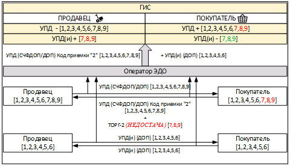

Рисунок 44. Заполнение КИ при недостачах в марках

#### <span id="_пример_заполнения_информации_о_ки_при_излишках_по_ки"></span>9.1.2. Пример заполнения информации о КИ при излишках по КИ

Визуализация табличной части УПД для понимания дальнейшего описания части XML приведена на рисунке ниже.


Рисунок 45. Визуализация табличной части УПД

Ситуация:

В УПД поставлены Товар Y и Товар N:

``` xml
<СведТов КолТов="2" НаимТов="Товар Y" НомСтр="001">
    <НомСредИдентТов>
        <КИЗ>Y001</КИЗ>
        <КИЗ>Y002</КИЗ>
    </НомСредИдентТов>

    <СведТов КолТов="2" НаимТов="Товар N" НомСтр="002">
        <НомСредИдентТов>
            <КИЗ>N001</КИЗ>
        </НомСредИдентТов>
    </СведТов>
</СведТов>
```

Первая строка сформирована корректно. По второй строке (Товар N) в УПД указано два товара и один КИ (N001), второй КИ забыли указать. К самому товару (к качеству, цене, количеству) претензий нет, покупатель подписывает УПД с признаком «2», оформляет ТОРГ-2 (код обстоятельства \<ОбстИсп="4XXX"\>) и ждёт от продавца УПД(и) с корректными КИ.

Пример в ТОРГ-2:

``` adoc
+ <СодФХЖ1 ОбстИсп = "4XXX">
- <СодФХЖ2 Заключение = "Перечисленные в документе ценности приняты">
```

``` xml
<СодСоб = "Настоящий Акт составлен комиссией, которая произвела осмотр прибывшего груза и установила: доставлен товар по сопроводительному документу 1111 от 16.09.2020. Перечисленные в документе ценности приняты, есть вопросы к КИ">
```

``` xml
<РезПрием>
    <Ценности НаимТов="Товар N" НомСтрСопрДок="002" />
    <ПоДокум КолТовПрин="2">
        <НомСредИдентТов>
            <КИЗ>N001</КИЗ>
        </НомСредИдентТов>
    </ПоДокум>
    <ПоФакту КолТовПрин="2">          <Излишки КолТовРасх="0">
        <НомСредИдентТов>                 <НомСредИдентТов>
            <КИЗ>N001</КИЗ>     И             <КИЗ>N002</КИЗ>
            <КИЗ>N002</КИЗ>               </НомСредИдентТов>
        </НомСредИдентТов>            </Излишки>
    </ПоФакту>
</РезПрием>
```

#### <span id="_пример_заполнения_информации_о_ки_при_ошибках_по_ки"></span>9.1.3. Пример заполнения информации о КИ при ошибках по КИ

Ситуация:

В УПД поставлены Товар Y и Товар N:

``` xml
<СведТов КолТов="2" НаимТов="Товар Y" НомСтр="001">
    <НомСредИдентТов>
        <КИЗ>Y001</КИЗ>
        <КИЗ>Y002</КИЗ>
    </НомСредИдентТов>

    <СведТов КолТов="2" НаимТов="Товар N" НомСтр="002">
        <НомСредИдентТов>
            <КИЗ>N001</КИЗ>
            <КИЗ>N002</КИЗ>
        </НомСредИдентТов>
    </СведТов>
</СведТов>
```

В УПД Товар N — КИ (N001, N002), при этом физически поступил Товар N — КИ (N003, N004), т.е. код маркировки на товаре не совпадает с кодом, указанным в УПД (на товаре указан КМ N003, N004, в УПД КМ — N001, N002). Покупатель оформляет ТОРГ-2 (код обстоятельства \<ОбстИсп="4XXX"\>):

- недостача (КМ N001, N002);

- излишек (КМ N003, N004).

К самому товару (к качеству, к цене, к количеству) претензий нет. Продавец оформляет УПД(и).

Пример заполнения ТОРГ-2 представлен ниже.

``` adoc
+ <СодФХЖ1 ОбстИсп = "4XXX">
- <СодФХЖ2 Заключение = "Перечисленные в документе ценности приняты">
```

``` xml
<СодСоб = "Настоящий Акт составлен комиссией, которая произвела осмотр прибывшего груза и установила: доставлен товар по сопроводительному документу 1111 от 16.09.2020. Перечисленные в документе ценности приняты, есть вопросы к КИ">
```

``` xml
<РезПрием>
    <Ценности НаимТов="Товар" НомСтрСопрДок="002" />

    <ПоДокум КолТовПрин="2">
        <НомСредИдентТов>
            <КИЗ>N001</КИЗ>
            <КИЗ>N002</КИЗ>
        </НомСредИдентТов>
    </ПоДокум>
    <ПоФакту КолТовПрин="2">     <Недостача КолТовРасх="0">     <Излишки КолТовРасх="0">
        <НомСредИдентТов>     И      <НомСредИдентТов>       И       <НомСредИдентТов>
            <КИЗ>N003</КИЗ>              <КИЗ>N001</КИЗ>                 <КИЗ>N003</КИЗ>
            <КИЗ>N004</КИЗ>              <КИЗ>N002</КИЗ>                 <КИЗ>N004</КИЗ>
        </НомСредИдентТов>           </НомСредИдентТов>              </НомСредИдентТов>
    </ПоФакту>                   </Недостача>                   </Излишки>
</РезПрием>
```

### <span id="_типовой_сценарий_обработки_документа_о_приёмке_материальных_ценностей_и_или_расхождениях_выявленных_при_их_приёмке_в_электронной_форме_торг_2_в_случае_расхождений_по_товарам"></span>9.2. Типовой сценарий обработки документа о приёмке материальных ценностей и (или) расхождениях, выявленных при их приёмке, в электронной форме (ТОРГ-2) в случае расхождений по товарам

Визуализация табличной части УПД для понимания дальнейшего описания части XML приведена на рисунке ниже.

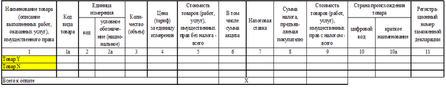

Рисунок 46. Визуализация табличной части УПД

#### <span id="_обнаружен_брак_по_товарам_в_том_числе_брак_по_км"></span>9.2.1. Обнаружен брак по товарам, в том числе брак по КМ

Ситуация:

По УПД поставлены товары по двум позициям: Товар Y (КИ Y001, Y002) и Товар N (КИ N001, N002).

``` xml
<СведТов КолТов="2" НаимТов="Товар Y" НомСтр="001">
    <НомСредИдентТов>
        <КИЗ>Y001</КИЗ>
        <КИЗ>Y002</КИЗ>
    </НомСредИдентТов>

    <СведТов КолТов="2" НаимТов="Товар N" НомСтр="002">
        <НомСредИдентТов>
            <КИЗ>N001</КИЗ>
            <КИЗ>N002</КИЗ>
        </НомСредИдентТов>
    </СведТов>
</СведТов>
```

Товар Y (КМ Y002) имеет брак по качеству товара, Товар N (КМ N002) имеет брак по КИ (затёрт, брак по марке приравнивается к браку по товару). Будет физический возврат продукции по двум единицам товара.

В случае, если физического возврата маркированной продукции не происходит, допускается оформление УКД без КИ.

Покупатель подписывает УПД с признаком «2», оформляет ТОРГ-2 (код обстоятельства \<ОбстИсп="3XXX" или "2XXX"\>).

Продавец оформляет УКД в части претензий к товару, в том числе по бракованному КИ. Отдельно оформлять УПД(и) в части претензий к КИ не нужно, так как товары с бракованным КИ также возвращаются продавцу.

Заполнение УКД (см. раздел «[Описание сведений о маркированных товарах в УКД](#_описание_сведений_о_маркированных_товарах_в_укд)»):

УКД_до КМ (Y001, Y002, N001, N002);

УКД_после КМ (Y001, N001).

Заполнение ТОРГ-2:

``` adoc
+ <СодФХЖ1 ОбстИсп = "3XXX">
- <СодФХЖ2 Заключение = "Перечисленные в документе ценности приняты частично">
```

``` xml
<СодСоб = "Настоящий Акт составлен комиссией, которая произвела осмотр прибывшего груза и установила: доставлен товар по сопроводительному документу 1111 от 16.09.2020. Перечисленные в документе ценности приняты частично">
```

``` xml
<РезПрием>
    <Ценности НаимТов="Товар Y" НомСтрСопрДок="001" />
    <ПоДокум КолТовПрин="2">
        <НомСредИдентТов>
            <КИЗ>Y001</КИЗ>
            <КИЗ>Y002</КИЗ>
        </НомСредИдентТов>
    </ПоДокум>
    <ПоФакту КолТовПрин="1">     И     <Брак КолТовРасх="1">
        <НомСредИдентТов>                  <НомСредИдентТов>
            <КИЗ>Y001</КИЗ>                    <КИЗ>Y002</КИЗ>
        </НомСредИдентТов>                 </НомСредИдентТов>
    </ПоФакту>                         </Брак>

    <РезПрием>
        <Ценности НаимТов="Товар N" НомСтрСопрДок="002" />
        <ПоДокум КолТовПрин="2">
            <НомСредИдентТов>
                <КИЗ>N001</КИЗ>
                <КИЗ>N002</КИЗ>
            </НомСредИдентТов>
        </ПоДокум>
        <ПоФакту КолТовПрин="1">     И     <Брак КолТовРасх="1">
            <НомСредИдентТов>                  <НомСредИдентТов>
                <КИЗ>N001</КИЗ>                    <КИЗ>N002</КИЗ>
            </НомСредИдентТов>                 </НомСредИдентТов>
        </ПоФакту>                         </Брак>
    </РезПрием>
</РезПрием>
```

#### <span id="_обнаружена_недостача_товаров_пример_заполнения_информации_при_обнаружении_недостачи_товаров"></span>9.2.2. Обнаружена недостача товаров. Пример заполнения информации при обнаружении недостачи товаров

Ситуация:

По УПД поставлены товары: Товар Y (КИ Y001, Y002) и Товар N (КИ N001, N002, N003).

``` xml
<СведТов КолТов="2" НаимТов="Товар Y" НомСтр="001">
    <НомСредИдентТов>
        <КИЗ>Y001</КИЗ>
        <КИЗ>Y002</КИЗ>
    </НомСредИдентТов>
    <СведТов КолТов="3" НаимТов="Товар N" НомСтр="002">
        <НомСредИдентТов>
            <КИЗ>N001</КИЗ>
            <КИЗ>N002</КИЗ>
            <КИЗ>N003</КИЗ>
        </НомСредИдентТов>
    </СведТов>
</СведТов>
```

Товар N — КМ (N001, N002) не поставлены физически, но в УПД есть.

Покупатель подписывает УПД с признаком «2», оформляет ТОРГ-2 (код обстоятельства \<ОбстИсп="3XXX" или "2XXX"\>).

Заполнение УКД:

- УКД_до КМ (Y001, Y002, N001, N002, N003);

- УКД_после КМ (Y001, Y002, N003);

- или заполнение УПД(и) — если первоначально было отгружено действительно 5 шт. (если указанные покупателем как недостача товары реально отгружены покупателю ошибочно не были (например, «нашлись» на складе) УПД(и) КМ (Y001, Y002, N003)).

Заполнение ТОРГ-2:

``` adoc
+ <СодФХЖ1 ОбстИсп = "3XXX">
- <СодФХЖ2 Заключение = "Перечисленные в документе ценности приняты с расхождением по количеству">
```

``` xml
<СодСоб = "Настоящий Акт составлен комиссией, которая произвела осмотр прибывшего груза и установила: доставлен товар по сопроводительному документу 1111 от 16.09.2020. Перечисленные в документе ценности приняты с расхождением по количеству">
```

``` xml
<РезПрием>
    <Ценности НаимТов="Товар Y" НомСтрСопрДок="001" />
    <ПоДокум КолТовПрин="2">
        <НомСредИдентТов>
            <КИЗ>Y001</КИЗ>
            <КИЗ>Y002</КИЗ>
        </НомСредИдентТов>
    </ПоДокум>
    <ПоФакту КолТовПрин="2">
        <НомСредИдентТов>
            <КИЗ>Y001</КИЗ>
            <КИЗ>Y002</КИЗ>
        </НомСредИдентТов>
    </ПоФакту>

    <РезПрием>
        <Ценности НаимТов="Товар N" НомСтрСопрДок="002" />
        <ПоДокум КолТовПрин="3">
            <НомСредИдентТов>
                <КИЗ>N001</КИЗ>
                <КИЗ>N002</КИЗ>
                <КИЗ>N003</КИЗ>
            </НомСредИдентТов>
        </ПоДокум>
        <ПоФакту КолТовПрин="1">         <Недостача КолТовРасх="2">
            <НомСредИдентТов>                 <НомСредИдентТов>
                <КИЗ>N003</КИЗ>     И             <КИЗ>N001</КИЗ>
            </НомСредИдентТов>                    <КИЗ>N002</КИЗ>
        </ПоФакту>                            </НомСредИдентТов>
    </РезПрием>                          </Недостача>
</РезПрием>
```

#### <span id="_пример_заполнения_информации_при_обнаружении_излишков_товаров"></span>9.2.3. Пример заполнения информации при обнаружении излишков товаров

Ситуация:

По УПД отражены (заявлены) Товар Y (КИ Y001, Y002) и Товар N (КИ N001, N002, N003).

``` xml
<СведТов КолТов="2" НаимТов="Товар Y" НомСтр="001">
    <НомСредИдентТов>
        <КИЗ>Y001</КИЗ>
        <КИЗ>Y002</КИЗ>
    </НомСредИдентТов>
    <СведТов КолТов="3" НаимТов="Товар N" НомСтр="002">
        <НомСредИдентТов>
            <КИЗ>N001</КИЗ>
            <КИЗ>N002</КИЗ>
            <КИЗ>N003</КИЗ>
        </НомСредИдентТов>
    </СведТов>
</СведТов>
```

При этом физически пришли Товар Y (КИ Y001, Y002) и Товар N (КИ N001, N002, N003, N004, N005).

Покупатель действует по одному из двух вариантов, в зависимости от договора (условий поставки):

- подписывает УПД с признаком «1», не принимает физически излишек Товара N с КИ N004 и N005 (покупатель принимает только то, что заказывал);

- подписывает УПД с признаком «2», решает принять излишек, оформляет ТОРГ-2 (код обстоятельства \<ОбстИсп="3XXX" или "2XXX"\>).

Поставщик:

- не делает ничего (ждёт возврат с доставки);

- составляет исправленный УПД, в котором отражает все фактически реализованные товары (все 7 шт.);

- оформляет отдельный УПД на Товар N с КИ N004 и N005.

Заполнение ТОРГ-2 к ситуации «2А» (подписывает УПД с признаком «2», решает принять излишек):

``` adoc
+ <СодФХЖ1 ОбстИсп = "3XXX">
- <СодФХЖ2 Заключение = "Перечисленные в документе ценности приняты с излишком">
```

``` xml
<СодСоб = "Настоящий Акт составлен комиссией, которая произвела осмотр прибывшего груза и установила: доставлен товар по сопроводительному документу 1111 от 16.09.2020. Перечисленные в документе ценности приняты с излишком">
```

``` xml
<РезПрием>
    <Ценности НаимТов="Товар N" НомСтрСопрДок="002" />
    <ПоДокум КолТовПрин="3">
        <НомСредИдентТов>
            <КИЗ>N001</КИЗ>
            <КИЗ>N002</КИЗ>
            <КИЗ>N003</КИЗ>
        </НомСредИдентТов>
    </ПоДокум>
    <ПоФакту КолТовПрин="5">          <Излишки КолТовРасх="2">
        <НомСредИдентТов>                 <НомСредИдентТов>
            <КИЗ>N001</КИЗ>                   <КИЗ>N004</КИЗ>
            <КИЗ>N002</КИЗ>     И             <КИЗ>N005</КИЗ>
            <КИЗ>N003</КИЗ>               </НомСредИдентТов>
            <КИЗ>N004</КИЗ>           </Излишки>
            <КИЗ>N005</КИЗ>
        </НомСредИдентТов>
    </ПоФакту>
</РезПрием>
```

В **«Титуле покупателя»** при подписании УПД необходимо проставить признак \<КодИтога\> в блоке содержания операции (\<КодСодОпер\>) (Приказ ФНС России от 19.12.2023 № ЕД-7-26/970@ — Таблица 7.6, или см. раздел «[Требования к указанию сведений о передаче маркированного товара в объёмно-сортовом разрезе учёта](#_требования_к_указанию_сведений_о_передаче_маркированного_товара_в_объёмно_сортовом_разрезе_учёта)»).

### <span id="_указание_сведений_при_заполнении_информации_при_объёмно_сортовом_разрезе_учёта"></span>9.3. Указание сведений при заполнении информации при объёмно-сортовом разрезе учёта

При организации прослеживаемости маркированной продукции в ГИС МТ в товарных группах, предусматривающих применение сортового учёта, предполагается указание информации об отгруженной маркированной продукции, базирующейся на следующих принципах:

- в ТОРГ-2 допускается указание сведений о маркировке товаров как поэкземплярно, так и в сортовом разрезе (GTIN и количество КИ потребительских упаковок);

- для отражения в документе информации о маркированной продукции в сортовом разрезе учёта используется регулярное выражение: \[02\]\[GTIN\]\[37\]\[количество\] в потребительской единице, подлежащей маркировке. Идентификаторы применения указываются без заключающих скобок, заполняются поля \<ГТИН\> и \<КолВедМарк\> согласно Приказу ФНС России от 19.12.2023 № ЕД-7-26/970@);

- по товарной позиции обязательным является указание количества в минимальной потребительской единице;

- сведения о маркированном товаре в объёмно-сортовом разрезе учёта рекомендуется в теге \<НомУпак\>, входящем в \<НомСредИдентТов\>. (Использование атрибутов \<КИЗ\> и \<ИдентТрансУпак\> может повлечь некорректную обработку документа контрагентом).

Пример: Обнаружен брак по товарам.

Ситуация:

По Приказу ФНС России от 19.12.2023 № ЕД-7-26/970@: по УПД поставлены товары по двум позициям в объёмно-сортовом учёте: Товар Y и Товар N.

``` xml
<СведТов КолТов="2" НаимТов="Y" НомСтр="001" НаимЕдИзм="шт">
        <ДопСведТов ГТИН="04605922024286">
          <НомСредИдентТов КолВедМарк="2">
          </НомСредИдентТов>
        </ДопСведТов>
      </СведТов>

      <СведТов КолТов="2" НаимТов="Товар N" НомСтр="002" НаимЕдИзм="шт">
        <ДопСведТов ГТИН="04605922024286">
          <НомСредИдентТов КолВедМарк="2">
          </НомСредИдентТов>
        </ДопСведТов>
</СведТов>
```

Товар Y имеет брак по качеству товара, Товар N имеет брак по КИ (затёрт, брак по марке приравнивается к браку по товару). Будет физический возврат продукции по двум единицам товара.

В случае, если физического возврата маркированной продукции не происходит, допускается оформление УКД без КИ.

Покупатель подписывает УПД с признаком «2», оформляет ТОРГ-2 (код обстоятельства \<ОбстИсп="3XXX" или "2XXX"\>).

Продавец оформляет УКД в части претензий к товару, в том числе по бракованному КИ. Отдельно оформлять УПД(и) в части претензий к КИ не нужно, так как товары с бракованным КИ также возвращаются продавцу.

Заполнение ТОРГ-2:

``` adoc
+ <СодФХЖ1 ОбстИсп = "3XXX">
- <СодФХЖ2 Заключение = "Перечисленные в документе ценности приняты частично">
```

``` xml
<СодСоб = "Настоящий Акт составлен комиссией, которая произвела осмотр прибывшего груза и установила: доставлен товар по сопроводительному документу 1111 от 16.09.2022. Перечисленные в документе ценности приняты частично">
```

``` xml
<РезПрием>
    <Ценности НаимТов="Товар Y" НомСтрСопрДок="001"/>
    <ПоДокум КолТовПрин="2">
        <НомСредИдентТов>
            <НомУпак>0204605922024286372</НомУпак>
        </НомСредИдентТов>
    </ПоДокум>
    <ПоФакту КолТовПрин="1">
        <НомСредИдентТов>
            <НомУпак>0204605922024286371</НомУпак>
        </НомСредИдентТов>
    </ПоФакту>
    <РезПрием>
        <Ценности НаимТов="Товар N" НомСтрСопрДок="002"/>
        <ПоДокум КолТовПрин="2">
            <НомСредИдентТов>
                <НомУпак>0204605922024286372</НомУпак>
            </НомСредИдентТов>
        </ПоДокум>
        <ПоФакту КолТовПрин="1">
            <НомСредИдентТов>
                <НомУпак>0204605922024286371</НомУпак>
            </НомСредИдентТов>
        </ПоФакту>
    </РезПрием>
```

Пример:

Обнаружена недостача товаров.

Ситуация:

По Приказу ФНС России от 19.12.2023 № ЕД-7-26/970@: по УПД поставлены товары: Товар Y и Товар N.

``` xml
<СведТов КолТов="20" НаимТов="Y" НомСтр="001">
        <ДопСведТов ГТИН="04605922024286">
          <НомСредИдентТов КолВедМарк="20">
          </НомСредИдентТов>
        </ДопСведТов>
      </СведТов>
      <СведТов КолТов="2" НаимТов="Товар N" НомСтр="002">

        <ДопСведТов ГТИН="04605922024286">
          <НомСредИдентТов КолВедМарк="30">
          </НомСредИдентТов>
        </ДопСведТов>
</СведТов>
```

Товар N — две единицы товара не поставлены физически, но в УПД есть.

Покупатель подписывает УПД с признаком «2», оформляет ТОРГ-2 (код обстоятельства \<ОбстИсп="3XXX" или "2XXX"\>).

Заполнение ТОРГ-2:

``` adoc
+ <СодФХЖ1 ОбстИсп = "3XXX">
- <СодФХЖ2 Заключение = "Перечисленные в документе ценности приняты с расхождением по количеству">
```

``` xml
<СодСоб = "Настоящий Акт составлен комиссией, которая произвела осмотр прибывшего груза и установила: доставлен товар по сопроводительному документу 1111 от 16.03.2022. Перечисленные в документе ценности приняты с расхождением по количеству">
```

``` xml
<РезПрием>
    <Ценности НаимТов="Товар Y" НомСтрСопрДок="001"/>
    <ПоДокум КолТовПрин="20">
        <НомСредИдентТов>
            <НомУпак>02046059220242863720</НомУпак>
        </НомСредИдентТов>
    </ПоДокум>
    <ПоФакту КолТовПрин="20">
        <НомСредИдентТов>
            <НомУпак>02046059220242863720</НомУпак>
        </НомСредИдентТов>
    </ПоФакту>

    <РезПрием>
        <Ценности НаимТов="Товар N" НомСтрСопрДок="002"/>
        <ПоДокум КолТовПрин="30">
            <НомСредИдентТов>
                <НомУпак>02046059220242863730</НомУпак>
            </НомСредИдентТов>
        </ПоДокум>
```

``` xml
   <ПоФакту КолТовПрин="28">
    <НомСредИдентТов>
     <НомУпак>02046059220242863728</НомУпак>
    </НомСредИдентТов>
   </ПоФакту>
</РезПрием>
</РезПрием>
```

и

``` xml
<Недостача КолТовРасх="2">
  <НомСредИдентТов>
   <НомУпак>0204605922024286372</НомУпак>
  </НомСредИдентТов>
</Недостача>
```

Пример:

Обнаружение излишков товаров.

По Приказу ФНС России от 19.12.2023 № ЕД-7-26/970@: по УПД отражены (заявлены) Товар Y и Товар N.

``` xml
<СведТов КолТов="20" НаимТов="Y" НомСтр="001">
  <ДопСведТов ГТИН="04605922024286">
    <НомСредИдентТов КолВедМарк="20">
    </НомСредИдентТов>
  </ДопСведТов>
</СведТов>
<СведТов КолТов="2" НаимТов="Товар N" НомСтр="002">
  <ДопСведТов ГТИН="04605922024286">
    <НомСредИдентТов КолВедМарк="30">
    </НомСредИдентТов>
  </ДопСведТов>
</СведТов>
```

При этом физически пришли Товар Y корректно и Товар N на две единицы больше.

Покупатель действует по одному из двух вариантов, в зависимости от договора (условий поставки):

- подписывает УПД с признаком «1», не принимает физически излишек Товара N (покупатель принимает только то, что заказывал);

- подписывает УПД с признаком «2», решает принять излишек, оформляет ТОРГ-2 (код обстоятельства \<ОбстИсп="3XXX" или "2XXX"\>).

Поставщик:

- не делает ничего (ждёт возврат с доставки);

- составляет исправленный УПД, в котором отражает все фактически реализованные товары;

- оформляет отдельный УПД на излишки Товар N две единицы товара.

Заполнение ТОРГ-2 к ситуации «2А» (подписывает УПД с признаком «2», решает принять излишек):

``` adoc
+ <СодФХЖ1 ОбстИсп = "3XXX">
- <СодФХЖ2 Заключение = "Перечисленные в документе ценности приняты с излишком">
```

``` xml
<СодСоб = "Настоящий Акт составлен комиссией, которая произвела осмотр прибывшего груза и установила: доставлен товар по сопроводительному документу 1111 от 16.03.2022. Перечисленные в документе ценности приняты с излишком">
```

``` xml
<РезПрием>
    <Ценности НаимТов="Товар N" НомСтрСопрДок="002"/>
    <ПоДокум КолТовПрин="30">
        <НомСредИдентТов>
            <НомУпак>02046059220242863730</НомУпак>
        </НомСредИдентТов>
    </ПоДокум>
```

``` xml
   <ПоФакту КолТовПрин="32">
    <НомСредИдентТов>
     <НомУпак>02046059220242863732</НомУпак>
    </НомСредИдентТов>
   </ПоФакту>
</РезПрием>
```

и

``` xml
<Излишки КолТовРасх="2">
  <НомСредИдентТов>
    <НомУпак>0204605922024286372</НомУпак>
  </НомСредИдентТов>
</Излишки>
```

## <span id="perechen_sokrashchenij_uslovnyh_oboznachenij_i_terminov"></span>Перечень сокращений, условных обозначений и терминов

| Сокращение, условное обозначение, термин | Описание |
|----|----|
| AI | Идентификатор применения — набор из двух или более знаков, расположенный в начале элементной строки. Идентификатор AI – это префикс, который единственным образом определяет значение и формат поля данных, следующего за AI. Данные, следующие за идентификатором AI, могут содержать буквенные или цифровые символы любой длины, до тридцати символов. Поля данных могут быть определённой или переменной длины в зависимости от идентификатора AI. Дополнительные данные, связанные с товарной единицей или логистическим элементом, не имеют значения сами по себе. Эти данные могут быть представлены в UCC/EAN–128 с помощью идентификатора AI |
| API | Application Programming Interface (интерфейс программирования приложений) — программный интерфейс приложения, набор готовых классов, процедур, функций, структур и констант, предоставляемых приложением (библиотекой, сервисом) или операционной системой для использования во внешних программных продуктах |
| GS1 | Global Standard 1 — независимая некоммерческая организация, специализирующаяся на разработке и внедрении глобальных стандартов идентификации, маркировки в торговых процессах для различных целей, включая организацию прослеживаемости товаров. Ассоциация автоматической идентификации «ГС1 РУС», использующая стандарты GS1 |
| GTIN | Global Trade Item Number – глобальный идентификационный номер, присваиваемый единице товара (продукции) национальной организацией GS1 в соответствии с правилами, установленными стандартами системы GS1, наносимый в виде штрихового кода на каждую единицу товара (продукции) в целях ее однозначной идентификации в мировом экономическом пространстве |
| GUID | Глобальный уникальный идентификатор |
| SSCC | Serial Shipping Container Code — индивидуальный серийный номер транспортной упаковки в виде линейного штрихового кода Code128 |
| XML | eXtensible Markup Language — расширяемый язык разметки, состоящий из набора тегов, их атрибутов, значений, а также набора правил, определяющих какие атрибуты и элементы могут входить в состав других элементов |
| АТК | Агрегированный таможенный код — уникальная последовательность символов, которая присваивается каждой отдельной виртуальной упаковке, объединяющей комбинацию товаров, подлежащих прохождению таможенных процедур, выпуска для внутреннего потребления или реимпорта, экспорта, временного вывоза и реэкспорта. Общее количество символов в составе АТК — 25 |
| АТП | Альтернативная табачная продукция |
| ГИС МТ | Государственная информационная система, созданная в целях автоматизации процессов сбора и обработки информации об обороте товаров, подлежащих обязательной маркировке средствами идентификации, хранения такой информации, обеспечения доступа к ней, её предоставления и распространения, повышения эффективности обмена такой информацией и обеспечения прослеживаемости указанных товаров, а также в иных целях, предусмотренных федеральными законами |
| ДОП | Первичный документ. Например: накладная или акт |
| ЕЛК | Единый личный кабинет |
| ИСН | Индивидуальный серийный номер — символьная последовательность, уникально идентифицирующая единицу товара, потребительскую упаковку товара на основании кода товаров |
| КИ | Код идентификации — последовательность символов, представляющая собой уникальный номер экземпляра товара, формируемая Оператором информационной системы мониторинга для целей идентификации товаров, в том числе в потребительской упаковке |
| КИГУ | Код идентификации групповой упаковки — последовательность символов, представляющая собой уникальный номер группы товара, формируемая оператором информационной системы мониторинга для целей идентификации упакованного товара в групповой упаковке в соответствии с законодательством РФ о маркировке товаров |
| КИК | Код идентификации комплекта товаров — последовательность символов, представляющая собой уникальный номер экземпляра комплекта товаров, формируемая для целей идентификации комплекта товаров в соответствии с законодательством РФ о маркировке товаров |
| КИН | Код идентификации набора товаров — последовательность символов, представляющая собой уникальный номер экземпляра набора товаров, формируемая в целях идентификации набора товаров в соответствии с законодательством РФ о маркировке товаров |
| КИТУ | Код идентификации транспортной упаковки (указывается от 18 до 74 символов включительно: цифры, буквы латинского алфавита, спецсимволы: A-Z a-z 0-9 % & ' " ( ) \* + , - \_ . / : ; \< = \> ? !) |
| Крипто-хвост | Код проверки — последовательность символов, сформированная в результате криптографического преобразования кода идентификации, позволяющая выявить фальсификацию кода идентификации при его проверке с использованием фискального накопителя и (или) технических средств проверки кода проверки |
| КТ | Код товара — уникальный код, присваиваемый группе товаров при их описании в информационном ресурсе (GTIN), обеспечивающем учёт и хранение достоверных данных о товарах по соответствующей товарной номенклатуре |
| НКМТ | Национальный каталог маркированных товаров |
| Оператор | Частный партнёр, действующий в качестве Оператора Единой системы маркировки в соответствии с распоряжением Правительства РФ от 8 мая 2019 г. № 899-р «О реализации проекта государственно-частного партнёрства, заключаемого в целях создания, эксплуатации и технического обслуживания объекта, предназначенного для обеспечения маркировки и прослеживаемости отдельных видов товаров» (<a href="https://честныйзнак.рф" class="bare">https://честныйзнак.рф</a>), распоряжением Правительства Российской Федерации от 3 апреля 2019 г. № 620-р «Об операторе государственной информационной системы мониторинга за оборотом товаров, подлежащих обязательной маркировке», и распоряжением № 2828-р от 18 декабря 2019 года |
| СЧФДОП | Первичный документ и счёт-фактура |
| УКД | Универсальный корректировочный документ — электронный документ, формат которого утверждается Федеральной налоговой службой, предназначенный для документирования факта изменения стоимости ранее осуществлённой поставки и (или) факта расхождения по количеству (качеству) продукции при её приёмке |
| УКД(и) | Исправленный универсальный корректировочный документ |
| УКЭП | Усиленная квалифицированная электронная подпись, обладающая дополнительными признаками защищённости: ключом проверки и подтверждёнными средствами электронной подписи |
| УПД | Универсальный передаточный документ — электронный документ об отгрузке товаров (выполнении работ, оказании услуг) или передаче имущественных прав, формат которого утверждается Федеральной налоговой службой |
| УПД(и) | Исправленный универсальный передаточный документ |
| ЭДО | Оператор электронного документооборота — организация, обеспечивающая обмен электронными документами, обладающими юридической силой. Операторы ЭДО оказывают услуги по организации обмена электронными документами по сделкам, такими, как договоры, первичные бухгалтерские документы, счёта-фактуры, между организациями, являющимися юридическими лицами, индивидуальными предпринимателями, государственными органами. Список доверенных Операторов ЭДО России, входящих в сеть ФНС РФ, размещён на официальном сайте налоговой службы |

## <span id="_история_изменений"></span>История изменений

<table class="tableblock frame-all grid-all stretch">
<colgroup>
<col style="width: 20%" />
<col style="width: 20%" />
<col style="width: 60%" />
</colgroup>
<thead>
<tr>
<th class="tableblock halign-left valign-top">Дата</th>
<th class="tableblock halign-left valign-top">Версия документа</th>
<th class="tableblock halign-left valign-top">Изменения</th>
</tr>
</thead>
<tbody>
<tr>
<td class="tableblock halign-left valign-top"><p>14.04.2026</p></td>
<td class="tableblock halign-left valign-top"><p>129.0</p></td>
<td class="tableblock halign-left valign-top"><p>В раздел «<a href="#_проверка_документа_и_описание_ошибки">Проверка документа и описание ошибки</a>» добавлено описание ошибок с кодами «06», «189», «393», «400»</p></td>
</tr>
<tr>
<td class="tableblock halign-left valign-top"><p>09.04.2026</p></td>
<td class="tableblock halign-left valign-top"><p>128.0</p></td>
<td class="tableblock halign-left valign-top"><p>Добавлены разделы «<a href="#_рекомендации_к_подаче_сведений_об_обороте_маркированных_товаров_в_рамках_исполнения_государственных_и_муниципальных_контрактов_для_товарных_групп_ветеринарные_препараты_и_медицинские_изделия">Рекомендации к подаче сведений об обороте маркированных товаров в рамках исполнения государственных и муниципальных контрактов для товарных групп «Ветеринарные препараты» и «Медицинские изделия»</a>», «<a href="#_рекомендации_к_подаче_сведений_через_еис_закупки_в_рамках_исполнения_государственных_и_муниципальных_контрактов_для_товарной_группы_медицинские_изделия">Рекомендации к подаче сведений через ЕИС Закупки в рамках исполнения государственных и муниципальных контрактов для товарной группы «Медицинские изделия»</a>»;<br />
В разделе «<a href="#_передача_товара_при_классической_контрактной_схеме_производства">Передача товара при классической контрактной схеме производства</a>» актуализировано описание для изготовителя, который оказывает услугу и получает оплату за услугу и который передаёт изготовленную продукцию по стоимости реализации</p></td>
</tr>
<tr>
<td class="tableblock halign-left valign-top"><p>08.04.2026</p></td>
<td class="tableblock halign-left valign-top"><p>127.0</p></td>
<td class="tableblock halign-left valign-top"><p>В разделе «<a href="#opisanie_ki_edinic_tovarov_gruppovyh_i_transportnyh_upakovok">Описание КИ единиц товаров, групповых и транспортных упаковок</a>» для товарной группы «Мясные изделия» обновлена информация о нормативных документах;<br />
В разделе «<a href="#_проверка_ки_в_документе_и_описание_ошибки">Проверка КИ в документе и описание ошибки</a>» актуализировано описание ошибки с кодом «268»</p></td>
</tr>
<tr>
<td class="tableblock halign-left valign-top"><p>01.04.2026</p></td>
<td class="tableblock halign-left valign-top"><p>126.0</p></td>
<td class="tableblock halign-left valign-top"><p>Раздел «Проверка документа УПД в объёмно-сортовом виде сведений и описание ошибки» переименован в «<a href="#_проверка_документа_упд_в_объёмно_сортовом_и_партионном_виде_сведений_и_описание_ошибки">Проверка документа УПД в объёмно-сортовом и партионном виде сведений и описание ошибки</a>»;<br />
В раздел «<a href="#_проверка_документа_упд_в_объёмно_сортовом_и_партионном_виде_сведений_и_описание_ошибки">Проверка документа УПД в объёмно-сортовом и партионном виде сведений и описание ошибки</a>» добавлено описание ошибок с кодами «362», «364»</p></td>
</tr>
<tr>
<td class="tableblock halign-left valign-top"><p>31.03.2026</p></td>
<td class="tableblock halign-left valign-top"><p>125.0</p></td>
<td class="tableblock halign-left valign-top"><p>В разделе «<a href="#opisanie_ki_edinic_tovarov_gruppovyh_i_transportnyh_upakovok">Описание КИ единиц товаров, групповых и транспортных упаковок</a>»:</p>
<ul>
<li><p>для товарных групп «Автозапчасти и комплектующие транспортных средств», «Мясные изделия», «Натуральный мех», «Полимерные трубы», «Радиоэлектронная продукция. Ноутбуки и смартфоны», «Товары для дома и интерьера», «Удобрения в потребительской упаковке» добавлено описание структуры КИН для указания в УПД, УПД(и), УКД, УКД(и);</p></li>
<li><p>для товарных групп «Полуфабрикаты и замороженные продукты», «Радиоэлектронная продукция. Ноутбуки и смартфоны» добавлено описание структуры КИГУ для указания в УПД, УПД(и), УКД, УКД(и)</p></li>
</ul></td>
</tr>
<tr>
<td class="tableblock halign-left valign-top"><p>24.03.2026</p></td>
<td class="tableblock halign-left valign-top"><p>124.0</p></td>
<td class="tableblock halign-left valign-top"><p>В раздел «<a href="#_перемещение_пива_и_слабоалкогольных_напитков">Перемещение пива и слабоалкогольных напитков</a>» добавлена информация о том, что УКД / УКДи будет обработан с ошибкой, если нет успешно обработанного первичного УПД / УПДи-основания;<br />
В раздел «<a href="#_проверка_документа_и_описание_ошибки">Проверка документа и описание ошибки</a>» добавлено описание ошибки с кодом «16»</p></td>
</tr>
<tr>
<td class="tableblock halign-left valign-top"><p>18.03.2026</p></td>
<td class="tableblock halign-left valign-top"><p>123.0</p></td>
<td class="tableblock halign-left valign-top"><p>В разделе «<a href="#opisanie_ki_edinic_tovarov_gruppovyh_i_transportnyh_upakovok">Описание КИ единиц товаров, групповых и транспортных упаковок</a>» для товарных групп «Радиоэлектронная продукция» и «Радиоэлектронная продукция. Ноутбуки и смартфоны» обновлена информация о нормативных документах</p></td>
</tr>
<tr>
<td class="tableblock halign-left valign-top"><p>17.03.2026</p></td>
<td class="tableblock halign-left valign-top"><p>122.0</p></td>
<td class="tableblock halign-left valign-top"><p>Для товарной группы «Медицинские изделия» в раздел «<a href="#_сведения_о_реализации_маркированных_товаров_в_рамках_гос_контракта">Сведения о реализации маркированных товаров в рамках гос. контракта</a>» добавлено примечание о перемещении товаров без вывода из оборота: при передаче по государственному (муниципальному) контракту и поступлении УПД из ЕИС Казначейства</p></td>
</tr>
<tr>
<td class="tableblock halign-left valign-top"><p>05.03.2026</p></td>
<td class="tableblock halign-left valign-top"><p>121.0</p></td>
<td class="tableblock halign-left valign-top"><p>В разделе «<a href="#_проверка_документа_и_описание_ошибки">Проверка документа и описание ошибки</a>» удалена ошибка с кодом «71» («Содержание документа некорректно. Некорректные данные: Исходный УПД с &lt;КодИтога&gt; = 3 не может быть исправлен»)</p></td>
</tr>
<tr>
<td class="tableblock halign-left valign-top"><p>04.03.2026</p></td>
<td class="tableblock halign-left valign-top"><p>120.0</p></td>
<td class="tableblock halign-left valign-top"><p>В разделе «<a href="#_проверка_документа_и_описание_ошибки">Проверка документа и описание ошибки</a>» актуализировано описание ошибки с кодом «384»</p></td>
</tr>
<tr>
<td class="tableblock halign-left valign-top"><p>03.03.2026</p></td>
<td class="tableblock halign-left valign-top"><p>119.0</p></td>
<td class="tableblock halign-left valign-top"><p>В разделе «<a href="#_согласие_на_предоставление_доступа_к_информации_о_ки">Согласие на предоставление доступа к информации о КИ</a>» исключён пункт о проверке наличия согласия с помощью выгрузки «Получение сведений по КИ и агрегатам» в связи с её отключением</p></td>
</tr>
<tr>
<td class="tableblock halign-left valign-top"><p>02.03.2026</p></td>
<td class="tableblock halign-left valign-top"><p>118.0</p></td>
<td class="tableblock halign-left valign-top"><p>В разделе «<a href="#opisanie_ki_edinic_tovarov_gruppovyh_i_transportnyh_upakovok">Описание КИ единиц товаров, групповых и транспортных упаковок</a>» для товарной группы «Натуральный мех» добавлено описание структуры КИ и КИТУ для указания в УПД, УПД(и), УКД, УКД(и)</p></td>
</tr>
<tr>
<td class="tableblock halign-left valign-top"><p>26.02.2026</p></td>
<td class="tableblock halign-left valign-top"><p>117.0</p></td>
<td class="tableblock halign-left valign-top"><p>Раздел «Рекомендации по указанию в УПД сведений о производственной партии молочной продукции для участников эксперимента» переименован в «<a href="#_рекомендации_по_указанию_в_упд_сведений_о_производственной_партии_молочной_продукции">Рекомендации по указанию в УПД сведений о производственной партии молочной продукции</a>»;<br />
В разделе «<a href="#_рекомендации_по_указанию_в_упд_сведений_о_производственной_партии_молочной_продукции">Рекомендации по указанию в УПД сведений о производственной партии молочной продукции</a>» удалено примечание о том, что в рамках одной товарной строки нужно указывать одну производственную партию;<br />
В связи с изменением формата номера партии:</p>
<ul>
<li><p>обновлено допустимое количество символов (см. разделы «<a href="#_описание_сведений_о_маркированных_товарах_в_упд">Описание сведений о маркированных товарах в УПД</a>», «<a href="#_рекомендации_по_указанию_в_упд_сведений_о_производственной_партии_молочной_продукции">Рекомендации по указанию в УПД сведений о производственной партии молочной продукции</a>»);</p></li>
<li><p>обновлены рекомендации по исправлению ошибки с кодом «71» (см. раздел «<a href="#_проверка_документа_и_описание_ошибки">Проверка документа и описание ошибки</a>»).</p></li>
</ul>
<p>Добавлен раздел «<a href="#_требования_к_указанию_сведений_о_передаче_товара_для_табачных_товарных_групп">Требования к указанию сведений о передаче товара для табачных товарных групп</a>»</p></td>
</tr>
<tr>
<td class="tableblock halign-left valign-top"><p>13.02.2026</p></td>
<td class="tableblock halign-left valign-top"><p>116.0</p></td>
<td class="tableblock halign-left valign-top"><p>В разделе «<a href="#opisanie_ki_edinic_tovarov_gruppovyh_i_transportnyh_upakovok">Описание КИ единиц товаров, групповых и транспортных упаковок</a>» для товарных групп:</p>
<ul>
<li><p>«Сладости и кондитерские изделия» добавлено описание структуры КИГУ для указания в УПД, УПД(и), УКД, УКД(и);</p></li>
<li><p>«Радиоэлектронная продукция. Электронные системы доставки никотина» добавлено описание структуры КИН для указания в УПД, УПД(и), УКД, УКД(и)</p></li>
</ul></td>
</tr>
<tr>
<td class="tableblock halign-left valign-top"><p>12.02.2026</p></td>
<td class="tableblock halign-left valign-top"><p>115.0</p></td>
<td class="tableblock halign-left valign-top"><p>В разделе «<a href="#_рекомендации_к_подаче_исправленных_сведений_о_передаче_маркированных_товаров_в_гис_мт_на_основании_формата_упди">Рекомендации к подаче исправленных сведений о передаче маркированных товаров в ГИС МТ на основании формата УПД(и)</a>» актуализирована логика обработки данных при поступлении УПДи с &lt;КодИтога&gt; = 3;<br />
В разделе «<a href="#_описание_сведений_о_маркированных_товарах_в_укд">Описание сведений о маркированных товарах в УКД</a>» внесены изменения в способы заполнения информации;<br />
В разделе «<a href="#_требования_к_указанию_сведений_о_передаче_товара_для_товарной_группы_ветеринарные_препараты">Требования к указанию сведений о передаче товара для товарной группы «Ветеринарные препараты»</a>» добавлена информация об обязательном указании МОД грузополучателя в УПД от поставщика, если у покупателя в личном кабинете установлен признак подконтрольности. При этом указываемый МОД должен быть зарегистрирован у покупателя в реестре МОД Системы маркировки, иначе такой УПД обработается с ошибкой</p></td>
</tr>
<tr>
<td class="tableblock halign-left valign-top"><p>04.02.2026</p></td>
<td class="tableblock halign-left valign-top"><p>114.0</p></td>
<td class="tableblock halign-left valign-top"><p>В разделе «<a href="#opisanie_ki_edinic_tovarov_gruppovyh_i_transportnyh_upakovok">Описание КИ единиц товаров, групповых и транспортных упаковок</a>» для товарной группы «Полуфабрикаты и замороженные продукты» добавлено описание структуры КИ и КИТУ для указания в УПД, УПД(и), УКД, УКД(и)</p></td>
</tr>
<tr>
<td class="tableblock halign-left valign-top"><p>16.01.2026</p></td>
<td class="tableblock halign-left valign-top"><p>113.0</p></td>
<td class="tableblock halign-left valign-top"><p>В разделе «<a href="#opisanie_ki_edinic_tovarov_gruppovyh_i_transportnyh_upakovok">Описание КИ единиц товаров, групповых и транспортных упаковок</a>» для товарных групп «Мясные изделия», «Товары для дома и интерьера», «Удобрения в потребительской упаковке» добавлено описание структуры КИГУ для указания в УПД, УПД(и), УКД, УКД(и)</p></td>
</tr>
<tr>
<td class="tableblock halign-left valign-top"><p>13.01.2026</p></td>
<td class="tableblock halign-left valign-top"><p>112.0</p></td>
<td class="tableblock halign-left valign-top"><p>В раздел «<a href="#_проверка_документа_и_описание_ошибки">Проверка документа и описание ошибки</a>» добавлено описание ошибки с кодом «399»</p></td>
</tr>
<tr>
<td class="tableblock halign-left valign-top"><p>30.12.2025</p></td>
<td class="tableblock halign-left valign-top"><p>111.0</p></td>
<td class="tableblock halign-left valign-top"><p>В разделе «<a href="#opisanie_ki_edinic_tovarov_gruppovyh_i_transportnyh_upakovok">Описание КИ единиц товаров, групповых и транспортных упаковок</a>» для товарной группы «Радиоэлектронная продукция» скорректировано описание структуры серийного номера КИ, в связи с увеличением его длины с 13 до 20 символов;<br />
Товарная группа «Биологически активные добавки к пище» переименована в «Специализированная пищевая продукция и БАД к пище»</p></td>
</tr>
<tr>
<td class="tableblock halign-left valign-top"><p>04.12.2025</p></td>
<td class="tableblock halign-left valign-top"><p>110.0</p></td>
<td class="tableblock halign-left valign-top"><p>Если для товарной группы «Пиво, напитки, изготавливаемые на основе пива, слабоалкогольные напитки» передача товаров по УД осуществляется не участнику оборота товаров с выводом КИ из оборота, то проверка МОД не выполняется (см. раздел «<a href="#_регистрация_мод_участников_оборота">Регистрация МОД участников оборота</a>»)</p></td>
</tr>
<tr>
<td class="tableblock halign-left valign-top"><p>01.12.2025</p></td>
<td class="tableblock halign-left valign-top"><p>109.0</p></td>
<td class="tableblock halign-left valign-top"><p>В разделе «<a href="#opisanie_ki_edinic_tovarov_gruppovyh_i_transportnyh_upakovok">Описание КИ единиц товаров, групповых и транспортных упаковок</a>» для товарных групп «Товары для дома и интерьера», «Удобрения в потребительской упаковке» добавлено описание структуры КИ и КИТУ для указания в УПД, УПД(и), УКД, УКД(и)</p></td>
</tr>
<tr>
<td class="tableblock halign-left valign-top"><p>24.11.2025</p></td>
<td class="tableblock halign-left valign-top"><p>108.0</p></td>
<td class="tableblock halign-left valign-top"><p>В разделе «<a href="#opisanie_ki_edinic_tovarov_gruppovyh_i_transportnyh_upakovok">Описание КИ единиц товаров, групповых и транспортных упаковок</a>» для товарной группы «Мясные изделия» добавлено описание структуры КИ и КИТУ для указания в УПД, УПД(и), УКД, УКД(и)</p></td>
</tr>
<tr>
<td class="tableblock halign-left valign-top"><p>19.11.2025</p></td>
<td class="tableblock halign-left valign-top"><p>107.0</p></td>
<td class="tableblock halign-left valign-top"><p>В раздел «<a href="#_перемещение_пива_и_слабоалкогольных_напитков">Перемещение пива и слабоалкогольных напитков</a>» добавлена информация о том, что после подписания обеими сторонами первого УПД / УПДи формирование документа «Отгрузка продукции» не требуется. При попытке создания такого документа на последующие УПДи / УКД, корректирующие приёмку, ГИС МТ вернёт ошибку;<br />
Раздел «Проверка документа «Титул продавца» (УПД) и описание ошибок» удалён;<br />
В раздел «<a href="#_проверка_документа_и_описание_ошибки">Проверка документа и описание ошибки</a>» добавлено описание ошибок с кодами «215», «277», «294», «371», «383», «384», «386», «387»;<br />
В раздел «<a href="#_проверка_ки_в_документе_и_описание_ошибки">Проверка КИ в документе и описание ошибки</a>» добавлено описание ошибок с кодами «273», «276» и «343»;<br />
В разделе «<a href="#_проверка_документа_упд_в_объёмно_сортовом_и_партионном_виде_сведений_и_описание_ошибки">Проверка документа УПД в объёмно-сортовом и партионном виде сведений и описание ошибки</a>» скорректировано описание ошибки с кодом «190»</p></td>
</tr>
<tr>
<td class="tableblock halign-left valign-top"><p>06.11.2025</p></td>
<td class="tableblock halign-left valign-top"><p>106.0</p></td>
<td class="tableblock halign-left valign-top"><p>В разделе «<a href="#opisanie_ki_edinic_tovarov_gruppovyh_i_transportnyh_upakovok">Описание КИ единиц товаров, групповых и транспортных упаковок</a>» для товарной группы «Радиоэлектронная продукция. Ноутбуки и смартфоны» добавлено описание структуры КИ и КИТУ для указания в УПД, УПД(и), УКД, УКД(и)</p></td>
</tr>
<tr>
<td class="tableblock halign-left valign-top"><p>28.10.2025</p></td>
<td class="tableblock halign-left valign-top"><p>105.0</p></td>
<td class="tableblock halign-left valign-top"><p>Для товарной группы «Ветеринарные препараты» добавлено описание:</p>
<ul>
<li><p><a href="#_требования_к_указанию_сведений_о_передаче_товара_для_товарной_группы_ветеринарные_препараты">требований к указанию сведений о передаче товара</a>;</p></li>
<li><p><a href="#_рекомендации_к_подаче_сведений_о_мод_в_упд">рекомендаций к подаче сведений о МОД в УПД</a>;</p></li>
</ul>
<p>В раздел «Проверка документа «Титул продавца» (УПД) и описание ошибок» добавлено описание ошибки с кодом «343»;<br />
В раздел «<a href="#_проверка_ки_в_документе_и_описание_ошибки">Проверка КИ в документе и описание ошибки</a>» добавлено описание ошибок с кодами «268», «375»;<br />
В разделе «<a href="#_проверка_документа_и_описание_ошибки">Проверка документа и описание ошибки</a>» скорректировано описание ошибки с кодом «77»;<br />
Из раздела «<a href="#_рекомендации_к_подаче_сведений_о_мод_в_гис_мт_в_упд">Рекомендации к подаче сведений о МОД в ГИС МТ в УПД</a>» удалено примечание о том, что подача сведений о МОД для индивидуальных предпринимателей доступна только для товарной группы «Пиво, напитки, изготавливаемые на основе пива, слабоалкогольные напитки»</p></td>
</tr>
<tr>
<td class="tableblock halign-left valign-top"><p>06.10.2025</p></td>
<td class="tableblock halign-left valign-top"><p>104.0</p></td>
<td class="tableblock halign-left valign-top"><p>В разделе «<a href="#opisanie_ki_edinic_tovarov_gruppovyh_i_transportnyh_upakovok">Описание КИ единиц товаров, групповых и транспортных упаковок</a>» для товарной группы «Радиоэлектронная продукция. Электронные системы доставки никотина» добавлено описание структуры КИ, КИГУ и КИТУ для указания в УПД, УПД(и), УКД, УКД(и)</p></td>
</tr>
<tr>
<td class="tableblock halign-left valign-top"><p>01.10.2025</p></td>
<td class="tableblock halign-left valign-top"><p>103.0</p></td>
<td class="tableblock halign-left valign-top"><p>В раздел «<a href="#_при_использовании_адрес_в_российской_федерации_адррф_или_адринф">При использовании «Адрес в Российской Федерации» (&lt;АдрРФ&gt; или &lt;АдрИнф&gt;)</a>» для элемента «Адрес в Российской Федерации» добавлен атрибут &lt;АдрИнф&gt;;<br />
В разделах «<a href="#_требования_к_указанию_сведений_о_передаче_маркированного_товара_в_объёмно_сортовом_разрезе_учёта">Требования к указанию сведений о передаче маркированного товара в объёмно-сортовом разрезе учёта</a>» и «<a href="#ukazanie_v_upd_ki_produkcii_v_kegah_tovarnoj_gruppy_pivo_napitki_izgotavlivaemye_na_osnove_piva_slaboalkogolnye_napitki_proizvedyonnoj_do_1_marta_2025_goda">Указание в УПД КИ продукции в кегах товарной группы «Пиво, напитки, изготавливаемые на основе пива, слабоалкогольные напитки», произведённой до 1 марта 2025 года</a>» расширено правило согласования с контрагентом экземплярной отгрузки: теперь оно применяется также к товарам, по которым ранее не велась экземплярная прослеживаемость (включая те, где допускается объёмно-сортовая прослеживаемость)</p></td>
</tr>
<tr>
<td class="tableblock halign-left valign-top"><p>18.09.2025</p></td>
<td class="tableblock halign-left valign-top"><p>102.0</p></td>
<td class="tableblock halign-left valign-top"><p>В разделе «<a href="#opisanie_ki_edinic_tovarov_gruppovyh_i_transportnyh_upakovok">Описание КИ единиц товаров, групповых и транспортных упаковок</a>» для товарной группы «Игры и игрушки для детей» изменена информация о нормативных документах</p></td>
</tr>
<tr>
<td class="tableblock halign-left valign-top"><p>11.09.2025</p></td>
<td class="tableblock halign-left valign-top"><p>101.0</p></td>
<td class="tableblock halign-left valign-top"><p>В разделе «<a href="#_рекомендации_к_подаче_исправленных_сведений_о_передаче_маркированных_товаров_в_гис_мт_на_основании_формата_упди">Рекомендации к подаче исправленных сведений о передаче маркированных товаров в ГИС МТ на основании формата УПД(и)</a>» актуализирована логика обработки данных при поступлении УПДи с &lt;КодИтога&gt; = 3;</p>
<p>В раздел «<a href="#_обязательные_поля_в_упд_ед_7_26970">Обязательные поля в УПД (ЕД-7-26/970@)</a>» добавлены уточнения:</p>
<ul>
<li><p>при обработке УКД /УПД(и) для товарной группы «Пиво, напитки, изготавливаемые на основе пива, слабоалкогольные напитки» указание сведений &lt;НомерПеревозЭлДок&gt; и &lt;НомерПеревозДок/ДатаПеревозДок/РегНомер&gt; не требуется;</p></li>
<li><p>при перемещении передаваемой продукции без привлечения транспортного средства атрибут «РегНомер» может отсутствовать;<br />
</p></li>
</ul>
<p>В раздел «<a href="#_перемещение_пива_и_слабоалкогольных_напитков">Перемещение пива и слабоалкогольных напитков</a>» добавлена информация об использовании УПД с функцией «ДОП» для оформления передачи имущества в рамках одного хозяйствующего субъекта;<br />
В раздел «<a href="#korrektirovka_raskhozhdenij_pri_priyomke_tovarov_peremeshchaemyh_mezhdu_raznymi_mod_v_ramkah_odnogo_inn">Корректировка расхождений при приёмке товаров, перемещаемых между разными МОД (в рамках одного ИНН)</a>» добавлен вариант корректировки с помощью подачи УКД / УКД(и) через единый метод создания документов;<br />
В раздел «<a href="#_проверка_документа_и_описание_ошибки">Проверка документа и описание ошибки</a>» добавлено описание ошибок с кодами «373» и «71» («Содержание документа некорректно. Некорректные данные: УПД(и) с &lt;КодИтога&gt; = 3 не может быть обработан», «Содержание документа некорректно. Некорректные данные: Исходный УПД с &lt;КодИтога&gt; = 3 не может быть исправлен»);</p></td>
</tr>
<tr>
<td class="tableblock halign-left valign-top"></td>
<td class="tableblock halign-left valign-top"></td>
<td class="tableblock halign-left valign-top"><p>В разделе «Проверка документа «Титул продавца» (УПД) и описание ошибок» удалена ошибка с кодом «274»</p></td>
</tr>
<tr>
<td class="tableblock halign-left valign-top"><p>10.09.2025</p></td>
<td class="tableblock halign-left valign-top"><p>100.0</p></td>
<td class="tableblock halign-left valign-top"><p>Переименованы товарные группы:</p>
<ul>
<li><p>«Слабоалкогольные напитки» → «Алкоголь»;</p></li>
<li><p>«Парфюмерные и косметические средства и бытовая химия» → «Косметика, бытовая химия и товары личной гигиены»</p></li>
</ul></td>
</tr>
<tr>
<td class="tableblock halign-left valign-top"><p>21.08.2025</p></td>
<td class="tableblock halign-left valign-top"><p>99.0</p></td>
<td class="tableblock halign-left valign-top"><p>В разделе «<a href="#opisanie_ki_edinic_tovarov_gruppovyh_i_transportnyh_upakovok">Описание КИ единиц товаров, групповых и транспортных упаковок</a>» для товарной группы «Биологически активные добавки к пище» изменена информация о нормативных документах</p></td>
</tr>
<tr>
<td class="tableblock halign-left valign-top"><p>22.07.2025</p></td>
<td class="tableblock halign-left valign-top"><p>98.0</p></td>
<td class="tableblock halign-left valign-top"><p>В разделах «<a href="#_описание_сведений_о_маркированных_товарах_в_упд">Описание сведений о маркированных товарах в УПД</a>», «<a href="#_требования_к_указанию_сведений_о_передаче_маркированного_товара_в_объёмно_сортовом_разрезе_учёта">Требования к указанию сведений о передаче маркированного товара в объёмно-сортовом разрезе учёта</a>», «<a href="#svedeniya_v_upd_oformlennyh_v_ramkah_dogovorov_komissii_i_ili_agentskih_dogovorov">Сведения в УПД, оформленных в рамках договоров комиссии и (или) агентских договоров</a>», «<a href="#trebovaniya_k_ukazaniyu_svedenij_o_peredache_markirovannogo_tovara_v_obyomno_sortovom_razreze_uchyota">Требования к указанию сведений о передаче маркированного товара в объёмно-сортовом разрезе учёта</a>», «<a href="#_требования_к_указанию_сведений_о_передаче_товара_для_товарной_группы_табачное_сырьё_и_нмтп_в_объёмно_сортовом_разрезе_учёта">Требования к указанию сведений о передаче товара для товарной группы «Табачное сырьё и НМТП» в объёмно-сортовом разрезе учёта</a>» актуализирована информация в связи с прекращением применения формата, утверждённого приказом ФНС России от 19.12.2018 № ММВ-7-15/820@</p></td>
</tr>
<tr>
<td class="tableblock halign-left valign-top"><p>26.06.2025</p></td>
<td class="tableblock halign-left valign-top"><p>97.0</p></td>
<td class="tableblock halign-left valign-top"><p>Для всех товарных групп, кроме «Альтернативная табачная продукция», «Никотиносодержащая продукция», «Табачная продукция», актуализировано описание КИТУ SSCC (см. раздел «<a href="#opisanie_ki_edinic_tovarov_gruppovyh_i_transportnyh_upakovok">Описание КИ единиц товаров, групповых и транспортных упаковок</a>»)</p></td>
</tr>
<tr>
<td class="tableblock halign-left valign-top"><p>24.06.2025</p></td>
<td class="tableblock halign-left valign-top"><p>96.0</p></td>
<td class="tableblock halign-left valign-top"><p>В разделе «<a href="#opisanie_ki_edinic_tovarov_gruppovyh_i_transportnyh_upakovok">Описание КИ единиц товаров, групповых и транспортных упаковок</a>» для товарных групп «Автозапчасти и комплектующие транспортных средств», «Велосипеды и велосипедные рамы», «Моторные масла» добавлено описание структуры КИГУ для указания в УПД, УПД(и), УКД, УКД(и)</p></td>
</tr>
<tr>
<td class="tableblock halign-left valign-top"><p>23.06.2025</p></td>
<td class="tableblock halign-left valign-top"><p>95.0</p></td>
<td class="tableblock halign-left valign-top"><p>В разделе «<a href="#_проверка_ки_в_документе_и_описание_ошибки">Проверка КИ в документе и описание ошибки</a>» добавлена ошибка с кодом «03»</p></td>
</tr>
<tr>
<td class="tableblock halign-left valign-top"><p>18.06.2025</p></td>
<td class="tableblock halign-left valign-top"><p>94.0</p></td>
<td class="tableblock halign-left valign-top"><p>Добавлен раздел «<a href="#_передача_товара_при_классической_контрактной_схеме_производства">Передача товара при классической контрактной схеме производства</a>»;<br />
В разделе «<a href="#_проверка_документа_и_описание_ошибки">Проверка документа и описание ошибки</a>»:</p>
<ul>
<li><p>удалена ошибка с кодом «71» («Отсутствуют сведения о грузоперевозке»);</p></li>
<li><p>добавлены ошибки с кодами «72», «76», «103», «106», «110», «272», «279», «340», «344», «359»</p></li>
</ul></td>
</tr>
<tr>
<td class="tableblock halign-left valign-top"><p>05.06.2025</p></td>
<td class="tableblock halign-left valign-top"><p>93.0</p></td>
<td class="tableblock halign-left valign-top"><p>В разделе «<a href="#opisanie_ki_edinic_tovarov_gruppovyh_i_transportnyh_upakovok">Описание КИ единиц товаров, групповых и транспортных упаковок</a>» для товарной группы «Строительные материалы» изменена информация о нормативных документах</p></td>
</tr>
<tr>
<td class="tableblock halign-left valign-top"><p>21.05.2025</p></td>
<td class="tableblock halign-left valign-top"><p>92.0</p></td>
<td class="tableblock halign-left valign-top"><p>Добавлена информация по товарной группе «Слабоалкогольные напитки» в разделы:</p>
<ul>
<li><p>«<a href="#opisanie_ki_edinic_tovarov_gruppovyh_i_transportnyh_upakovok">Описание КИ единиц товаров, групповых и транспортных упаковок</a>»;</p></li>
<li><p>«<a href="#_рекомендации_к_проверке_сведений_о_маркированных_товарах_до_подачи_сведений_в_гис_мт">Рекомендации к проверке сведений о маркированных товарах до подачи сведений в ГИС МТ</a>»;</p></li>
<li><p>«<a href="#rekomendacii_po_ukazaniyu_mest_osushchestvleniya_deyatelnosti">Рекомендации по указанию мест осуществления деятельности для товарных групп «Алкоголь» и «Пиво, напитки, изготавливаемые на основе пива, слабоалкогольные напитки»</a>»;</p></li>
<li><p>«<a href="#_регистрация_мод_участников_оборота">Регистрация МОД участников оборота</a>»;</p></li>
<li><p>«<a href="#trebovaniya_k_ukazaniyu_svedenij_o_peredache_tovara_dlya_tovarnoj_gruppy_pivo_napitki_izgotavlivaemye_na_osnove_piva_slaboalkogolnye_napitki">Требования к указанию сведений о передаче товара для товарных групп «Алкоголь» и «Пиво, напитки, изготавливаемые на основе пива, слабоалкогольные напитки»</a>»</p></li>
</ul></td>
</tr>
<tr>
<td class="tableblock halign-left valign-top"><p>15.05.2025</p></td>
<td class="tableblock halign-left valign-top"><p>91.0</p></td>
<td class="tableblock halign-left valign-top"><p>В разделе «<a href="#opisanie_ki_edinic_tovarov_gruppovyh_i_transportnyh_upakovok">Описание КИ единиц товаров, групповых и транспортных упаковок</a>» для товарных групп «Печатная продукция», «Радиоэлектронная продукция», «Сладости и кондитерские изделия» добавлено описание структуры КИН для указания в УПД, УПД(и), УКД, УКД(и)</p></td>
</tr>
<tr>
<td class="tableblock halign-left valign-top"><p>16.04.2025</p></td>
<td class="tableblock halign-left valign-top"><p>90.0</p></td>
<td class="tableblock halign-left valign-top"><p>В разделе «<a href="#_описание_кодов_ошибки_при_проверке_документов_и_ки">Описание кодов ошибки при проверке документов и КИ</a>» добавлена ошибка с кодом «103»</p></td>
</tr>
<tr>
<td class="tableblock halign-left valign-top"><p>04.04.2025</p></td>
<td class="tableblock halign-left valign-top"><p>89.0</p></td>
<td class="tableblock halign-left valign-top"><p>Закрыта подача УПД / УПДи по формату приказа ФНС России от 19.12.2018 № ММВ-7-15/820@</p></td>
</tr>
<tr>
<td class="tableblock halign-left valign-top"><p>12.03.2025</p></td>
<td class="tableblock halign-left valign-top"><p>88.0</p></td>
<td class="tableblock halign-left valign-top"><p>В разделе «<a href="#opisanie_ki_edinic_tovarov_gruppovyh_i_transportnyh_upakovok">Описание КИ единиц товаров, групповых и транспортных упаковок</a>» для товарных групп «Бакалейная продукция», «Моторные масла», «Парфюмерные и косметические средства и бытовая химия» изменена информация о нормативных документах</p></td>
</tr>
<tr>
<td class="tableblock halign-left valign-top"><p>03.03.2025</p></td>
<td class="tableblock halign-left valign-top"><p>87.0</p></td>
<td class="tableblock halign-left valign-top"><p>В разделе «<a href="#opisanie_ki_edinic_tovarov_gruppovyh_i_transportnyh_upakovok">Описание КИ единиц товаров, групповых и транспортных упаковок</a>» для товарных групп «Автозапчасти и комплектующие транспортных средств», «Сладости и кондитерские изделия» добавлено описание структуры КИ и КИТУ для указания в УПД, УПД(и), УКД, УКД(и)</p></td>
</tr>
<tr>
<td class="tableblock halign-left valign-top"><p>26.02.2025</p></td>
<td class="tableblock halign-left valign-top"><p>86.0</p></td>
<td class="tableblock halign-left valign-top"><p>В рамках одного УД допускается указание КИ, принадлежащих любым товарным группам;<br />
В раздел «<a href="#_приём_сведений_по_чекам_ккт_с_указанием_инн_покупателя">Приём сведений по чекам ККТ с указанием ИНН покупателя</a>» добавлено примечание для товарной группы «Пиво, напитки, изготавливаемые на основе пива, слабоалкогольные напитки»;<br />
В разделе «<a href="#_описание_кодов_ошибки_при_проверке_документов_и_ки">Описание кодов ошибки при проверке документов и КИ</a>»:</p>
<ul>
<li><p>удалены ошибки с кодами «27», «46», «102», «106», «109»;</p></li>
<li><p>скорректировано описание ошибки с кодом «71»;<br />
</p></li>
<li><p>добавлена ошибка с кодом «77»</p></li>
</ul></td>
</tr>
<tr>
<td class="tableblock halign-left valign-top"><p>06.02.2025</p></td>
<td class="tableblock halign-left valign-top"><p>85.0</p></td>
<td class="tableblock halign-left valign-top"><p>Добавлены разделы «<a href="#_рекомендации_по_формату_киту_для_товарной_группы_упакованная_вода">Рекомендации по формату КИТУ для товарной группы «Упакованная вода»</a>», «<a href="#ukazanie_v_upd_ki_produkcii_v_kegah_tovarnoj_gruppy_pivo_napitki_izgotavlivaemye_na_osnove_piva_slaboalkogolnye_napitki_proizvedyonnoj_do_1_marta_2025_goda">Указание в УПД КИ продукции в кегах товарной группы «Пиво, напитки, изготавливаемые на основе пива, слабоалкогольные напитки», произведённой до 1 марта 2025 года</a>»;<br />
В раздел «<a href="#_требования_к_указанию_сведений_о_передаче_маркированного_товара_в_объёмно_сортовом_разрезе_учёта">Требования к указанию сведений о передаче маркированного товара в объёмно-сортовом разрезе учёта</a>» для товарной группы «Упакованная вода» добавлена информация о том, что при определённых условиях указание в УПД кодов идентификации необходимо согласовывать с контрагентом;<br />
Из раздела «<a href="#opisanie_ki_edinic_tovarov_gruppovyh_i_transportnyh_upakovok">Описание КИ единиц товаров, групповых и транспортных упаковок</a>» для товарной группы «Пиво, напитки, изготавливаемые на основе пива, слабоалкогольные напитки» удалён код идентификации с индивидуальным серийным номером из 13 символов</p></td>
</tr>
<tr>
<td class="tableblock halign-left valign-top"><p>29.01.2025</p></td>
<td class="tableblock halign-left valign-top"><p>84.0</p></td>
<td class="tableblock halign-left valign-top"><p>Удалён раздел «Рекомендации по подаче сведений в УПД, в случае если покупатель не является зарегистрированным участником оборота товаров»</p></td>
</tr>
<tr>
<td class="tableblock halign-left valign-top"><p>28.12.2024</p></td>
<td class="tableblock halign-left valign-top"><p>83.0</p></td>
<td class="tableblock halign-left valign-top"><p>В разделе «<a href="#_проверка_документа_упд_в_объёмно_сортовом_и_партионном_виде_сведений_и_описание_ошибки">Проверка документа УПД в объёмно-сортовом и партионном виде сведений и описание ошибки</a>» дополнено описание ошибки с кодом «142»;<br />
В разделе «<a href="#_рекомендации_к_подаче_сведений_о_передаче_маркированных_товаров_в_гис_мт">Рекомендации к подаче сведений о передаче маркированных товаров в ГИС МТ</a>» скорректированы рекомендации при указании в документе сведений по объёмно-сортовым показателям</p></td>
</tr>
<tr>
<td class="tableblock halign-left valign-top"><p>24.12.2024</p></td>
<td class="tableblock halign-left valign-top"><p>82.0</p></td>
<td class="tableblock halign-left valign-top"><p>В разделе «<a href="#opisanie_ki_edinic_tovarov_gruppovyh_i_transportnyh_upakovok">Описание КИ единиц товаров, групповых и транспортных упаковок</a>» для товарной группы «Пиротехника и огнетушащее оборудование» скорректировано описание структуры серийного номера КИ, в связи с увеличением его длины с 6 до 13 символов для кодов, включающих в себя четыре группы данных</p></td>
</tr>
<tr>
<td class="tableblock halign-left valign-top"><p>20.12.2024</p></td>
<td class="tableblock halign-left valign-top"><p>81.0</p></td>
<td class="tableblock halign-left valign-top"><p>В разделе «<a href="#_сведения_о_видах_оборота">Сведения о видах оборота</a>» добавлены варианты кодов для элемента «Информация продавца об обстоятельствах закупок для государственных и муниципальных нужд»;<br />
В разделах «<a href="#_обязательные_поля_в_упд_ед_7_26970">Обязательные поля в УПД (ЕД-7-26/970@)</a>», «<a href="#_перемещение_пива_и_слабоалкогольных_напитков">Перемещение пива и слабоалкогольных напитков</a>» и «Проверка документа «Титул продавца» (УПД) и описание ошибок» удалено упоминание УПДи там, где это необходимо;<br />
В разделы «<a href="#_обязательные_поля_в_упд_ед_7_26970">Обязательные поля в УПД (ЕД-7-26/970@)</a>» и «<a href="#_перемещение_пива_и_слабоалкогольных_напитков">Перемещение пива и слабоалкогольных напитков</a>» добавлена информация о заполнении реквизитов электронного перевозочного документа и перевозочного документа на бумажном носителе;<br />
В раздел «<a href="#korrektirovka_raskhozhdenij_pri_priyomke_tovarov_peremeshchaemyh_mezhdu_raznymi_mod_v_ramkah_odnogo_inn">Корректировка расхождений при приёмке товаров, перемещаемых между разными МОД (в рамках одного ИНН)</a>» добавлен вариант осуществления корректировки</p></td>
</tr>
<tr>
<td class="tableblock halign-left valign-top"><p>02.12.2024</p></td>
<td class="tableblock halign-left valign-top"><p>80.0</p></td>
<td class="tableblock halign-left valign-top"><p>В разделе «<a href="#_требования_к_указанию_сведений_о_передаче_маркированного_товара_в_объёмно_сортовом_разрезе_учёта">Требования к указанию сведений о передаче маркированного товара в объёмно-сортовом разрезе учёта</a>» добавлен альтернативный опциональный способ указания сведений об отгруженной маркированной продукции при сортовом разрезе учёта по Приложению № 1 к Приказу ФНС России от 19.12.2023 № ЕД-7-26/970@;<br />
В разделе «<a href="#_рекомендации_по_указанию_в_упд_сведений_о_производственной_партии_молочной_продукции">Рекомендации по указанию в УПД сведений о производственной партии молочной продукции</a>» добавлено примечание о структуре указания производственной партии во время эксперимента во избежание сложностей при формировании УКД;<br />
В разделе «<a href="#_проверка_документа_упд_в_объёмно_сортовом_и_партионном_виде_сведений_и_описание_ошибки">Проверка документа УПД в объёмно-сортовом и партионном виде сведений и описание ошибки</a>» скорректировано описание и рекомендации по исправлению ошибки с кодом «142»</p></td>
</tr>
<tr>
<td class="tableblock halign-left valign-top"><p>29.11.2024</p></td>
<td class="tableblock halign-left valign-top"><p>79.0</p></td>
<td class="tableblock halign-left valign-top"><p>В разделе «<a href="#opisanie_ki_edinic_tovarov_gruppovyh_i_transportnyh_upakovok">Описание КИ единиц товаров, групповых и транспортных упаковок</a>» для товарной группы «Моторные масла» скорректировано описание структуры серийного номера КИ, в связи с увеличением его длины с 6 до 13 символов</p></td>
</tr>
<tr>
<td class="tableblock halign-left valign-top"><p>28.11.2024</p></td>
<td class="tableblock halign-left valign-top"><p>78.0</p></td>
<td class="tableblock halign-left valign-top"><p>В разделе «<a href="#opisanie_ki_edinic_tovarov_gruppovyh_i_transportnyh_upakovok">Описание КИ единиц товаров, групповых и транспортных упаковок</a>» для товарных групп «Бакалейная продукция», «Моторные масла», «Парфюмерные и косметические средства и бытовая химия», «Пиротехника и огнетушащее оборудование» добавлено описание структуры КИН для указания в УПД, УПД(и), УКД, УКД(и)</p></td>
</tr>
<tr>
<td class="tableblock halign-left valign-top"><p>25.11.2024</p></td>
<td class="tableblock halign-left valign-top"><p>77.0</p></td>
<td class="tableblock halign-left valign-top"><p>В разделе «<a href="#opisanie_ki_edinic_tovarov_gruppovyh_i_transportnyh_upakovok">Описание КИ единиц товаров, групповых и транспортных упаковок</a>» для товарных групп «Безалкогольное пиво», «Игры и игрушки для детей», «Пиротехника и огнетушащее оборудование», «Строительные материалы» добавлено описание структуры КИГУ для указания в УПД, УПД(и), УКД, УКД(и)</p></td>
</tr>
<tr>
<td class="tableblock halign-left valign-top"><p>25.11.2024</p></td>
<td class="tableblock halign-left valign-top"><p>76.0</p></td>
<td class="tableblock halign-left valign-top"><p>Для товарной группы <em>«Пиво, напитки, изготавливаемые на основе пива, слабоалкогольные напитки»</em> включена проверка МОД при обработке УД (ЕД-7-26/970@) (см. раздел «<a href="#_рекомендации_к_проверке_сведений_о_маркированных_товарах_до_подачи_сведений_в_гис_мт">Рекомендации к проверке сведений о маркированных товарах до подачи сведений в ГИС МТ</a>»);<br />
В раздел «<a href="#_проверка_документа_и_описание_ошибки">Проверка документа и описание ошибки</a>» добавлены коды ошибок «189», «270», «271», «275» и «282»</p></td>
</tr>
<tr>
<td class="tableblock halign-left valign-top"><p>15.11.2024</p></td>
<td class="tableblock halign-left valign-top"><p>75.0</p></td>
<td class="tableblock halign-left valign-top"><p>В разделе «<a href="#opisanie_ki_edinic_tovarov_gruppovyh_i_transportnyh_upakovok">Описание КИ единиц товаров, групповых и транспортных упаковок</a>» для товарной группы «Полимерные трубы» добавлено описание структуры КИ и КИТУ для указания в УПД, УПД(и), УКД, УКД(и);<br />
В разделах «<a href="#_описание_сведений_о_маркированных_товарах_в_упд">Описание сведений о маркированных товарах в УПД</a>», «<a href="#_описание_сведений_о_маркированных_товарах_в_укд">Описание сведений о маркированных товарах в УКД</a>» в таблицы с информацией по допустимым сочетаниям различных товарных групп в рамках одного документа добавлена товарная группа «Полимерные трубы»</p></td>
</tr>
<tr>
<td class="tableblock halign-left valign-top"><p>22.10.2024</p></td>
<td class="tableblock halign-left valign-top"><p>74.0</p></td>
<td class="tableblock halign-left valign-top"><p>В разделе «<a href="#opisanie_ki_edinic_tovarov_gruppovyh_i_transportnyh_upakovok">Описание КИ единиц товаров, групповых и транспортных упаковок</a>» для товарной группы «Кабельно-проводниковая продукция» добавлено описание структуры КИ и КИТУ для указания в УПД, УПД(и), УКД, УКД(и);<br />
В разделах «<a href="#_описание_сведений_о_маркированных_товарах_в_упд">Описание сведений о маркированных товарах в УПД</a>», «<a href="#_описание_сведений_о_маркированных_товарах_в_укд">Описание сведений о маркированных товарах в УКД</a>» в таблицы с информацией по допустимым сочетаниям различных товарных групп в рамках одного документа добавлена товарная группа «Кабельно-проводниковая продукция»</p></td>
</tr>
<tr>
<td class="tableblock halign-left valign-top"><p>16.10.2024</p></td>
<td class="tableblock halign-left valign-top"><p>73.0</p></td>
<td class="tableblock halign-left valign-top"><p>В разделе «<a href="#trebovaniya_k_ukazaniyu_svedenij_o_peredache_tovara_dlya_tovarnoj_gruppy_pivo_napitki_izgotavlivaemye_na_osnove_piva_slaboalkogolnye_napitki">Требования к указанию сведений о передаче товара для товарных групп «Алкоголь» и «Пиво, напитки, изготавливаемые на основе пива, слабоалкогольные напитки»</a>» изменена информация о перемещении маркированного пива и слабоалкогольных напитков</p></td>
</tr>
<tr>
<td class="tableblock halign-left valign-top"><p>09.10.2024</p></td>
<td class="tableblock halign-left valign-top"><p>72.0</p></td>
<td class="tableblock halign-left valign-top"><p>В разделе «<a href="#opisanie_ki_edinic_tovarov_gruppovyh_i_transportnyh_upakovok">Описание КИ единиц товаров, групповых и транспортных упаковок</a>» изменена информация о нормативных документах</p></td>
</tr>
<tr>
<td class="tableblock halign-left valign-top"><p>24.09.2024</p></td>
<td class="tableblock halign-left valign-top"><p>71.0</p></td>
<td class="tableblock halign-left valign-top"><p>Для УПД / УПД(и) по формату приказа ФНС России от 19.12.2023 № ЕД-7-26/970@ допускается указание нескольких идентификаторов производственной партии (подробнее см. в разделе «Рекомендации по указанию в УПД сведений о производственной партии молочной продукции для участников эксперимента»)</p></td>
</tr>
<tr>
<td class="tableblock halign-left valign-top"><p>16.09.2024</p></td>
<td class="tableblock halign-left valign-top"><p>70.0</p></td>
<td class="tableblock halign-left valign-top"><p>В разделе «<a href="#_требования_к_указанию_сведений_о_передаче_маркированного_товара_в_объёмно_сортовом_разрезе_учёта">Требования к указанию сведений о передаче маркированного товара в объёмно-сортовом разрезе учёта</a>» удалена дата окончания переходного периода от объёмно-сортового учёта к экземплярному</p></td>
</tr>
<tr>
<td class="tableblock halign-left valign-top"><p>31.08.2024</p></td>
<td class="tableblock halign-left valign-top"><p>69.0</p></td>
<td class="tableblock halign-left valign-top"><p>Добавлены разделы с информацией по заполнению сведений о производственной партии молочной продукции:</p>
<ul>
<li><p>«Рекомендации по указанию в УПД сведений о производственной партии молочной продукции для участников эксперимента»;</p></li>
<li><p>«<a href="#_рекомендации_по_указанию_в_укд_сведений_о_производственной_партии_молочной_продукции_для_участников_эксперимента">Рекомендации по указанию в УКД сведений о производственной партии молочной продукции для участников эксперимента</a>».</p></li>
</ul>
<p>Добавлены разделы с описанием требований по фиксации перемещений маркированного пива и слабоалкогольных напитков:</p>
<ul>
<li><p>«<a href="#rekomendacii_po_ukazaniyu_mest_osushchestvleniya_deyatelnosti">Рекомендации по указанию мест осуществления деятельности для товарных групп «Алкоголь» и «Пиво, напитки, изготавливаемые на основе пива, слабоалкогольные напитки»</a>»;</p></li>
<li><p>«<a href="#trebovaniya_k_ukazaniyu_svedenij_o_peredache_tovara_dlya_tovarnoj_gruppy_pivo_napitki_izgotavlivaemye_na_osnove_piva_slaboalkogolnye_napitki">Требования к указанию сведений о передаче товара для товарных групп «Алкоголь» и «Пиво, напитки, изготавливаемые на основе пива, слабоалкогольные напитки»</a>».</p></li>
</ul>
<p>В разделе «<a href="#_требования_к_указанию_сведений_о_передаче_маркированного_товара_в_объёмно_сортовом_разрезе_учёта">Требования к указанию сведений о передаче маркированного товара в объёмно-сортовом разрезе учёта</a>» скорректированы сведения о заполнении информации об отгрузке на время переходного периода от объёмно-сортового учёта к экземплярному</p></td>
</tr>
<tr>
<td class="tableblock halign-left valign-top"><p>05.08.2024</p></td>
<td class="tableblock halign-left valign-top"><p>68.0</p></td>
<td class="tableblock halign-left valign-top"><p>В разделе «<a href="#opisanie_ki_edinic_tovarov_gruppovyh_i_transportnyh_upakovok">Описание КИ единиц товаров, групповых и транспортных упаковок</a>» для товарных групп «Безалкогольное пиво», «Консервированная продукция», «Корма для животных» и «Растительные масла» добавлено описание структуры КИН для указания в УПД, УПД(и), УКД, УКД(и)</p></td>
</tr>
<tr>
<td class="tableblock halign-left valign-top"><p>05.08.2024</p></td>
<td class="tableblock halign-left valign-top"><p>67.0</p></td>
<td class="tableblock halign-left valign-top"><p>В разделе «<a href="#opisanie_ki_edinic_tovarov_gruppovyh_i_transportnyh_upakovok">Описание КИ единиц товаров, групповых и транспортных упаковок</a>» для товарной группы «Моторные масла» добавлено описание структуры КИ и КИТУ для указания в УПД, УПД(и), УКД, УКД(и);<br />
В разделах «<a href="#_описание_сведений_о_маркированных_товарах_в_упд">Описание сведений о маркированных товарах в УПД</a>», «<a href="#_описание_сведений_о_маркированных_товарах_в_укд">Описание сведений о маркированных товарах в УКД</a>» в таблицы с информацией по допустимым сочетаниям различных товарных групп в рамках одного документа добавлена товарная группа «Моторные масла»</p></td>
</tr>
<tr>
<td class="tableblock halign-left valign-top"><p>02.08.2024</p></td>
<td class="tableblock halign-left valign-top"><p>66.0</p></td>
<td class="tableblock halign-left valign-top"><p>В разделе «<a href="#opisanie_ki_edinic_tovarov_gruppovyh_i_transportnyh_upakovok">Описание КИ единиц товаров, групповых и транспортных упаковок</a>» для товарных групп «Бакалейная продукция», «Консервированная продукция», «Парфюмерные и косметические средства и бытовая химия», «Растительные масла» добавлено описание структуры КИГУ для указания в УПД, УПД(и), УКД, УКД(и)</p></td>
</tr>
<tr>
<td class="tableblock halign-left valign-top"><p>16.07.2024</p></td>
<td class="tableblock halign-left valign-top"><p>65.0</p></td>
<td class="tableblock halign-left valign-top"><p>В разделе «<a href="#_описание_сведений_о_маркированных_товарах_в_упд">Описание сведений о маркированных товарах в УПД</a>» скорректировано описание блока «N5» в имени файла обмена</p></td>
</tr>
<tr>
<td class="tableblock halign-left valign-top"><p>05.07.2024</p></td>
<td class="tableblock halign-left valign-top"><p>64.0</p></td>
<td class="tableblock halign-left valign-top"><p>В разделе «<a href="#opisanie_ki_edinic_tovarov_gruppovyh_i_transportnyh_upakovok">Описание КИ единиц товаров, групповых и транспортных упаковок</a>» для товарной группы «Пиротехника и огнетушащее оборудование» добавлено описание структуры КИ и КИТУ для указания в УПД, УПД(и), УКД, УКД(и);<br />
В разделах «<a href="#_описание_сведений_о_маркированных_товарах_в_упд">Описание сведений о маркированных товарах в УПД</a>», «<a href="#_описание_сведений_о_маркированных_товарах_в_укд">Описание сведений о маркированных товарах в УКД</a>» в таблицы с информацией по допустимым сочетаниям различных товарных групп в рамках одного документа добавлена товарная группа «Пиротехника и огнетушащее оборудование»</p></td>
</tr>
<tr>
<td class="tableblock halign-left valign-top"><p>03.07.2024</p></td>
<td class="tableblock halign-left valign-top"><p>63.0</p></td>
<td class="tableblock halign-left valign-top"><p>В разделе «<a href="#opisanie_ki_edinic_tovarov_gruppovyh_i_transportnyh_upakovok">Описание КИ единиц товаров, групповых и транспортных упаковок</a>» для товарной группы «Бакалейная продукция» добавлено описание структуры КИ и КИТУ для указания в УПД, УПД(и), УКД, УКД(и);<br />
В разделах «<a href="#_описание_сведений_о_маркированных_товарах_в_упд">Описание сведений о маркированных товарах в УПД</a>», «<a href="#_описание_сведений_о_маркированных_товарах_в_укд">Описание сведений о маркированных товарах в УКД</a>» в таблицы с информацией по допустимым сочетаниям различных товарных групп в рамках одного документа добавлена товарная группа «Бакалейная продукция»</p></td>
</tr>
<tr>
<td class="tableblock halign-left valign-top"><p>25.06.2024</p></td>
<td class="tableblock halign-left valign-top"><p>62.0</p></td>
<td class="tableblock halign-left valign-top"><p>В разделе «<a href="#opisanie_ki_edinic_tovarov_gruppovyh_i_transportnyh_upakovok">Описание КИ единиц товаров, групповых и транспортных упаковок</a>» для товарной группы «Отопительные приборы» добавлено описание структуры КИ и КИТУ для указания в УПД, УПД(и), УКД, УКД(и);<br />
В разделах «<a href="#_описание_сведений_о_маркированных_товарах_в_упд">Описание сведений о маркированных товарах в УПД</a>», «<a href="#_описание_сведений_о_маркированных_товарах_в_укд">Описание сведений о маркированных товарах в УКД</a>» в таблицы с информацией по допустимым сочетаниям различных товарных групп в рамках одного документа добавлена товарная группа «Отопительные приборы»</p></td>
</tr>
<tr>
<td class="tableblock halign-left valign-top"><p>17.06.2024</p></td>
<td class="tableblock halign-left valign-top"><p>61.0</p></td>
<td class="tableblock halign-left valign-top"><p>В раздел «<a href="#_требования_к_указанию_сведений_о_передаче_товара_для_товарной_группы_табачное_сырьё_и_нмтп_в_объёмно_сортовом_разрезе_учёта">Требования к указанию сведений о передаче товара для товарной группы «Табачное сырьё и НМТП» в объёмно-сортовом разрезе учёта</a>» добавлены примеры некорректного заполнения УПД при подаче сведений об одинаковых товарах / сырье без идентификаторов концентраций или с одинаковыми концентрациями никотина по одному и тому же товару</p></td>
</tr>
<tr>
<td class="tableblock halign-left valign-top"><p>14.06.2024</p></td>
<td class="tableblock halign-left valign-top"><p>60.0</p></td>
<td class="tableblock halign-left valign-top"><p>В разделе «<a href="#opisanie_ki_edinic_tovarov_gruppovyh_i_transportnyh_upakovok">Описание КИ единиц товаров, групповых и транспортных упаковок</a>» для товарной группы «Игры и игрушки для детей» добавлено описание структуры КИ и КИН с длиной индивидуального серийного номера (ИСН) 13 символов</p></td>
</tr>
<tr>
<td class="tableblock halign-left valign-top"><p>11.06.2024</p></td>
<td class="tableblock halign-left valign-top"><p>59.0</p></td>
<td class="tableblock halign-left valign-top"><p>Для табачных товарных групп при первичной передаче продукции от производителя осуществляется проверка лицензии на соответствие <a href="https://docs.crpt.ru/gismt/Регистрация_оборудования_и_лицензий/">требованиям</a> (подробнее см. в разделе «<a href="#_рекомендации_к_проверке_сведений_о_маркированных_товарах_до_подачи_сведений_в_гис_мт">Рекомендации к проверке сведений о маркированных товарах до подачи сведений в ГИС МТ</a>»);<br />
В раздел «<a href="#_проверка_документа_и_описание_ошибки">Проверка документа и описание ошибки</a>» добавлены коды ошибок «06», «196», «261», «262» и «263»</p></td>
</tr>
<tr>
<td class="tableblock halign-left valign-top"><p>04.06.2024</p></td>
<td class="tableblock halign-left valign-top"><p>58.0</p></td>
<td class="tableblock halign-left valign-top"><p>В разделе «<a href="#opisanie_ki_edinic_tovarov_gruppovyh_i_transportnyh_upakovok">Описание КИ единиц товаров, групповых и транспортных упаковок</a>» для товарных групп «Велосипеды и велосипедные рамы» и «Морепродукты» актуализирована информация о документах, в котором описаны КИ маркированных товаров</p></td>
</tr>
<tr>
<td class="tableblock halign-left valign-top"><p>28.05.2024</p></td>
<td class="tableblock halign-left valign-top"><p>57.0</p></td>
<td class="tableblock halign-left valign-top"><p>В разделе «<a href="#opisanie_ki_edinic_tovarov_gruppovyh_i_transportnyh_upakovok">Описание КИ единиц товаров, групповых и транспортных упаковок</a>» для товарных групп «Печатная продукция», «Строительные материалы» добавлено описание структуры КИ и КИТУ для указания в УПД, УПД(и), УКД, УКД(и);<br />
В разделах «<a href="#_описание_сведений_о_маркированных_товарах_в_упд">Описание сведений о маркированных товарах в УПД</a>», «<a href="#_описание_сведений_о_маркированных_товарах_в_укд">Описание сведений о маркированных товарах в УКД</a>» в таблицы с информацией по допустимым сочетаниям различных товарных групп в рамках одного документа добавлены товарные группы «Печатная продукция», «Строительные материалы»</p></td>
</tr>
<tr>
<td class="tableblock halign-left valign-top"><p>20.05.2024</p></td>
<td class="tableblock halign-left valign-top"><p>56.0</p></td>
<td class="tableblock halign-left valign-top"><p>В раздел «<a href="#_проверка_документа_и_описание_ошибки">Проверка документа и описание ошибки</a>» добавлена ошибка с кодом «267»</p></td>
</tr>
<tr>
<td class="tableblock halign-left valign-top"><p>26.04.2024</p></td>
<td class="tableblock halign-left valign-top"><p>55.0</p></td>
<td class="tableblock halign-left valign-top"><p>В разделе «<a href="#opisanie_ki_edinic_tovarov_gruppovyh_i_transportnyh_upakovok">Описание КИ единиц товаров, групповых и транспортных упаковок</a>» для товарной группы «Игры и игрушки для детей» скорректированы правила составления серийного номера КИ</p></td>
</tr>
<tr>
<td class="tableblock halign-left valign-top"><p>13.04.2024</p></td>
<td class="tableblock halign-left valign-top"><p>54.0</p></td>
<td class="tableblock halign-left valign-top"><p>В разделе «<a href="#_описание_сведений_о_маркированных_товарах_в_упд">Описание сведений о маркированных товарах в УПД</a>» приведены дополнительные пояснения к заполнению параметров «N3», «N4» и «N5» в имени файла «R_Т_A_О_GGGGMMDD_N1_N2_N3_N4_N5_N6_N7»</p></td>
</tr>
<tr>
<td class="tableblock halign-left valign-top"><p>05.04.2024</p></td>
<td class="tableblock halign-left valign-top"><p>53.0</p></td>
<td class="tableblock halign-left valign-top"><p>В разделе «<a href="#opisanie_ki_edinic_tovarov_gruppovyh_i_transportnyh_upakovok">Описание КИ единиц товаров, групповых и транспортных упаковок</a>» для товарной группы «Игры и игрушки для детей» добавлено описание структуры КИН для указания в УПД, УПД(и), УКД, УКД(и)</p></td>
</tr>
<tr>
<td class="tableblock halign-left valign-top"><p>28.03.2024</p></td>
<td class="tableblock halign-left valign-top"><p>52.0</p></td>
<td class="tableblock halign-left valign-top"><p>В разделе «<a href="#opisanie_ki_edinic_tovarov_gruppovyh_i_transportnyh_upakovok">Описание КИ единиц товаров, групповых и транспортных упаковок</a>» для товарных групп «Ветеринарные препараты» и «Корма для животных» добавлено описание структуры КИГУ для указания в УПД, УПД(и), УКД, УКД(и)</p></td>
</tr>
<tr>
<td class="tableblock halign-left valign-top"><p>22.03.2024</p></td>
<td class="tableblock halign-left valign-top"><p>51.0</p></td>
<td class="tableblock halign-left valign-top"><p>В разделе «<a href="#opisanie_ki_edinic_tovarov_gruppovyh_i_transportnyh_upakovok">Описание КИ единиц товаров, групповых и транспортных упаковок</a>» для товарной группы «Морепродукты» добавлено описание структуры КИН для указания в УПД, УПД(и), УКД, УКД(и)</p></td>
</tr>
<tr>
<td class="tableblock halign-left valign-top"><p>20.03.2024</p></td>
<td class="tableblock halign-left valign-top"><p>50.0</p></td>
<td class="tableblock halign-left valign-top"><p>В разделе «<a href="#_проверка_ки_в_документе_и_описание_ошибки">Проверка КИ в документе и описание ошибки</a>» добавлены рекомендации по исправлению ошибки с кодом «146»</p></td>
</tr>
<tr>
<td class="tableblock halign-left valign-top"><p>11.03.2024</p></td>
<td class="tableblock halign-left valign-top"><p>49.0</p></td>
<td class="tableblock halign-left valign-top"><p>Добавлены примеры и описание нового приказа ФНС: Приложение № 1 к приказу ФНС России от 19.12.2023 № ЕД-7-26/970@</p></td>
</tr>
<tr>
<td class="tableblock halign-left valign-top"><p>28.02.2024</p></td>
<td class="tableblock halign-left valign-top"><p>48.0</p></td>
<td class="tableblock halign-left valign-top"><p>В разделе «<a href="#opisanie_ki_edinic_tovarov_gruppovyh_i_transportnyh_upakovok">Описание КИ единиц товаров, групповых и транспортных упаковок</a>» для товарной группы «Парфюмерные и косметические средства и бытовая химия» скорректированы правила составления серийного номера КИ</p></td>
</tr>
<tr>
<td class="tableblock halign-left valign-top"><p>15.02.2024</p></td>
<td class="tableblock halign-left valign-top"><p>47.0</p></td>
<td class="tableblock halign-left valign-top"><p>В разделе «<a href="#opisanie_ki_edinic_tovarov_gruppovyh_i_transportnyh_upakovok">Описание КИ единиц товаров, групповых и транспортных упаковок</a>» для товарных групп «Оптоволокно и оптоволоконная продукция», «Радиоэлектронная продукция» добавлено описание структуры КИГУ для указания в УПД, УПД(и), УКД, УКД(и)</p></td>
</tr>
<tr>
<td class="tableblock halign-left valign-top"><p>12.02.2024</p></td>
<td class="tableblock halign-left valign-top"><p>46.0</p></td>
<td class="tableblock halign-left valign-top"><p>В разделе «<a href="#opisanie_ki_edinic_tovarov_gruppovyh_i_transportnyh_upakovok">Описание КИ единиц товаров, групповых и транспортных упаковок</a>» для товарной группы «Консервированная продукция» добавлено описание структуры КИ и КИТУ для указания в УПД, УПД(и), УКД, УКД(и);<br />
В разделах «<a href="#_описание_сведений_о_маркированных_товарах_в_упд">Описание сведений о маркированных товарах в УПД</a>», «<a href="#_описание_сведений_о_маркированных_товарах_в_укд">Описание сведений о маркированных товарах в УКД</a>» актуализирована информация по допустимым сочетаниям различных товарных групп в рамках одного документа</p></td>
</tr>
<tr>
<td class="tableblock halign-left valign-top"><p>17.01.2024</p></td>
<td class="tableblock halign-left valign-top"><p>45.0</p></td>
<td class="tableblock halign-left valign-top"><p>В разделе «<a href="#opisanie_ki_edinic_tovarov_gruppovyh_i_transportnyh_upakovok">Описание КИ единиц товаров, групповых и транспортных упаковок</a>» для товарных групп «Корма для домашних животных (кроме сельскохозяйственных) расфасованные в потребительскую упаковку», «Ветеринарные препараты», «Игры и игрушки для детей», «Радиоэлектронная продукция», «Растительные масла», «Оптоволокно и оптоволоконная продукция», «Парфюмерные и косметические средства и бытовая химия» добавлено описание структуры КИ и КИТУ для указания в УПД, УПД(и), УКД, УКД(и);<br />
В разделах «<a href="#_описание_сведений_о_маркированных_товарах_в_упд">Описание сведений о маркированных товарах в УПД</a>», «<a href="#_описание_сведений_о_маркированных_товарах_в_укд">Описание сведений о маркированных товарах в УКД</a>» актуализирована информация по допустимым сочетаниям различных товарных групп в рамках одного документа</p></td>
</tr>
<tr>
<td class="tableblock halign-left valign-top"><p>20.11.2023</p></td>
<td class="tableblock halign-left valign-top"><p>44.0</p></td>
<td class="tableblock halign-left valign-top"><p>В раздел «<a href="#_проверка_ки_в_документе_и_описание_ошибки">Проверка КИ в документе и описание ошибки</a>» добавлен код ошибки «146»</p></td>
</tr>
<tr>
<td class="tableblock halign-left valign-top"><p>09.11.2023</p></td>
<td class="tableblock halign-left valign-top"><p>43.0</p></td>
<td class="tableblock halign-left valign-top"><p>В разделе «<a href="#opisanie_ki_edinic_tovarov_gruppovyh_i_transportnyh_upakovok">Описание КИ единиц товаров, групповых и транспортных упаковок</a>» для товарной группы «Соковая продукция и безалкогольные напитки» добавлено описание структуры КИГУ и КИН для указания в УПД, УПД(и), УКД, УКД(и)</p></td>
</tr>
<tr>
<td class="tableblock halign-left valign-top"><p>01.11.2023</p></td>
<td class="tableblock halign-left valign-top"><p>42.0</p></td>
<td class="tableblock halign-left valign-top"><p>В разделе «<a href="#opisanie_ki_edinic_tovarov_gruppovyh_i_transportnyh_upakovok">Описание КИ единиц товаров, групповых и транспортных упаковок</a>» для товарной группы «Морепродукты» добавлено описание структуры КИГУ для указания в УПД, УПД(и), УКД, УКД(и)</p></td>
</tr>
<tr>
<td class="tableblock halign-left valign-top"><p>15.08.2023</p></td>
<td class="tableblock halign-left valign-top"><p>41.0</p></td>
<td class="tableblock halign-left valign-top"><p>В раздел «<a href="#_проверка_ки_в_документе_и_описание_ошибки">Проверка КИ в документе и описание ошибки</a>» добавлен код ошибки «26»</p></td>
</tr>
<tr>
<td class="tableblock halign-left valign-top"><p>04.08.2023</p></td>
<td class="tableblock halign-left valign-top"><p>40.0</p></td>
<td class="tableblock halign-left valign-top"><p>В разделе «<a href="#opisanie_ki_edinic_tovarov_gruppovyh_i_transportnyh_upakovok">Описание КИ единиц товаров, групповых и транспортных упаковок</a>» для товарной группы «Медицинские изделия» добавлено описание структуры КИГУ и КИН для указания в УПД, УПД(и), УКД, УКД(и)</p></td>
</tr>
<tr>
<td class="tableblock halign-left valign-top"><p>31.07.2023</p></td>
<td class="tableblock halign-left valign-top"><p>39.0</p></td>
<td class="tableblock halign-left valign-top"><p>Актуализировано описание в следующих разделах:</p>
<p>«<a href="#_требования_к_указанию_ки_товаров">Требования к указанию КИ товаров</a>»;<br />
«<a href="#_требования_к_указанию_сведений_о_передаче_маркированного_товара_в_объёмно_сортовом_разрезе_учёта">Требования к указанию сведений о передаче маркированного товара в объёмно-сортовом разрезе учёта</a>»;<br />
«<a href="#_рекомендации_к_подаче_сведений_в_гис_мт_об_изменениях_сведений_о_передаче_маркированных_товаров">Рекомендации к подаче сведений в ГИС МТ об изменениях сведений о передаче маркированных товаров</a>»;<br />
«<a href="#opisanie_dopolnitelnyh_svedenij_o_peredache_markirovannyh_tovarov_vidy_oborota_prichiny_vybytiya_tovarov">Описание дополнительных сведений о передаче маркированных товаров (виды оборота, причины выбытия товаров)</a>»;<br />
«<a href="#_сведения_о_реализации_маркированных_товаров_в_рамках_гос_контракта">Сведения о реализации маркированных товаров в рамках гос. контракта</a>»</p></td>
</tr>
<tr>
<td class="tableblock halign-left valign-top"><p>10.07.2023</p></td>
<td class="tableblock halign-left valign-top"><p>38.0</p></td>
<td class="tableblock halign-left valign-top"><p>В разделе «<a href="#opisanie_ki_edinic_tovarov_gruppovyh_i_transportnyh_upakovok">Описание КИ единиц товаров, групповых и транспортных упаковок</a>» для товарной группы «Морепродукты» добавлено описание структуры КИ и КИТУ для указания в УПД, УПД(и), УКД, УКД(и);<br />
В разделах «<a href="#_описание_сведений_о_маркированных_товарах_в_упд">Описание сведений о маркированных товарах в УПД</a>», «<a href="#_описание_сведений_о_маркированных_товарах_в_укд">Описание сведений о маркированных товарах в УКД</a>» актуализирована информация по допустимым сочетаниям различных товарных групп в рамках одного документа</p></td>
</tr>
<tr>
<td class="tableblock halign-left valign-top"><p>21.02.2022</p></td>
<td class="tableblock halign-left valign-top"><p>37.0</p></td>
<td class="tableblock halign-left valign-top"><p>В разделе «<a href="#_требования_к_указанию_сведений_о_передаче_маркированного_товара_в_объёмно_сортовом_разрезе_учёта">Требования к указанию сведений о передаче маркированного товара в объёмно-сортовом разрезе учёта</a>» добавлено уточнение о том, что для одной товарной позиции в УПД, УПД(и), УКД, УКД(и) допускается указание нескольких регулярных выражений, в случае, когда в составе содержится несколько кодов товаров, за исключением весовых товаров. Для весового товара допускается указание не более одного регулярного выражения;<br />
Скорректированы рекомендации по формату КИТУ для товарной группы «Молочная продукция»: стал необязательным идентификатор применения AI = «17» («Expiration Date (Дата окончания строка годности)») («<a href="#_рекомендации_по_формату_киту_для_товарной_группы_молочная_продукция">Рекомендации по формату КИТУ для товарной группы «Молочная продукция»</a>»);<br />
Исправлена опечатка в разделе «<a href="#_проверка_документа_упд_в_объёмно_сортовом_и_партионном_виде_сведений_и_описание_ошибки">Проверка документа УПД в объёмно-сортовом и партионном виде сведений и описание ошибки</a>»: код «06» исправлен на «60»</p></td>
</tr>
<tr>
<td class="tableblock halign-left valign-top"><p>08.12.2022</p></td>
<td class="tableblock halign-left valign-top"><p>36.0</p></td>
<td class="tableblock halign-left valign-top"><p>В разделе «<a href="#trebovaniya_k_ukazaniyu_svedenij_o_peredache_markirovannogo_tovara_v_obyomno_sortovom_razreze_uchyota">Требования к указанию сведений о передаче маркированного товара в объёмно-сортовом разрезе учёта</a>» добавлено уточнение о том, что для одной товарной позиции в УПД, УПД(и), УКД, УКД(и) допускается многократное указание одного регулярного выражения</p></td>
</tr>
<tr>
<td class="tableblock halign-left valign-top"><p>07.12.2022</p></td>
<td class="tableblock halign-left valign-top"><p>35.0</p></td>
<td class="tableblock halign-left valign-top"><p>В разделе «<a href="#opisanie_ki_edinic_tovarov_gruppovyh_i_transportnyh_upakovok">Описание КИ единиц товаров, групповых и транспортных упаковок</a>» добавлено описание формата КИН в таблицах:</p>
<ul>
<li><p>«<a href="#primery_opisaniya_ki_kitu_kigu_kin_pri_ukazanii_v_upd_updi_ukd_ukdi_dlya_tovarnoj_gruppy_antiseptiki">Примеры описания КИ / КИТУ / КИГУ / КИН при указании в УПД, УПД(и), УКД, УКД(и) для товарной группы «Антисептики и дезинфицирующие средства»</a>»;<br />
</p></li>
<li><p>«<a href="#primery_opisaniya_ki_kitu_kigu_kin_pri_ukazanii_v_upd_updi_ukd_ukdi_dlya_tovarnoj_gruppy_bad">Примеры описания КИ / КИТУ / КИГУ / КИН при указании в УПД, УПД(и), УКД, УКД(и) для товарной группы «Биологически активные добавки к пище»</a>»</p></li>
</ul></td>
</tr>
<tr>
<td class="tableblock halign-left valign-top"><p>25.10.2022</p></td>
<td class="tableblock halign-left valign-top"><p>34.0</p></td>
<td class="tableblock halign-left valign-top"><p>Из раздела «<a href="#svedeniya_v_upd_oformlennyh_v_ramkah_dogovorov_komissii_i_ili_agentskih_dogovorov">Сведения в УПД, оформленных в рамках договоров комиссии и (или) агентских договоров</a>» удалена информация о том, что при указании в атрибуте &lt;ОбстФормСЧФ&gt; значения «8» дополнительные сведения не обрабатываются, ГИС МТ осуществляет регистрацию передачи КИ с типом оборота «Продажа»;<br />
Добавлен раздел «<a href="#_сведения_в_упд_при_указании_информации_о_возврате_товара_от_покупателя_продавцу">Сведения в УПД при указании информации о возврате товара от покупателя продавцу</a>»;<br />
В раздел «<a href="#_сведения_в_упд_в_объёмно_сортовом_виде_о_наличии_чека_ккт_при_совершении_операции_по_сделке">Сведения в УПД (в объёмно-сортовом виде) о наличии чека ККТ при совершении операции по сделке</a>» добавлена информация о том, что применение функциональности распространяется на товарные группы, в которых принята возможность подачи сведений в объёмно-сортовом учёте</p></td>
</tr>
<tr>
<td class="tableblock halign-left valign-top"><p>06.10.2022</p></td>
<td class="tableblock halign-left valign-top"><p>33.0</p></td>
<td class="tableblock halign-left valign-top"><p>В разделе «<a href="#_требования_к_указанию_киту">Требования к указанию КИТУ</a>» добавлены требования к указанию КИТУ в случае, когда в КИТУ входят несколько товарных позиций из УПД, добавлен рисунок «Пример указания КИТУ к нескольким товарным позициям»;<br />
В разделе «<a href="#_требования_к_указанию_сведений_о_передаче_маркированного_товара_в_объёмно_сортовом_разрезе_учёта">Требования к указанию сведений о передаче маркированного товара в объёмно-сортовом разрезе учёта</a>» добавлен принцип указания GTIN в ОСУ в случае, если он не совпадает с кодом, нанесённым на товар, добавлен рисунок «Определение кода товара», добавлена информация по способу расчёта количества единиц товара для товара с переменным весом;<br />
В разделе «<a href="#trebovaniya_k_ukazaniyu_svedenij_o_peredache_markirovannogo_tovara_v_obyomno_sortovom_razreze_uchyota">Требования к указанию сведений о передаче маркированного товара в объёмно-сортовом разрезе учёта</a>» добавлена информация о том, что количество отгруженного товара указывается в виде регулярного выражения 02[gtin]37[count] в «НомСредИдентТовДо» до изменения сведений в отношении отгруженного маркированного товара и в «НомСредИдентТовПосле» после изменения сведений в отношении отгруженного маркированного товара, добавлены рисунки «Пример заполнения при указании информации о частичном возврате по товарной позиции», «Пример заполнения при указании информации о полном возврате по товарной позиции»</p></td>
</tr>
<tr>
<td class="tableblock halign-left valign-top"><p>03.10.2022</p></td>
<td class="tableblock halign-left valign-top"><p>32.0</p></td>
<td class="tableblock halign-left valign-top"><p>В разделе «<a href="#_проверка_документа_упд_в_объёмно_сортовом_и_партионном_виде_сведений_и_описание_ошибки">Проверка документа УПД в объёмно-сортовом и партионном виде сведений и описание ошибки</a>» в рекомендациях по исправлению ошибки с кодом «190»: «Неверное указание данных в регулярном выражении» регулярное выражение 02[gtin]37[count]3103[netWeight] скорректировано на 02[gtin]37[count], добавлена информация об отсутствии скобок и разделителей при указании КИ, добавлен пример КИ без указания скобок</p></td>
</tr>
<tr>
<td class="tableblock halign-left valign-top"><p>15.09.2022</p></td>
<td class="tableblock halign-left valign-top"><p>31.0</p></td>
<td class="tableblock halign-left valign-top"><p>В раздел «<a href="#trebovaniya_k_ukazaniyu_svedenij_o_peredache_markirovannogo_tovara_v_obyomno_sortovom_razreze_uchyota">Требования к указанию сведений о передаче маркированного товара в объёмно-сортовом разрезе учёта</a>» добавлен пункт: предоставление в ГИС МТ сведений о передаче маркированного товара возможно путём подачи документа «Вывод из оборота» в сортовом учёте по товарам с указанием причины вывода из оборота «Реализация незарегистрированному участнику»</p></td>
</tr>
<tr>
<td class="tableblock halign-left valign-top"><p>09.09.2022</p></td>
<td class="tableblock halign-left valign-top"><p>30.0</p></td>
<td class="tableblock halign-left valign-top"><p>В разделе «<a href="#_проверка_документа_упд_в_объёмно_сортовом_и_партионном_виде_сведений_и_описание_ошибки">Проверка документа УПД в объёмно-сортовом и партионном виде сведений и описание ошибки</a>» добавлен код ошибки «190»</p></td>
</tr>
<tr>
<td class="tableblock halign-left valign-top"><p>07.09.2022</p></td>
<td class="tableblock halign-left valign-top"><p>29.0</p></td>
<td class="tableblock halign-left valign-top"><p>В разделе «<a href="#perechen_sokrashchenij_uslovnyh_oboznachenij_i_terminov">Перечень сокращений, условных обозначений и терминов</a>» добавлены сокращения ДОП и СЧФДОП;<br />
Добавлен раздел «<a href="#_рекомендации_по_подаче_сведений_об_обороте_в_случае_недоступности_инфраструктуры_операторов_эдо_для_товарной_группы_молочная_продукция">Рекомендации по подаче сведений об обороте в случае недоступности инфраструктуры операторов ЭДО для товарной группы «Молочная продукция»</a>»</p></td>
</tr>
<tr>
<td class="tableblock halign-left valign-top"><p>26.08.2022</p></td>
<td class="tableblock halign-left valign-top"><p>28.0</p></td>
<td class="tableblock halign-left valign-top"><p>В разделе «<a href="#opisanie_ki_edinic_tovarov_gruppovyh_i_transportnyh_upakovok">Описание КИ единиц товаров, групповых и транспортных упаковок</a>» скорректировано описание формата КИТУ (короб) для товарных групп «Альтернативная табачная продукция», «Никотиносодержащая продукция», «Табачная продукция»</p></td>
</tr>
<tr>
<td class="tableblock halign-left valign-top"><p>24.08.2022</p></td>
<td class="tableblock halign-left valign-top"><p>27.0</p></td>
<td class="tableblock halign-left valign-top"><p>Добавлены разделы «<a href="#rekomendacii_po_podache_svedenij_v_upd_pri_otgruzke_tovarov_podlezhashchih_proslezhivaemosti_v_gis_mt_i_fgis_mdlp">Рекомендации по подаче сведений в УПД при отгрузке товаров, подлежащих прослеживаемости в ГИС МТ и ФГИС МДЛП</a>», «Рекомендации по подаче сведений в УПД, в случае если покупатель не является зарегистрированным участником оборота товаров»;<br />
В разделе «<a href="#opisanie_ki_edinic_tovarov_gruppovyh_i_transportnyh_upakovok">Описание КИ единиц товаров, групповых и транспортных упаковок</a>» скорректировано описание формата КИ / КИГУ в таблице «<a href="#primery_opisaniya_ki_kitu_kigu_pri_ukazanii_v_upd_updi_ukd_ukdi_dlya_tovarnoj_gruppy_pivo">Примеры описания КИ / КИТУ / КИГУ при указании в УПД, УПД(и), УКД, УКД(и) для товарной группы «Пиво, напитки, изготавливаемые на основе пива и слабоалкогольные напитки»</a>»</p></td>
</tr>
<tr>
<td class="tableblock halign-left valign-top"><p>09.08.2022</p></td>
<td class="tableblock halign-left valign-top"><p>26.0</p></td>
<td class="tableblock halign-left valign-top"><p>В разделе «<a href="#_предварительная_проверка_упд_до_свершения_факта_приёмки_со_стороны_покупателя">Предварительная проверка УПД до свершения факта приёмки со стороны покупателя</a>» указано, что проверка подключённых товарных групп выполняется для товарных групп «Альтернативная табачная продукция», «Никотиносодержащая продукция», «Табачная продукция»</p></td>
</tr>
<tr>
<td class="tableblock halign-left valign-top"><p>05.08.2022</p></td>
<td class="tableblock halign-left valign-top"><p>25.0</p></td>
<td class="tableblock halign-left valign-top"><p>Удалён раздел «Рекомендации по подаче сведений в УПД, если покупатель не является зарегистрированным участником оборота маркированных товаров»;<br />
Из раздела «<a href="#trebovaniya_k_ukazaniyu_svedenij_o_peredache_markirovannogo_tovara_v_obyomno_sortovom_razreze_uchyota">Требования к указанию сведений о передаче маркированного товара в объёмно-сортовом разрезе учёта</a>» удалён пункт, содержащий информацию о том, что предоставление в ГИС МТ сведений о передаче маркированного товара возможно путём подачи документа «Вывод из оборота» в объёмно-сортовом разрезе с указанием причины вывода «Реализация незарегистрированному участнику» (функциональность находится в разработке)</p></td>
</tr>
<tr>
<td class="tableblock halign-left valign-top"><p>03.08.2022</p></td>
<td class="tableblock halign-left valign-top"><p>24.0</p></td>
<td class="tableblock halign-left valign-top"><p>Из раздела «<a href="#trebovaniya_k_ukazaniyu_ki_tovarov_gruppovyh_i_transportnyh_upakovok">Требования к указанию КИ товаров, групповых и транспортных упаковок</a>» удалены информация о том, что обработка УКД по формату Приказа ФНС России № ЕД-7-26/736@ от 12.10.2020 доступна на демонстрационном и промышленном контурах ГИС МТ с 1 июля 2021 и уточнение о том, что графический интерфейс в рамках реализации данной функциональности будет изменён позднее;<br />
В раздел «<a href="#_рекомендации_к_подаче_сведений_в_гис_мт_об_изменениях_сведений_о_передаче_маркированных_товаров">Рекомендации к подаче сведений в ГИС МТ об изменениях сведений о передаче маркированных товаров</a>» для некоторых пунктов добавлено уточнение о том, что применимо только для УКД в формате Приказа № ММВ-7-15/189@ от 13.04.2016, в пункте, который содержит информацию о том, что если на момент подачи сведений в формате УКД по товарной группе вступили обязательства по передаче в ГИС МТ сведений обо всех КИ, исходный документ, на который была оформлена корректировка в систему ГИС МТ, не передавался, т.к. был оформлен до наступления обязательств, то сведения в формате УКД будут приняты и обработаны в ГИС МТ, формулировка «обо всех операциях над КИ» заменена на «об обороте КИ как в экземплярном, так и в объёмно-сортовом разрезе»</p></td>
</tr>
<tr>
<td class="tableblock halign-left valign-top"><p>02.08.2022</p></td>
<td class="tableblock halign-left valign-top"><p>23.0</p></td>
<td class="tableblock halign-left valign-top"><p>По тексту документа скорректирована нумерация таблиц;<br />
В разделе «<a href="#opisanie_ki_edinic_tovarov_gruppovyh_i_transportnyh_upakovok">Описание КИ единиц товаров, групповых и транспортных упаковок</a>» актуализирована и разделена по товарным группам таблица с примерами описания КИ / КИК / КИН / КИГУ / КИТУ при указании в УПД, УПД(и), УКД, УКД(и)</p></td>
</tr>
<tr>
<td class="tableblock halign-left valign-top"><p>01.08.2022</p></td>
<td class="tableblock halign-left valign-top"><p>22.0</p></td>
<td class="tableblock halign-left valign-top"><p>В разделе «<a href="#opisanie_ki_edinic_tovarov_gruppovyh_i_transportnyh_upakovok">Описание КИ единиц товаров, групповых и транспортных упаковок</a>» для товарной группы «Биологически активные добавки к пище» добавлено описание структуры КИГУ для указания в УПД, УПД(и), УКД, УКД(и)</p></td>
</tr>
<tr>
<td class="tableblock halign-left valign-top"><p>28.07.2022</p></td>
<td class="tableblock halign-left valign-top"><p>21.0</p></td>
<td class="tableblock halign-left valign-top"><p>Раздел «Перечень терминов и сокращений» переименован в «<a href="#perechen_sokrashchenij_uslovnyh_oboznachenij_i_terminov">Перечень сокращений, условных обозначений и терминов</a>»</p></td>
</tr>
<tr>
<td class="tableblock halign-left valign-top"><p>15.07.2022</p></td>
<td class="tableblock halign-left valign-top"><p>20.0</p></td>
<td class="tableblock halign-left valign-top"><p>В разделе «<a href="#_требования_к_указанию_сведений_о_передаче_маркированного_товара_в_объёмно_сортовом_разрезе_учёта">Требования к указанию сведений о передаче маркированного товара в объёмно-сортовом разрезе учёта</a>» актуализирован пример указания сведений в комбинированном виде</p></td>
</tr>
<tr>
<td class="tableblock halign-left valign-top"><p>15.07.2022</p></td>
<td class="tableblock halign-left valign-top"><p>19.0</p></td>
<td class="tableblock halign-left valign-top"><p>Актуализирована информация в разделе «Перечень терминов и сокращений»;<br />
В раздел «<a href="#_требования_к_указанию_сведений_о_передаче_маркированного_товара_в_объёмно_сортовом_разрезе_учёта">Требования к указанию сведений о передаче маркированного товара в объёмно-сортовом разрезе учёта</a>» добавлена информация о доступности функциональности на промышленном контуре ГИС МТ, скорректирована информация по передаче кодов товара наборов и групповых упаковок на баланс склада;<br />
В разделе «<a href="#_рекомендации_к_подаче_сведений_о_передаче_маркированных_товаров_в_гис_мт">Рекомендации к подаче сведений о передаче маркированных товаров в ГИС МТ</a>» скорректирована формулировка по указанию кодов товара наборов и групповой упаковки;<br />
В разделе «<a href="#trebovaniya_k_ukazaniyu_svedenij_o_peredache_markirovannogo_tovara_v_obyomno_sortovom_razreze_uchyota">Требования к указанию сведений о передаче маркированного товара в объёмно-сортовом разрезе учёта</a>» скорректирована информация по доступности функциональности ОСУ на демонстрационном и промышленном контурах ГИС МТ, а также рекомендации по передаче кодов товара набора и групповой упаковки</p></td>
</tr>
<tr>
<td class="tableblock halign-left valign-top"><p>12.07.2022</p></td>
<td class="tableblock halign-left valign-top"><p>18.0</p></td>
<td class="tableblock halign-left valign-top"><p>В разделах «<a href="#_требования_к_указанию_сведений_о_передаче_маркированного_товара_в_объёмно_сортовом_разрезе_учёта">Требования к указанию сведений о передаче маркированного товара в объёмно-сортовом разрезе учёта</a>» и «<a href="#trebovaniya_k_ukazaniyu_svedenij_o_peredache_markirovannogo_tovara_v_obyomno_sortovom_razreze_uchyota">Требования к указанию сведений о передаче маркированного товара в объёмно-сортовом разрезе учёта</a>» удалена информация о доступности функциональности по обработке документов с указанием сведений о маркированных товарах в объёмно-сортовом разрезе только на демонстрационном контуре ГИС МТ</p></td>
</tr>
<tr>
<td class="tableblock halign-left valign-top"><p>23.06.2022</p></td>
<td class="tableblock halign-left valign-top"><p>17.0</p></td>
<td class="tableblock halign-left valign-top"><p>В разделе «<a href="#_требования_к_указанию_сведений_о_передаче_маркированного_товара_в_объёмно_сортовом_разрезе_учёта">Требования к указанию сведений о передаче маркированного товара в объёмно-сортовом разрезе учёта</a>» актуализирован пример указания сведений в комбинированном виде;<br />
В разделе «<a href="#_сведения_в_упд_при_передаче_возврате_товара_на_ответственное_хранение">Сведения в УПД при передаче / возврате товара на ответственное хранение</a>» скорректирован формат описания поведения системы ГИС МТ при заполнении поля «ВидОборотаМАРК»;<br />
В разделе «<a href="#_сведения_о_реализации_маркированных_товаров_в_рамках_гос_контракта">Сведения о реализации маркированных товаров в рамках гос. контракта</a>» актуализирован рисунок «Информационное поле события факта хозяйственной жизни продавца»</p></td>
</tr>
<tr>
<td class="tableblock halign-left valign-top"><p>17.06.2022</p></td>
<td class="tableblock halign-left valign-top"><p>16.0</p></td>
<td class="tableblock halign-left valign-top"><p>В разделе «<a href="#_сведения_о_видах_оборота">Сведения о видах оборота</a>» выделены подразделы «<a href="#svedeniya_v_upd_oformlennyh_v_ramkah_dogovorov_komissii_i_ili_agentskih_dogovorov">Сведения в УПД, оформленных в рамках договоров комиссии и (или) агентских договоров</a>» и «<a href="#_сведения_в_упд_при_передаче_возврате_товара_на_ответственное_хранение">Сведения в УПД при передаче / возврате товара на ответственное хранение</a>»;<br />
В разделе «<a href="#opisanie_dopolnitelnyh_svedenij_o_peredache_markirovannyh_tovarov_vidy_oborota_prichiny_vybytiya_tovarov">Описание дополнительных сведений о передаче маркированных товаров (виды оборота, причины выбытия товаров)</a>» дополнены сведения о выводе товара из оборота по УПД. Уточнён порядок обработки сведений о причинах выбытия со стороны покупателя и со стороны продавца при одновременном их заполнении в УПД;<br />
В разделе «<a href="#_сведения_о_причинах_выбытия">Сведения о причинах выбытия</a>» в таблице с описанием допустимых значений «Информационного поля события (факта хозяйственной жизни) 1» (&lt;ИнфПолФХЖ1&gt;) «Информации продавца» в элементе «Текстовая информация» (&lt;ТекстИнф&gt;) для идентификатора &lt;СвВыбытияМАРК&gt; скорректированы допустимые значения. В таблице с описанием допустимых значений «Информационного поля события (факта хозяйственной жизни) 4» (&lt;ИнфПолФХЖ4&gt;) «Информации покупателя» в элементе «Текстовая информация» (&lt;ТекстИнф&gt;) для идентификатора &lt;СвВыбытияМАРК&gt; скорректировано значение «3» («Использование товаров для производственных целей, не связанных с их последующей реализацией (продажей)») (прежнее значение — «2»);<br />
</p></td>
</tr>
<tr>
<td class="tableblock halign-left valign-top"></td>
<td class="tableblock halign-left valign-top"></td>
<td class="tableblock halign-left valign-top"><p>В разделе «<a href="#_сведения_о_реализации_маркированных_товаров_в_рамках_гос_контракта">Сведения о реализации маркированных товаров в рамках гос. контракта</a>» в таблице с описанием допустимых значений «Информационного поля события (факта хозяйственной жизни) 1» (&lt;ИнфПолФХЖ1&gt;) «Информации продавца» в элементе «Текстовая информация» (&lt;ТекстИнф&gt;) для идентификатора &lt;СвВыбытияМАРК&gt; скорректировано значение «4» («Продажа товаров по государственному (муниципальному) контракту») (прежнее значение — «3»), скорректировано значение столбцов «Формат элемента» и «Признак обязательности элемента». Добавлено примечание о том, что, если при заполненном идентификаторе гос. контракта поле &lt;СвВыбытияМАРК&gt; не заполнено, то при поступлении УПД осуществляется только перемещение кодов на конечного покупателя, вывод кодов из оборота не осуществляется. Актуализирован рисунок «Информационное поле события факта хозяйственной жизни продавца»;<br />
В разделе «<a href="#_сведения_о_безвозмездной_передаче_маркированной_продукции">Сведения о безвозмездной передаче маркированной продукции</a>» в таблице с описанием допустимых значений «Информационного поля события (факта хозяйственной жизни) 1» (&lt;ИнфПолФХЖ1&gt;) «Информации продавца» в элементе «Текстовая информация» (&lt;ТекстИнф&gt;) для идентификатора &lt;СвВыбытияМАРК&gt; удалено значение «1» («Покупка товаров юридическими лицами и индивидуальными предпринимателями в целях использования для собственных нужд, не связанных с их последующей реализацией (продажей)»)</p></td>
</tr>
<tr>
<td class="tableblock halign-left valign-top"><p>15.06.2022</p></td>
<td class="tableblock halign-left valign-top"><p>15.0</p></td>
<td class="tableblock halign-left valign-top"><p>В разделе «<a href="#_описание_сведений_о_маркированных_товарах_в_упд">Описание сведений о маркированных товарах в УПД</a>» внесено уточнение по формулировки возможности указания сведений о маркированном товаре в УПД;<br />
В разделе «<a href="#_требования_к_указанию_сведений_о_передаче_маркированного_товара_в_объёмно_сортовом_разрезе_учёта">Требования к указанию сведений о передаче маркированного товара в объёмно-сортовом разрезе учёта</a>» добавлены уточнения по сочетанию товаров с поэкземплярной и объёмно-сортовой прослеживаемостью;<br />
В разделе «<a href="#_сведения_о_причинах_выбытия">Сведения о причинах выбытия</a>» добавлена причина выбытия КИ «Использование товаров для производственных целей, не связанных с их последующей реализацией (продажей)»;<br />
В разделе «<a href="#_сведения_о_реализации_маркированных_товаров_в_рамках_гос_контракта">Сведения о реализации маркированных товаров в рамках гос. контракта</a>» добавлена причина выбытия КИ «Продажа товаров по государственному (муниципальному) контракту»</p></td>
</tr>
<tr>
<td class="tableblock halign-left valign-top"><p>10.06.2022</p></td>
<td class="tableblock halign-left valign-top"><p>14.0</p></td>
<td class="tableblock halign-left valign-top"><p>В разделах «<a href="#_описание_сведений_о_маркированных_товарах_в_упд">Описание сведений о маркированных товарах в УПД</a>», «<a href="#_описание_сведений_о_маркированных_товарах_в_укд">Описание сведений о маркированных товарах в УКД</a>», «<a href="#opisanie_dopolnitelnyh_svedenij_o_peredache_markirovannyh_tovarov_vidy_oborota_prichiny_vybytiya_tovarov">Описание дополнительных сведений о передаче маркированных товаров (виды оборота, причины выбытия товаров)</a>», «<a href="#_предварительная_проверка_упд_до_свершения_факта_приёмки_со_стороны_покупателя">Предварительная проверка УПД до свершения факта приёмки со стороны покупателя</a>», «<a href="#_повторная_обработка_универсальных_документов">Повторная обработка универсальных документов</a>», «<a href="#_согласие_на_предоставление_доступа_к_информации_о_ки">Согласие на предоставление доступа к информации о КИ</a>» удалена ссылка на документацию «Описание True API», добавлено уточнение о том, где размещена данная документация</p></td>
</tr>
<tr>
<td class="tableblock halign-left valign-top"><p>02.06.2022</p></td>
<td class="tableblock halign-left valign-top"><p>13.0</p></td>
<td class="tableblock halign-left valign-top"><p>В разделах «<a href="#_требования_к_указанию_сведений_о_передаче_маркированного_товара_в_объёмно_сортовом_разрезе_учёта">Требования к указанию сведений о передаче маркированного товара в объёмно-сортовом разрезе учёта</a>» и «<a href="#_требования_к_указанию_сведений_о_передаче_маркированного_товара_в_объёмно_сортовом_разрезе_учёта">Требования к указанию сведений о передаче маркированного товара в объёмно-сортовом разрезе учёта</a>» скорректирован срок перехода на поэкземплярный учет (с 1 июня 2025 года)</p></td>
</tr>
<tr>
<td class="tableblock halign-left valign-top"><p>31.05.2022</p></td>
<td class="tableblock halign-left valign-top"><p>12.0</p></td>
<td class="tableblock halign-left valign-top"><p>В раздел «Требования к указанию КИ товаров, групповых и транспортных упаковок при использовании УКД по формату Приказа № ЕД-7-26/736@ от 12.10.2020» добавлено уточнение о возможности осуществления возврата КИ, который был перемаркирован получателем, рисунок «Пример заполнения при указании информации о полном возврате по товарной позиции» переименован в «Пример заполнения при указании информации о возврате по товарной позиции», удалён рисунок «Пример заполнения при указании информации о вновь добавляемых КИ по товарной позиции»</p></td>
</tr>
<tr>
<td class="tableblock halign-left valign-top"><p>25.05.2022</p></td>
<td class="tableblock halign-left valign-top"><p>11.0</p></td>
<td class="tableblock halign-left valign-top"><p>В разделе «<a href="#_требования_к_указанию_сведений_о_передаче_маркированного_товара_в_объёмно_сортовом_разрезе_учёта">Требования к указанию сведений о передаче маркированного товара в объёмно-сортовом разрезе учёта</a>» актуализированы описание и рисунок «Пример указания сведений в комбинированном виде»;<br />
В разделе «<a href="#trebovaniya_k_ukazaniyu_svedenij_o_peredache_markirovannogo_tovara_v_obyomno_sortovom_razreze_uchyota">Требования к указанию сведений о передаче маркированного товара в объёмно-сортовом разрезе учёта</a>» актуализировано описание;<br />
В разделе «<a href="#_сведения_в_упд_в_объёмно_сортовом_виде_о_наличии_чека_ккт_при_совершении_операции_по_сделке">Сведения в УПД (в объёмно-сортовом виде) о наличии чека ККТ при совершении операции по сделке</a>» актуализирована дополнительная информация в таблице с описанием заполнения «Информационного поля события (факта хозяйственной жизни) 1 («ИнфПолФХЖ1»)» Информации продавца</p></td>
</tr>
<tr>
<td class="tableblock halign-left valign-top"><p>27.04.2022</p></td>
<td class="tableblock halign-left valign-top"><p>10.0</p></td>
<td class="tableblock halign-left valign-top"><p>Скорректирована история изменений версии 9.0</p></td>
</tr>
<tr>
<td class="tableblock halign-left valign-top"><p>20.04.2022</p></td>
<td class="tableblock halign-left valign-top"><p>9.0</p></td>
<td class="tableblock halign-left valign-top"><p>В разделе «<a href="#_рекомендации_по_формату_киту_для_товарной_группы_молочная_продукция">Рекомендации по формату КИТУ для товарной группы «Молочная продукция»</a>» актуализировано описание рекомендаций по формату КИТУ для товарной группы «Молочная продукция»;<br />
В разделе «<a href="#_требования_к_указанию_сведений_о_передаче_маркированного_товара_в_объёмно_сортовом_разрезе_учёта">Требования к указанию сведений о передаче маркированного товара в объёмно-сортовом разрезе учёта</a>» добавлена ссылка на раздел «<a href="#_проверка_документа_упд_в_объёмно_сортовом_и_партионном_виде_сведений_и_описание_ошибки">Проверка документа УПД в объёмно-сортовом и партионном виде сведений и описание ошибки</a>», актуализировано описание, актуализирован «пример указания сведений в комбинированном виде», рисунок «Пример указания сведений об отгруженной маркированной продукции при сортовом разрезе учёта»;<br />
В разделе «<a href="#trebovaniya_k_ukazaniyu_svedenij_o_peredache_markirovannogo_tovara_v_obyomno_sortovom_razreze_uchyota">Требования к указанию сведений о передаче маркированного товара в объёмно-сортовом разрезе учёта</a>» добавлена ссылка на раздел «<a href="#_проверка_документа_упд_в_объёмно_сортовом_и_партионном_виде_сведений_и_описание_ошибки">Проверка документа УПД в объёмно-сортовом и партионном виде сведений и описание ошибки</a>»;<br />
Добавлены разделы «<a href="#_сведения_в_упд_в_объёмно_сортовом_виде_о_наличии_чека_ккт_при_совершении_операции_по_сделке">Сведения в УПД (в объёмно-сортовом виде) о наличии чека ККТ при совершении операции по сделке</a>», «<a href="#_проверка_документа_упд_в_объёмно_сортовом_и_партионном_виде_сведений_и_описание_ошибки">Проверка документа УПД в объёмно-сортовом и партионном виде сведений и описание ошибки</a>»;<br />
В разделе «<a href="#_указание_сведений_при_заполнении_информации_при_объёмно_сортовом_разрезе_учёта">Указание сведений при заполнении информации при объёмно-сортовом разрезе учёта</a>» актуализировано описание, добавлены примеры «Обнаружена недостача товаров», «Обнаружение излишков товаров»</p></td>
</tr>
<tr>
<td class="tableblock halign-left valign-top"><p>15.03.2022</p></td>
<td class="tableblock halign-left valign-top"><p>8.0</p></td>
<td class="tableblock halign-left valign-top"><p>В разделах «<a href="#opisanie_ki_edinic_tovarov_gruppovyh_i_transportnyh_upakovok">Описание КИ единиц товаров, групповых и транспортных упаковок</a>», «<a href="#_описание_сведений_о_маркированных_товарах_в_упд">Описание сведений о маркированных товарах в УПД</a>», «<a href="#_описание_сведений_о_маркированных_товарах_в_укд">Описание сведений о маркированных товарах в УКД</a>» актуализировано описание общих сведений;<br />
Актуализированы разделы «<a href="#_требования_к_указанию_сведений_о_передаче_маркированного_товара_в_объёмно_сортовом_разрезе_учёта">Требования к указанию сведений о передаче маркированного товара в объёмно-сортовом разрезе учёта</a>», «<a href="#_рекомендации_к_подаче_сведений_о_передаче_маркированных_товаров_в_гис_мт">Рекомендации к подаче сведений о передаче маркированных товаров в ГИС МТ</a>», «<a href="#_требования_к_указанию_сведений_о_передаче_маркированного_товара_в_объёмно_сортовом_разрезе_учёта">Требования к указанию сведений о передаче маркированного товара в объёмно-сортовом разрезе учёта</a>»;<br />
Добавлен раздел «<a href="#_указание_сведений_при_заполнении_информации_при_объёмно_сортовом_разрезе_учёта">Указание сведений при заполнении информации при объёмно-сортовом разрезе учёта</a>»</p></td>
</tr>
<tr>
<td class="tableblock halign-left valign-top"><p>27.01.2022</p></td>
<td class="tableblock halign-left valign-top"><p>7.0</p></td>
<td class="tableblock halign-left valign-top"><p>В разделах «<a href="#opisanie_dopolnitelnyh_svedenij_o_peredache_markirovannyh_tovarov_vidy_oborota_prichiny_vybytiya_tovarov">Описание дополнительных сведений о передаче маркированных товаров (виды оборота, причины выбытия товаров)</a>» и «<a href="#_сведения_о_видах_оборота">Сведения о видах оборота</a>» исправлена ошибка в названии акта о возврате товарно-материальных ценностей (документ возврата с ответственного хранения). До исправления было указано значение «МХ-2», после исправления — «МХ-3»</p></td>
</tr>
<tr>
<td class="tableblock halign-left valign-top"><p>12.01.2022</p></td>
<td class="tableblock halign-left valign-top"><p>6.0</p></td>
<td class="tableblock halign-left valign-top"><p>В разделе «<a href="#_сведения_о_видах_оборота">Сведения о видах оборота</a>» исправлен тег &lt;ОбсФормСЧФ&gt; на &lt;ОбстФормСЧФ&gt;</p></td>
</tr>
<tr>
<td class="tableblock halign-left valign-top"><p>14.12.2021</p></td>
<td class="tableblock halign-left valign-top"><p>5.0</p></td>
<td class="tableblock halign-left valign-top"><p>В разделе «<a href="#_сведения_о_видах_оборота">Сведения о видах оборота</a>» добавлено описание поведения системы ГИС МТ при заполнении поля «ВидОборотаМАРК»</p></td>
</tr>
<tr>
<td class="tableblock halign-left valign-top"><p>07.12.2021</p></td>
<td class="tableblock halign-left valign-top"><p>4.0</p></td>
<td class="tableblock halign-left valign-top"><p>В разделе «<a href="#_сведения_о_видах_оборота">Сведения о видах оборота</a>» добавлено описание сценариев совмещение документов «Отгрузка»/«Приёмка» и УПД</p></td>
</tr>
<tr>
<td class="tableblock halign-left valign-top"><p>29.11.2021</p></td>
<td class="tableblock halign-left valign-top"><p>3.0</p></td>
<td class="tableblock halign-left valign-top"><p>В разделах «<a href="#_требования_к_указанию_сведений_о_передаче_маркированного_товара_в_объёмно_сортовом_разрезе_учёта">Требования к указанию сведений о передаче маркированного товара в объёмно-сортовом разрезе учёта</a>» и «<a href="#trebovaniya_k_ukazaniyu_svedenij_o_peredache_markirovannogo_tovara_v_obyomno_sortovom_razreze_uchyota">Требования к указанию сведений о передаче маркированного товара в объёмно-сортовом разрезе учёта</a>» добавлено уточнение, что функциональность по обработке документов, с указанием сведений о маркированных товарах в объёмно-сортовом разрезе, будет доступна на демонстрационном контуре ГИС МТ в феврале 2022;<br />
В разделе «<a href="#opisanie_ki_edinic_tovarov_gruppovyh_i_transportnyh_upakovok">Описание КИ единиц товаров, групповых и транспортных упаковок</a>» для товарной группы «Молочная продукция» добавлен комментарий, актуализирована информация о допустимой длине серийного кода транспортной упаковки для товарных групп «Велосипеды и велосипедные рамы», «Духи и туалетная вода», «Медицинские изделия», «Молочная продукция», «Обувные товары», «Предметы одежды, бельё постельное, столовое, туалетное и кухонное», «Упакованная вода», «Фотокамеры (кроме кинокамер), фотовспышки и лампы-вспышки», «Шины и покрышки пневматические резиновые новые»</p></td>
</tr>
<tr>
<td class="tableblock halign-left valign-top"><p>15.11.2021</p></td>
<td class="tableblock halign-left valign-top"><p>2.0</p></td>
<td class="tableblock halign-left valign-top"><p>В разделе «<a href="#opisanie_ki_edinic_tovarov_gruppovyh_i_transportnyh_upakovok">Описание КИ единиц товаров, групповых и транспортных упаковок</a>» добавлено уточнение, что в электронных документах КИ указываются без символов-разделителей GS (ASCII 29);<br />
В разделе «<a href="#_проверка_ки_в_документе_и_описание_ошибки">Проверка КИ в документе и описание ошибки</a>» добавлен код ошибки 177 «Проверка статуса возвращаемых КМ, проданных покупателем»;<br />
В разделах «<a href="#_описание_сведений_о_маркированных_товарах_в_упд">Описание сведений о маркированных товарах в УПД</a>», «<a href="#_описание_сведений_о_маркированных_товарах_в_укд">Описание сведений о маркированных товарах в УКД</a>» добавлено описание об адаптировании проверки обязательности наличия у продавца и покупателя подписанного договора на взаимодействие с товарной группой, по которой осуществляется товарооборот;<br />
В разделе «<a href="#_проверка_документа_и_описание_ошибки">Проверка документа и описание ошибки</a>» актуализировано описание кодов ошибок 10, 12, 13</p></td>
</tr>
<tr>
<td class="tableblock halign-left valign-top"><p>29.10.2021</p></td>
<td class="tableblock halign-left valign-top"><p>1.0</p></td>
<td class="tableblock halign-left valign-top"><p>Начальная версия</p></td>
</tr>
</tbody>
</table>


